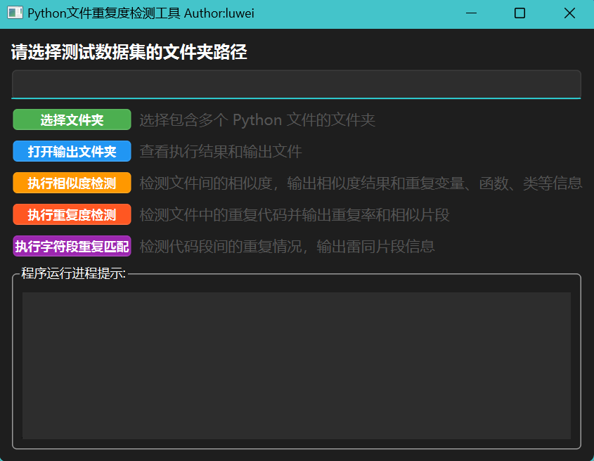
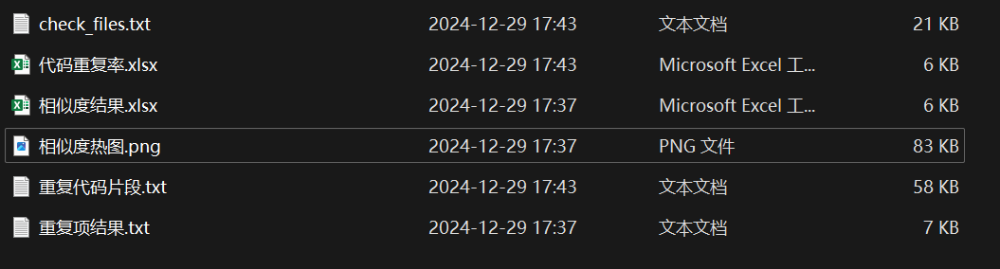
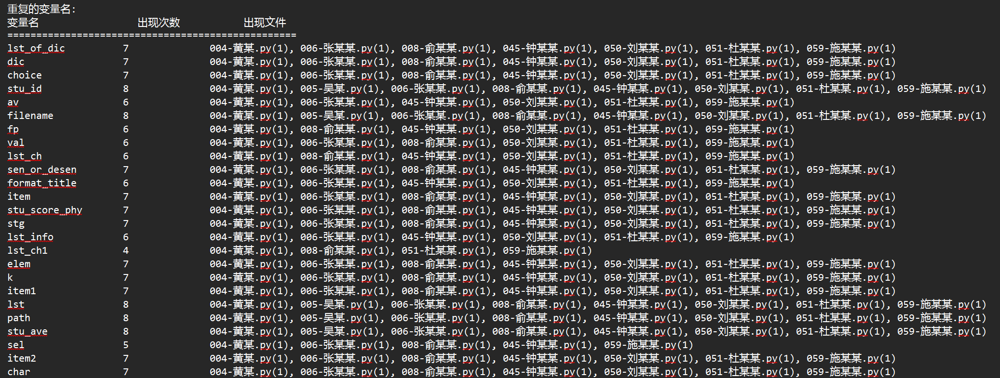
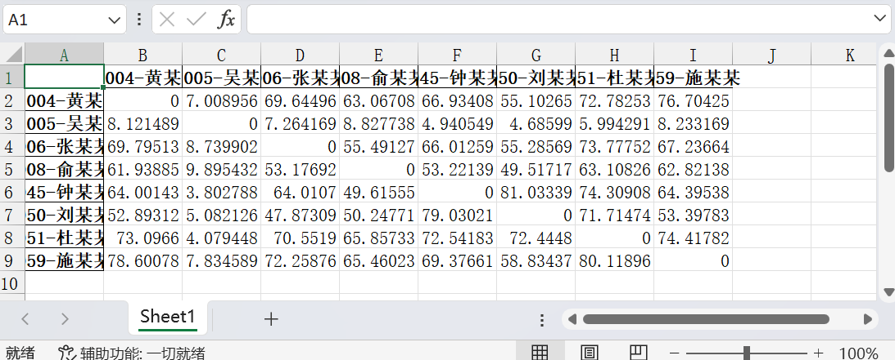

# 基于AST语义分析和字符匹配技术的python文件查重软件

本科Python课程，课程设计。

本文相关的仓库地址：[Python文件查重程序](https://gitee.com/weigo6/python-file-duplicate-detector)

---

## 一、程序目的

本程序旨在帮助用户检测指定文件夹中Python代码文件的相似度和重复情况。它提供了三种主要功能：

- **相似度检测**：计算不同文件之间的结构相似度，输出相似度矩阵，并识别重复的变量名、函数名和类名。
- **重复度检测**：检测文件中的重复代码片段，并计算重复率。
- **字符段重复匹配**：查找并输出文件中雷同的代码段。

通过这些功能，用户可以更好地理解和优化代码库，发现潜在的代码冗余问题，提高代码质量。

同时，通过该程序批量检测`python`文件的功能，可以用作`python`作业批改，检查出抄袭的作业。

**项目结构：**
```bash
项目根目录/ 
├── 输出结果/ # 程序运行结果输出目录（自动生成） 
├── Python查重程序.assets/ # 文档图片资源 
├── all_in_one.py # 主程序入口，整合所有功能的GUI界面 
├── ast-check.py # AST语义分析核心模块 
├── code-token.py # 基于Token的代码格式化与相似度计算 
├── sim-segment.py # 字符段匹配查重模块 
├── check-gui.py # 旧版GUI界面实现 
├── py6-gui.py # 基于PySide6的多线程GUI实现 
├── requirements.txt # 项目依赖库 
└── README.md # 项目说明文档
```
## 二、用户操作指南

### （一）启动程序

### 运行打包后的程序

双击直接打开后缀为exe的文件运行。

### 运行python脚本

针对具有开发能力的用户，可以搭建开发环境运行脚本。

1. 确保已安装Python环境（建议3.6及以上版本），并安装依赖库（如`pandas`、`seaborn`、`matplotlib`等）。
2. 打开命令行或终端，导航到包含`gui_main.py`文件的目录。
3. 运行命令`python gui_main.py`启动程序。

**图形界面模式**
```bash
python gui_main.py
## 或者
python check-gui.py
```
**命令行模式（需指定模块）**
```bash
python ast-check.py [文件夹路径]
python code-token.py [文件夹路径] 
python sim-segment.py [文件夹路径]
```
输出说明：结果文件统一生成在`输出结果`子目录

#### 主程序模块
**gui_main.py**  

- 功能：集成AST分析、代码重复检测、字符段匹配三大功能的图形界面主程序
- 特性：
    - 基于PySide6的多线程GUI框架
    - 支持文件夹选择、结果查看、三种检测模式
    - 包含进度提示和错误处理机制

#### 核心功能模块
**ast-check.py** 

- 功能：
    - 提取变量/函数/类名（`extract_variable_names`）
    - AST序列化与相似度计算（`calculate_similarity`）
    - 生成相似度矩阵和热力图（`visualize_similarity_matrix`）

**code-token.py**  

- 功能：
    - 去除注释和文档字符串（`remove_comments_and_docstrings`）
    - 代码格式化处理（`remove_empty_lines`）
    - 基于difflib的相似度计算（`calculate_similarity`）

**sim-segment.py**  

- 功能：
    - 字符段匹配查重（`find_duplicates`）
    - 有效代码段验证（`is_valid_segment_start`）
    - 支持最小匹配长度和排除列表配置

#### 工具模块
**check-gui.py/py6-gui.py**  
- 历史版本GUI实现，支持多脚本选择执行
- 包含子进程管理和输出重定向功能

#### 使用说明

### 环境要求
```bash
# 安装依赖（已包含在requirements.txt中）
pip install pandas seaborn matplotlib scikit-learn PySide6
```

### （二）界面介绍

程序启动后将显示一个图形用户界面（GUI），包含以下主要部分：

#### 1. 文件夹选择区

- **标签**：提示用户选择测试数据集的文件夹路径。
- **文本框**：显示当前选择的文件夹路径，只读模式。
- **按钮**：点击“选择文件夹”按钮，弹出文件夹选择对话框，用户可以选择包含多个Python文件的文件夹。

#### 2. 功能按钮区

- **选择文件夹**：用于选择待检测的文件夹。
- **打开输出文件夹**：查看执行结果和输出文件。
- **执行相似度检测**：启动相似度检测任务，处理文件间的相似度计算。
- **执行重复度检测**：启动重复度检测任务，分析文件内的重复代码。
- **执行字符段重复匹配**：启动字符段重复匹配任务，查找代码段间的雷同情况。

每个按钮旁边都有简短说明，解释其具体作用。

#### 3. 输出信息区

- **程序运行进程提示**：实时显示程序运行状态和输出信息，包括进度更新、错误报告等。

### （三）操作步骤

1. **选择文件夹**：点击“选择文件夹”按钮，选择包含多个Python文件的文件夹。
2. **选择功能**：根据需要点击相应的功能按钮（相似度检测/重复度检测/字符段重复匹配）。
3. **等待处理完成**：在输出信息区查看处理进度，直到任务完成。
4. **查看结果**：任务完成后，点击“打开输出文件夹”按钮，查看生成的结果文件。



## 三、运行输出的结果

### （一）相似度检测结果

- **相似度结果.xlsx**：Excel表格形式的相似度矩阵，展示各文件之间的相似度评分。
- **重复项结果.txt**：文本文件，列出所有重复出现的变量名、函数名和类名及其所在文件。
- **相似度热图.png**：可视化图表，以热图形式展示文件间的相似度分布。

### （二）重复度检测结果

- **代码重复率.xlsx**：Excel表格，记录每对文件之间的代码重复率。
- **重复代码片段.txt**：文本文件，详细列出各文件间相似的代码片段。

### （三）字符段重复匹配结果

- **check_files.txt**：文本文件，记录各文件与其他文件之间存在的雷同代码段，包括具体的雷同片段内容。

程序输出结果的部分展示：







## 四、注意事项

- 确保选择的文件夹内仅包含有效的Python源代码文件（`.py`），其他类型的文件可能影响检测准确性。
- 在执行新任务前，请确认上一个任务已完成或被中断，避免并发操作导致的数据混乱。
- 如果遇到异常情况或错误提示，可参考输出信息区的具体报错内容进行排查，必要时重启程序。
