# Matlab 笔记---学习记录

---
1.11 writed by luwei

本文相关的仓库地址：[Matlab入门学习](https://gitee.com/weigo6/matlab)

## 基础语法

### 变量注释与运算符

#### 清除终端内容

```matlab
clear all %清除所有变量
clc %清除Command窗口中所有命令
close all; %关闭所有图形窗口，释放内存并清理工作区
```

#### 运算符

```matlab
a 与 A 是两个变量在matlab中创建变量直接赋值对应的数据类型就可以了
+ - * / sqrt开根号
&& 与; || 或
~= 不等于
```

| 算数 | 描述       | 关系 |          | 逻辑 |                    | 位运算     |          | 赋值 |        |
| ---- | ---------- | ---- | -------- | ---- | ------------------ | ---------- | -------- | ---- | ------ |
| `+`  | 加法       | `==` | 等于     | `&&` | 逻辑与（短路运算） | `bitand`   | 按位与   | `=`  | 赋值   |
| `-`  | 减法       | `~=` | 不等于   | `||` | 逻辑或（短路运算） | `bitor`    | 按位或   | `+=` | 加赋值 |
| `*`  | 矩阵乘法   | `<`  | 小于     | `&`  | 逐元素逻辑与       | `bitxor`   | 按位异或 | `-=` | 减赋值 |
| `.*` | 逐元素乘法 | `<=` | 小于等于 | `|`  | 逐元素逻辑或       | `bitcmp`   | 按位取反 | `*=` | 乘赋值 |
| `/`  | 矩阵右除   | `>`  | 大于     | `~`  | 逻辑非             | `bitshift` | 位移     | `/=` | 除赋值 |
| `./` | 逐元素右除 | `>=` | 大于等于 |      |                    |            |          | `^=` | 幂赋值 |
| `^`  | 矩阵幂     |      |          |      |                    |            |          |      |        |

特殊运算符：

- `:`：生成序列或选择数组的元素
- `;`：用于分隔行或命令
- `...`：续行符，用于将一个长命令分成多行

#### 注释

```matlab
%单行注释
%{ 
多行注释
%}
```

#### 基本运算

```matlab
s = 'a'  %s 是一个字符数组，包含单个字符 'a'
result = abs(a)  % 结果为97，ASCAL码
result = char(666) %将数字666转换为其对应的Unicode字符
lengeh(str) %字符串长度
exp(2) % exp函数用于计算自然指数函数,这里表示e的平方
a = b = 666 %把666赋给b再给a
```

### rand、randi和randn的区别

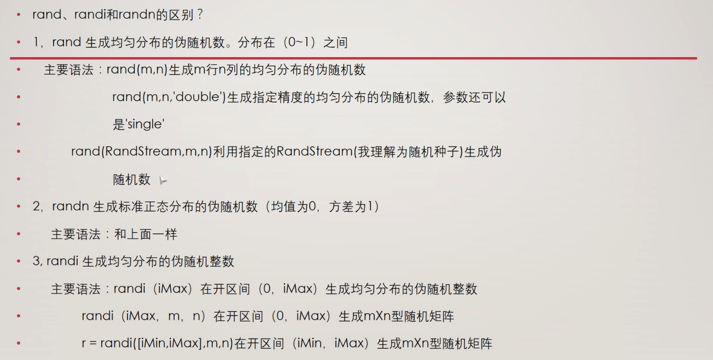

### 元胞数组

```matlab
% cell 类似python元组
A = cell(1,6)  
A{2} = eye(3) %生成一个3x3对角线数值为1的单位矩阵
A{5} = magic(5) %生成n阶幻方矩阵
B = A{5}
```
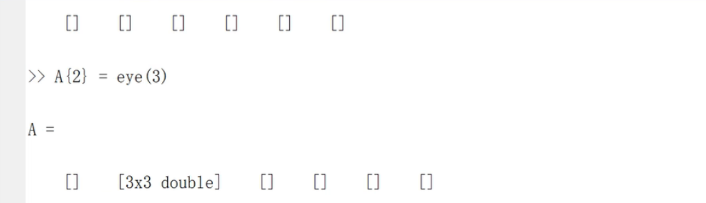

> [!NOTE]
>
> MATLAB是从1开始的不是从0开始的，这与绝大部分的编程语言不一样。

### 结构体

```matlab
% 修正 struct 函数的参数格式，将 name 字段值设为元胞数组
books = struct('name', {'Machine Learning', 'data mining'}, 'price', [30 40]);
books.name % 属性
books.name(1) % 返回 cell
books.name{1} % 返回值
```

### 矩阵操作

#### 矩阵的数学运算

```matlab
A = [1 2 3;4 5 6;7 8 9] %每行元素的分隔符为空格或者逗号
B = A’ %矩阵转秩，行变列，列变行
C = A(:) %按列每个元素依次按行赋值
D = inv(A) % 求矩阵的逆，只有方阵可以求逆
E = zeros(10,5,3) % 三维 十行五列 零矩阵
矩阵 \ 左除  / 右除 
```

#### 矩阵创建、矩阵构造拼接与逻辑矩阵

```matlab
%矩阵的定义和构造
A = [1 2 3 4 5 6] %创建一维数组
B = 1:2:9 %初值 步长 终值，创建一维数组
C = repmat(B,3,1) %repmat 横重复3次，列重复2次 
D = ones(2,4) %生成2行四列全1矩阵 
.* 和 ./ %矩阵元素相乘或除，不是矩阵乘除

%矩阵拼接
A = magic(5) %创建一个 5 × 5 的魔方阵,其中每一行、每一列和两个主对角线上的数字的和都相等
B = A(2,3) %取A矩阵第二行第三个
C = A(3,:) % :表示取全部 第三行
D = A(:,4) %取第四列
[m,n] = find(A>20) %把大于20的值按下标将第几行第几列分别存入m和n中

% 在矩阵的第二行插入[10 11 12]，本质还是矩阵拼接
newRow = [10 11 12];
rowIndex = 2;
A = [A(1:rowIndex-1, :); newRow; A(rowIndex:end, :)];

[numRows, numCols] = size(A4) % size语句返回行数列数，矩阵形式
rankA4 = rank(A4) %取矩阵的秩

%在 MATLAB 中，logical() 函数用于将输入数据转换为逻辑数组（logical array），逻辑数组的元素仅能是 0 和 1，分别表示 false（假）和 true（真）。
A = [1, 0, 3; 
     0, 5, 6; 
     7, 0, 9];
B = logical(A);

%使用逻辑数组来筛选原数组中的元素。例如，假设我们想找出 A 中所有大于 5 的元素：
A = [1, 2, 3; 
     4, 5, 6; 
     7, 8, 9];
B = A > 5;  % 生成逻辑矩阵
filteredValues = A(B);  % 使用逻辑矩阵筛选

% reshape 函数用于重新排列矩阵的元素，以形成具有不同维度的矩阵。
A = [1, 2, 3, 4; 
     5, 6, 7, 8];
B = reshape(A, [4, 2]);% 将 A 变为 4 行 2 列的矩阵
```

#### 查找矩阵中的非零元素

```matlab
查找稀疏矩阵中的非零元素，并打印出它们的值及其所在的行列位置。
A = [0 0 3 0; 1 0 0 1; 0 9 0 0; 2 0 0 0];

% 获取非零元素的索引
[row, col, val] = find(A);

% 打印结果
fprintf('非零元素及其位置:\n');
for i = 1:length(val)
    fprintf('值: %d, 行: %d, 列: %d\n', val(i), row(i), col(i));
end
```

#### 用矩阵除法求方程组的解

在 MATLAB 中，可以使用矩阵除法对线性方程组进行求解。如果你有一个线性方程组的形式：
$$
Ax = b
$$
其中 \( A \) 是系数矩阵，\( x \) 是未知数向量，\( b \) 是常数向量，你可以使用矩阵左除操作符 `\` 来求解。

假设我们有以下线性方程组：

$$
\begin{align*}
2x_1 + 3x_2 &= 5 \\
4x_1 + x_2 &= 6
\end{align*}
$$

我们可以将其表示为矩阵形式 \( Ax = b \)，其中：

$$
A = \begin{bmatrix}
2 & 3 \\
4 & 1
\end{bmatrix}, \quad
x = \begin{bmatrix}
x_1 \\
x_2
\end{bmatrix}, \quad
b = \begin{bmatrix}
5 \\
6
\end{bmatrix}
$$

代码示例：

```matlab
% 定义系数矩阵A和常数向量b
A = [2, 3; 4, 1];
b = [5; 6];

% 使用矩阵左除操作符求解方程组
x = A \ b;

% 显示结果
disp('方程组的解为：');
disp(x);
```

步骤如下：

1. 定义矩阵：
   - `A` 是系数矩阵，包含方程的系数。
   - `b` 是常数向量，包含方程右侧的常数。

2. 矩阵左除：
   - 使用 `A \ b` 计算 \( x \)。这是 MATLAB 中求解线性方程组的标准方法，相当于求解 \( Ax = b \)。

3. 结果显示：
   - 使用 `disp` 函数显示解。

注意事项：

- 确保矩阵 \( A \) 是方阵且可逆。如果 \( A \) 不是方阵，或者其行列式为零，则会导致无解或无穷多解的情况。
- 通过 `rank(A)` 和 `rank([A b])` 可以进一步分析方程组的解的性质。

使用矩阵除法在 MATLAB 中求解线性方程组是一种高效且简洁的方法。只需定义系数矩阵和常数向量，然后使用左除操作符 `\` 即可得到解。

### 逻辑与流程控制

```matlab
if...else...end
for...end
while...end
switch...case...otherwise...end

for 循环变量 = 初值:步长:终值
	执行语句1
	...
	执行语句n
end
%步长为1 可以省略

while 条件表达式
	执行语句1
	...
	执行语句n
end

if 条件表达式
	...
	语句体
	...
end

switch 表达式（数值和字符串）
	case 数值和字符串1
		语句体1
	case 数值和字符串2
		语句体2
	...
	otherwise
		语句体n
end
```

### 函数文件和脚本文件

函数文件关键字：function，函数名与文件名一样，需要与脚本文件在同一工作路径下

示例：创建一个简单的函数文件 `add.m`：

```matlab
function result = add(a, b)
    result = a + b;
end
```

可以在脚本文件中调用该函数文件，例如：`sum = add(3, 5);  % sum 将为 8`

### 常用函数

#### 复数运算函数表

| 函数名       | 说明                                |
| ------------ | ----------------------------------- |
| real(z)      | 返回复数z的实部                     |
| imag(z)      | 返回复数z的虚部                     |
| angle(z)     | 返回复数z的幅角                     |
| abs(z)       | 返回复数z的模                       |
| conj(z)      | 返回复数z的共轭复数                 |
| complex(a,b) | 以a和b分别作为实部和虚部，创建复数z |

#### 常用数学函数

| 常用函数   | 含义                                                       |
| ---------- | ---------------------------------------------------------- |
| sin(x)     | 正弦函数，以“弧度”为单位                                   |
| sqrt(x)    | 平方根函数                                                 |
| exp(x)     | 指数函数                                                   |
| zeros(m,n) | 创建m行n列的零矩阵                                         |
| ones(m,n)  | 创建m行n列的矩阵，矩阵的所有元素为1                        |
| size(A)    | 计算矩阵A各维尺寸。size(A,1) ; size(A,2); [m1,m2] =size(A) |
| length(A)  | 计算矩阵A最大维尺寸                                        |
| rand(m,n)  | 产生m×n阶由0-1之间均匀取值的数值组成的矩阵                 |

#### 矩阵函数

| 常用函数     | 含义                             |
| ------------ | -------------------------------- |
| det(A)       | 计算方阵行列式                   |
| rank(A)      | 计算矩阵的秩                     |
| inv(A)       | 求逆矩阵                         |
| find(表达式) | 查找符合表达式的元素并返回其下标 |
| max(A)       | 数组中各列的最大值               |
| min(A)       | 数组中各列的最小值               |
| mean(A)      | 数组中各列的平均值               |
| std(A)       | 数组中各列的标准差               |
| size(A)      | 数组的行列数                     |
| length(A)    | 数组的最大维数                   |

### nargin函数，返回接收参数

在MATLAB中，`nargin`是一个内置函数，用于返回函数实际接收的输入参数的个数。在编写函数时，`nargin`可以帮助你根据输入参数的个数来决定函数应执行的操作。

```matlab
function drawShape(N)
if nargin == 0
  %逻辑代码
```

### find函数，返回符合条件的数组下标

```matlab
% find 函数
A = [1, 2, 3; 4, 5, 6; 7, 8, 9];  % 创建一个 3x3 矩阵
indices = find(A > 5);  % 找到大于 5 的元素的线性索引
[row, col] = find(A > 5);  % 返回大于 5 的元素的行和列索引
indices = find(A > 5, 2);  % 找到前两个大于 5 的元素的线性索引
```

### floor函数，确保变量是否为整数

`floor(N) == N` 的作用是确保 `N` 是一个整数。

具体来说：

- `floor(N)` 函数返回不大于 `N` 的最大整数（即向下取整）。
- 如果 `N` 已经是整数，那么 `floor(N)` 应该等于 `N` 本身。
- 如果 `N` 是一个小数或浮点数，`floor(N)` 将取等于 `N` 的整数部分，这时 `floor(N)` 和 `N` 不相等。

因此，`floor(N) == N` 这个条件用来判断 `N` 是否为整数。

### 判断函数isnumeric、isscalar、isempty、isnan

`isnumeric(N)`：检查`N`是否是数值。

`isscalar(N)`：检查`N`是否是标量。

`isempty(N) `：检查N是否为空。

`isnan(N)` :`isnan` 函数在 MATLAB 中用于检查输入是否为 "Not-a-Number" (NaN) 值。`isnan` 返回一个逻辑数组，其中包含 `true` 表示对应位置的元素为 NaN，`false` 则表示对应位置的元素不是 NaN。

### 类型转换函数

`int2str(N)` ：将N转换为字符串

`str2double` ：将输入转换为数字

`num2str` : 用于将数值转换为字符串。这个函数在需要将数值与其它字符串连接或显示时非常有用。

```matlab
disp([num2str(year) ' 是闰年。']);
```

### 显示函数fprintf、disp

```matlab
% disp函数不返回输出，适合简单的输出
x = 42;
disp('The value of x is:');
disp(x);

% fprintf 返回输出的字符数，支持格式字符串
x = 42;
y = 3.14159;
fprintf('The value of x is: %d\n', x);
fprintf('The value of y is: %.2f\n', y);
```

### length函数与size函数

```matlab
v = [1, 2, 3, 4, 5]; %计算向量的长度
L = length(v); % L 将为 5
M = [1 2 3; 4 5 6]; %计算矩阵的长度
L = length(M); % L 将为 3，因为矩阵的最大维度是3（列数）
str = 'Hello'; %计算字符串的字符数
L = length(str); % L 将为 5

%size返回每一维度数组的大小
A = [1 2 3; 4 5 6];
dims = size(A); % dims 返回 [2 3]，表示A有2行3列
```

### 错误信息抛出error

打印错误信息

```matlab
error('Input must be a natural number greater than 2.');
```

### 请求用户输入input

```matlab
n = input('请输入矩阵的行数 n: ');
```

### linspace与logspace

```matlab
y = linspace(a, b, n)
linspace 会生成一个行向量，其中包含从 a 到 b 的 n 个均匀分布的点。n可选默认为100。

y = logspace(a, b, n)
logspace 会生成 n 个在 10^a 到 10^b 之间均匀分布的数值。
logspace 函数用于生成在对数尺度上均匀分布的数值数组。这在处理指数增长或衰减的情况时尤其有用。
```

## MATLAB绘图

[MATLAB 进阶绘图_matlab horizontalalignment-CSDN博客](https://blog.csdn.net/bigfantastictree/article/details/123705485)

### 二维平面绘图

#### 数据处理

```matlab
x = 0:0.01:2*pi; %数据赋值
y = sin(x);
figure %建立一个幕布
t = linspace(0, 6*pi, 1000);  % 使用linspace创建从0到6π的1000个点
```

#### 绘图设置

```matlab
figure; % 创建新的图形窗口
plot(x,y)
plot(x, y, 'b-'); %plot函数根据给定的x和y坐标绘制图形，'b-'指定使用蓝色实线绘制。
plot(t, y,'r','LineWidth', 1);
% plot(t, y, '--b', 'LineWidth', 2); % 使用虚线和蓝色,线粗为2

xlim([0 6*pi]); %设置当前坐标轴的x轴范围    
xticks(0:2*pi:6*pi); %设置当前坐标轴x轴上的刻度位置
ylim([0 1.4]); %设置当前坐标轴的y轴范围        
yticks(0.95:0.05:1.05); %设置y轴的刻度为从0.95到1.05，间隔为0.05，刻度位置为0.95, 1.00, 1.05

axis([0 0.2 -1.2 1.2]) %x 轴范围：从 0 到 0.2；y 轴范围：从 -1.2 到 1.2，限制 x 轴和 y 轴的显示范围
```

多个图表绘制

```matlab
subplot(2, 2, 1);  % 创建2行2列的子图，激活第1个子图
subplot(m, n, p) 
m：网格的行数。
n：网格的列数。
p：指定当前活动图的位置，从左到右、从上到下编号。
```

将多个曲线绘制在同一张图中

```matlab
x = linspace(0, 2*pi, 100);  % 从0到2π生成100个点
y1 = sin(x);      % 第一条曲线
y2 = cos(x);      % 第二条曲线
y3 = sin(2*x);    % 第三条曲线
% 一次性绘制所有曲线
plot(x, y1, 'r', x, y2, 'g', x, y3, 'b');  % 'r', 'g', 'b' 为颜色
legend('sin(x)', 'cos(x)', 'sin(2x)');  % 添加图例

或者使用hold on;
y1 = sin(x);
plot(x, y1, 'r');  % 绘制第一条曲线
hold on;           % 保持当前图形
y2 = cos(x);
plot(x, y2, 'g');  % 绘制第二条曲线
grid on;  % 添加网格
hold off;  % 释放当前图形
```

绘图颜色参数选项

| 颜色 | 字符 | 颜色 | 字符 |
| ---- | ---- | ---- | ---- |
| 红   | r    | 粉红 | m    |
| 绿   | g    | 青   | c    |
| 蓝   | b    | 白   | w    |
| 黄   | y    | 黑   | k    |


#### 图例标注

```matlab
title('y = sin(x)') %设置标题
sgtitle('Your Title Here') %用于在多个子图的图形窗口中添加一个统一的标题
xlable('x') %在x轴的底部添加标签"x"。
ylable('sin(x)')

stem(t_sampled, f_sampled, 'r'); % 采样点，使用 stem 函数绘制，t:时间向量，f采样点的函数值向量
legend('label1', 'label2', ..., 'labelN'); %添加图例，以便为不同的曲线或数据系列提供标签

grid on; % 添加网格
axis equal;%axis equal命令设置图形的坐标轴比例，使得单位长度在x轴和y轴方向上相同。
```

```matlab
legend('sin(x)', 'cos(x)', 'sin(2x)', 'Location', 'northeast'); %添加位置参数来自定义图例的位置,'best'：自动选择最佳位置
legend('sin(x)', 'cos(x)', 'sin(2x)', 'box', 'off');  % 关闭框线
legend('sin(x)', 'cos(x)', 'sin(2x)', 'FontSize', 12); % 设置 FontSize 属性来更改图例的字体大小
```

#### 不同图形的绘制

```matlab
%具体的图形样式可见下文第三期题目
%柱形图
x = [1 2 5 4 8];
y = [x;1:5];
bar(y,"stacked"); %stacked是一个可选的参数，代表堆栈
barh(y,"stacked"); %barh 水平式的bar
%饼图
a = [15 8 31 46];
pie(a); %画出饼图，自动计算百分比
pie(a,[0,0,0,1]); %画出饼图，并分离第四部分
pie3(a,[1,1,1,1]); %3代表三维
%极坐标图
n = 6;
theta = linspace(0, 2*pi, n+1); % 从 0 到 2\pi 生成 n+1 个点，以便闭合六边形
r = ones(size(theta));%size返回theta向量的元素个数
polar(theta,r);
```

### 三维图像的绘制

#### mesh 与 surf

```matlab
x = -3.5:0.2:3.5;  % 创建从 -3.5 到 3.5 的 x 数据，步长为 0.2
y = -3.5:0.2:3.5;  % 创建从 -3.5 到 3.5 的 y 数据，步长为 0.2

[X,Y] = meshgrid(x,y);  % 创建网格矩阵 X 和 Y，适用于二维函数
Z = X .* exp(-X.^2 - Y.^2);  % 计算 Z 的值，Z 为 X 和 Y 的复合函数

% 绘制网格图
subplot(1,2,1);  % 在 1 行 2 列的图形中选择第一个位置
mesh(X,Y,Z);     % 绘制网格图

% 绘制表面图
subplot(1,2,2);  % 选择第二个位置
surf(X,Y,Z);     % 绘制表面图
```

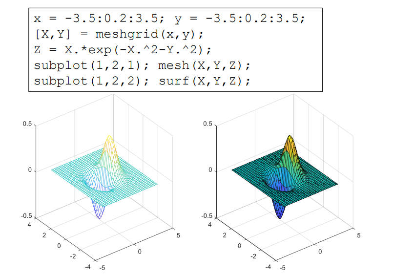

- 网格图（Mesh Plot）：显示了函数 *Z* 的网格结构，使用线条来表示表面。

- 表面图（Surface Plot）：显示了函数的表面，使用颜色和光泽效果来表示高度信息。

mesh 函数用于绘制三维网格图，它显示了一个网格的线条和表面轮廓。surf 函数用于绘制三维表面图，它不仅显示网格，还通过面填充色彩来表示数据值。

> [!NOTE]
>
> colorbar;  % 显示颜色条
>
> shading interp;  % 平滑着色
>
> view(45, 30);  % 设置观察角度

#### meshc() 与 surfc()

`meshc()` 与` surfc()`是在`mesh()`和`surf()`函数的基础上，创建三维网格图，并在底部添加等高线图。

```matlab
x = -3.5:0.2:3.5; y = -3.5:0.2:3.5;
[X,Y] = meshgrid(x,y); Z = X.*exp(-X.^2-Y.^2);
subplot(1,2,1); meshc(X,Y,Z);
subplot(1,2,2); surfc(X,Y,Z);
```

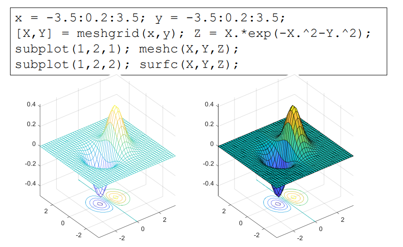

## 信号产生与处理

考虑生成采样频率为 1000 Hz 的数据。 一个合适的时间矢量是

```matlab
fs = 1000; %fs为采样频率即精度
t = (0:1/fs:1)'; % 0：?:1决定了采样时间为0-1s
%如果有一个矩阵 A 和一个列向量 b，可以使用 A * b 进行矩阵乘法，故通常转换为列向量。

y = sin(2*pi*50*t) + 2*sin(2*pi*120*t); % 可以创建由两个正弦波组成的采样信号 y，一个为 50 Hz；另一个为 120 Hz，振幅为原来的两倍。2 * pi * f 是将频率转换为角频率
%在信号中加入正态分布的白噪声，并绘制前 50 个点的曲线
noise = 0.5 * randn(size(y));  % 生成标准差为0.5的高斯白噪声
y_noisy = y + noise;            % 将噪声添加到信号中
figure;
plot(t(1:50), y_noisy(1:50), 'b-o');  % 绘制带噪声的信号
hold on;
plot(t(1:50), y(1:50), 'r--');  % 绘制原始信号
xlabel('Time (s)');
ylabel('Amplitude');
title('Signal with Added White Noise (First 50 Points)');
legend('Noisy Signal', 'Original Signal'); % 添加图例
grid on;
hold off;
```

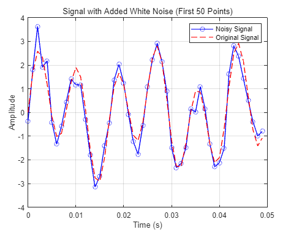

产生 1.5 秒钟的 50 Hz锯齿波（分别为方波），采样率为 10 kHz，同理如下

```matlab
fs = 10000; %采样频率10k
t = (0:1/fs:1.5)'; % 0：?:1.5决定了采样时间为0-1.5s
x = square(2*pi*50*t); %占空比不填默认是50% x = square(2*pi*50*t,80);%占空比为80。
plot(t,x)
axis([0 0.2 -1.2 1.2]) %框定画图范围
```

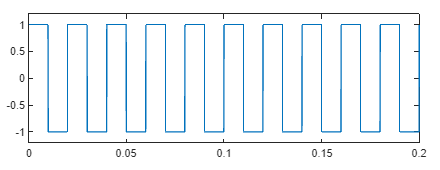

**常用的信号函数**，使用方法同理

```matlab
t --> 2*pi*f*t1 f频率，t1是个列向量，决定了采样间隔和采用时间
y = sawtooth(t, width) %生成锯齿波信号 width：可选参数，定义波形的上升或下降斜率，0.5 表示生成三角波
y = square(t, duty) %生成方波信号 duty：可选参数，定义方波的占空比（0到100之间，默认值为50）
y = tripuls(t, width) %生成三角脉冲信号 width：可选参数，定义脉冲的宽度（单位时间的比例，默认值为1）
y = rectpuls(t, width) %生成矩形脉冲信号 width：可选参数，定义脉冲的宽度（单位时间的比例，默认值为1)
%若取脉宽为20ms，width取值为20e-3
y = gauspuls(t, fc, bw) %生成高斯脉冲信号 fc：中心频率（Hz）bw：带宽（可选，单位为赫兹，默认为1)

x = -10:0.01:10;  % 输入向量
y = sinc(x) %生成 sinc 函数，通常用于信号处理
plot(x, y);
```

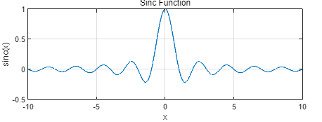

**添加高斯噪声**

```matlab
noise = sqrt(variance) * randn(size(A));  % 生成高斯白噪声，variance为噪声的方差
A_wnoise = A + sqrt(variance)*randn(size(A)); %输出信号
```

**去除信号的线性趋势**

`detrend` 函数可以从信号中去除线性趋势。

示例 1：去除线性趋势

```matlab
% 生成示例信号（例如，带有线性趋势的正弦波）
t = 0:0.01:10; % 时间向量
original_signal = sin(t) + 0.5*t; % 原始信号（带线性趋势）
% 使用 detrend 去除线性趋势
detrended_signal = detrend(original_signal);
% 绘图
figure;
subplot(2,1,1);
plot(t, original_signal, 'b');
title('Original Signal with Linear Trend');
xlabel('Time');
ylabel('Signal Value');
subplot(2,1,2);
plot(t, detrended_signal, 'r');
title('Detrended Signal (Linear Trend Removed)');
xlabel('Time');
ylabel('Signal Value');
```

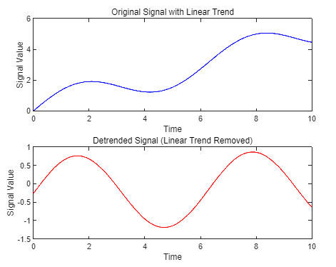

示例 2：去除多项式趋势，去除非线性趋势可以使用多项式拟合，然后从原始信号中减去拟合的非线性趋势。

```matlab
% 生成示例信号（例如，带有非线性趋势的正弦波）
t = 0:0.01:10; % 时间向量
original_signal = sin(t) + 0.2*t.^2; % 原始信号（带非线性趋势）
% 使用 polyfit 拟合二次多项式
p = polyfit(t, original_signal, 2); % 拟合二次多项式
trend_line = polyval(p, t); % 计算趋势线
% 去除多项式趋势
detrended_signal = original_signal - trend_line;
% 绘图
figure;
subplot(2,1,1);
plot(t, original_signal, 'b', t, trend_line, 'r--');
title('Original Signal with Nonlinear Trend');
xlabel('Time');
ylabel('Signal Value');
subplot(2,1,2);
plot(t, detrended_signal, 'r');
title('Detrended Signal (Nonlinear Trend Removed)');
xlabel('Time');
ylabel('Signal Value');
```

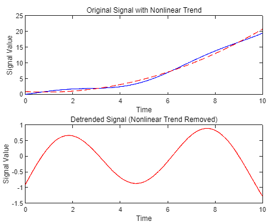

**数据拟合与趋势分析**

`polyfit` 函数用于拟合多项式模型。

```matlab
p = polyfit(x, y, n) 
%x：自变量数据（输入向量）多为时间向量
%y：因变量数据（输出向量）多为需要拟合的原始信号
%n：多项式的阶数。
%p：返回的多项式系数向量，按降幂排列。
```

`polyval` 函数用于计算多项式在给定点的值。它的基本语法是：

```matlab
y_fit = polyval(p, x_fit)
%p：多项式系数向量（由 polyfit 返回）
%x_fit：需要计算的自变量数据。多为时间向量t
%y_fit：返回的多项式在 x_fit 处的值。
```

这两个函数结合使用可以方便地进行数据拟合和趋势分析。

## 题目

### 第一期--数组与矩阵

1.已知变量`t`的取值范围为 0~2π
–产生以`π/4`为步长的行向量t1;
–利用函数linspace函数产生10个元素的行向量t2;
–求y1 = sin(t1),  y2 = cos(t2)；
–将y1中小于0的数去除，将y2中小于0的数替换为0；
```matlab
t1 = 0:pi/4:2*pi; 
t2 = linspace(0, 2*pi, 10);%（起始值 终值 元素个数）均分
y1 = sin(t1);  
y2 = cos(t2);  
y1(y1<0)=[];  %将y1中小于0的数去除
y2(y2<0)=0;  %将y2中小于0的数替换为0
```

2.矩阵操作 
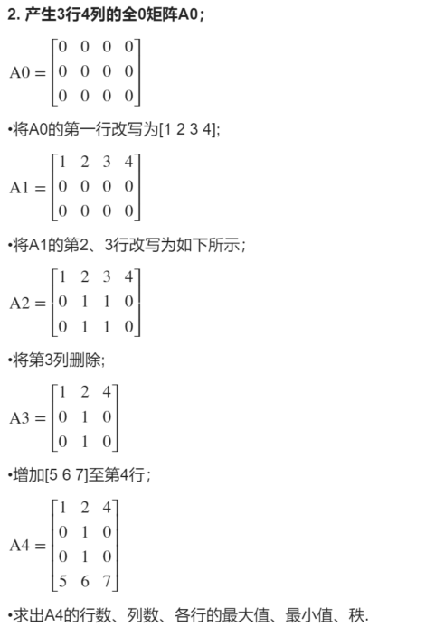

```matlab
% PUT YOUR CODE HERE
A0 = zeros(3,4) %产生全零矩阵
A1 = A0
A1(1,:)=[1 2 3 4] %改写第一行

A2 = A1;  
A2(2,:) = [0 1 1 0]; %改写第二行
A2(3,:) = [0 1 1 0];  
A3 = A2(:, [1 2 4]); %本质是取出几列赋值到新矩阵里
A4 = [A3; [5 6 7]];
% A = [A; newRow]; % 追加到矩阵末尾

[numRows, numCols] = size(A4);  %矩阵的函数和列数
maxValues = max(A4, [], 2)  % 返回一个列向量，表示每一行的最大值，2表示按行维度进行比较，1为列。
maxValues = min(A4, [], 2)
rankA4 = rank(A4);  %求矩阵的秩
```

3.矩阵产生

   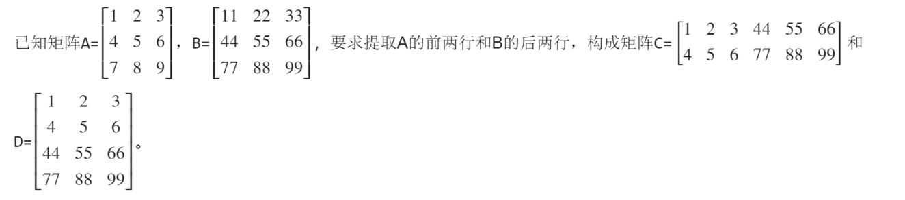

```matlab
A=[1 2 3;4 5 6;7 8 9]
B=[11 22 33;44 55 66; 77 88 99]
a=A([1:2],[1:3]) % : 冒号表示范围
b=B([2:3],[1,2,3]) % 选定列用`,`也可以用空格
C=[a,b] %等价写法 C=[a b]，表示按行拼接
D=[a;b] %表示按列拼接
```

4.用`“from : step : to”`方式得到从`0~4π`步长为`0.4π`的变量`X1`；用linspace函数得到`0~4π`分成10点的变量`X2`；

```matlab
X1 = 0:0.4*pi:4*pi  %起始值 步长 终值
X2 = linspace(0, 4*pi, 10)  %起始值 终值 等分个数 生成的是行矩阵
```

5.输入矩阵 $$
   \left| \begin{matrix}
   	1&		2&		3\\
   	4&		5&		6\\
   	7&		8&		9\\
   \end{matrix} \right|$$，使用全下标方式取出元素“3”，使用单下标方式取出元素“8”，取出后面两行子矩阵块，使用逻辑矩阵方式取出
   $$
   \left| \begin{matrix}
	1&		3\\
	7&		9\\
   \end{matrix} \right|
   $$		提示：逻辑矩阵logical()函数

```matlab
% 输入矩阵
A = [1, 2, 3; 
     4, 5, 6; 
     7, 8, 9];

% 1. 使用全下标方式取出元素“3”
element_3 = A(1, 3);  % 第1行第3列

% 2. 使用单下标方式取出元素“8”
element_8 = A(8);  % 使用单下标方式

% 3. 取出后面两行子矩阵块
subMatrix = A(2:end, :);  % 从第2行到最后一行

% 4. 使用逻辑矩阵方式取出 [1 3; 7 9]
logicalMatrix = logical([1, 0, 1; 
                         0, 0, 0; 
                         1, 0, 1]);  % 1表示取出的元素，0表示不取
result = A(logicalMatrix); % 对A矩阵做逻辑运算，按列逐个运算并返回一个列向量
result = reshape(result, [2, 2]);  % 按列进行重塑为2x2矩阵，如果需要按行对矩阵进行转秩操作（`'`）
disp(result);
```

6.求矩阵$$
\left| \begin{matrix}
	1&		3\\
	5&		8\\
\end{matrix} \right|
$$的转置、秩、逆矩阵、矩阵的行列式值和矩阵的三次幂。

```matlab
A = [1 3;5 8] % 创建矩阵
B = A' % 转置
C = rank(A) % 秩
D = inv(A) % 逆
E = det(A) % 行列式值
F = A^3 % 矩阵的三次幂
```

7.计算数组A$$
   \left| \begin{matrix}
   	1&		2&		3\\
   	4&		5&		6\\
   	7&		8&		9\\
   \end{matrix} \right|$$和数组B $$
   \left| \begin{matrix}
	1&		1&		1\\
	2&		2&		2\\
	3&		3&		3\\
   \end{matrix} \right|$$左除、右除以及点乘和点除的行列式值和矩阵的三次幂。

```matlab
A = [1:3;4:6;7:9]
B = [1 1 1;2 2 2;3 3 3]
left = A\B  % 左除
right = B/A % 右除
pointmul = det(A.*B) %点乘求行列式值
pointdiv = det(A./B) %点除求行列式值
Apower_3 = A^3 %矩阵的三次幂
Bpower_3 = B^3
```

8.计算函数$f\left( t \right) =10e^{2t}-\sin \left( 4t \right)$的值，其中t的范围从0~20步长取0.2；$f_1\left( t \right)$为$f\left( t \right) \geqslant 0$的部分，计算$f_1\left( t \right)$的值。

```matlab
t = 0:0.2:20  % 从 0 到 20，步长为 0.2
f = 10 * exp(2 * t) - sin(4 * t)  % 计算函数 f(t)
f1 = f(f >= 0)  % 筛选出 f(t) 大于等于 0 的部分
```

9.计算函数 $f\left( t \right) =\sqrt{2}e^{-t}\sin \left( \pi t \right) \geqslant 0$的值,其中t的范围从0~10步长取0.1。输出显示所有满足要求的`f`值。
   提示：`find()`函数

```matlab
t = 0:0.1:10;  % 从 0 到 10，步长为 0.1
f = sqrt(2) * exp(-t) .* sin(pi * t);  % 使用元素乘法，注意矩阵不能直接相乘，需要用点乘
% 使用 find 函数找到 f(t) >= 0 的索引
indices = find(f >= 0)  % 找到满足条件的索引，返回下标
f_positive = f(indices)  % 获取对应的 f 值
```

### 第二期--程序与M文件

1.编写一个M函数文件，实现功能： 

   （1）没有输入量时，画出单位圆； 

   （2）输入量是大于2的自然数N时绘制正N边形，图名应反映显示多边 形的真实边数； 

   （3）输入量是“非自然数”或小于等于2的数时给出出错信息； 

   （4）此外，M函数文件有H1行、帮助说明和程序编写人姓名。

   提示： 

   (1)画正N边形： 当N→∞时，为圆 

   (2) nargin判断输入个数 

   (3)图名：int2str(n)

```matlab
function drawShape(N)
%DRAWSHAPE Draws a unit circle or regular N-sided polygon.
%   DRAWSHAPE() draws a unit circle.
%   DRAWSHAPE(N) draws a regular N-sided polygon if N is a natural number greater than 2.
%   If N is not valid, an error message is displayed.
%
%   Author: luwei

    % 当没有输入参数时，画个圆
    if nargin == 0
        % 画个单位圆
        theta = linspace(0, 2*pi, 100);%生成一个0-2pi的向量，这个向量有100个点
        x = cos(theta);%生成圆的x,y的坐标值
        y = sin(theta);
        plot(x, y, 'b-');%plot函数根据给定的x和y坐标绘制图形，'b-'指定使用蓝色实线绘制。
        axis equal;%axis equal命令设置图形的坐标轴比例，使得单位长度在x轴和y轴方向上相同。
        title('Unit Circle');%在图形的顶部添加标题"Unit Circle"。
        xlabel('x');%在x轴的底部添加标签"x"。
        ylabel('y');%在y轴的左侧添加标签"y"。
    else
        % Input provided, validate it
        if isnumeric(N) && isscalar(N) && N > 2 && floor(N) == N %检查N是否是数值，检查N是否是标量。确保N大于2，确保N是整数（自然数）。
            % Input is a valid natural number greater than 2, draw the polygon
            % 如果输入有效大于2，开始画正N多边形
            theta = linspace(0, 2*pi, N+1);%生成每个顶点的角度，包括回到起始点。
            x = cos(theta);%根据角度计算正 N 边形每个顶点的x坐标。
            y = sin(theta);%根据角度计算正 N 边形每个顶点的y坐标。
            plot(x, y, 'r-');%plot根据x和y坐标绘制图形，'r-'指定使用红色实线。
            axis equal;
            title(['Regular ' int2str(N) '-sided Polygon']);%int2str(N)将N转换为字符串，例如"N=5"时，标题为"Regular 5-sided Polygon"。
            xlabel('x');
            ylabel('y');
        else
            % Invalid input
            %非法输入，打印错误信息
            error('Input must be a natural number greater than 2.');
        end
    end
end
```

2.编写一个程序，查找一稀疏矩阵A=[0 0 3 0;1 0 0 1;0 9 0 0;2 0 0 0]中的非零元素，要求打印出具体的值及其所在的行列位置。

```matlab
%查找稀疏矩阵中的非零元素，并打印出它们的值及其所在的行列位置。
A = [0 0 3 0; 1 0 0 1; 0 9 0 0; 2 0 0 0];

% 获取非零元素的索引
[row, col, val] = find(A);%行 列 值

% 打印结果
fprintf('非零元素及其位置:\n');
for i = 1:length(val)
    fprintf('值: %d, 行: %d, 列: %d\n', val(i), row(i), col(i));
end
```
3.编写一个M函数文件，生成n行m列的矩阵，n和m由输入参数代入，各
元素的值等于该元素位置的行列之和。

```matlab
%生成n行m列的矩阵，n和m由输入参数代入，各元素的值等于该元素位置的行列之和。
function A = createMatrix(n, m)
    % 验证输入参数是否为正整数
    if ~isscalar(n) || ~isscalar(m) || n <= 0 || m <= 0 || floor(n) ~= n || floor(m) ~= m
        %isscalar(n) 和 isscalar(m)：检查 n 和 m 是否为标量（即单一值）。n <= 0 和 m <= 0：确保 n 和 m 为正数。floor(n) ~= n 和 floor(m) ~= m：确保 n 和 m 是整数。
        error('输入参数必须为正整数。');
    end

    % 初始化 n 行 m 列的矩阵
    A = zeros(n, m);
    
    % 填充矩阵，每个元素的值等于其行列索引之和
    for i = 1:n
        for j = 1:m
            A(i, j) = i + j;
        end
    end
end
```

4.编写M脚本文件，从键盘中输入学生成绩，并显示成绩等级。

| 成绩   | 等级 | 成绩  | 等级 |
| ------ | ---- | ----- | ---- |
| 90-100 | A    | 60-69 | D    |
| 80-89  | B    | <60   | E    |
| 70-79  | C    |       |      |

```matlab
%输入学生成绩，显示成绩等级
% 提示用户输入学生成绩
score = input('请输入学生的成绩（0-100之间的整数）: ');

% 检查输入是否在有效范围内
if ~isscalar(score) || score < 0 || score > 100 || floor(score) ~= score
    disp('请输入有效的成绩（0-100之间的整数）。');
else
    % 根据成绩确定等级
    if score >= 90 && score <= 100
        grade = 'A';
    elseif score >= 80 && score < 90
        grade = 'B';
    elseif score >= 70 && score < 80
        grade = 'C';
    elseif score >= 60 && score < 70
        grade = 'D';
    else
        grade = 'E';
    end
    
    % 显示成绩等级
    fprintf('成绩等级为: %s\n', grade);
end
```

5.编写M脚本文件，从键盘中输入年份，并判断显示平年还是闰年。程序 一直运行，直到没有输入 

   注：能被4整除且不能被100整除，或能被400整除的是闰年

```matlab
   %从键盘中输入年份，并判断显示平年还是闰年。程序一直运行，直到没有输入
   while true
       % 提示用户输入年份
       yearInput = input('请输入年份（按 Enter 键结束运行）：', 's');
       
       % 检查是否输入为空，若为空则退出循环
       if isempty(yearInput)
           disp('程序结束。');
           break;
       end
       
       % 将输入转换为数字
       year = str2double(yearInput);
       
       % 检查输入是否为有效的整数年份
       if isnan(year) || floor(year) ~= year || year <= 0
           disp('请输入有效的正整数年份。');
       else
           % 判断是否为闰年
           if (mod(year, 4) == 0 && mod(year, 100) ~= 0) || mod(year, 400) == 0
               disp([num2str(year) ' 是闰年。']);
           else
               disp([num2str(year) ' 是平年。']);
           end
       end
   end
```

6.编写M函数文件，用for循环实现矩阵元素从小到大排序。函数的输入参 数为一个任意行任意列的二维矩阵，输出为排序后的矩阵。

   如：function B = sortMatrix(A)
   
   

```matlab
function B = sortMatrix(A)
    % sortMatrix - 对输入的二维矩阵 A 的元素进行从小到大的排序
    % 输入: A - 任意行任意列的二维矩阵
    % 输出: B - 排序后的矩阵，保持与 A 相同的维度
    
    % 获取输入矩阵的尺寸
    [rows, cols] = size(A);
    
    % 将矩阵展平成一维数组
    flatA = A(:);
    
    % 使用插入排序算法对展平的数组进行排序
    n = length(flatA);
    for i = 2:n
        key = flatA(i);
        j = i - 1;
        while j >= 1 && flatA(j) > key%注意MATLAB索引从1开始
            flatA(j + 1) = flatA(j);
            j = j - 1;
        end
        flatA(j + 1) = key;
    end
    
    % 将排序后的数组重构为原矩阵的尺寸
    B = reshape(flatA, [rows, cols]);
end
```

7.编写M脚本文件，求满足$\sum_{i=1}^m{2^i>10000}$的最小m值

```matlab
%求满足$\sum_{i=1}^m{2^i>10000}$的最小m值
% 初始化变量
sum = 0; % 用于存储累积和
i = 0;   % 用于存储当前的指数

% 定义目标值
target = 10000;

% 循环计算累积和，直到其超过目标值
while sum <= target
    i = i + 1;
    sum = sum + 2^i;
end

% 输出结果
fprintf('满足 sum(2^i, i=1 to m) > 10000 的最小 m 值是: %d\n', i);
```

8.计算下面函数的值，给出标量x的值，调用该函数后，返回y的值。

$$
y\left( x \right) =\left\{ \begin{array}{c} 
   \cos x,  x\leqslant 0\\
   -x-x^2, 0<x\leqslant 3\\
   e^x+2\sqrt{x}, x>3\\
   \end{array} \right.
$$

```matlab
function y = calculate(x)
    if x <= 0
        y = cos(x);
    elseif x > 0 && x <= 3
        y = -x - x^2;
    else
        y = exp(x) + 2 * sqrt(x);
    end
end
```

### 第三期--平面绘图

1.在[0，6π]区间内，绘制曲线  $y=1-e^{-\alpha t} \cos \left(\beta t\right),\alpha =0\ldotp 3,\beta =0\ldotp 7$
    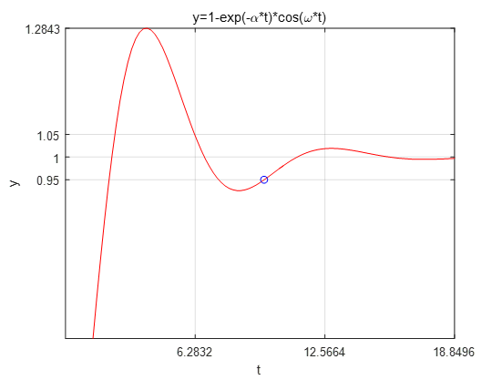

```matlab
% put your code here
% 参数定义
alpha = 0.3;
beta = 0.7;
% 定义时间范围
t = linspace(0, 6*pi, 1000);  % 使用linspace创建从0到6π的1000个点
% 计算y值
y = 1 - exp(-alpha * t) .* cos(beta * t);
% 绘制曲线
figure; % 创建新的图形窗口
plot(t, y,'r','LineWidth', 1);
% plot(t, y, '--b', 'LineWidth', 2); % 使用虚线和蓝色,线粗为2
xlabel('t');
ylabel('y');
title('y = 1 - exp(-\alpha t) \cdot cos(\beta t)');

xlim([0 6*pi]);           
xticks(0:2*pi:6*pi); 
ylim([0 1.4]);           
yticks(0.95:0.05:1.05); 

grid on; % 添加网格
```
实际运行图：

2.Stack the horizontal bar chart.堆叠水平条形图。
    

```matlab
% put your code here
clear;clc;close all;
x = [1 2 5 4 8];
y = [x;1:5];
subplot(1,2,1);
bar(y,"stacked"); %stacked是一个可选的参数，代表堆栈
title("Stacked");
subplot(1,2,2);
barh(y,"stacked"); %barh 水平式的bar
title("Horizontal")
```
实际运行图：

3.Separate all the pieces in the 3D pie chart
   分离 3D 饼图中的所有部分
    

```matlab
% put your code here
clear;clc;close all;
a = [15 8 31 46];
subplot(1,3,1);
pie(a); %画出饼图，自动计算百分比
subplot(1,3,2);
pie(a,[0,0,0,1]);
subplot(1,3,3);
pie3(a,[1,1,1,1]); %3代表三维
```
实际运行图：

4.Plot a hexagon on a polar chart
   在极坐标图上绘制六边形
    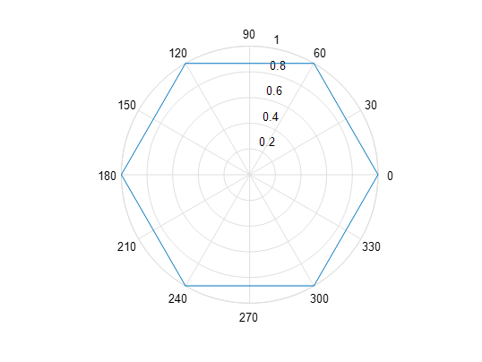

```matlab
% put your code here
% 六边形的边数
n = 6;
% 定义六边形的顶点角度
theta = linspace(0, 2*pi, n+1); % 从 0 到 2\pi 生成 n+1 个点，以便闭合六边形
% 为这些顶点定义半径（1表示正六边形）
r = ones(size(theta));%size返回theta向量的元素个数
% 创建极坐标图
figure;
polar(theta,r);
% 添加图形标题
title('极坐标图上的六边形');

%另一种解法
%polarplot(theta, r, '-b', 'LineWidth', 1);
%rlim([0 1]);                % 设置 r 轴范围为 0 到 1
%rticks(0:0.2:1);            % 设置 r 轴刻度为 0, 0.2, 0.4, ..., 1

%polarplot 是用于绘制极坐标图的 MATLAB 函数。
%theta 和 r 分别指定了每个点的角度和半径。
%- 表示用实线连接顶点，b表示蓝色线型。
%'LineWidth', 1 设置了线条的宽度，使图形更清晰。
```

实际运行图：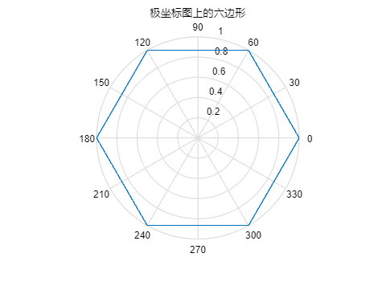

5.Plot a function:$f\left( t \right) =\sin \left( \small{\frac{\pi t^2}{4}} \right)$，Add the points sampled at 5 Hz using `stem()`绘制函数图：$f\left( t \right) =\sin \left( \small{\frac{\pi t^2}{4}} \right)$使用 `stem()` 添加以 5 Hz 频率采样的点
   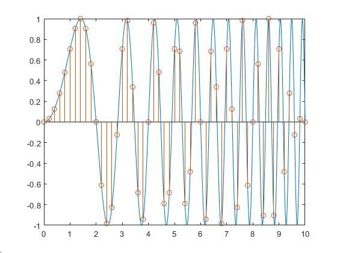

```matlab
% put your code here
% 定义时间范围和步长
t_continuous = linspace(0, 10, 1000); % 连续时间向量，用于绘制平滑曲线
t_sampled = 0:0.2:10; % 以 5 赫兹采样，即每秒 5 个样本，步长为 1/5 = 0.2 秒

% 计算连续函数值
f_continuous = sin(pi * t_continuous.^2 / 4);

% 计算采样点的函数值
f_sampled = sin(pi * t_sampled.^2 / 4);
%.^ 是用于数组元素逐元素幂运算的运算符

% 绘制图形
figure;
plot(t_continuous, f_continuous, 'b-', 'LineWidth', 0.8); % 连续函数曲线
hold on;
%hold on 命令用于保持当前图形窗口活跃，使新的绘图命令不会删除当前的图形内容。在调用 hold on 之后，任何新图形元素（如线条、点或其他图表）都将被添加到现有图形上，而不是替换它们。
stem(t_sampled, f_sampled, 'r'); % 采样点，使用 stem 函数绘制
hold off;
%hold off 命令用于关闭保持状态，恢复默认的图形绘制行为。

% 添加标签和标题
xlabel('Time (s)');
ylabel('f(t)');
title('Function f(t) = sin(\pi t^2 / 4) with 5 Hz Sampling Points');
%legend('Continuous Function', 'Sampled Points');%添加图例
%在调用 legend 函数时，顺序很重要。第一个参数 'Continuous Function' 对应 plot 绘制的连续曲线，第二个参数 'Sampled Points' 对应 stem 绘制的采样点

% 设置 x 轴范围和刻度
xlim([0 10]);           % 设置 x 轴显示范围为 1 到 10
xticks(1:1:10);         % 设置 x 轴刻度为 1 到 10，间隔为 1

ylim([-1 1]);           
yticks(-1:0.2:1);       

grid on;
```

实际运行图：

6.Various Contour PlotsCombine the contour techniques to generate a figure as shown below.
各种等高线图将等高线技术相结合，生成如下图所示的图形。


```matlab
% put your code here
x = -2:0.01:2; 
y = -2:0.01:2; 
[X,Y] = meshgrid(x,y);% 创建网格矩阵 X 和 Y，适用于二维函数
Z = X.*exp(-X.^2-Y.^2);% 计算 Z 的值，Z 为 X 和 Y 的复合函数
[C,h] = contourf(X,Y,Z,-.45:.05:.45); % 生成等高线
clabel(C,h);% 添加标签
colormap(jet); % 设置颜色映射为 jet
axis square; %axis square 函数用于调整当前坐标轴的比例，使得 x 轴和 y 轴的单位长度相等
```

实际运行图：

7.Consider two electrocardiogram (ECG) signals with different trends. Load the signals and plot them.

  考虑两个趋势不同的心电图（ECG）信号。 加载信号并绘制曲线。
  

```matlab
% put your code here
load('ecgSignals.mat') %加载同路径下的数据文件

% 检查加载的数据结构
whos; % 显示工作区中的变量信息

% 假设数据加载后包含两个信号变量 signal1 和 signal2
% 根据实际的变量名称和数据结构进行调整
signal1 = ecgl;
signal2 = ecgnl;

% 两个信号的采样频率相同，获取信号长度
N = length(signal1); % 信号长度
fs = 1;            % 采样频率

% 生成时间向量
t = (0:N-1) / fs;
%N-1 的使用是因为 MATLAB 中的索引是从 1 开始的，而信号的采样点是从 0 计数的

% 绘制信号
figure;
subplot(2, 1, 1);
plot(t, signal1);
title('ECG Signal 1');
xlabel('Time');
ylabel('Voltage');
grid on;
xlim([0 2000]);           
xticks(0:200:2000); 
ylim([-1 2]);           
yticks(-1:1:2); 

subplot(2, 1, 2);
plot(t, signal2);
title('ECG Signal 2');
xlabel('Time');
ylabel('Voltage');
grid on;
xlim([0 2000]);           
xticks(0:200:2000); 
ylim([-1 2]);           
yticks(-1:1:2); 

% 调整图形窗口的布局
sgtitle('Comparison of Two ECG Signals');
```
实际运行图：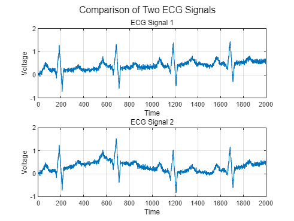

### 第四期--信号产生

1.Generates 10 seconds of a square wave with a period of π, set the sample rate to 1 kHz and specify a duty cycle of 30%. Add white Gaussian noise with a variance of 1/100 .

   产生 10 秒钟的方波，周期为π，设置采样率为 1 kHz，占空比为 30%。 添加方差为 1/100 的白高斯噪声。

```matlab
% 设置参数
fs = 1000;               % 采样率 1 kHz
T = pi;                  % 周期为π
duration = 10;           % 信号持续时间 10 秒
dutyCycle = 30;          % 占空比 30%
% 生成时间向量
t = 0:1/fs:duration;     % 从 0 到 10 秒，间隔为 1/fs
% 生成方波信号
x = square(2 * pi / T * t, 30);  % 根据周期和占空比生成方波
% 添加高斯白噪声
variance = 1/100;        % 噪声的方差
noise = sqrt(variance) * randn(size(x));  % 生成高斯白噪声
x_noisy = x + noise;     % 将噪声添加到方波信号中
% 绘制结果
figure;
plot(t, x_noisy, 'b', 'LineWidth', 1.5);  % 绘制带噪声的方波信号
hold on;
plot(t, x, 'r--', 'LineWidth', 1.5);      % 绘制原始方波信号
xlabel('Time (s)');
ylabel('Amplitude');
title('Square Wave with Added Gaussian Noise');
legend('Noisy Signal', 'Original Signal');
grid on;
hold off;
```

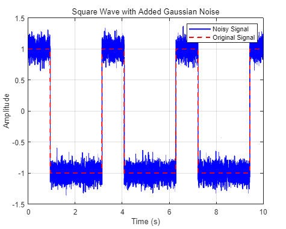

### 第五期--信号趋势去除与数据拟合

1.Remove Linear Trends from Data

   此示例说明如何从股票每日收盘价中去除线性趋势，以重点观察整体涨幅的价格波动。如果数据确实有趋势，则去除线性趋势会强制其均值为零并减少总体变化。该示例使用从 gallery 函数获取的分布来模拟股价波动。
   创建一个模拟数据集并计算其均值。sdata 表示股票的每日价格变动。

```matlab
t = 0:300;
dailyFluct = gallery('normaldata',size(t),2); 
sdata = cumsum(dailyFluct) + 20 + t/100;
```

 求出数据的平均值。

```matlab
mean(sdata)
```

绘制和标记数据。可以看到，数据显示股价呈系统性增长，效果图如图所示

```matlab
figure
plot(t,sdata);
legend('Original Data','Location','northwest');
xlabel('Time (days)');
ylabel('Stock Price (dollars)');
```

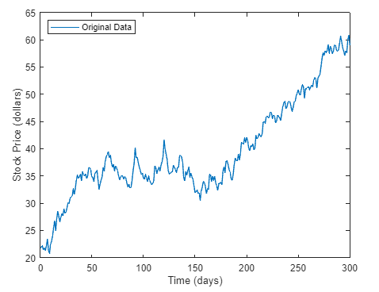

应用 detrend，它对 sdata 执行线性拟合，然后对其进行去除线性趋势处理。从输入中减去输出，得出计算所得的趋势线。

```matlab
detrend_sdata = detrend(sdata);
trend = sdata - detrend_sdata;
```

求出去除线性趋势后的数据的平均值。

```matlab
mean(detrend_sdata)
```

去除线性趋势后，数据均值非常接近 0，与预期相符。
将趋势线、去除线性趋势后的数据及其均值添加到图中，以显示结果。效果如图所示。

```matlab
hold on
plot(t,trend,':r')
plot(t,detrend_sdata,'m')
plot(t,zeros(size(t)),':k')
legend('Original Data','Trend','Detrended Data',...
       'Mean of Detrended Data','Location','northwest')
xlabel('Time (days)'); 
ylabel('Stock Price (dollars)');
```

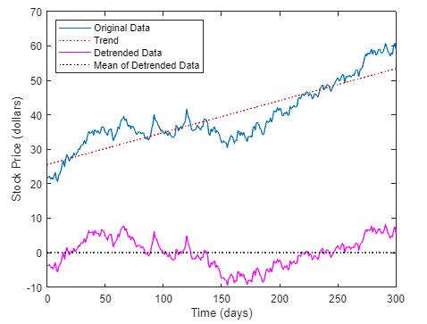

2.Fit Polynomial to Set of Points 将多项式拟合到点集

   Create a vector of 5 equally spaced points in the interval [1,2], and evaluate  at those points.

   在区间 [1,2] 内创建由 5 个等距点组成的向量，并在这些点上求值。

```matlab
points = linspace(1, 2, 5);  % 在区间 [1, 2] 中生成5个均匀分布的点
f = @(x) x.^2;  % 定义函数
evaluated_values = f(points);  % 计算函数值
```

   Fit a polynomial of degree 4 to the 5 points. In general, for n points, you can fit a polynomial of degree n-1 to exactly pass through the points.在 5 个点上拟合一条阶数为 4 的多项式。 一般来说，对于 n 个点，可以拟合出一个 n-1 度的多项式来精确通过这些点。

```matlab
p = polyfit(points, evaluated_values, 4);  % 拟合4次多项式
```

   Evaluate the original function and the polynomial fit on a finer grid of points between 1 and 3.在 1 至 3 点之间的更细网格上评估原始函数和多项式拟合。

```matlab
fine_grid = linspace(1, 3, 100);   % 在区间 [1, 3] 内生成100个点
f_original = f(fine_grid);         % 计算原始函数值
f_polyfit = polyval(p, fine_grid); % 计算多项式拟合值
```

   Plot the function values and the polynomial fit in the wider interval [1,3], with the points used to obtain the polynomial fit highlighted as circles. The polynomial fit is good in the original [1,2] interval, but quickly diverges from the fitted function outside of that interval.在更宽的区间 [1,3] 内绘制函数值和多项式拟合图，并用圆圈标出用于获得多项式拟合的点。 在原始区间 [1,2] 内，多项式拟合效果良好，但在该区间外，拟合函数迅速发散。

```matlab
figure;
plot(fine_grid, f_original, 'b-', 'LineWidth', 1.5); % 原始函数
hold on;
plot(fine_grid, f_polyfit, 'r--', 'LineWidth', 1.5);  % 多项式拟合
plot(points, evaluated_values, 'ko', 'MarkerFaceColor', 'k'); % 拟合点
xlabel('x');
ylabel('Function Value');
title('Polynomial Fit to Function f(x) = x^2');
legend('Original Function', 'Polynomial Fit', 'Fitting Points', 'Location', 'Best');
grid on;
hold off;
```

   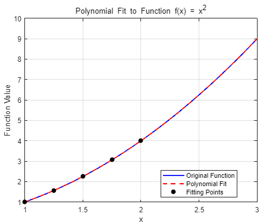
