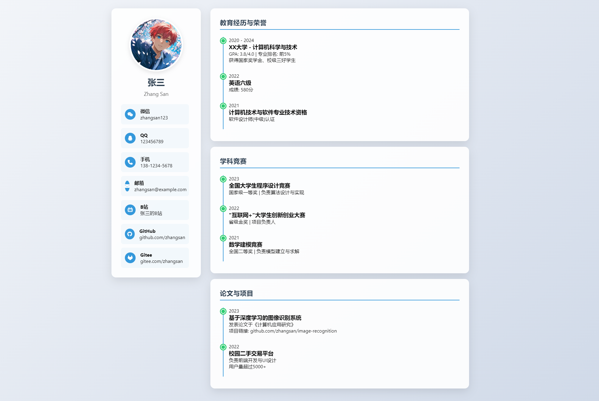
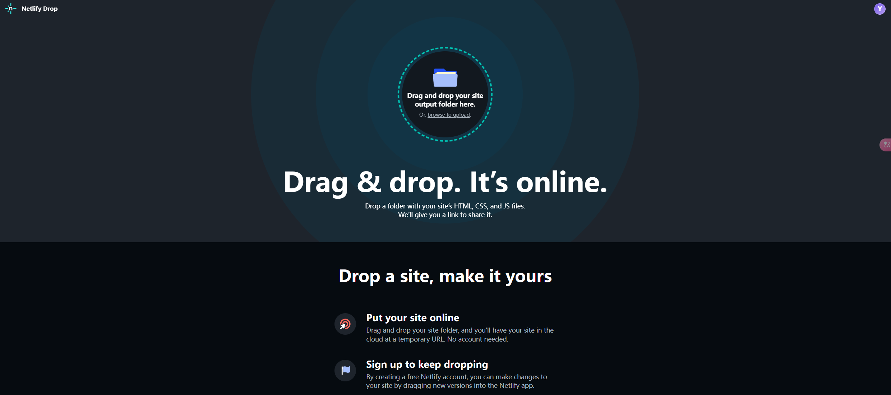

# 📣动态简历？电子名片！

超炫酷！记录一下自己设计的简历网页。它不仅是一份简历载体，更能作为独具特色的个人新名片 ，助力我们在社交和求职中脱颖而出。

文末附零基础部署教程👇

---

### 📝 项目功能说明

这是一个**纯静态响应式电子名片网页**，基于原生HTML+CSS+JavaScript实现，无需后端支持。

修改填充内容十分容易，技术栈非常简单，无框架零依赖。

⚡电子名片网页预览：[个人简历 - 张三 (weigo6.github.io/resume-site/)](https://weigo6.github.io/resume-site/)

🎯 核心功能亮点：

#### ✅1. **智能响应式设计**

- 自动适配手机/平板/电脑屏幕  
- 侧边栏在PC端固定显示，移动端自动转为上下布局  

#### ✅2. **全3D视差动效**

- 滚动触发的渐显动画 
- 悬浮卡片+旋转图标带来空间层次感

#### ✅3. **时间轴履历系统**

- 时间线可视化  
- 教育/竞赛/项目经历立体化呈现
- 标题悬停平移效果  

#### ✅4. **证书自动滚动墙**

- 无限循环的水平滚动动画
- 悬停暂停+放大查看效果  
- 响应式图片尺寸适配  

#### ✅5. **现代化设计**

- 现代化卡片式设计  
- 包含时间轴卡片、标准内容卡片与滚动图片卡片

---

📌 项目地址：[Github地址](https://github.com/weigo6/resume-site)；[Gitee地址](https://gitee.com/weigo6/resume-site)（喜欢记得点个Star🌟）

📌公众号后台回复`电子名片`获取代码文件夹

---

### 🌐 Netlify 静态部署教程

🛠️只需3步免费上线你的简历网页：

---

#### 1️⃣步骤1：准备代码文件

1. 获取代码文件夹
2. 包含以下文件：  
   - `index.html`（主页面）  
   - `pic.png`（头像文件，可选）  
   - `404.html`（错误访问代码页面等）
3. 需要使用VsCode等工具打开index.html文件，进行信息修改，引用添加的图片可以在项目根目录创建一个文件夹存储。
4. （可选）通过Git上传Github管理项目：  

   ```bash
   git init
   git add .
   git commit -m "Initial commit"
   ```

---

#### 2️⃣步骤2：部署到Netlify

1. 访问 [Netlify官网](https://www.netlify.com/) → 点击 _"Sign up"_ 注册（邮箱注册支持GitHub账号登录）  
2. 进入控制台 → 拖拽`项目文件夹`到虚线区域  
   
3. （可选）绑定Github账户，拉取Github仓库进行网页部署。
4. 等待自动部署完成（约30秒）  
5. 部署完成后可以在站点设置中自定义二级域名，例如：`your-site-name.netlify.app`
6. 🌟可以访问啦！

---

#### 3️⃣步骤3：配置自定义域名（可选）

1. 部署成功后 → 进入 _"Domain settings"_  
2. 点击 _"Add custom domain"_ → 输入已购买的域名  
3. 根据提示在域名购买商处配置DNS解析：  
   - 记录类型：`CNAME`  
   - 目标地址：`your-site.netlify.app`  

---

### 💡 Tips!

- Netlify平台每月为免费用户提供了100GB的访问流量
- 除Netlify外，也可以使用Github Pages（访问比较慢）进行部署
- 建议将网页中引用的图片转换成WebP格式以加快网页的加载速度
- [在线图片格式转换器（jpg、png、webp、bmp、svg）-宅Tools (xiaozhaijun.com)](https://tools.xiaozhaijun.com/#/index)
- 部署过程如有疑问，欢迎在评论区留言交流~

立即让你的名片在互联网上闪耀吧！ ✨  
