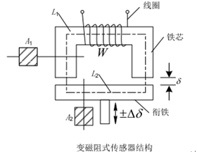
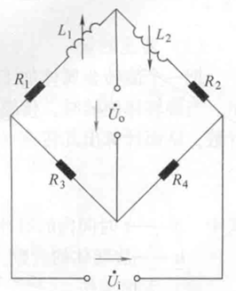
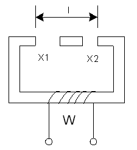
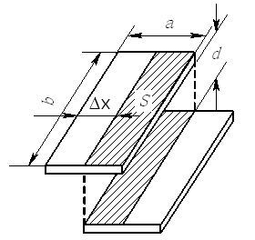
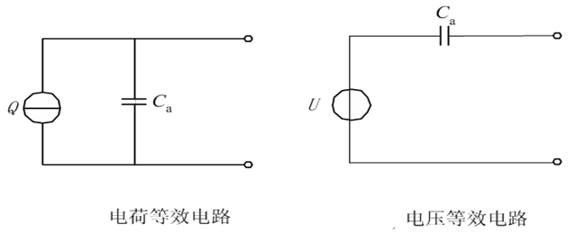
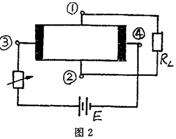
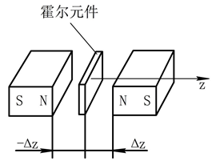

# 传感器与检测技术

---

2025-6-15/16 writed by luwei

## 传感器的基本特性

### 迟滞误差

**迟滞误差（Hysteresis Error）** 是指传感器在输入量递增（正行程）和递减（反行程）的过程中，对于同一输入量所得到的输出量之间存在的差异。这种误差反映了传感器在测量过程中对输入信号变化方向的依赖性，本质上是由于传感器内部结构（如弹性元件的弹性滞后、磁性材料的磁滞现象、机械摩擦等）导致的非理想特性。

迟滞误差的存在会使得传感器的输出特性曲线在正、反行程时不重合，形成类似于 “滞环” 的现象。它是衡量传感器静态特性的重要指标之一，直接影响测量的准确性和重复性。

#### 迟滞误差的一般表达式

迟滞误差的计算公式为：$\gamma_H = \frac{\Delta H_{\max}}{y_{\mathrm{FS}}}\times 100\%$

- $\Delta H_{\text{max}}$ 为全量程范围内正、反行程输出值的最大差值；
- $Y_{\text{FS}}$ 为传感器的满量程输出值（Full Scale Output）

### 重复性误差

**重复性误差（Repeatability Error）** 是指传感器在相同测量条件下（相同环境、相同输入方向、相同操作方法），对同一输入量进行多次重复测量时，其输出值之间的最大差异。该误差反映了传感器输出特性的一致性和稳定性。

迟滞误差体现正 / 反行程的差异，重复性误差体现同方向多次测量的差异。

对某温度传感器重复测量 25℃的环境温度 10 次，输出电压分别为 2.51V、2.49V、2.53V、2.50V… 其中最大值与最小值的差异即为重复性误差的体现。

#### 最大偏差法求重复性误差的步骤与公式

1. **控制测量条件**：保持环境温度、湿度、供电电压等条件不变，对同一输入量进行**n 次（n≥3）** 重复测量（输入方向一致，如均为递增或均为递减）。
2. **记录输出值**：记录每次测量的输出值 $y_1, y_2, \dots, y_n$。
3. **计算单次偏差**：对每次测量值，计算其与平均输出值 $\bar{y}$ 的偏差 $\Delta y_i = y_i - \bar{y}$。
4. **确定最大偏差**：找出所有偏差中的绝对值最大值 $\Delta y_{\text{max}} = \max(|\Delta y_1|, |\Delta y_2|, \dots, |\Delta y_n|)$。
5. **计算重复性误差**：以相对误差形式表示，公式如下：$\text{重复性误差}\gamma_R = \frac{\Delta y_{\text{max}}}{Y_{\text{FS}}} \times 100\%$，其中 $Y_{\text{FS}}$ 为传感器的满量程输出值。

示例计算

假设某压力传感器满量程输出为 5V（$Y_{\text{FS}}=5\text{V}$），对 10kPa 压力重复测量 5 次，输出值为：$2.01\text{V}, 1.98\text{V}, 2.03\text{V}, 2.00\text{V}, 1.99\text{V}$

- 平均输出值：$\bar{y} = \frac{2.01+1.98+2.03+2.00+1.99}{5} = 2.002\text{V}$
- 单次偏差：$\Delta y_1 = 2.01-2.002=0.008\text{V}$,$\Delta y_2 = 1.98-2.002=-0.022\text{V}$,$\Delta y_3 = 2.03-2.002=0.028\text{V}$,$\Delta y_4 = 2.00-2.002=-0.002\text{V}$,$\Delta y_5 = 1.99-2.002=-0.012\text{V}$
- 最大偏差绝对值：$\Delta y_{\text{max}} = 0.028\text{V}$
- 重复性误差：$\frac{0.028}{5} \times 100\% = 0.56\%$

### 最小二乘法拟合直线

用线性模型 $y = kx + b$ 逼近测量数据，使 “残差平方和最小”，见例题2。

联立方程组求解斜率 k、截距 b： $\begin{cases} k = \frac{n\sum xy - \sum x \sum y}{n\sum x^2 - (\sum x)^2} \\ b = \frac{\sum y - k\sum x}{n} \end{cases}$ 

#### 线性度（非线性误差）

实际曲线与拟合直线的最大偏差程度。实际输出与拟合直线的最大偏差，占满量程输出的比例，反映线性程度。

$\delta_L = \frac{\Delta y_{\text{max}}}{y_{\text{FS}}} \times 100\%$，$\Delta y_{\text{max}}$ 是最大残差绝对值，$y_{\text{FS}}$ 是满量程输出。

#### 灵敏度

拟合直线的斜率，反映输入输出的比例关系。$k = \frac{\Delta y}{\Delta x}$（线性模型中为常数）

### 动态误差

动态误差是指检测系统在被测量随时间变化时，输出量与被测量真实值之间的差值。

#### 时间常数（$\tau_0$）

时间常数是反映传感器响应速度的重要参数，它表示传感器在阶跃输入下，输出值从初始值变化到最终值的$63.2\%$所需的时间。时间常数越大，传感器响应越慢，达到稳定所需时间越长，动态误差持续的时间和幅度也可能越大 。

#### 一阶系统微分方程

例3题目中给出的$t_{1}=t_{2}+\tau_{0} \frac{d t_{2}}{d \tau}$是描述一阶测温系统（很多简单的测温传感器可近似为一阶系统，其热传递等过程符合一阶线性微分方程的规律）动态特性的微分方程。其中$t_1$是被测介质真实温度（输入量），$t_2$是传感器示值温度（输出量），$\tau$是时间变量，该方程体现了输入、输出以及输出变化率之间的关系，用于分析传感器在温度突变等动态过程中的响应情况。

### 选填简答题

1. 什么是传感器的静态特性，描述传感器静态特性的主要指标有哪些？

   指传感器在输入量的变化率为零（输入静态信号）时的输出与输入关系，反映传感器在静态条件下的测量精度。

   **主要指标**：

   - **线性度**：输出与输入的线性程度，用实际曲线与拟合直线的最大偏差表示。
   - **灵敏度**：输出变化量与输入变化量的比值，反映传感器对输入量的敏感程度。
   - **迟滞**：正向行程与反向行程输出特性的差异，由机械摩擦、材料滞后等引起。
   - **重复性**：在相同条件下重复测量时，输出的一致性程度。
   - **漂移**：在输入不变时，输出随时间或环境温度的缓慢变化，包括温漂和时漂。

2. 什么是传感器的动态特性，描述传感器静态特性的主要指标有哪些？如何分析传感器动态特性？

   指传感器对随时间变化的输入信号（动态信号）的响应能力，反映传感器跟踪输入信号变化的速度和准确性。

   **主要指标**：

   - **时间常数（τ）**：一阶系统中表征响应速度，τ 越小，响应越快。
   - **固有频率（ωₙ）**、**阻尼比（ζ）**：二阶系统的关键参数，影响系统的振荡特性和稳定性。
   - **上升时间**：输出从终值的 10% 上升到 90% 所需的时间，反映响应速度。
   - **超调量**：输出超过终值的百分比，体现系统的振荡幅度。
   - **稳态误差**：动态过程结束后，输出与理想值的偏差，反映测量精度。

   **动态特性分析方法**：

   - **时域分析**：通过阶跃响应等典型输入信号，分析上升时间、超调量等时域指标。
   - **频域分析**：利用正弦输入信号，绘制幅频特性和相频特性曲线，分析传感器的频率响应范围和相位失真。

3. 试解释线性时不变系统的叠加性和频率保持性特性的含义及其意义。

   **叠加性**：

   - **含义**：若系统对输入信号 x₁(t) 的响应为 y₁(t)，对 x₂(t) 的响应为 y₂(t)，则对输入 a・x₁(t)+b・x₂(t) 的响应为 a・y₁(t)+b・y₂(t)（a、b 为常数）。
   - **意义**：简化复杂输入信号的响应计算，可将复杂信号分解为简单信号的叠加，分别求解后再叠加。

   **频率保持性**：

   - **含义**：当输入信号包含某一频率成分时，系统的稳态响应也仅包含相同频率的成分，不会产生新的频率分量。
   - **意义**：在信号测量中，可通过输出信号的频率分析确定输入信号的频率，排除干扰频率的影响，保证测量准确性。

### 例题

**1.**某压力传感器的三次测试数据如下表所示求该传感器三次测试的**迟滞误差**井使用最大偏差法求该传感器的**重复性误差**

(保留小数点后两位)

| 行 程   |输出电压(mV) （1）     |（2）          |（3）   |
| ------ | -------------------- | ------------ | ----- |
| 正行程 输入压力（$×10^5Pa$） |  |              ||
| 2.0    | 190.9            | 191.1    | 191.3     |
| 4.0    | 382.8            | 383.2    | 383.5     |
| 6.0    | 575.8            | 576.1    | 576.6     |
| 8.0    | 769.4            | 769.8    | 770.4     |
| 10.0   | 963.9            | 964.6    | 965.2     |
| 反行程 输入压力（$×10^5Pa$） |   |          |           |
| 10.0   | 964.4            | 965.1    | 965.7     |
| 8.0    | 770.6            | 771.0    | 771.4     |
| 6.0    | 577.3            | 577.4    | 578.4     |
| 4.0    | 384.1            | 384.2    | 384.7     |
| 2.0    | 191.6            | 191.6    | 192.0     |

**答：**

（1）迟滞误差的计算公式为：$\gamma_H = \frac{\Delta H_{\max}}{y_{\mathrm{FS}}}\times 100\%$

第一次测量：由所给数据可得：$\Delta H_{\max} = 1.5$，$y_{\mathrm{FS}} = 964.4$，($577.3 - 575.8 = 1.5$)

所以，$\gamma_{H1} = \frac{\Delta H_{\max}}{y_{\mathrm{FS}}}\times 100\% = \frac{1.5}{964.4}\times 100\% = 0.16\%$

第二次测量：由所给数据可得：$\Delta H_{\max} = 1.3$，$y_{\mathrm{FS}} = 965.1$，($577.4 - 576.1 = 1.3$)

所以，$\gamma_{H2} = \frac{\Delta H_{\max}}{y_{\mathrm{FS}}}\times 100\% = \frac{1.3}{965.1}\times 100\% = 0.13\%$

第三次测量：由所给数据可得：$\Delta H_{\max} = 1.8$，$y_{\mathrm{FS}} = 965.7$，($578.4 - 576.6 = 1.8$)

所以，$\gamma_{H3} = \frac{\Delta H_{\max}}{y_{\mathrm{FS}}}\times 100\% = \frac{1.8}{965.7}\times 100\% = 0.19\%$

（2）由所给数据可得，

正行程：$\Delta R_{1_{\max}} = 1.3$，反行程：$\Delta R_{2_{\max}} = 1.3$

所以，$\Delta R_{\max} = \max(\Delta R_{1_{\max}}, \Delta R_{2_{\max}}) = 1.3$

又 $y_{\mathrm{FS}} = 965.7$

> 由于题目未给出满量程输出值，故直接从表格中取最大值计算。

所以，重复性误差为：

$\gamma_R = \pm\frac{\Delta R_{\max}}{y_{\mathrm{FS}}}\times 100\% = \pm\frac{1.3}{965.7}\times 100\% = \pm0.13\%$

**2.**通过某检测装置测得的一组输入输出数据如表 1 所示。试用最小二乘法拟合直线，并求其线性度和灵敏度。

表 1 某检测装置获取的一组测量数据

| x    | 1    | 2    | 3    | 4    |
| ---- | ---- | ---- | ---- | ---- |
| y    | 2.2  | 4.1  | 5.8  | 8.0  |

**答：**

拟合直线目标：找线性模型 $y = kx + b$，使残差 $e_i = y_i - (kx_i + b)$ 的平方和最小，即 $S = \sum e_i^2 = \sum (y_i - kx_i - b)^2$ 最小。

推导过程：

对 S 分别求 $k、b$ 的偏导并令其为 0，联立得方程组：$\begin{cases}  \frac{\partial S}{\partial b} = -2\sum (y_i - kx_i - b) = 0 \\  \frac{\partial S}{\partial k} = -2\sum x_i(y_i - kx_i - b) = 0  \end{cases}$

化简后得到**计算 $k、b$ 的公式**（n 为数据点数，本题 $n=4$）：$k = \frac{n\sum xy - \sum x \sum y}{n\sum x^2 - (\sum x)^2}, \quad b = \frac{\sum y - k\sum x}{n}$

代入题目数据计算：

- 先算基础求和项：$\sum x = 1+2+3+4 = 10$$\sum y = 2.2+4.1+5.8+8.0 = 20.1$$\sum xy = 1×2.2 + 2×4.1 + 3×5.8 + 4×8.0 = 2.2 + 8.2 + 17.4 + 32.0 = 59.8$$\sum x^2 = 1^2+2^2+3^2+4^2 = 1+4+9+16 = 30$
- 计算 k：$k = \frac{4×59.8 - 10×20.1}{4×30 - 10^2} = \frac{239.2 - 201}{120 - 100} = \frac{38.2}{20} = 1.91$
- 计算 b：$b = \frac{20.1 - 1.91×10}{4} = \frac{20.1 - 19.1}{4} = \frac{1}{4} = 0.25$

**拟合直线方程：**$y = 1.91x + 0.25$

非线性误差计算：

1. 计算每个数据点的**残差** $e_i = y_i - (kx_i + b)$（实际值与拟合值的差）
2. 找残差的**最大绝对值** $\Delta y_{\text{max}}$；
3. 计算**满量程输出 $y_{\text{FS}}$**：最大输出 - 最小输出（本题不确定最小输出，取最大输出值8.0作为满量程输出值）；
4. 代入公式：$\delta_L = \frac{\Delta y_{\text{max}}}{y_{\text{FS}}} \times 100\%$

代入题目数据计算：

- 计算各点残差：
  - $x=1$: $e_1 = 2.2 - (1.91×1 + 0.25) = 2.2 - 2.16 = 0.04$
  - $x=2$: $e_2 = 4.1 - (1.91×2 + 0.25) = 4.1 - 4.07 = 0.03$
  - $x=3$: $e_3 = 5.8 - (1.91×3 + 0.25) = 5.8 - 5.98 = -0.18$
  - $x=4$: $e_4 = 8.0 - (1.91×4 + 0.25) = 8.0 - 7.9 = 0.1$
- 最大残差绝对值：$\Delta y_{\text{max}} = |-0.18| = 0.18$
- **线性度：**$\delta_L = \frac{0.18}{8} \times 100\% \approx 2.25\%$

灵敏度计算：输入变化引起输出变化的比例，线性模型中等于拟合直线的斜率 k（非线性模型中是变化率，本题因线性拟合，直接取 k）。

$k = \frac{\Delta y}{\Delta x}$

拟合直线斜率 $k = 1.91$，即**灵敏度为 1.91**（物理意义：输入 x 每变化 1 单位，输出 y 平均变化 1.91 单位）。

**3.**当被测介质温度为 $t_{1}$，测温传感器示值温度为 $t_{2}$ 时，有下列方程式成立:
$$
t_{1}=t_{2}+\tau_{0} \frac{d t_{2}}{d \tau}
$$

当被测介质温度从 $25^{\circ} \mathrm{C}$ 突然变化到 $300^{\circ} \mathrm{C}$ 时，测温传感器时间常数 $\tau_{0}=120 \mathrm{~s}$，试确定经过 $480 \mathrm{~s}$ 后的动态误差。

> 自动控制原理的典型题目

- 1.**建立系统传递函数**

   $\because \tau_{0} \frac{d t_{2}}{d \tau} +t_{2}=t_{1} \leftrightarrow$ $\left(\tau_{0} s+1\right) t_{2} s=t_{1}(s) $

  确定一阶系统传递函数$H(s)=1/(\tau_0 s + 1)$，其中$\tau_0=120\text{ s}$。

- 2.**求解阶跃响应**

  输入信号的拉氏变换为: $X(s)=\frac{275}{s}$

  $\therefore Y(s)=H(s) X(s)=\frac{1}{\tau_{0} s+1} \cdot \frac{275}{s}$

  进行拉氏反变换后，有 $y(t)=275 \left(1-e^{-\frac{t}{120}}\right)$

- 3.**计算动态误差**

	在控制系统中，误差通常定义为$e(t) = r(t) - y(t)$，
	$\therefore$ 动态误差 $\Delta=275-y(480)=275 e^{-\frac{480}{120}}=5.04\left({ }^{\circ} \mathrm{C}\right)$

4. 某传感器为一阶系统，当受阶跃函数作用时，在 $t=0$ 时，输出为 $10 \mathrm{mV}$; 在 $t=5 \mathrm{~s}$时输出为 $50 \mathrm{mV}$; 在 $t \rightarrow \infty$ 时, 输出为 $100 \mathrm{mV}$ 。试求该传感器的时间常数。

**答：**

1. 一阶系统阶跃响应公式：$y(t)=y(\infty)(1 - e^{-\frac{t}{\tau}})+y(0)e^{-\frac{t}{\tau}}$（这里$y(0) = 10 mV$，$y(\infty)=100 mV$ ），也可简化为 $y(t)-y(0)=[y(\infty)-y(0)](1 - e^{-\frac{t}{\tau}})$ 。
2. 代入$t = 5s$，$y(5) = 50 mV$ ，$y(0) = 10 mV$，$y(\infty)=100 mV$：
   - $50 - 10=(100 - 10)(1 - e^{-\frac{5}{\tau}})$
   - $40 = 90(1 - e^{-\frac{5}{\tau}})$
   - $1 - e^{-\frac{5}{\tau}}=\frac{4}{9}$
   - $e^{-\frac{5}{\tau}} = 1-\frac{4}{9}=\frac{5}{9}$
   - 两边取自然对数：$-\frac{5}{\tau}=\ln\frac{5}{9}$
   - 计算得$\tau=\frac{5}{-\ln\frac{5}{9}}=\frac{5}{\ln\frac{9}{5}}\approx 6.74s$

## 电阻式传感器

### 应变片工作原理

- **应变效应**：导体或半导体材料在受力产生应变时，其电阻值会发生变化，称为应变效应。电阻变化率与应变的关系为：$\frac{\Delta R}{R} = K \cdot \varepsilon$
- **灵敏系数 K**：反映单位应变引起的电阻变化率，由材料特性和几何结构决定，公式为：$K = \frac{\Delta R/R}{\varepsilon}$ 对于金属应变片，K 主要由几何变形（尺寸效应）决定；对于半导体应变片，K 主要由压阻效应（电阻率变化）决定。

### 应力 - 应变关系

- **胡克定律**：弹性范围内，应力与应变成正比，是力学量检测的基础，公式为：$\sigma = E \cdot \varepsilon \quad (\text{或} \quad \varepsilon = \frac{\sigma}{E})$ 其中，$\sigma$ 为应力（单位：$\text{N/m}^2$），E 为弹性模量（单位：$\text{Pa}$）。

### 温度与热膨胀系数

- **温度对电阻的直接影响**：由电阻温度系数 $\alpha$ 引起的电阻变化为：$\frac{\Delta R_1}{R} = \alpha \cdot \Delta T$ 其中，$\alpha$ 为材料的电阻温度系数（本题中康铜丝 $\alpha = 20 \times 10^{-6} \, \Omega/\Omega/^\circ\text{C}$），$\Delta T$ 为温度变化量。
- **热膨胀不匹配引起的附加应变**：当应变片与基体材料的热膨胀系数不同时，温度变化会导致应变片产生附加应变 $\varepsilon_T$：$\varepsilon_T = (\alpha_{\text{基体}} - \alpha_{\text{应变片}}) \cdot \Delta T$ 

### 应变片测量电路

- **惠斯通电桥**：常用测量电路，可将电阻变化转换为电压输出，具有灵敏度高、温度补偿能力强的特点。
- **电桥输出公式**：对于等臂电桥，当应变片电阻变化为 $\Delta R$ 时，输出电压 $U_o$ 为：$U_o = \frac{U_i}{4} \cdot K \cdot \varepsilon$ 其中，$U_i$ 为电桥供电电压。

### 例题

$\text { 有一个电阻为 } 120 \Omega, \mathrm{~K}=2 \text { 的应变片, 弹性极限为 }$ $400 \mathrm{MN} / \mathrm{m}^{2} \text {, 弹性模量为 } 200 \mathrm{GN} / \mathrm{m}^{2} \text { 的钢件上: }$ 

1）当应力等于弹性范围的 1/10时; 

2）如果应变片材料为康铜丝 $\left(\alpha=20 \times 10^{-6} \Omega / \Omega /{ }^{\circ} \mathrm{C}\right.$, 膨胀系数为 $\left.12 \times 10^{-6} \mathrm{~m} / \mathrm{m} /{ }^{\circ} \mathrm{C}\right.$, 钢膨胀系数为 $\left.16 \times 10^{-6} \mathrm{~m} / \mathrm{m} /{ }^{\circ} \mathrm{C}\right)$,温度变化 $20^{\circ} \mathrm{C}$; 试**分别**计算此应变片的电阻变化。

**答：**

（1）已知弹性极限为 $400 \, \text{MN/m}^2$，应力为弹性范围的 1/10 时：$\sigma = \frac{1}{10} \times 400 \, \text{MN/m}^2 = 40 \, \text{MN/m}^2 = 40 \times 10^6 \, \text{N/m}^2$

由胡克定律计算应变：$\varepsilon = \frac{\sigma}{E} = \frac{40 \times 10^6}{200 \times 10^9} = 2 \times 10^{-4}$

代入应变效应公式计算电阻变化：$\Delta R = R \cdot K \cdot \varepsilon = 120 \, \Omega \times 2 \times 2 \times 10^{-4} = 0.048 \, \Omega$

（2）温度直接引起的电阻变化：$\Delta R_1 = R \cdot \alpha \cdot \Delta T = 120 \, \Omega \times 20 \times 10^{-6} \times 20 = 0.048 \, \Omega$

热膨胀不匹配引起的附加应变：$\varepsilon_T = (16 \times 10^{-6} - 12 \times 10^{-6}) \times 20 = 4 \times 10^{-6} \times 20 = 8 \times 10^{-5}$

附加应变引起的电阻变化：$\Delta R_2 = R \cdot K \cdot \varepsilon_T = 120 \, \Omega \times 2 \times 8 \times 10^{-5} = 0.0192 \, \Omega$

总电阻变化：$\Delta R = \Delta R_1 + \Delta R_2 = 0.048 + 0.0192 = 0.0672 \, \Omega$

## 电感式传感器

### 电感线圈的阻抗

电感线圈在交流电路中表现为**复阻抗**，由电阻 R 和感抗 $X_L$ 组成，公式为：$Z = R + j\omega L$，其模值为：$|Z| = \sqrt{R^2 + X_L^2}$

其中：

- $\omega = 2\pi f$ 是角频率（f 为电源频率）；
- j 是虚数单位，体现电感的 “无功” 特性（电流滞后电压 90°）。

### 四臂等阻抗电桥的平衡条件

当电桥平衡时，相对桥臂的电阻值乘积相等。等阻抗电桥，桥臂阻抗模值相等。对于差动电感传感器，$R_1 = R_2 = R$、$L_1 = L_2 = L$（初始平衡状态，见例题图），要求匹配电阻 $R_3、R_4$ 与线圈阻抗 Z 满足：$Z_1 Z_4 = Z_2 Z_3$

### 选填简答题

1. 对于差动变压器，采用交流电压表测量输出电压时，既不能反映位移的方向，也不能消除零点残余电压。

2. 电感式传感器采用变压器式交流电桥测量电路时，根据输出的指示**不**可以判断位移的方向。

3. 变磁阻电感式传感器的基本测量原理是：利用磁导或磁阻的变化

4. 以下哪一项通常是变磁阻电感式传感器的核心结构组成？<u>线圈、铁芯和衔铁</u>

5. 变磁阻电感式传感器常用于测量以下哪种物理量？<u>微小位移</u>

6. 电感式传感器是建立在 <u>电磁感应</u> 基础上的，电感式传感器可以把输入的物理量转换为 <u>线圈的自感系数</u> 或 <u>互感系数</u> 的变化，并通过测量电路进一步转换为电量的变化，进而实现对非电量的测量。

7. 变磁阻式传感器的敏感元件由线圈、<u>铁芯</u> 与 <u>衔铁</u> 三部分组成。

8. 在磁路中电感的表达式为：

    $$
      L = \frac{N^{2} \mu A}{l}
    $$

    其中，$N$表示表示 <u>线圈匝数</u> ，$μ$表示 <u>磁导率</u> ，$A$表示 <u>磁路截面积</u> ，$l$表示 <u>磁路长度</u> 。

9. 变磁阻传感器的灵敏度主要取决于 <u>磁阻变换</u> 对电感的影响程度。

10. 对于变气隙式自感传感器，当街铁移动靠近铁芯时，铁芯上的线圈电感量减少。（X）

11. 差动式比单线圈式结构的变磁阻式传感器在灵敏度方面高了一倍。（√）

12. 变磁阻电感式传感器适合用于测量微小位移、角度等机械量。（√）

13. 当磁阻变大时，线圈的电感值也会随之变大。（X）（磁阻变大 → 磁导变小 → 电感变小）

14. 变磁阻电感式传感器一般使用直流信号作为激励源。 （X）（一般使用交流激励源，因为直流无法检测电感变化）

15. 根据工作原理的不同，电感式传感器可分为哪些种类？

    根据工作原理的不同，电感式传感器可分为变磁阻式（自感式）、变压器式和涡流式（互感式）等种类。

16. 试分析变气隙厚度变磁阻式电感传感器的工作原理

    变磁阻式传感由线圈、铁心和衔铁三部分组成。在铁心和衔铁间有气隙，当衔铁移动时气息厚度发生变化，引起磁路中磁阻变化，从而导致线圈的电感值变化。通过测量电感量的变化就能确定先贴位移量的大小和方向。

17. 差动式比单线圈式结构的变磁阻式传感器在灵敏度和线性度方面有什么优势？

    差动式比单线圈的灵敏度高一倍。

18. 试分析变压器式交流电桥测量电路的工作原理。见书P69-70。要写成公式(4-38)、(4-39)、(4-40)

### 例题

**1.**如下图所示, 有一只差动电感位移传感器, 已知电源电压 $ \vec{U}=4 $ V, $ f=400 $ Hz, 传感器线圈电阻与电感分别为 $ R=40 \Omega $, $ L=30 \mathrm{mH} $, 用两只匹配电阻设计成四臂等阻抗电桥。试求匹配电阻 $ R_3 $ 和 $ R_4 $ 的值为多少？

**答：**

题目要求设计成四臂等阻抗电桥, 因此有: $Z_{1}=Z_{2}=Z_{3}=Z_{4}$ 。

$Z_{1}=Z_{2}=R+j \omega L=R+j 2 \pi f L \quad$

因此有 $Z_{3}=Z_{4}=R+j 2 \pi f L \quad$

所以有:

$$
\begin{aligned}
R_{3} &= R_{4} = \left|Z_{3}\right| = \left|Z_{4}\right| = |R + j 2 \pi f L| = \sqrt{R^{2} + (2 \pi f L)^{2}} \\
&= \sqrt{40^{2} + \left(2 \pi \times 400 \times 30 \times 10^{-3}\right)^{2}} \\
&= 85.34(\Omega)
\end{aligned}
$$

**2.**对于如下图所示自感传感器，试写出磁路总磁阻表达式，并分析当动铁心左右移动时，自感L的变化情况。（已知空气隙的长度为x1和x2，空气隙的面积为S，磁导率为μ，线圈匝数W不变）

**答：**

线圈中自感量： $L=\frac{W^{2}}{R_{\mathrm{m}}}$

磁路总磁阻: $\mathrm{R}_{\mathrm{m}} \approx \frac{2 \delta}{\mu_{0} \mathrm{~A}_{0}}=\frac{2 \mathrm{x}_{1}}{\mu S}+\frac{2 \mathrm{x}_{2}}{\mu S}$

空气隙 $\mathrm{x} 1$ 和 $\mathrm{x} 2$ 各自变而其和不变, 其他变量都不变, 所以自感量 $L$ 不变。

## 电容式传感器

### 平板电容的工作原理

通过极板相对位移改变有效重叠面积 A，从而引起电容 C 变化。当极板沿长度方向平移时，重叠面积与位移量成线性关系，进而实现位移 - 电容的转换。

### 平板电容的基本公式

$$
K_0 = \frac{\Delta C / C_0}{\Delta x}
$$

$$
C = \frac{\varepsilon_0 \varepsilon_r A}{d}
$$

其中：

- $\varepsilon_0 = 8.854 \times 10^{-12} \, \text{F/m}$ 为真空介电常数；
- $\varepsilon_r = 1$ 为空气的相对介电常数（无量纲，由介质绝对介电常数/真空介电常数得到）；
- A 为两极板的有效重叠面积（$\text{m}^2$）；
- d 为极板间距（$\text{m}$）。

- **电容变化量**：当极板有效面积变化时，电容变化量为：

  $\Delta C = C_1 - C_0 = \frac{\varepsilon_0 \varepsilon_r}{d} (A_1 - A_0)$

- **电容相对变化量**：

  $\frac{\Delta C}{C_0} = \frac{A_1 - A_0}{A_0}$

- **位移相对灵敏度**：单位位移引起的电容相对变化量，定义为：

  $K_0 = \frac{\Delta C / C_0}{\Delta x}$

### 例题

已知空气的相对介电常数 $\varepsilon_{r}=1$，真空时的介电常数 $\varepsilon_{0}=8.854 \times 10^{-12} F / m$。一个以空气为介质的平板电容式传感器结构如下图所示，其中 $a=10 \mathrm{~mm}, b=16 \mathrm{~mm}$，两极板间距 $d=1 \mathrm{~mm}$ 。测量时，若上极板在原始位置（$\Delta x=0 \mathrm{~mm}$）上向左平移了 $2 \mathrm{~mm}$ （即 $\Delta x=2 \mathrm{~mm}$），求该传感器的**电容变化量**、**电容相对变化量**和**位移相对灵敏度 **$K_{0}$。

**答：**

电容变化量为：
$\begin{aligned} \Delta C & =C-C_{0}=\frac{\varepsilon_{r} \varepsilon_{0}(a-\Delta x) b}{d}-\frac{\varepsilon_{r} \varepsilon_{0} a b}{d}=-\frac{\varepsilon_{r} \varepsilon_{0} \Delta x b}{d} \\ & =-\frac{1 \times 8.854 \times 10^{-12} \times 2 \times 10^{-3} \times 16 \times 10^{-3}}{1 \times 10^{-3}}=-2.83 \times 10^{-13}(F) \end{aligned}$

即电容减小了 $2.83 \times 10^{-13} F\quad (3$ 分)

电容相对变化量为: $\frac{\Delta C}{C_0} = \frac{A_1 - A_0}{A_0} = \frac{-\Delta x \cdot b}{a \cdot b} = -\frac{\Delta x}{a}=-0.2$

位移相对灵敏度为: 

- 由 $K_{0}=\frac{\Delta C}{C_0} = \frac{A_1 - A_0}{A_0} = \frac{-\Delta x \cdot b}{a \cdot b} = -\frac{\Delta x}{a}$，得：$K_0 = \frac{\Delta C / C_0}{\Delta x} = -\frac{1}{a}$
- 代入数值：$K_0 = -\frac{1}{0.01 \, \text{m}} = -100 \, \text{m}^{-1} \quad (\text{或} \, -0.1 \, \text{mm}^{-1})$

## 压电式传感器

### 选填简答题

1. 对石英晶体，沿光轴方向施加作用力，不会产生压电效应，也没有电荷产生。

2. 石英晶体和压电陶瓷的压电效应对比：压电陶瓷比石英晶体的压电效应明显，稳定性不如石英晶体好。

3. 两个压电元件相并联与单片时相比，并联时电荷量增加了一倍，输出电容为单片时的2倍。

4. 两个压电元件相串联与单片时相比，串联时输出电压增大一倍，电荷量与单片时相同。

5. 陶瓷传感器与压电石英晶体传感器的比较，前者比后者灵敏度高。

6. 电石英晶体表面上产生的电荷密度与作用在晶片上的压力成正比。

7. 电式传感器目前多用于测量动态的力或压力。

8. 英晶体在沿机械轴y方向的力作用下会产生横向压电效应。

9. 英晶体在沿电轴X方向的力作用下会产生纵向压电效应。

10. 压电式传感器中压电元件的连接，与单片相比，并联时电荷量增加1倍、电容量增加1倍、输出电压不变。

11. 在选择合适的压电材料时必须考虑的有：<u>转换性能 电性能 时间稳定性 温度稳定性</u>

12. 具有压电效应的材料有：<u>钛酸钡  锆钛酸铅  石英</u>

13. 压电式传感器是以某些介质的 <u>压电效应</u> 作为工作基础的。

14. 将电能转变为机械能的压电效应称为 <u>逆压电效应</u> 。

15. 石英晶体沿 <u>z轴/光轴</u> 方向施加作用力不会产生压电效应，没有点电荷产生。

16. 压电陶瓷需要有 <u>外电场</u> 和 <u>压力</u> 的共同作用才会具有压电效应。

17. 压电式传感器可等效为一个 <u>电荷源Q</u> 和一个 <u>电容器C</u> 并联，也可等效为一个与 <u>电容</u> 相串联的电压源。

18. 电式传感器是一种典型的 <u>有源</u> 传感器（或发电型传感器），其以某些电介质的 <u>压电效应</u> 为基础，来实现非电量电测的目的。

19. 电式传感器的工作原理是基于某些 <u>压电</u> 材料的压电效应

20. 沿着压电陶瓷极化方向加力时，其 <u>晶粒的极化方向</u> 发生变化，引起垂直于极化方向的平面上 <u>压电特性</u> 的变化而产生压电效应。

21. 压电式传感器具有体积小、结构简单等优点，但不能测量 <u>随时间变化缓慢</u> 的被测量。特别是不能测量 <u>静态量</u> 。

22. 某些电介质当沿一定方向对其施力而变形时内部产生极化现象，同时在它的表面产生符号相反的电荷，当外力去掉后又恢复不带电的状态，这种现象称为 <u>正压电效应</u> 效应；在介质极化方向施加电场时电介质会产生形变，这种效应又称 <u>逆压电效应</u> 效应。

23. 石英晶体的X轴称为 <u>电轴</u> ，垂直于X轴的平面上 <u>压电效应</u> 最强；Y轴称为 <u>机械轴</u> ，沿Y轴的 <u>机械变形</u> 最明显；Z轴称为光轴或中性轴，Z轴方向上无压电效应。

24. 压电效应将 <u>机械能</u> 转变为 <u>电能</u> ，逆压电效应将 <u>电能</u> 转化为 <u>机械能</u> 。

25. 压电材料的主要特性参数有：<u>压电系数、弹性系数、介电常数、机电耦合系数、居里点、电阻。</u>

26. 什么叫正压电效应？

    正压电效应就是对某些电介质沿一定方向施以外力使其变形时，其内部将产生极化现象而使其出现电荷集聚的现象。

27. 什么是逆压电效应？

    当在片状压电材料的两个电极面上加上交流电压，那么压电片将产生机械振动，即压电片在电极方向上产生伸缩变形，压电材料的这种现象称为电致伸缩效应，也称为逆压电效应。

28. 石英晶体x、y、z轴的名称及其特点是什么？

    石英晶体的x轴：称为电轴，压电效应只在该轴的两个表面产生电荷集聚。沿电轴方向的力作用于晶体时所产生的电荷量的大小与切片的几何尺寸无关。
    
    石英晶体的y轴：是机械轴，沿机械轴方向的力作用于晶体时产生的电荷量大小q，与晶体切片的几何尺寸有关。
    
    石英晶体的z轴：是纵向轴，称为光轴，沿该方向受力不会产生压电效应。

29.  画出压电元件的两种等效电路。

    

30. 压电元件在使用时常采用多片串接或并接的结构形式。试述在不同接法下输出电压、电荷、电容的关系，它们分别适用于何种应用场合？

    并联接法在外力作用下正负电极上的电荷量增加了1倍，电容量也增加了1倍，输出电压与单片时相同。适宜测量慢变信号且以电荷作为输出量的场合。

    串联接法上、 下极板的电荷量与单片时相同，总电容量为单片的一半，输出电压增大了1倍。 适宜以电压作输出信号且测量电路输入阻抗很高的场合。

31. 为什么压电传感器通常都用来测量动态或瞬态参量？

    如作用在压电组件上的力是静态力，则电荷会泄露，无法进行测量。所以压电传感器通常都用来测量动态或瞬态参量。

## 霍尔式传感器

### 选填简答题

1. 制造霍尔元件的半导体材料中，目前用的较多的是锗、锑化铟、砷化铟，其原因是这些N型半导体材料较适宜制造灵敏度较高的霍尔元件

2. 霍尔电势与 <u>霍尔器件长度</u> 成反比。

3. 霍尔元件不等位电势产生的主要原因不包括 <u>周围环境温度变化</u> 。

4. 磁电作用主要分为 <u>电磁感应</u> 、 <u>霍尔效应</u> 。

5. 霍尔式传感器可用于测量 <u>转速</u> 、<u>加速度</u> 、<u>微位移</u> 、<u>压力</u>

6. 磁电感应式传感器是利用导体和磁场发生相对运动而在导体两端输出 <u>感应电动势</u> 的原理进行工作的。

7. 当载流导体或半导体处于与电流相垂直的磁场中时，在其两端将产生电位差，这一现象被称为 <u>霍尔效应</u>  。

8. 霍尔效应的产生是由于运动电荷受 <u>磁场中洛伦兹力</u> 作用的结果。

9. 霍尔元件的灵敏度与 <u>元件的厚度</u> 和 <u>载流子的浓度</u> 有关。

10. 霍尔效应是导体中的载流子在磁场中受 <u>洛伦兹力</u> 作用发生 <u>运动</u> 的结果。

11. 霍尔传感器的灵敏度与霍尔系数成正比而与 <u>霍尔片厚度</u> 成反比。

12. 简述霍尔电势产生的原理。

    霍尔电势的产生基于**霍尔效应**，其本质是带电粒子在磁场中受**洛伦兹力**作用而发生偏转，导致电荷在导体两侧积累，从而形成电势差。

13. 磁电感应式传感器的工作原理

    恒磁通式传感器是指在测量过程中使导体（线圈）位置相对于恒定磁通变化而实现测量的一类磁电感应式传感器。

    变磁通式磁电传感器主要是靠改变磁路的磁通大小来进行测量，即通过改变测量磁路中气隙的大小，从而改变磁路的磁阻来实现测量的。

14. 图2是 <u>霍尔</u> 元件的基本测量电路。

    图2中各编号名称：

    ①和②是 <u>霍尔电极</u> ；

    ③和④是 <u>激励电极（控制电极）</u> 。

    图2电路中的被测量是 <u>磁感应强度</u> 。

    

15. 霍尔元件能够测量哪些物理参数？

    霍尔元件可测量磁场、电流、位移、压力、振动、转速等。

16. 霍尔元件的不等位电势的概念是什么？

    霍尔组件的不等位电势是霍尔组件在额定控制电流作用下，在无外加磁场时，两输出电极之间的空载电势，可用输出的电压表示。

17. 什么是霍尔效应？

     当载流导体或半导体处于与电流相垂直的磁场中时，在其两端将产生电位差，这一现象被称为霍尔效应。

18. 霍尔电势与哪些因素有关？

    霍尔电势 $U_H = E_H b = v B b = -\frac{IB}{ned} = R_H \frac{IB}{d} = K_H IB$

    霍尔电势与霍尔电场 $E_{\text{H}}$ 、载流导体或半导体的宽度 $b$、载流导体或半导体的厚度 $d$、电子平均运动速度 $v$、磁场感应强度 $B$、电流 $I$ 有关。

    