# 区间信号自动控制

---
writed by luwei 3-05 V1.2

## 1.固定闭塞  P7

固定闭塞是根据列车运行及有关闭塞分区状态自动变换信号显示，司机凭信号行车的闭塞方法。

固定闭塞将一个站间划分为若干个闭塞分区。数量划分取决于速度，划分依据为轨道电路和计轴装置（具有列车定位和轨道占用检查功能）

速度控制方式：分级速度控制模式（曲线式或台阶式）；制动的起点和终点都是固定的。（空间间隔长度固定）

> [!TIP]
>
> 闭塞：用信号或凭证保证列车按照前行列车和追踪列车之间必须保持一定距离运行的技术方法。
>
> > 闭塞主要分为站间闭塞和自动闭塞。站间闭塞分为：人工闭塞、半自动闭塞、站间自动闭塞（区间占用检查，发车出站信号机自动关闭，任意时刻同方向只允许有一辆列车运行的闭塞方法）
> >
> > 计轴站间自动闭塞：是指采用微机计轴设备自动检查区间空闲的站间闭塞。ZBSJ及RBSJ的作用是反映站间闭塞的闭塞方式。ZBSJ励磁，表示按站间自动闭塞方式行车，并点亮站间闭塞方式表示灯（绿灯）。当RBSJ励磁时，表示按半自动闭塞方式行车，并点亮半自动闭塞方式表示灯（红灯）。
>
> 半自动闭塞：用人工来办理闭塞及开放出站信号机，而由出发列车自动关闭出站信号机并实现区间闭塞的一种闭塞方式。
>
> 自动闭塞：是根据列车运行及有关闭塞分区状态，自动变换通过信号机显示而司机凭信号行车的一种先进的行车闭塞方法。自动闭塞是在列车运行过程中自动完成闭塞作用的，不需要人工操纵，故称为自动闭塞。
>
> > 自动闭塞的特征：站间划分为若干闭塞分区，有分区占用检查设备；站间能实现列车追踪；办理发车进路时,自动办理闭塞手续，自动变换信号机的显示。

> [!NOTE]
>
> 自动闭塞可分为4类：固定闭塞、准移动闭塞、虚拟闭塞、移动闭塞。
>
> 自动闭塞的分类：
>
> ​	按通过信号机的显示制式可分为<u>三显示</u>自动闭塞和<u>四显示</u>自动闭塞
>
> ​	按设备放置方式可分为<u>分散安装式</u>自动闭塞和<u>集中安装式</u>自动闭塞
>
> ​	按传递的信息特征可分为<u>交流计数电码</u>、<u>极频</u>和<u>移频</u>自动闭塞等
>
> ​	按绝缘节类型分为<u>有绝缘</u>自动闭塞和<u>无绝缘</u>自动闭塞

## 2.虚拟闭塞  P8

是准移动闭塞的一种特殊方式，它不设轨道占用检查设备，采取无线定位方式来实现列车定位和占用轨道的检查功能，闭塞分区是以计算机技术虚拟设定的。

速度控制方式：目标距离控制模式；制动的起点不固定，制动的终点固定。（空间间隔长度不固定）

## 3.准移动闭塞  P8

准移动闭塞是在装备车载防护设备的前提下采用的一种闭塞方法。准移动闭塞仍然采用闭塞分区，闭塞分区可采用轨道电路或计轴装置来划分，它具有列车定位和轨道占用检查的功能。

速度控制方式：目标距离控制模式；制动的起点不固定，制动的终点固定。（空间间隔长度不固定）

## 4.追踪运行

在自动闭塞线路上，同方向运行的两列车以闭塞分区（轨道电路区段）或制动距离加上安全防护距离为间隔运行的方式。

> [!NOTE]
>
> 行车组织方法：时间间隔法、空间间隔法（可防止列车追尾和迎面冲撞。）

## 5.追踪列车

追踪运行中的后车为追踪列车，能自动追踪与前车距离，保证安全。

## 6.移频自动闭塞  P68

移频自动闭塞是以移频轨道电路为基础的自动闭塞。它选用频率参数作为控制信息，采用频率调制的方法，把低频信息搬移到较高频率上，以此实现振幅不变，频率随低频信号的幅度作周期性变化的调频信号。

> [!NOTE]
>
> 在移频自动闭塞区段，移频信息是迎着列车运行的方向，自动地向各闭塞分区传递信息的。
>
> 18信息四显示移频闭塞（18种低频信号）

## 7.FSK频移键控

FSK频移键控是用载波的频率来传达数字消息的，即用所传送的数字信息控制载波的频率。

## 8.电气隔离式

无绝缘自动闭塞以无绝缘轨道电路为基础，无绝缘轨道电路分为谐振式与感应式两种，取消了区间线路的钢轨绝缘，满足铁路无缝化电气化发展需要。

## 9.单线双向自动闭塞

在单线区段，只有一条线路，既要运行上行列车，又要运行下行列车。为了指挥双 方向列车的运行，在线路的两侧都要装设通过信号机。

> [!TIP]
>
> 双线单向自动闭塞：在双线区段，一般采用列车单方向运行方式，即一条线路只允许上行列车运行，而 另一条线路只允许下行列车运行。因此，对于每一条线路仅在一侧装设通过信号机。
>
> 

## 10.双线双向自动闭塞

双线双向自动闭塞地面通过信号机的设置同双线单向自动闭塞。行车组织有两种方 式，一种是反方向按自动闭塞行车，列车可以追踪运行;另一种是反方向按站间自动闭塞 行车。这两种方式的反方向均不设通过信号机(按自动闭塞行车时设停车标志)，反方向运 行的列车是按车载信号显示行车。

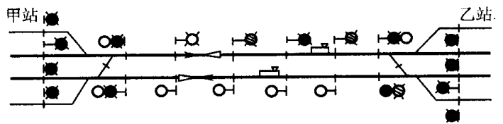

## 11.ZPW - 2000A型自动闭塞的技术特点

- 解决调谐区断轨检查，实现轨道电路全程断轨检查
- 减少调谐区分路死区段，缩短为不大于5m（实现对调谐单元断线故障的检查。）
- 发送、接收设备四种载频频率通用
- 系统中发送器采用“n+1”冗余，接收器采用成对双机并联运用。
- 通过系统参数优化，提高了轨道电路传输长度

## 12.半自动闭塞、自动闭塞的优点

半自动闭塞优点：运行效率高于人工闭塞

自动闭塞优点：运行效率高于半自动闭塞

(1) 两站间的区间允许续行列车追踪运行，大幅度地提高了行车密度，显著地提高区间通过能力。

(2) 由于不需要办理闭塞手续，简化了办理接发列车的程序，因此既提高了通过能力，又大大减轻了车站值班人员的劳动强度。

(3) 通过信号机的显示能直接反映运行前方列车所在位置以及线路的状态，确保列车在区间运行的安全。

(4) 自动闭塞还能为列车运行超速防护提供连续的速度信息，构成更高层次的列车运行控制系统，保证列车高速运行的安全。

## 13.64D继电半自动闭塞请求发车作业过程发车站和接车站电路的动作顺序

发车站：值班员按请求发车按钮（BSA），ZDJ（正电继电器）吸起，发送请求发车正脉冲；XZJ选择继电器保持吸起，BSJ吸起。

当BSA松开后，发车站的ZDJ落下。

接车站：收到请求发车正脉冲后，HDJ（回执到达继电器）吸起，发送回执信号；BSJ闭塞继电器保持吸起，TJJ吸起，FDJ吸起。

64D继电半自动闭塞系统基本要求：

> - 车站要向区间发车，必须检查区间空闲状态，在取得接车站同意并已取消了 接车站向该区间的发车权后，发车站才能开放出站信号机。
>
> - 当列车出站后，发车站的出站信号机必须自动关闭，在未再次办理手续 之前，出站信号机不得再次开放。
>
> - 列车到达接车站，由车站值班员检查列车完整到达后，接车站关闭进站信号 机后，即可办理解除闭塞手续，使两站站闭塞机恢复定位状态。
>
> - 闭塞系统必须符合“故障-安全”原则。

> [!IMPORTANT]
>
> 64D系统构成：
>
> - 按钮: BSA（闭塞按钮）、FUA（复原按钮）、SGA（事故按钮）；
> - 表示灯：一个车站每个接发车方向设置两组表示灯：FBD（发车表示灯）、JBD（接车表示灯）
> - 电铃（DL）、计数器（JSQ）、短小轨道电路（DG）[一是监督列车的出发，使发车站闭塞机闭塞；二是监督列车的到达，然后由接车站值班员办理到达复原。]、闭塞电源+24V
> - 闭塞外线 （X1、X2）：传递正、负信息。
> - 闭塞机（继电器及阻容元件）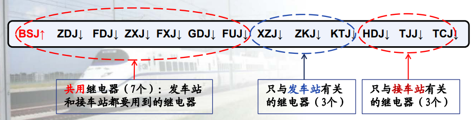

| BSJ  | ZDJ  | FDJ  | ZXJ  | FXJ  | GDJ  | FUJ  | XZJ  | ZKJ      | KTJ  | HDJ      | TJJ      | TCJ      |
| ---- | ---- | ---- | ---- | ---- | ---- | ---- | ---- | -------- | ---- | -------- | -------- | -------- |
| 闭塞 | 正电 | 负电 | 正线 | 负线 | 轨道 | 复原 | 选择 | 准备开通 | 开通 | 回执到达 | 同意接车 | 通知出发 |

> 同一车站的ZDJ、FDJ（缓放）互锁，不可同时吸起，发车站、接车站只要有一个吸起，其余 3个均不可吸起，发送信号
>
> ZXJ、FXJ（偏极）动作条件（电源）来自对方车站。ZXJ、FXJ放在一个电路中，节省外线，接收信号
>
> BSJ闭塞继电器：监督和表示闭塞机的状态。闭塞机在定位状态时，表示区间空闲。作为发车站时当列车占用区间时它落下，作为接车站时发出同意接车信号后它落下， 表示区间闭塞。（平时没车吸起状态）
>
> GDJ股道继电器：是现场轨道继电器（GJ，没车轨道空闲吸起，由列车压在轨道上触发落下）的复示继电器，监督列车出发和到达。
>
> XZJ 选择继电器 ：
>
> ​	a. 记录发车站办理过请求发车手续；(XZJ↑)
>
> ​	b. 区分收到的负信息是自动回执信号(XZJ↑)还是到达复原信号(XZJ↓)；
>
> ​	c. 证明出站信号机开放过。(XZJ↑--XZJ↓)
>
> ZKJ 准备开通继电器（缓放）：记录收到自动回执负信号。XZJ↑+FXJ↑——>ZKJ↑
>
> KTJ 开通继电器：
>
> ​	a. 记录收到接同意接车信号，并控制出站信号机的开放。
>
> ​	b.  ZKJ↑+ZXJ↑（收到同意接车正信息）——>KTJ↑
>
> HDJ 回执到达继电器（缓放）：
>
> ​	a. 和TJJ一起构成发送自动回执信号的条件（自动回执负信息传递结束时HDJ↓）
>
> ​	b.  记录列车到达（HDJ↑）
>
> ​	c. 记录收到请求发车信息 (HDJ↑)
>
> TJJ 同意接车继电器：
>
> ​	a. 反映请求发车信息结束；(HDJ↑+ZXJ ↓→ TJJ↑)
>
> ​	b.与HDJ一起构成发送自动回执负信息的条件。(TJJ↑+HDJ↑→FDJ↑)	
>
> TCJ通知出发继电器：记录收到列车出发信号。(TJJ↑+ZXJ↑→TCJ↑)						

## 14.64D半自动闭塞列车出发作业过程结束发车站和接车站有哪些继电器吸起?

发车站：没有继电器吸起。

接车站：GDJ（轨道复示继电器，因为此时接车站没车空闲）吸起，TCJ（通知出发继电器）吸起。

> [!IMPORTANT]
>
> -  零状态：区间空闲，闭塞机在定位状态。      本状态：发、接车站 BSJ↑，其余继电器↓，表示灯灭灯。
>
> - 第一状态：发送和接收“请求发车”信息
> 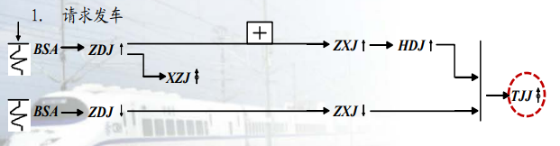
>
>   本状态：发车站 BSJ↑，XZJ↑  ；接车站 BSJ↑，HDJ↑
>
> - 第二状态：发送和接收“自动回执”信息
> 
>
> 	本状态：发车站 BSJ↑，XZJ↑，ZKJ↑，GDJ↑ 接车站 BSJ↑，TJJ↑
>
> - 第三状态：发送和接收“同意接车”信息
> 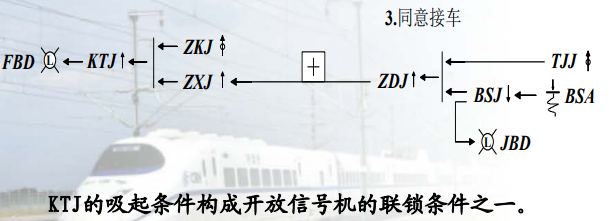
>
>   本状态：发车站BSJ↑，XZJ↑，ZKJ↑，GDJ↑，KTJ↑ 接车站BSJ↓，TJJ↑
>
> - 第四状态：发送和接收“通知出发”信息
> 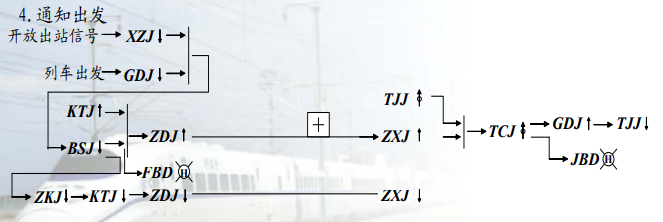
>
> 	本状态：发车站没有继电器吸起，接车站TCJ↑GDJ↑。
>
> - 第五状态：发送和接收“解除闭塞”（到达复原）信息
> 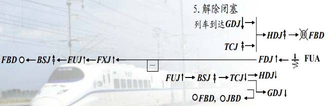
>
> 	本状态结束两站返回到零状态
>
> - 64D型继电半自动闭塞继电器动作状态
> 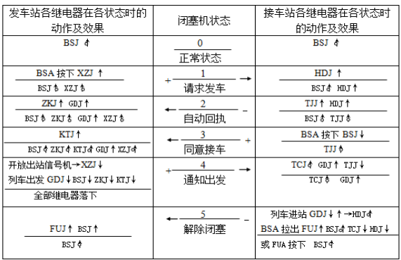
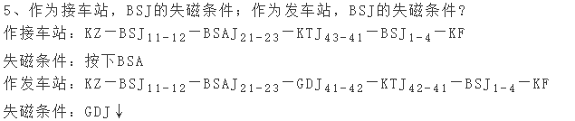

## 15.64D半自动闭塞列车同意接车作业过程结束发车站和接车站的动作顺序。结束时有哪些继电器吸起？

按下BSA，接车站BSJ落下，TJJ缓放吸起，ZDJ吸起，发送正电信号，接车站ZXJ吸起，ZKJ继电器缓放吸起，KTJ吸起，发车标识灯FBD亮绿灯。

发车站：发车站BSJ↑，XZJ↑，ZKJ↑，GDJ↑，KTJ↑

接车站：BSJ↓，TJJ↑

## 16.TJJ电路的作用，励磁电路

作用：TJJ（同意接车继电器）接收请求发车信号，TJJ吸起后将闭塞机转换为接车状态，并为同意接收信号做好准备。

励磁电路：TJJ励磁电路由接收到发车站请求发车正脉冲触发，通过相关继电器接点（如JDJ的落下接点等）构成励磁电路使其吸起。

> [!IMPORTANT]
>
> 8个单元电路（13个继电器）
>
> - 线路继电器电路
> 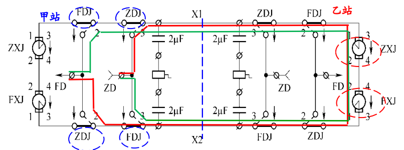
> - 信号发送器电路
> 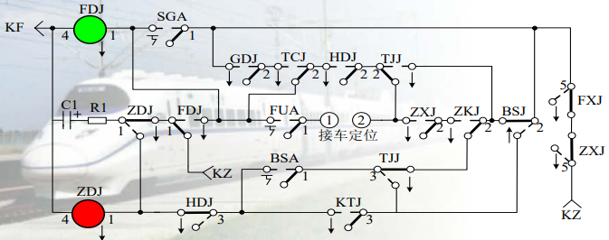
> - 正电继电器ZDJ电路
> 
> - FDJ电路
> 
> - 发车接收器电路 ZKJ、XZJ、KTJ
> 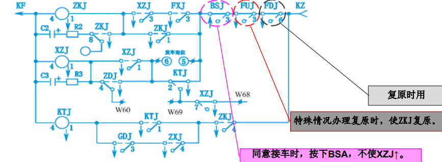
> - 接车接收器电路 HDJ、TJJ、TCJ
> 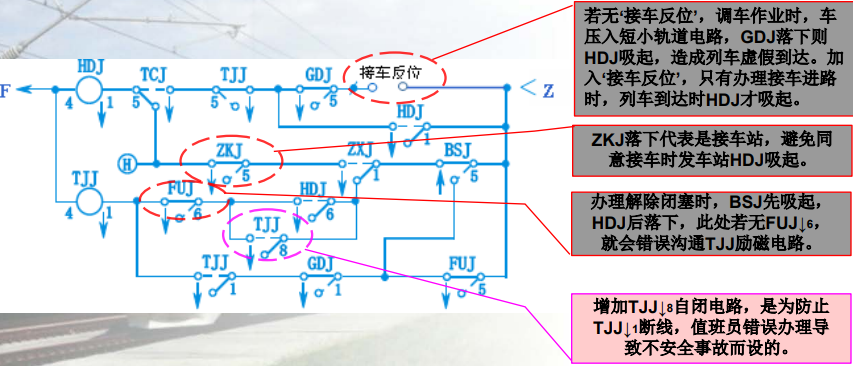
> - FUJ电路复原电路
> 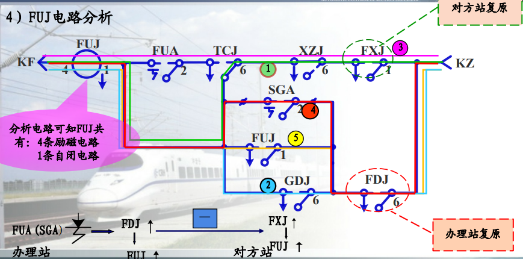
>
> - BSJ电路，BSJ是为了监督闭塞机的状态而设。
> 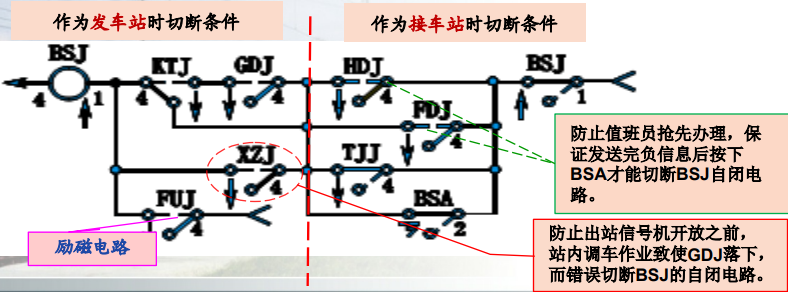
>
> - GDJ电路
> 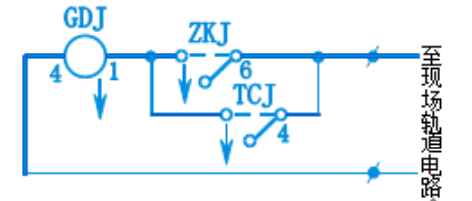
>
> - 表示灯电路
>   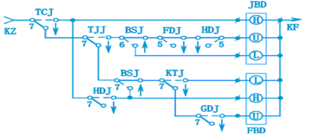
>
>   表示灯电路用来表示两站间区间闭塞的状态，及改变运行方向电路的动作情况。

## 17.在64D继电半自动电路中，写出发车站FBD亮L灯时，发车站的BSJ的电路分析，自闭电路，BSJ落下时机

电路分析：FBD亮L灯表示列车出发，区间闭塞，XZJ落下（表示出站信号机开放过），BSJ自闭电路接通，使其保持吸起状态。当列车进入轨道区段，GDJ继电器落下，切断了BSJ继电器的自闭回路，BSJ落下，此时发车表示灯FBD亮红灯。

自闭电路：正常时BSJ通过自身接点和其他继电器接点构成自闭电路保持吸起。

## 18.64D继电半自动闭塞两站间传递的闭塞信息

- 请求发车信号：+   （人工）

  甲站先检查本站的FBD、JBD处于灭灯状态，确认区间空闲。甲站值班员通过闭塞电话联系乙站，然后按下BSA，此时接车站电铃响.

- 自动回执信号：-    （自动）

  甲值班员松开BSA后，乙站自动发送自动回执信息，此时甲站电铃响，同时FBD点黄灯。自动回执信息发送完后，乙站JBD点黄灯，可以进行后面手续办理。

- 同意接车信号：+   （人工）

  乙站值班员同意甲站发车，确认乙站JBD亮黄灯后，按下BSA向甲站发送 同意接车信号，此时乙站JBD 改点绿灯 。

  甲站电铃鸣响，同时甲站FBD也改点绿灯。

- 出发通知信号：+   （列车）

  甲站开放出站信号机。列车出发，驶入出站信号机内方时，出站信号机自动关闭，甲站FBD点红灯。甲站自动向乙站发送出发通知信号，乙站收到后JBD点红灯，电铃响。

- 到达复原信号：-   （64D正常办理分上五步）

  乙站开放进站信号机；列车压入乙站进站信号机内方第一个轨道区段时，乙站FBD点红灯，电铃响，（此时 乙站JBD、FBD均点红灯）列车到达。

  列车全部进入乙站股道后，接车进路解锁。乙站值班员人工确认列车完整到达后，按下FUA，办理到达复原，使 乙站FBD、JBD灭灯。甲站接收到到达复原信息后，电铃响且FBD灭灯。

- 取消复原信号：-

- 事故复原信号：-

 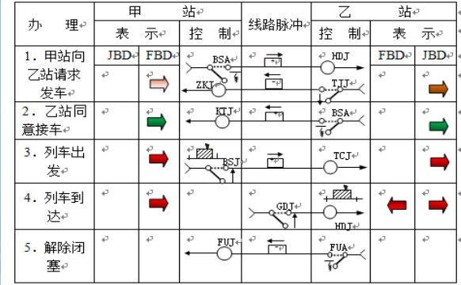

## 19.区间通过信号机不应设于哪些地点？

在动能闯坡和列车容易断钩、脱钩的地点，不能设置通过信号机。为了最大限度地保证行车安全，在大型桥梁和隧道内，一般不能装设通过信号机。应尽量避免在列车停车后启动困难的地方设置通过信号机。 

## 20.三显示自动闭塞区间通过信号机灯光显示的含义

绿色灯光（L）：表示前方至少有两个闭塞分区空闲，列车可按规定速度运行。

黄色灯光（U）：表示前方只有一个闭塞分区空闲，列车要减速慢行。

红色灯光（H）：表示前方闭塞分区被占用，列车要停车。

## 21.四显示自动闭塞增加绿黄显示的好处

①提高区间通过能力	②适应不同速度的列车	③满足制动距离要求

> [!IMPORTANT]
>
> 四显示信号显示含义：
>
> | 信号机显示 |              显示含义              |
> | :--------: | :--------------------------------: |
> |   绿灯 L   | 列车运行前方有两个以上闭塞分区空闲 |
> | 绿黄灯 LU  |  列车运行前方只有两个闭塞分区空闲  |
> |   黄灯 U   |  列车运行前方只有一个闭塞分区空闲  |
> |   红灯 H   |    列车运行前方闭塞分区有车占用    |
>

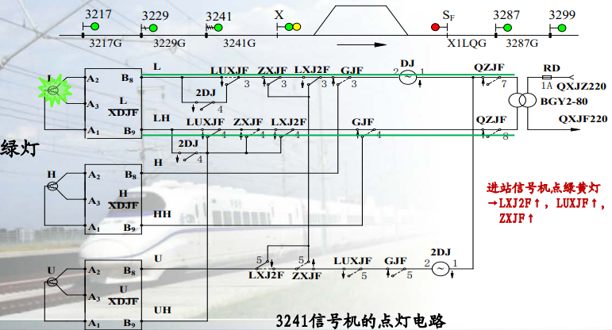

DJ：灯丝继电器，灯丝继电器常态吸起（DJ↑）；主灯丝断丝→DJ↑；副灯丝断丝→DJ↑；主、副灯丝均断丝→DJ↓

## 22.调制低频的频率选择原则

①足够的信息量	②较大的调频系数	③移频波能顺利通过带通滤波器

## 23.掌握2FSK调制过程

使用二进制数字基带信号控制载波的频率变化实现数字调制的方法称为二进制频移键控调制（2FSK）。

2FSK是用二进制数字信号改变载波的频率，即分别用不同频率的载波承载「0」信号和「1」信号。2FSK信号可分解为「1」码时用载波f1调制和「0」码时用载波f2调制的2个2ASK信号之和。

## 24.电气谐振式无绝缘轨道电路电气隔离的工作原理

无绝缘轨道电路分谐振式和感应式两种。

**谐振式无绝缘轨道电路的组成：**

- 室内：发送器FS、接收器JS、衰耗器SH、轨道继电器GJ、电缆模拟网络、站防雷

- 室外：轨道电路、调谐单元BA、空芯线圈SVA、匹配变压器、补偿电容、SPT(铁路内屏蔽数字信号电缆)

**电气谐振式无绝缘轨道电路工作原理：**

  ① 发送器发出的信号既向主轨道电路传送又向小轨道电路区段发送；

  ② 向小轨道电路传送的信号经相邻区段接收器给本区段发送小轨道条件；

  ③ 本区段接收到小轨道条件和主轨道条件后，接收器工作并输出小轨道条件作为下一区段的输入条件。

**电气隔离的工作原理：**

​	a. f1（f2）端调谐单元的L1、C1（L2、C2）对 f2（f1）端的频率为串联谐振，呈现较低阻抗，称“零阻抗”，相当于短路，阻止了相邻区段信号进入本区段。

​	b. f1（f2）端调谐单元对本区段的频率呈现电容性，并与调谐区的钢轨、空心线圈的综 合电感构成并联谐振，呈现高阻抗，称“极阻抗”，相当于开路，减少了对本区段信号的衰耗。

## 25.空芯线圈SVA的原理、SVA的作用、工作原理

空芯线圈的作用：

- 平衡牵引电流回流
- 复线平衡上、下行线的牵引电位（对于上、下行线路间的两个SVA中心线可做等电位连接。一方面平衡线路间牵引电 流， 一方面可保证维修人员安全）
- 改善电气绝缘节的品质因数，提高调谐区工作的稳定性。（做调谐区两端设备纵向防雷的接地连接）
- 当扼流（抗流）变压器用。

空芯线圈的电感量为33μH，直流电阻为4.5mΩ，交流电阻为4.5mΩ。

## 26.会分析一般信号点、三接近、一离去编码电路原理图。懂得图中主要符号的含义。当分别有车和无车时，FS盘是发送什么码？表明什么？能完成自动闭塞编码表 P116-120

（简单理解，编码电路其实就是四显示点灯电路，FS盘发送信号灯的L码，HU码[表示列车前方无空闲闭塞分区]等等调制的移频信号）

①轨道电路：检测列车位置并传递信息 ②继电器：控制电路的通断③编码电路：根据轨道电路的状态生成相应的编码信息

④发送盘（FS盘）：发送编码信号至信号机

无车：发L码，表示区段空闲。有车时，根据占用情况生成对应的编码反映列车的位置，FS盘发送这个编码到信号机，信号机根据编码显示相应的信号。

三接近区段应该根据进站信号机显示状态进行编码。一离去区段即为反向运行时的三接近区段。

## 27.会分析四显示自动闭塞的ZPW-2000A型无绝缘轨道电路组成示意图，知道各个部件作用、主轨道与小轨道区段（调谐区）的位置关系。补偿电容设置。机械绝缘节与电气绝缘节的不同

ZPW-2000A型无绝缘轨道电路组成示意图。

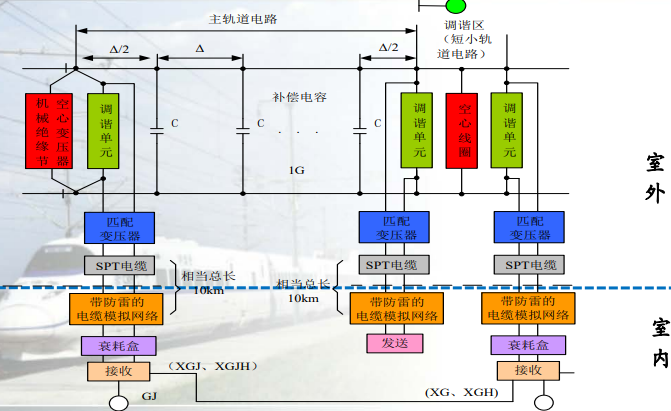

组成部分：

1. 绝缘节

   机械绝缘节与电气绝缘节的不同：

   - 电气绝缘节：按29m设计，设备包括调谐单元及空心线圈。功能是实现两相邻轨道电路电气隔离。
   - 机械绝缘节：对于进站和出站口均设有机械绝缘节。为使机械绝缘节轨道电路与电气绝缘节轨道 电路有相同的传输参数和传输长度。由机械绝缘节空心线圈（SVA）与调谐单元并接而 成，其特性与电气绝缘节相同。

2. 防雷匹配变压器（ ZPW·BPL ）：按传输通道参数和载频频率进行设计，以实现轨道与SPT铁路数字信号电缆的匹 配连接，减小失配衰耗，获得最佳的传输效果。

3. 传输电缆：采用SPT型铁路信号内屏蔽数字电缆

4. 补偿电容（ ZPW· CBG ）：使传输通道趋于阻性，保证轨道电路具有良好传输性能

5. 调谐区设备引接线：用于BA、SVA、SVA’等设备与钢轨间 的连接

6. 发送器（ ZPW·F ）：用于产生具有足够功率的经18种低频调制8种载频的高精度、高稳定的移频信号。对移频信号进行自检测，故障时给出报警条件及通过FBJ接点转至“＋1FS”。

7. 带防雷电缆模拟网络：用作对通过传输电缆引入室内雷电冲击的横向、纵向防护；用于对SPT电缆长度的补偿。

8. 衰耗盒：用于实现对接收端主轨道电路、小轨道电路的调整。给出发送 和接收故障、轨道占用表示及发送、 接收用＋24电源电压、发送功出电 压、接收GJ、XG、XGJ测试条件等。

9. 接收器：用于接收本主轨道电路信号，并在检 查所属调谐区短小轨道电路状态（ＸＧJ、 ＸＧJＨ）条件下，动作本轨道电路的轨道 继电器（ＧＪ）。另外，接收器还接收相 邻区段小轨道电路的信号，向相邻区段提 供小轨道电路状态（ＸＧ、ＸＧＨ）条件。

**主轨道与小轨道区段（调谐区）的位置关系**：小轨道始终是列车运行前方主轨道的延续段，列车运行方向改变，小轨道位置发生改变。

**补偿电容**：

​	作用：保证轨道电路的传输距离，保证接收端信号有效信干比。

​	补偿电容的设置方式：采用“等间距法”，即将无绝缘轨道电路两端BA间的距离L按补偿电容总量Nc等分， 其步长Δ=L~主~/Nc 。轨道电路两端按半步长（Δ）/2，中间按全步长（Δ）设置电容，以获 得最佳传输效果。安装允许误差±0.5ｍ。

​	其中，Nc为补偿电容数量（查表）。（L为闭塞分区长度）

​	电气-机械绝缘节闭塞分区： L主 = L -14.5

​	电气-电气绝缘节闭塞分区： L主 = L - 29

​	机械-机械绝缘节闭塞分区： L主 = L

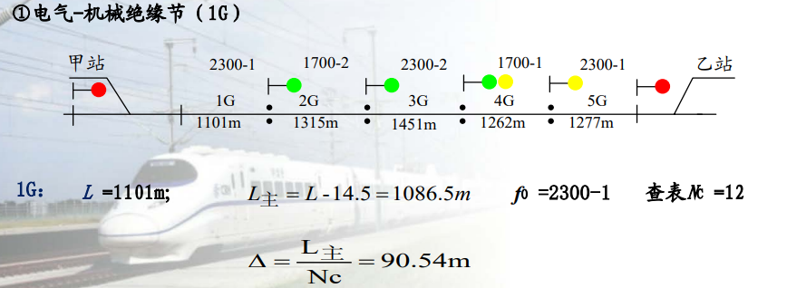

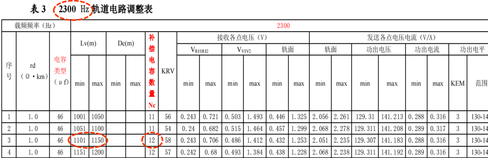

> [!IMPORTANT]
>
> Z表示自动闭塞，P表示移频，W表示无绝缘，2000A表示系列号。
>
> **8种载频：**
>
> | 下行   | -1 代表+1.4Hz | 上行   | -2 代表-1.3Hz |
> | ------ | ------------- | ------ | ------------- |
> | 1700-1 | 1701.4        | 2000-1 | 2001.4        |
> | 1700-2 | 1698.7        | 2000-2 | 1998.7        |
> | 2300-1 | 2301.4        | 2600-1 | 2601.4        |
> | 2300-2 | 2298.7        | 2600-2 | 2598.7        |
>
> **18种低频**：10.3+n×1.1Hz ，n=0～17即：10.3 Hz、11.4 Hz、12.5 Hz、13.6 Hz、14.7 Hz、15.8 Hz、16.9 Hz、18 Hz、 19.1 Hz、20.2 Hz、21.3 Hz、22.4 Hz、23.5 Hz、24.6 Hz、25.7 Hz、26.8 Hz、 27.9 Hz、29 Hz
>
> **频偏 ：±11 Hz**
> 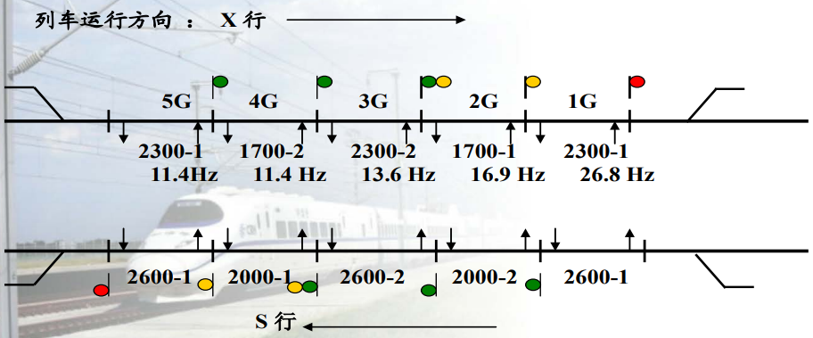
>
> 电气隔离式无绝缘轨道电路：
> 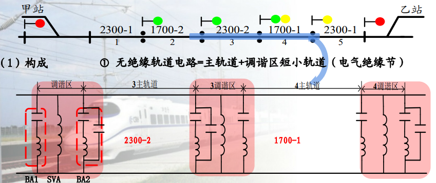
>
> **小轨道区段（调谐区）位置关系：**
>
> ​	1）主轨道长度不定，但小轨道长度固定（29m）；
>
> ​	2）小轨道始终是列车运行前方主轨道的延续段；
>
> ​	3）列车运行方向改变，主轨位置不变，小轨道位置发生改变。
>
> **电气绝缘结：**
>
> ​	由调谐单元（BA1[1700、2000]、BA2[2300、2600]）、空心线圈及29m钢轨组成。用于实现两相邻轨道电路间的电气隔离。
> 
>
> ​	每个闭塞分区的FS、JS端连接的调谐单元类型相同。电气隔离式无绝缘轨道电路的每一种移频信息覆盖1个主 轨道+2个小轨道范围。
>
> ​	a. f1（f2）端调谐单元的L1、C1（L2、C2）对 f2（f1）端的频率为串联谐振，呈现较低阻抗，称“零阻抗”，相当于短路，阻止了相邻区段信号进入本区段。
>
> ​	b. f1（f2）端调谐单元对本区段的频率呈现电容性，并与调谐区的钢轨、空心线圈的综 合电感构成并联谐振，呈现高阻抗，称“极阻抗”，相当于开路，减少了对本区段信号的衰耗。
>
> **区间改方电路原理：**
>
> ​	由于线路采用双方向行车方式，当列车改 变运行方向时，闭塞分区发送、接收端的位置 也对应改变。每个闭塞分区轨道电路发送通道与接收通 道的切换用QZJ和QFJ来实现。
>
> QZJ↑ QFJ↓ ——>正方向运行；QZJ↓ QFJ↑ ——>反方向运行
>
> 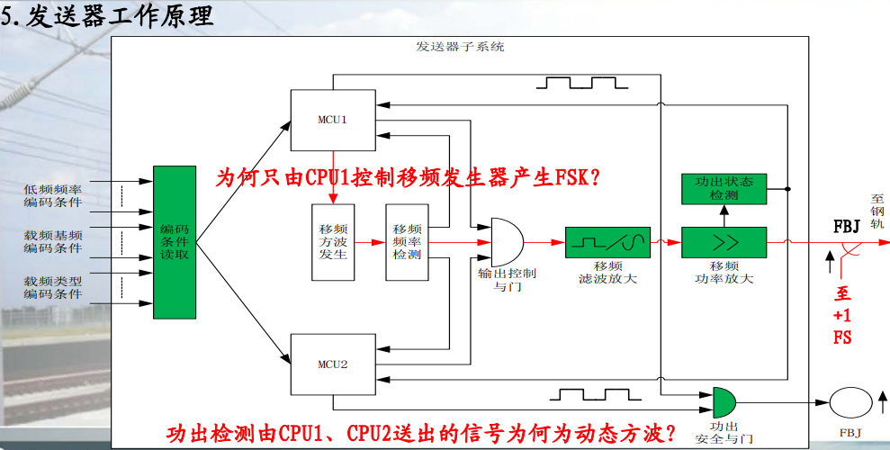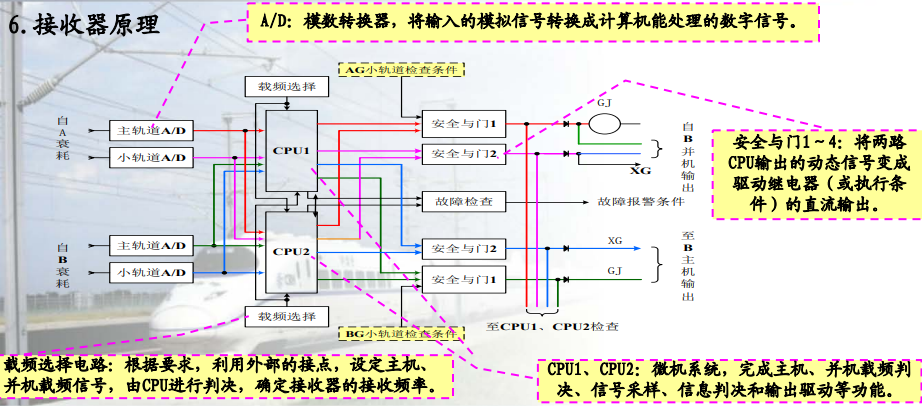
>
> **发送器工作原理：**
>
> ​	将同一载频、低频编码条件分别送入CPU1、CPU2，其中CPU1控制移频发生器产生低频控制信号FSK，移频信号送至CPU1、CPU2，进行检测，若符合要求，经控制与门送至滤波。实现方波-正弦波的转换，然后将功放出的低频信号送CPU1、CPU2进行功出电压检测，若符合要求，就会打开安全与门，动作执行继电器将信号送至轨道，否则就会执行报警。
>
> **接收器工作原理：**
>
> ​	将外部送来的信号分别经主机、并机两路模数转换成数字信号，然后送至CPU1、CPU2进行单独运算。判决处理，若符合要求就会输出3KHZ的方波，驱动安全与门，动作执行继电器若不符合安全，安全与门不能构成FL同时报警。

## 28.会分析移频自动闭塞的工作原理图，掌握移频自动闭塞采用的载频的目的，能说出移频自动闭塞的工作原理

**移频自动闭塞采用的载频的目的：**可以避开牵引电流谐振带来的干扰。

**移频自动闭塞工作原理：**移频自动闭塞选用频率参数作为控制信息，采用频率调制的方法，把低频 信号(fc)搬移到较高频率(载频f0)上，以形成振幅不变、频率随低频信号的幅度 作周期性变化的调频信号。将此信号用钢轨作为传输通道来控制通过信号机和机车信号的显示，达到自动指挥列车运行的目的。在ZPW-2000A中，采用1700和2300（-1/-2）作为下行载频，采用2000和2600（-1/-2）作为上行载频。11.4hz -L；16.9-LU；26.8hz-U；

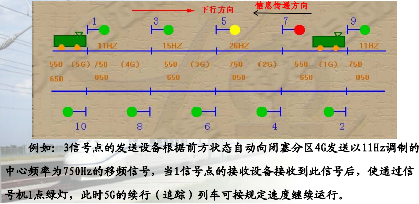

## 29.调谐单元有何用途？如何实现两相邻轨道电路的电气绝缘？

用途：调谐单元对本区段频率呈现并联谐振，信号被输出或接收。对相邻区段频率呈现串联谐振，信号被短路。

如何实现：本区段频率送至相邻区段，接收器调谐单元并联谐振，邻区段频率送至本区段发送器调谐单元串联谐振，信号被短路形成电气绝缘节。
