# 数字电压表设计与制作（课程设计）

---

## 摘 要

本课程设计围绕数字电压表的开发与实现，提出了三种不同的设计方案：基于双积分A/D转换器ICL7135的四位半电压表、基于集成芯片ICL7107的LED驱动电压表，以及基于ESP32单片机和Arduino框架的数字化电压表。

各方案分别采用不同的核心技术与硬件架构，兼顾高精度、低成本与灵活性。ICL7135方案利用双积分原理实现高抗干扰性和±199.99mV量程的精密测量；ICL7107方案通过集成化设计简化电路，支持三位半LED显示；ESP32方案结合软件滤波与分压电路，以极简硬件实现宽量程测量。

实验结果表明，三种方案均能有效实现电压测量，但各具特点，适用于不同场景。本设计验证了模数转换技术的多样性，为实际应用提供了参考依据。

**关键词：**ADC；数字电压表；ICL7135；ICL7107；Arduino

## 1 课程设计目的

1.  **掌握核心理论知识**
    - 理解双积分型A/D转换器（如ICL7135、ICL7107）的工作原理，分析其高精度与抗干扰特性的技术本质。
    
    - 学习单片机（ESP32）内置ADC模块的采样机制，掌握分压电路设计、软件滤波算法等关键技术。
    
2.  **培养工程实践能力**
    - 通过原理图设计、PCB布局（EDA工具）、电路焊接与调试，熟悉电子系统开发的完整流程。
    
    - 通过仿真验证和实验测试，掌握数字电压表的性能分析与调试方法，提升实践操作和问题解决能力。
    
3.  **提升问题分析与解决能力**

    - 在实验过程中识别常见问题（如信号干扰、数码管显示异常、ADC非线性误差），并通过理论推导与实验验证提出解决方案。

    - 对比不同方案（ICL7135、ICL7107、ESP32）的硬件复杂度、成本与性能差异，培养技术选型与优化意识。

4.  **强化创新与扩展思维**

    - 探索传统分立电路与嵌入式系统的融合设计，例如结合Arduino框架实现数据可视化与交互功能。

    - 鼓励在基础方案上进行功能扩展（如量程自动切换、温度补偿），提升系统的实用性与适应性。

5.  **规范科研与工程素养**

    - 学习查阅芯片数据手册、学术文献，规范撰写设计文档与实验报告。

    - 通过团队协作（如电路调试分工）与项目管理（如进度规划），培养工程实践中的综合素养。

## 2 基于双积分A/D转换器ICL7135实现四位半数字电压表

### 第2.1节 方案简述

本方案设计了一个基于ICL7135的简易数字电压表。本设计以双积分式A/D转换器ICL7135为核心，结合典型200mV满量程应用电路，实现四位半（4^1/2^位）数字电压表。通过双积分技术保证高精度和强抗干扰能力，量程为-199.99mV至+199.99mV，分辨率为10μV。系统由模拟输入调理、参考电压源、时钟信号生成、模数转换及动态扫描显示驱动等模块组成。

### 第2.2节 原理框图


<p style="text-align: center">图1：系统原理框图</p>

### 第2.3节 原理总图

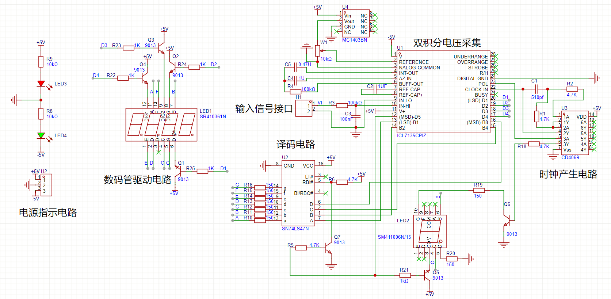

<p style="text-align: center">图2：电路设计原理图</p>


下图展示了系统的关键信号流连接：


<p style="text-align: center">图3：系统信号流图</p>


### 第2.4节 各部分电路原理分析

#### 2.4.1 基准电压产生电路

基于外部电压输入，通过MC1403芯片产生2.5V精密基准源，通过精密电阻分压生成1 V参考电压。

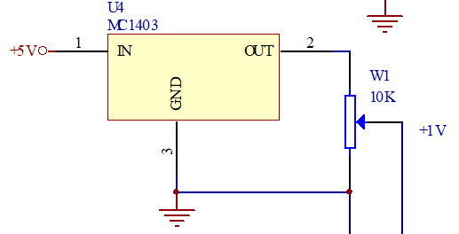

<p style="text-align: center">图4：基准电压原理图</p>


#### 2.4.2 时钟信号产生电路

时钟信号产生采用MC14036芯片，利用反相器与RC网络构成环形振荡器，

其频率大致为$f\approx \frac{1}{2.2RC}$

通过调整电阻与电容，使得输出方波频率大于125Khz。

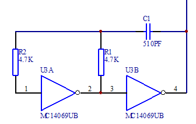

<p style="text-align: center">图5：时钟信号产生电路</p>


#### 2.4.3 待测模拟信号输入

参考芯片手册典型电路设计，在电压测量线输入端接入 100K 电阻和 0.1μF 电容。

数字电压表的输入阻抗需足够高，避免对被测电路产生分流作用（即 “负载效应”）。100KΩ 电阻与后续电路（如缓冲放大器）的输入阻抗配合，可使整体输入阻抗达到 MΩ 级别（如 10MΩ)，满足高精度测量需求。通过RC组合，滤除高频干扰，保留直流精度。

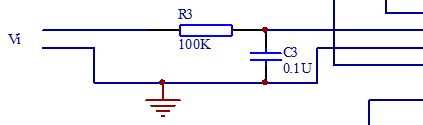

<p style="text-align: center">图6：输入RC电路</p>


#### 2.4.4 数码管驱动与显示电路

数码管显示驱动有ICL7135芯片与74LS47译码芯片配合完成。


<p style="text-align: center">图7：数码管驱动原理图</p>


上图简要展示了数码管显示驱动的过程。ICL7135输出多路复用的BCD码（B1-B8）和位选信号（D1-D5），通过74LS47译码为七段码，9013晶体管驱动共阳数码管。通过动态扫描机制对数码管进行快速刷新，利用人眼视觉残留，实现数值的显示。最高位数码管实现灭零控制，仅显示有效数字1及负号。

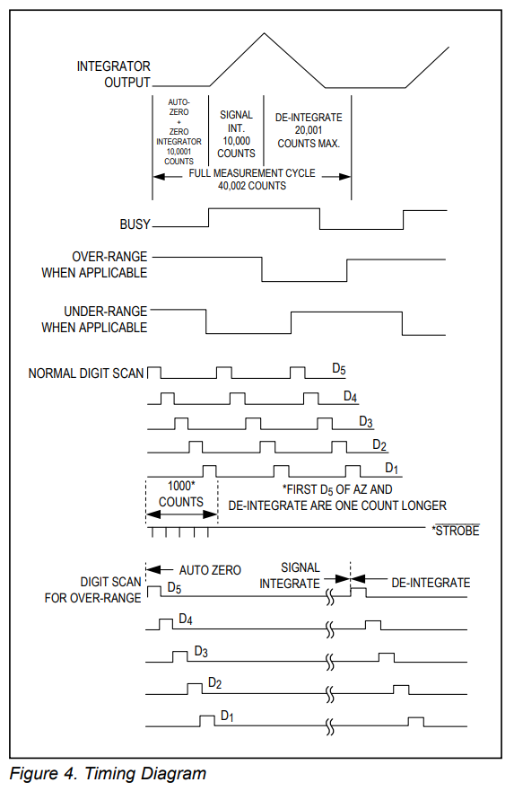

<p style="text-align: center">图8：ICL7135位选信号输出时序图</p>


#### 2.4.5 双积分A/D转换器ICL7135

ICL7135双积分式A/D转换器是在单极性参考电压(VR=+1V)供给之下，对双极性输入的模拟电压进行A/D转换，并输出自动极性判别信号。

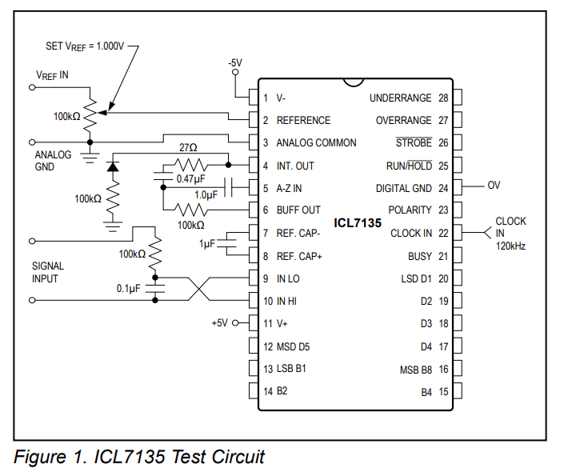

<p style="text-align: center">图9：ICL7135外围电路测试电路</p>


双积分式 A/D 转换是一种基于间接测量原理的模数转换技术，通过对输入模拟电压和参考电压进行两次积分操作，将模拟量转换为数字量。

双积分式 A/D 转换的核心是 “积分 - 比较 - 计数” 过程，分为两个阶段：定时积分阶段和定压积分阶段。

1.  定时积分阶段（正向积分）

输入信号：将未知模拟电压 $V_{in}$ 接入积分器，在固定时间 $T_{1}$ 内对 $V_{in}$ 进行积分。

积分结果：积分器的输出电压 $V_{1}$ 与 $V_{in}$ 在 $T_{1}$ 内的平均值成正比，即：

$$
V_1=\frac{1}{RC}\int_0^{T_1}{V_{in}(t)dt}
$$
其中，$R$ 和 $C$ 为积分电路的电阻和电容。

2.  定压积分阶段（反向积分）

参考电压接入：断开 $V_{in}$ ，接入与 $V_{in}$ 极性相反的固定参考电压 $-V_{ref}$ ，对积分器进行反向积分。

计数过程：从积分器输出 $V_{1}$ 开始反向积分，直至积分器输出回到零电平。记录此过程的时间 $T_{2}$ 。

电荷平衡：正向积分与反向积分的电荷相等，即：

$$
V_{in,avg}\cdot T_1=V_{ref}\cdot T_2
$$
因此， $T_{2}$ 与 $V_{in,avg}$成正比，通过计数器测量 $T_{2}$ 即可得到对应的数字量$N$：
$$
N=\frac{T_2}{T_0}=\frac{V_{in,avg}\cdot T_1}{V_{ref}\cdot T_0}
$$
其中， $T_{0}$为计数脉冲的周期。

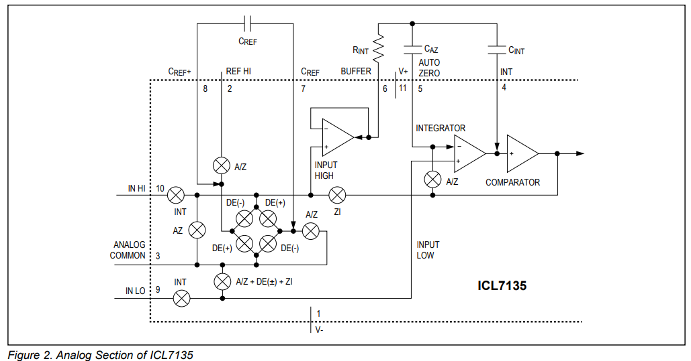

<p style="text-align: center">图10：ICL7135芯片的模拟部分</p>


双积分式 A/D 转换具有抗干扰能力强、精度高、线性度好、成本低等特点，其缺点是转换速度慢、实时性差。其简单的电路结构和低成本特性决定其非常适合用于数字万用表的制作。

### 第2.5节 实验过程

查询已有芯片的数据手册，进行电路功能解读与原理图二次绘制，通过专业EDA软件进行原理图器件与封装绑定，通过EDA软件进行电路布局与布线的辅助设计，确定通过洞洞板进行电路焊接验证时的芯片、阻容器件的放置位置与走线。


<p style="text-align: center">图11：通过EDA软件进行电路布局与走线设计</p>


电路焊接采用先焊元件，后连线的方式。

完成电路焊接后，进入调试环节，步骤如下：

1.  给电路板外接±5V电源和GND。观察电源指示灯是否正常，测量芯片底座的供电引脚和电路中其余的电源网络联通是否完好。

2.  检查焊点是否存在连锡，检查是否存在虚焊的地方。

3.  插上MC1403芯片，测量2脚是否输出2.5V，旋转滑动变阻器使7135插座2脚为1V。

4.  插芯片MC14069，用示波器观察MC14069的4脚和7135插槽的22脚是否为f\>125KHz的矩形。


<p style="text-align: center">图12：时钟信号波形图</p>


5.  插芯片7135和74LS47，用示波器观察7135的BCD码输出13,14,15,16矩形波，选通输出12，17，18，19，20矩形波。

6.  用示波器观察74LS47输出9，10，11，12，13，14，15段选信号波形，如果出现方波，说明74LS47能正常将BCD码译成abcdefg段选信号，此视数码管显示正常。

### 第2.6节 实验结果

实验设计焊接完成的电路板如下图所示：


<p style="text-align: center">图13：实际焊接电路板</p>


表1：实验电压数据测试表

| 次数  电压（V） | 1     | 2     | 3     | 4       | 5     | 6     | 7     | 8     | 9     | 10    | 11    | 12    | 13    | 14    | 15    | 16    | 17    | 18    | 19    | 20    |
| --------------- | ----- | ----- | ----- | ------- | ----- | ----- | ----- | ----- | ----- | ----- | ----- | ----- | ----- | ----- | ----- | ----- | ----- | ----- | ----- | ----- |
| 标准表     | -1.99 | -1.80 | -1.70 | -1.60 | -1.50 | -1.40 | -1.30 | -1.20 | -1.10 | -1.00 | +1.10 | +1.20 | +1.30 | +1.40 | +1.50 | +1.60 | +1.70 | +1.80 | +1.90 | +1.99 |
| 自制表     | -1.98 | -1.79 | -1.69 | -1.59 | -1.49 | -1.39 | -1.29 | -1.19 | -1.09 | -0.99 | 0.093 | +1.19 | +1.29 | +1.39 | +1.49 | +1.59 | +1.69 | +1.79 | +1.89 | +1.97 |

### 第2.7节 方案总结

双积分式A/D转换以其高抗干扰性和高精度的优势，在低速、高精度的场景中占据重要地位。尽管转换速度较慢，但其简单的电路结构和低成本特性，使其成为工业仪表、精密测量等领域的理想选择。本设计成功实现了基于ICL7135的高精度数字电压表，验证了双积分ADC在低速高精度测量中的优势。

## 3 基于集成芯片ICL7107的LED驱动数字电压表设计

### 第3.1节 方案简述

本设计旨在基于 ICL7107 芯片制作一款数字电压表，实现对直流电压的精确测量与显示。ICL7107 是一款高精度、低功耗的双积分型 A/D 转换芯片。与ICL7135芯片不同的是，ICL7107芯片内部集成了时钟发生器、积分器、比较器等电路，可直接驱动共阳极 LED 数码管，极大地简化了外围电路的设计，非常适合用于数字电压表的设计。

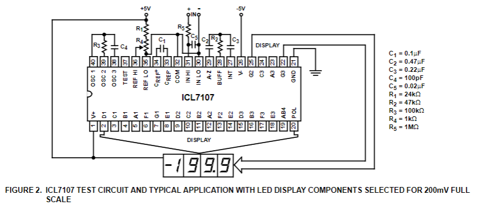

<p style="text-align: center">图14：200mV满量程电路典型芯片应用图</p>


### 第3.2节 电路原理分析

#### 3.2.1 ICL7107 芯片工作原理

ICL7107 采用双积分型 A/D 转换原理，其工作过程主要包括采样阶段和比较阶段。在采样阶段，芯片对输入电压进行固定时间的积分，积分电容上的电压与输入电压成正比；在比较阶段，芯片对基准电压进行反向积分，直至积分电容上的电压回到零，通过计数器记录比较阶段的时间，该时间与输入电压成正比，从而实现模拟信号到数字信号的转换。

芯片内部的时钟发生器产生稳定的时钟信号，为积分器和计数器提供工作时序。比较器用于检测积分电容上的电压是否为零，控制计数器的启停。

此外，ICL7107 还具有自动调零功能，可消除放大器的失调电压和漂移，提高测量精度。

#### 3.2.2 积分电路原理

根据ICL7107芯片的数据手册，积分电阻*R~INT~*和积分电容*C~INT~*作用如下：

*R~INT~*：与输入电压共同决定积分电流 *I~INT~=V~INFS~/R~INT~*，典型值 4μA。

*C~INT~*：存储积分电荷，其容量影响积分器输出电压摆幅 *V~INT~=I~INT~×t~INT~/C~INT~*。

设计要点：

1.  *R~INT~*：2V 满量程时选 470kΩ，200mV 满量程时选 47kΩ，确保电流在芯片线性范围内（≤100μA）。

2. *C~INT~*：选用低介质吸收的电容（如聚丙烯电容），避免电荷泄漏引入误差。典型值：2V 量程 0.1μF，200mV 量程 0.22μF）。

下图展示了ICL7107芯片的模拟部分，本节中后续所有的元件与引脚名称参考此图标注。

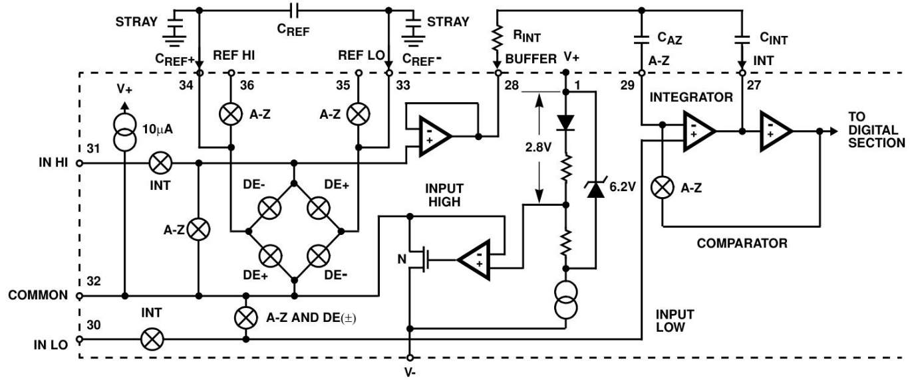

<p style="text-align: center">图15：ICL7107芯片的模拟部分</p>


#### 3.2.3 时钟振荡电路（OSC1、OSC2、OSC3）

根据ICL7107芯片的数据手册，电阻*R~OSC~*$和电容$*C~OSC~*构成 RC 振荡器，产生芯片所需的时钟信号（典型频率 48kHz）。

时钟频率公式：*f~OSC~*=0.45*/(R×C)*，如 *R*=100kΩ,*C*=100pF 时，*f~OSC~*=48kHz。

设计要点：

1.  时钟频率影响转换速度和抗干扰能力。若需抑制 50Hz/60Hz 干扰，积分周期*t~INT~*应设为其整数倍（如 40kHz 时钟可同时抑制 50Hz 和 60Hz）。

2.  电容需选用稳定性高的类型（如瓷片电容），避免温度漂移影响频率精度。


<p style="text-align: center">图16：时钟振荡电路</p>


#### 3.2.4 自动调零与参考电路

根据ICL7107芯片的数据手册，自动调零电容*C~AZ~*，0.01μF~1μF的作用如下：存储自动调零阶段的补偿电压，消除缓冲器、积分器和比较器的失调电压（典型≤10μV）。

设计要点：

1\. 200mV 满量程时选 0.47μF（降低噪声），2V 满量程时选 0.047μF（加快过载恢复）。

参考电容*C~REF~*，0.1μF~1μF的作用为稳定参考电压，抑制共模电压引起的翻转误差（Rollover Error）。

设计要点：

1\. 共模电压较高时（如 *R~EFLO~* 未接 COMMON），需增大 *C~REF~*至 1μF，确保误差＜0.5 计数。

#### 3.2.4 显示模块原理

ICL7107 芯片内部集成了七段译码器和驱动电路，可直接驱动共阳极 LED 数码管。芯片的输出端 a、b、c、d、e、f、g 分别对应数码管的七段笔划，通过控制各输出端的电平状态，即可显示相应的数字。三位半数码管的最高位为半位，可显示 0 或 1，用于表示电压的极性或超量程状态。数码管需外接限流电阻（如 130Ω），避免电流过大损坏器件。极性指示（POL 引脚）用于显示负电压，通过点亮千位 “1” 表示负值。


<p style="text-align: center">图17：ICL7107芯片的数字部分</p>


### 第3.3节 仿真验证

1\. 仿真工具与电路设计

本次仿真采用 Proteus 仿真软件，设计的仿真电路主要包括电源电路、信号调理电路、ICL7107 芯片和数码管显示电路。电源电路提供 + 5V 和 - 5V 电源，为 ICL7107 芯片和数码管供电；采用高阻抗信号输入电路；根据芯片数据手册，选择合适的阻容元件，将ICL7107 芯片的各个引脚按照原理图正确连接，数码管选用共阳极三位半 LED 数码管。

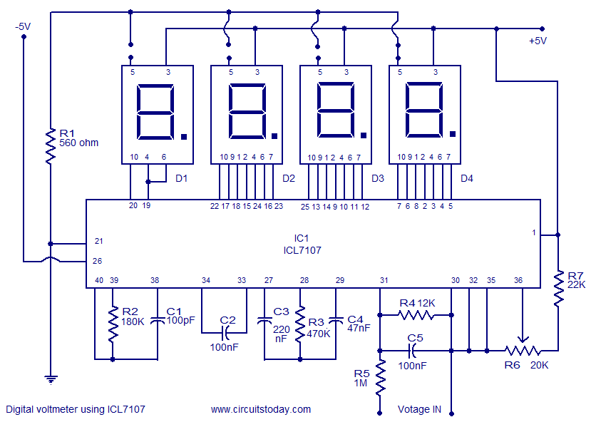

<p style="text-align: center">图18：ICL7107用于数字万用表电路的设计原理图</p>


2\. 仿真结果与分析

在仿真过程中，分别输入不同的直流电压值，观察数码管的显示情况。经过比对发现，输入电压探针与数码管显示的数值能够保持同步变化，电路具备量程选择切换和负压测量功能。

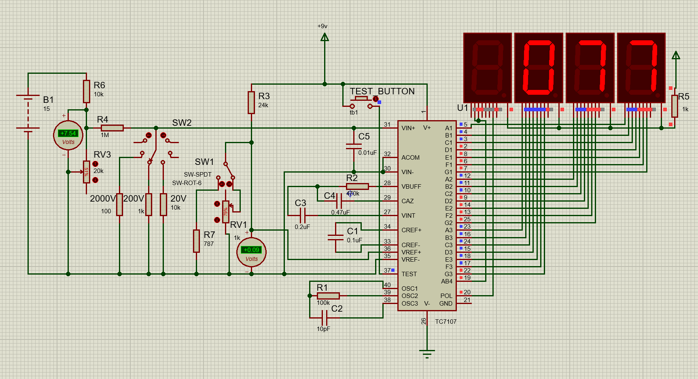

<p style="text-align: center">图19：Proteus 8 电路仿真测试图</p>


### 第3.4节 方案总结

本方案所述电路为基于ICL7107芯片的高精度数字电压表系统，采用LED数码管显示。ICL7107芯片作为核心组件，集成了3.5位模数转换器，其内部电路架构包含七段译码器、显示驱动器、基准电压源及时钟发生器，系统功耗低于10mW且显示稳定性卓越。

本系统工作原理可概括为：待测电压经由芯片内置模数转换器转化为等效数字量，经译码后通过七段码格式驱动显示。该转换器采用双积分型架构，其工作过程可分为两个阶段：首先对待测电压进行固定时间积分以产生斜坡信号，随后施加反向基准电压进行反向积分直至积分器输出归零。通过测量反向积分阶段所消耗的时钟周期数（与输入电压呈正比关系），实现模拟量至数字量的精确转换。

简言之，系统通过将输入电压与内部基准电压进行对比，最终将差值量转换为数字格式输出。

如图18所示，关键外围元件参数配置如下：电阻R2与电容C1协同设定芯片内部时钟频率；电容C2通过抑制基准电压波动显著提升显示稳定性；量程调节电阻R4的阻值决定测量范围（R4=1.2kΩ对应0-20V量程，R4=12kΩ对应0-200V量程）。显示单元采用四位LED数码管布局，右侧三位具备完整数字显示功能，左侧首位特殊设计仅支持"1"及负号显示。

本方案仅需ICL7107芯片以及10个左右的无源器件即可完成高精度的数字电压表设计，具有非常高的经济效益。

## 4 基于ESP32单片机和Arduino的数字电压表设计

### 第4.1节 方案简述

本设计基于ESP32单片机与Arduino框架，通过分压电路扩展输入电压范围，利用ESP32单片机内置ADC采集电压信号，结合OLED显示屏实时显示输入电压值。在硬件设计上，采用分压电阻扩展电压测量范围，ESP32的ADC模块（GPIO36）采集分压后信号。在软件设计上，通过多采样平均滤波提升精度，OLED显示电压值，支持串口输出调试。本方案的测量量程由分压比（外接分压电阻计算得到）决定，默认分压比为5，最大输入电压支持16.5V（对应ADC量程3.3V）。

### 第4.2节 电路原理设计

#### 4.2.1 原理框图

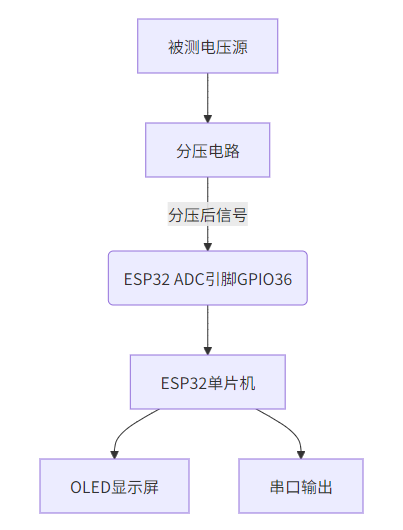

<p style="text-align: center">图20：使用单片机方案的原理框图</p>


#### 4.2.2 硬件电路说明

本方案使用的硬件电路十分简单，只需要一块ESP32单片机核心板（以ESP32-WROOM为例），将ESP32的ADC引脚（GPIO36）连接外部分压电阻中点，将OLED显示屏（SSD1306）连接单片机的I2C接口（SCL -GPIO22、SDA-GPIO21）。

如果使用ESP32的其他型号，需要在代码中修改相应的引脚端口。


<p style="text-align: center">图21：硬件模拟图</p>


图21展示了硬件接线示意图，图示VP引脚即为ESP32单片机的ADC采集引脚（GPIO36），在该图中采用电位器模拟输入电压变化。

表2：方案接线表

| 模块引脚     | ESP32引脚 | 说明             |
|--------------|-----------|------------------|
| 分压电路中点 | GPIO36    | 连接分压电阻中点 |
| OLED SDA     | GPIO21    | I2C数据线        |
| OLED SCL     | GPIO22    | I2C时钟线        |
| OLED VCC     | 3V3       | 电源正极         |
| OLED GND     | GND       | 电源负极         |

#### 4.2.3 分压电阻连接与计算公式

当需要测量的电压超过3V3（ESP32单片机引脚耐受电平不超过3.9V）时，需要根据最高的电压输入值确定分压电阻值，并根据下文中的分压比计算公式同步修改代码中的分压值。需要测量的电压范围越大，分压比越大，相应的测量分辨率会降低。

代码中ADC衰减设置 *ADC_ATTEN_DB_11*对应量程3.3V，需确保分压后电压不超过此值。默认使用0-3V3量程时，无需外接的分压电阻，最小测量分辨率为$\small{\frac{3.3}{2^{12}}}=0.000805664$V。

分压电路由两个电阻（R1、R2）串联组成，输入电压接R1端，R2接地，ADC引脚连接R1与R2中点。可以在ADC引脚附近添加0.1μF去耦电容，抑制高频干扰。


<p style="text-align: center">图22：ADC分压电路</p>


分压比公式：

$$
\text{分压比}=\frac{R1+R2}{R2}
$$
如图所示：若R1=400kΩ，R2=100kΩ，分压比为$\frac{400+100}{100}=5$，实际电压为ADC测量值（0-3V3)的5倍。

表3：分压比与电阻值对照表

| 目标量程 | R1   | R2   | 分压比 |
|----------|------|------|--------|
| 0-16.5V  | 400K | 100K | 5      |
| 0-25V    | 680K | 100K | 7.8    |

### 第4.3节 代码说明

#### 4.3.1代码结构概述

代码分为以下功能模块：

- 硬件初始化：配置OLED显示屏和ADC校准参数。

- ADC采样：多采样平均滤波读取电压值。

- 电压计算：根据分压比转换实际电压。

- 显示与输出：OLED动态显示电压值，串口输出调试信息。

#### 4.3.2系统流程图


<p style="text-align: center">图23：系统流程图</p>


#### 4.3.3关键代码解析

##### 1. ADC初始化与校准

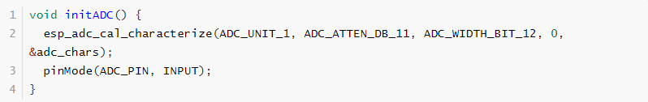

代码功能是初始化ADC单元，校准参数以提升精度，使用ESP32内部参考电压源。

> *ADC_ATTEN_DB_11*：设置ADC衰减为11dB，对应量程0-3.3V 。
>
> *ADC_WIDTH_BIT_12*：12位分辨率（ESP32 ADC实际有效位约9-10位）。 
>
> *adc_chars*：存储校准后的ADC特性参数。

##### 2. ADC多采样与电压计算

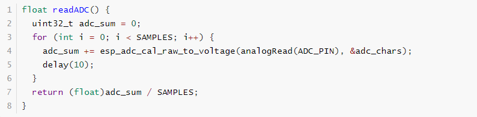
>
> 代码功能是采集10次ADC值，取平均以减少噪声干扰。关键函数如下：
>
> *analogRead(ADC_PIN)*：读取ADC原始值（0-4095）。
>
> *esp_adc_cal_raw_to_voltage()*：将原始值转换为实际电压（单位mV）。

##### 3.动态显示与单位切换

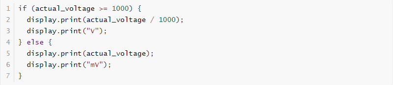
>
> 此代码的逻辑是根据电压值自动切换单位（V/mV），优化显示效果。

##### 4.分压比代码实现

代码中分压比通过该行实现：


> 若分压电阻更换（如R1=680kΩ，R2=100kΩ，分压比7.8），需修改此处的乘数。

##### 5.代码设计要点

1.  抗干扰设计

> 通过 *SAMPLES=10* 多次采样取平均，抑制瞬时噪声。
>
> *delay(10)* 确保两次采样间隔，避免ADC内部电路干扰。

2.  单位自适应

> 根据 *actual_voltage* 大小自动切换V/mV单位，提升可读性。

3.  校准优化

> 使用 *esp_adc_cal_characterize*校准ADC非线性误差，提高测量精度。

### 第4.4节 仿真验证

#### 4.4.1 仿真工具

使用wokwi.com平台进行仿真设计及验证。

搭建的仿真链接：[Wokwi - Online ESP32, STM32, Arduino Simulator](https://wokwi.com/projects/428534368100928513)


<p style="text-align: center">图24：仿真实验图</p>


#### 4.4.2 仿真结果分析

在仿真过程中，调节电位器模拟输入电压变化，观察OLED的显示数据。OLED能够显示ADC引脚测量得到的电压值*Pin Voltage*，能够显示计算得到的实际待测电压值*Input Voltage*。仿真电路能够实现自动切换显示单位（mV/V）功能，具备串口电压数据输出功能。

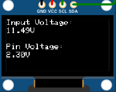

<p style="text-align: center">图25：仿真OLED显示数据</p>


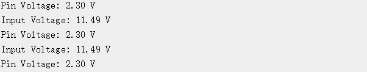

<p style="text-align: center">图26：串口调试器输出结果图</p>


### 第4.5节 方案总结

本设计方案，通过构建分压电路，成功扩展了输入电压的测量范围，同时利用 ESP32 的内置12位 ADC 完成电压信号的采集工作，并借助I2C接口与 SSD1306 OLED 驱动芯片进行通信，通过显示屏和串口监视器实时显示测量电压值。

方案的设计优势在于通过调整分压电阻（R1/R2）可轻松扩展测量量程（如0-30V），适应不同场景需求。代码中分压比参数可快速修改，无需重构核心逻辑。通过多次采样并计算平均值的方式，有效抑制随机噪声，提高了电压测量的准确性；通过ADC校准函数补偿非线性误差，优化精度；支持人机交互可视化，支持串口输出调试，便于开发验证。未来可以增加软件校准功能，支持用户手动输入标准电压值进行误差补偿；在硬件上增加过压保护器件，防止输入电压超限。

本方案最大的特点就是硬件结构极为简单，无需额外模数转换芯片，硬件结构简单的同时，保留了较高的测量精度。此方案采用Arduino框架，代码非常容易在不同微控制器之间进行迁移，适配成本低。本方案非常适合集成于嵌入式系统中进行电源电压采集，适用于电子工程教学中电压测量原理的验证，可替代低精度万用表，用于非关键场合的电压粗略测量。

## 5 结论

本课程设计通过三种不同方案实现了数字电压表，各方案在技术特点、性能指标和适用场景上存在明显差异，具体对比如下：

**基于 ICL7135 的四位半数字电压表方案**

- **优势**：采用双积分 A/D 转换技术，具有极高的测量精度（四位半，分辨率 10μV）和强抗干扰能力，适合对精度要求高的低速测量场景，如工业仪表、精密测量等。电路原理清晰，通过各模块的合理设计，验证了双积分 ADC 在高精度测量中的优势。

- **不足**：电路结构相对复杂，需要较多的外围元件（如基准电压产生电路、时钟信号产生电路等），焊接和调试过程较为繁琐，转换速度较慢，实时性较差。

**基于 ICL7107 芯片的数字电压表方案**

- **优势**：ICL7107 芯片内部集成了时钟发生器、积分器、比较器、七段译码器和驱动电路等，可直接驱动共阳极 LED 数码管，极大简化了外围电路设计，仅需约 10 个无源器件即可完成设计，具有很高的经济效益。电路设计简洁，功耗低（低于 10mW），显示稳定性卓越，适合低成本、对电路复杂度要求低的直流电压测量场景。

- **不足**：测量精度为三位半，相对 ICL7135 方案精度较低，在需要更高精度测量的场合表现不足。

**基于 ESP32 单片机和 Arduino 的数字电压表方案**

- **优势**：硬件结构极为简单，无需额外模数转换芯片，利用 ESP32 内置 ADC 和 Arduino 框架，通过分压电路可轻松扩展测量量程（如 0-30V），适配不同场景需求。代码基于 Arduino 框架，易于在不同微控制器之间迁移，适配成本低，且支持 OLED 显示和串口输出调试，便于开发验证和人机交互。通过多采样平均滤波和 ADC 校准，有效抑制噪声和补偿误差，提高了测量准确性，适合集成于嵌入式系统中进行电源电压采集，以及电子工程教学和非关键场合的电压粗略测量。

- **不足**：测量精度受 ESP32 内置 ADC 限制（实际有效位约 9-10 位），相比前两种基于专用 A/D 转换芯片的方案，精度相对较低。

表4：三种数字电压表设计方案维度对比表

| 对比维度       | ICL7135方案                | ICL7107方案              | ESP32方案               |
|----------------|----------------------------|--------------------------|-------------------------|
| **核心技术**   | 双积分A/D转换              | 集成双积分ADC+LED驱动    | 单片机内置ADC+软件滤波  |
| **分辨率**     | 10μV（四位半）             | 100μV（三位半）          | 0.8mV（12位ADC）        |
| **量程**       | ±199.99mV                  | 0-200mV（可扩展至200V）  | 0-3.3V（分压扩展至25V） |
| **抗干扰能力** | 极强（双积分原理）         | 强（集成化设计）         | 一般（依赖软件滤波）    |
| **硬件复杂度** | 高（需外围时钟、译码电路） | 中（集成驱动，减少元件） | 低（仅分压电阻+单片机） |
| **成本**       | 较高（专用芯片+多元件）    | 极低（集成芯片）         | 中等（通用单片机）      |
| **适用场景**   | 实验室精密测量             | 工业仪表、手持设备       | 嵌入式系统、教学实验    |
| **开发难度**   | 高（需精密调试）           | 中（依赖芯片手册）       | 低（Arduino框架易用）   |
| **扩展性**     | 有限（固定量程）           | 可扩展量程               | 灵活（软件可调分压比）  |

通过对比三种设计方案，得出的结论如下：

- ICL7135方案适合对精度要求极高的场景，但硬件复杂且成本较高；

- ICL7107方案在精度与成本间取得平衡，适合批量生产的工业仪表；

- ESP32方案在嵌入式集成和扩展性方面具有优势，适用于教学实验或非精密测量。

通过本次课程设计，我全面系统地学习了不同技术路径下数字电压表的设计方法，提升了从原理分析、电路设计到仿真调试的全流程能力，为今后电子系统设计积累了宝贵经验。

## 参考文献

1.  Intersil. ICL7135 Data Sheet: 4½ Digit A/D Converter.
2.  Texas Instruments. ICL7107 CMOS Analog-to-Digital Converter.
3.  Espressif. ESP32 Technical Reference Manual.
4.  Arduino Voltage Monitoring System（<https://github.com/Mashuk048/digitalVoltmeter>）
5.  Digital Voltmeter Circuit（<https://github.com/rwandhare/Digital-Voltmeter>）
6.  Simple-Digital-Voltmeter（<https://github.com/tejasgolhar2/Simple-Digital-Voltmeter>）
7.  Digital voltmeter using ICL7107（<https://www.circuitstoday.com/digital-voltmeter-using-icl7107>）
8.  Digital Voltmeter based on 7135 IC（<https://github.com/NosherwanA/Digital_Voltmeter>）
9.  万用表之电压测量原理(基于ICL7107)-CSDN博客(<https://blog.csdn.net/liht_1634/article/details/134671809>)

## 附录

附录1：

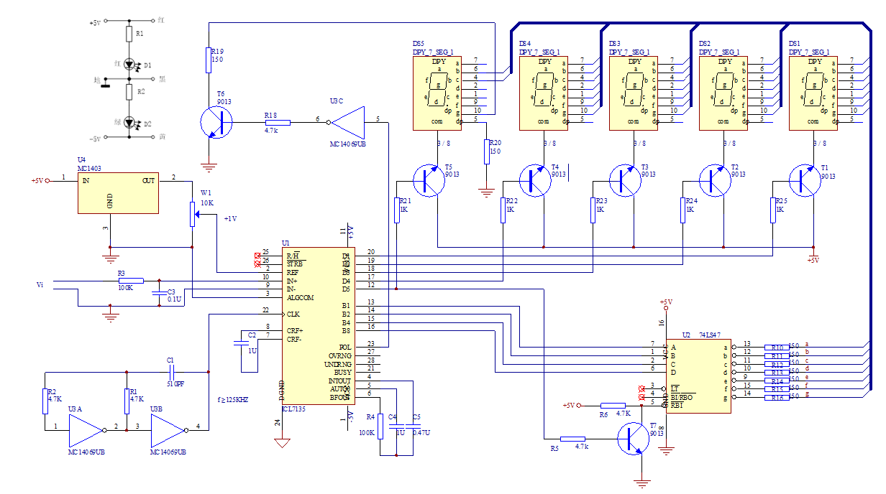

<p style="text-align: center">图27：ICL7135设计电路图</p>


附录2：ESP32-数字电压表源程序与仿真设计图

```c++
#include <Wire.h>
#include <Adafruit_GFX.h>
#include <Adafruit_SSD1306.h>
#include <esp_adc_cal.h>
#define SCREEN_WIDTH 128 // OLED显示屏宽度
#define SCREEN_HEIGHT 64 // OLED显示屏高度
#define OLED_RESET -1    // OLED复位引脚，如果没有则设为-1
#define ADC_PIN 36       // ESP32 ADC引脚，这里使用GPIO36
#define SAMPLES 10       // 取样次数
Adafruit_SSD1306 display(SCREEN_WIDTH, SCREEN_HEIGHT, &Wire, OLED_RESET);
esp_adc_cal_characteristics_t adc_chars;
// 初始化ADC
void initADC() {
  esp_adc_cal_characterize(ADC_UNIT_1, ADC_ATTEN_DB_11, ADC_WIDTH_BIT_12, 0, &adc_chars);
  pinMode(ADC_PIN, INPUT);
}
// 读取ADC值并计算平均电压
float readADC() {
  uint32_t adc_sum = 0;
  for (int i = 0; i \< SAMPLES; i++) {
    adc_sum += esp_adc_cal_raw_to_voltage(analogRead(ADC_PIN), &adc_chars);
    delay(10); // 稍微延时以稳定读数
  }
  return (float)adc_sum / SAMPLES;
}
void setup() {
  Serial.begin(115200);
  // 初始化OLED显示屏
  if (!display.begin(SSD1306_SWITCHCAPVCC, 0x3C)) {
    Serial.println(F("SSD1306 allocation failed"));
    for (;;);
  }
  display.clearDisplay();
  display.display();
  initADC();
}
void loop() {
  float voltage = readADC();
  // 假设经过分压电路，进行电压范围扩展，这里假设分压比为 5
  float actual_voltage = voltage \* 4.096;
  display.clearDisplay();
  display.setTextSize(1);
  display.setTextColor(WHITE);
  display.setCursor(0, 0);
  display.print("Input Voltage:");
  if (actual_voltage >= 1000) {
    display.setCursor(0, 10);
    display.print(actual_voltage / 1000);
    display.print("V");
  } else {
    display.setCursor(0, 10);
    display.print(actual_voltage);
    display.print("mV");
  }
  display.setCursor(0, 30);
  display.print("Pin Voltage:");
  if (voltage >= 1000) {
    display.setCursor(0, 40);
    display.print(voltage / 1000);
    display.print("V");
  } else {
    display.setCursor(0, 40);
    display.print(voltage);
    display.print("mV");
  }
  display.display();
  Serial.print("Input Voltage: ");
  if (actual_voltage >= 1000) {
    Serial.print(actual_voltage / 1000);
    Serial.println(" V");
  } else {
    Serial.print(actual_voltage);
    Serial.println(" mV");
  }
  Serial.print("Pin Voltage: ");
  if (voltage >= 1000) {
    Serial.print(voltage / 1000);
    Serial.println(" V");
  } else {
    Serial.print(voltage);
    Serial.println(" mV");
  }
  delay(1000);
}    
```


<p style="text-align: center">图28：基于ESP32的数字电压表的仿真电路图</p>


附录3：基于ICL7107集成芯片的数字电压表原理图和仿真测试图


<p style="text-align: center">图29：基于ICL7107集成芯片的数字电压表仿真测试图</p>


<p style="text-align: center">图30：ICL7107仿真电路所参考的原理图</p>

