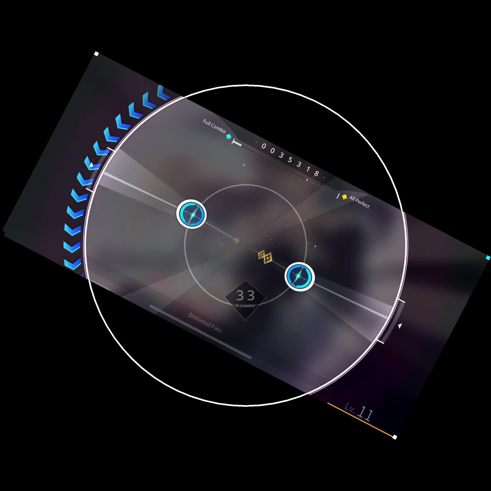

# 旋转音律视频稳定工具 Rotaeno Stabilizer
---
## Rotaeno介绍

Rotaeno是一款旋转手机音乐游戏，区别于传统音游的点按式判定，游戏利用手机陀螺仪功能，玩家需通过快速旋转手机来完成如 ROTATE 音符等部分音符的判定。

玩家需要在旋转的平台上跟随音乐的节奏进行操作，不仅要通过点击屏幕来触发如 TAP（点击）、SLIDE（长按）、FLICK（快速划过）等音符，还要根据不同颜色的旋转音符，通过旋转手机来完成判定，红色音符需要高速顺时针旋转设备，蓝色音符则需高速逆时针旋转。此外还有 CATCH 音符，要通过旋转设备让其进入捕捉区内，而陨石音符则要避免进入捕捉区。

独特的玩法增加了游戏的趣味性和挑战性，带来独特的沉浸式体验。

普通的录屏无法直接反映游玩过程中的手机旋转角度的变化，旋转音律视频稳定器基于游戏直播模式，提取画面中的旋转角度信息，进行旋转处理后进行输出。

## Python Rotaeno Stabilizer

旋转音律视频文件稳定器



[视频演示](https://www.bilibili.com/video/BV1bc411f7fK/?share_source=copy_web&vd_source=9e94008dbf76e399a164028430118348)

这是一个基于Python的Rotaeno录屏稳定工具，原理和Rotaeno官方提供的Adobe After
Effects脚本一样，是基于直播模式下录屏画面四个角的颜色来旋转帧，从而达到稳定视频画面的目的，基于[Lawrenceeeeeeee](https://github.com/Lawrenceeeeeeee)项目的v1.3版本进行二次开发而来。

原项目的修改说明：

• 当前版本能完全实现原项目main.py的脚本功能，可以依照原项目的使用说明使用，当前版本项目没有对原项目的核心处理逻辑进行修改
• 通过gui_main文件实现了图形化界面的支持
• 图形化程序可选输入输出文件夹，具备默认输入输出文件夹选定功能
• 图形化程序支持自动获取同工作目录或用户路径下的ffmpeg软件包路径，同时也支持用户手动选择路径
• 图形化程序增加对圆形蒙版、方形渲染、高码率输出、v1模式等视频处理选项的支持
• 增加对颜色方块取样区域的调整设置，以修复一些机型的录制视频处理失效的问题

原项目地址：[https://github.com/Lawrenceeeeeeee/python_rotaeno_stabilizer](https://github.com/Lawrenceeeeeeee/python_rotaeno_stabilizer)

联系项目原作者：Bilibili账号[https://space.bilibili.com/143784401](https://space.bilibili.com/143784401)

官网关于直播模式的说明：[https://www.rotaeno.com/streaming](https://www.rotaeno.com/streaming)

本项目的Github：[https://github.com/weigo6/python_rotaeno_stabilizer](https://github.com/weigo6/python_rotaeno_stabilizer)

本项目的Gitee地址：[https://gitee.com/weigo6/python_rotaeno_stabilizer](https://gitee.com/weigo6/python_rotaeno_stabilizer)

## 功能特点

- 无需安装Adobe After Effects，通过一行命令运行`main.py`即可渲染完成
- 支持批量处理视频
- 图形化程序支持一键式操作，无需部署python运行环境，几乎没有使用的学习成本

## 安装

如果你没有编程能力，直接点击此处 [Releases](https://github.com/weigo6/python_rotaeno_stabilizer/releases) 下载打包好的软件（仅支持Windows），打包的压缩包中已经包含了`ffmpeg`软件包。

如遇网络问题，可以从[Gitee Releases](https://gitee.com/weigo6/python_rotaeno_stabilizer/releases)下载发行版本。该链接的ffmpeg软件包和工具两个zip文件是独立的。

程序支持从用户环境和当前的文件夹目录下直接读取`ffmpeg`的路径。所以如果您此前已经在本机安装了`ffmpeg`并将其添加到了用户环境中，则打包的压缩包中的`ffmpeg`软件包是不必要的，可以删去。否则你需要确保ffmpeg文件夹存在于exe文件同路径下。

双击exe文件即可执行程序，注意不要将ffmpeg软件包的文件夹设置为输出目录。

### 程序开发环境部署

如果只是使用，可直接通过exe可执行程序（windows）实现功能，无需操作下文部分。

1. 下载项目代码：

```shell
git clone https://github.com/weigo6/python_rotaeno_stabilizer.git
```

或者直接在本仓库界面点击Download ZIP下载然后解压

2. 安装依赖：

```shell
# 切换到脚本所在目录
cd python_rotaeno_stabilizer
# 安装依赖
pip install -r requirements.txt
# 如果需要运行GUI程序，额外安装pyside6，需要执行以下的命令。
pip install pyside6
```

3. 安装FFmpeg

请在[FFmpeg官网](https://ffmpeg.org/download.html)上下载对应的安装包。

## 使用方法

**注意！！！** 录屏前请在Rotaeno的设置中开启"直播模式"，开启后屏幕的四个角将会出现记录设备旋转角的色块。

要注意视频录制的比例问题，要保证色块位置在画面四角。一些特殊比例的视频录制会在周围填充黑边导致程序无法处理。

### 使用批处理脚本

1. 将待处理的视频放在`videos`目录下 (目前支持mp4, mov, avi, mkv, wmv, flv)

2. 启动项目：

```shell
python main.py
```

3. 在`output`文件夹找渲染完成的视频

### 使用图形化界面

1. 启动项目：

```shell
python gui_main.py
```

注：如果没有选择默认的输入输出文件夹的话，则默认选择当前程序所在目录下的`videos`和`output`文件夹，如果`output`文件夹不存在，程序会自动创建。

视频渲染完成后将在程序运行进程提示输出框中返回`Happy End!`字样。


效果如下:


