# 蓝桥杯嵌入式学习笔记

个人嵌入式学习笔记，蓝桥杯部分，仅供学习参考，不允许售卖。

---

`提示：本篇相当部分代码及语法解释来自百度文心一言及阿里通义灵码,chatgpt AI生成，并且有相当多的部分摘抄了网络博文和正点原子的HAL库开发手册，本篇笔记由本人在相当长的学习过程中逐渐整理成型，缺少精力对各部分内容来源进行标注，本文档中绝大部分的代码已通过实践验证，如果存在知识点错误或内容有更好的表述形式，欢迎通过邮箱指正 yang92636@qq.com 欢迎您在git代码托管平台上提交Issues，笔者已经参与过了蓝桥杯比赛，本文后续更新幅度和修改范围会非常小，甚至不更新，您可以通过GITEE/GITCODE网址：https://gitee.com/weigo6/MCU_LEARN_LIB 或者 https://gitcode.com/weigo6/MCU_LEARN_LIB 查看最新文档（欢迎来点个Star），希望本份笔记能够为你提供帮助！`

跳转本文对应的仓库：[与蓝桥杯比赛嵌入式赛道相关的内容整理](https://gitee.com/weigo6/blue-cup)

## 一、HAL库常用函数

在写HAL库代码时，所有用户代码放在user code begin和user code end中，否则重新生成代码会被覆盖

### 1.GPIO

+ `Output Push Pull`：推挽输出，能输出高低电平，且高低电平都有驱动能力。以PB13引脚为例，若需要通过其控制LED灯，则该引脚应配置为“Output Push Pull”模式，对应标准库函数中的“GPIO_Mode_Out_PP”
+ `Output Open Drain`：开漏输出，只能输出低电平，需要借助外部上拉电阻才能输出高电平，对应标准库函数中的“`GPIO_Mode_Out_OD`”
+ `Analog mode`：模拟输入，ADC采样信号输入引脚的配置模式，对应标准库函数中的“`GPIO_Mode_AIN`”
+ `Alternate Function Push Pull`：推挽式复用功能，对应标准库函数中的“`GPIO_Mode_AF_PP`”
+ `Input mode`：输入模式，配合`No pull-up/pull-down`可形成`GPIO_Mpde_IN_FLOATING`、`GPIO_Mode_IPD`、`GPIO_Mode_IPU`等不同工作模式

```c
HAL_GPIO_WritePin(GPIOF,GPIO_PIN_9,GPIO_PIN_SET);//PF9设置为高电平，GPIO_PIN_RESET代表低电平
HAL_GPIO_ReadPin (GPIOF, GPIO_PIN_5);//读取PF5的引脚状态
HAL_GPIO_TogglePin(GPIO_TypeDef* GPIOx, uint16_t GPIO_Pin);//翻转引脚电平
/*GPIO中断回调函数*/
void HAL_GPIO_EXTI_Callback(uint16_t GPIO_Pin)
{
/*逻辑功能写在这里*/
}
```
> __HAL_RCC_GPIOF_CLK_ENABLE();//使能GPIOF时钟
> > \_\_HAL_RCC_USART2_CLK_ENABLE();//使能串口 2 时钟
> > \_\_HAL_RCC_TIM1_CLK_ENABLE();//使能 TIM1 时钟
> > \_\_HAL_RCC_DMA1_CLK_ENABLE();//使能 DMA1 时钟 
>
> HAL_GPIO_Init();//GPIO初始化

### 2.NVIC中断

在HAL库中，中断服务函数定义在底层，不需要编写，通常只需要编写中断回调函数，无需清理中断标记位。

+ 如果要在中断服务函数中使用 HAL_Delay 函数的话，那么中断的优先级在设置的时候就要注意，
  不能设置比 SysTick 的中断优先级比高或者同级，否则中断服务函数一直得不到执行，从而卡死在这里。

第一，如果两个中断的抢占优先级和响应优先级都是一样的话，则看哪个中断先发生就先执行；
第二，高优先级的抢占优先级是可以打断正在进行的低抢占优先级中断的。而抢占优先级相同的中断，高优先级的响应优先级不可以打断低响应优先级的中断。

中断分组表：

| 组   | AIRCR[10:8] | bit[7:4]分配情况 | 分配结果                       |
| :--: | :-----------: | :------------: | :------------------------: |
| 0    | 111         | 0:4              | 0 位抢占优先级，4 位响应优先级 |
| 1    | 110         | 1:3              | 1 位抢占优先级，3 位响应优先级 |
| 2    | 101         | 2:2              | 2 位抢占优先级，2 位响应优先级 |
| 3    | 100         | 3:1              | 3 位抢占优先级，1 位响应优先级 |
| 4    | 011         | 4:0              | 4 位抢占优先级，0 位响应优先级 |

中断分组函数在`HAL_Init`内被调用。

配置 IO 口外部中断的一般步骤：

1. 使能 IO 口时钟。
2. 调用函数 `HAL_GPIO_Init` 设置 IO 口模式，触发条件，使能 SYSCFG 时钟以及设置 IO
口与中断线的映射关系。
3. 配置中断优先级（NVIC），并使能中断。
4. 在中断服务函数中调用外部中断共用入口函数 `HAL_GPIO_EXTI_IRQHandler`。
5. 编写外部中断回调函数 `HAL_GPIO_EXTI_Callback`。
```c
void HAL_NVIC_SetPriorityGrouping(uint32_t PriorityGroup);//这个函数在系统中只需要被调用一次，一旦分组确定就最好不要更改，否则容易造成程序分组混乱。
HAL_NVIC_SetPriorityGrouping (NVIC_PriorityGroup_2);//设置系统的中断优先级的分组为2
void HAL_NVIC_SetPriority(IRQn_Type IRQn, uint32_t PreemptPriority, uint32_t SubPriority);//设置单个优先级的抢占优先级和响应优先级的值
void HAL_NVIC_EnableIRQ(IRQn_Type IRQn);//使能某个中断通道
void HAL_NVIC_DisableIRQ(IRQn_Type IRQn);//来清除某个中断使能
HAL_NVIC_SetPriority(EXTI0_IRQn,2,1); //使能中断线抢占优先级为 2，子优先级为 1
HAL_NVIC_EnableIRQ(EXTI0_IRQn); //使能中断线 0

/*stm32 IO口外部中断服务函数*/
void EXTI0_IRQHandler();
void EXTI1_IRQHandler();
void EXTI2_IRQHandler();
void EXTI3_IRQHandler();
void EXTI4_IRQHandler();
void EXTI9_5_IRQHandler();
void EXTI15_10_IRQHandler();
```

GPIO与中断线的映射关系图

中断函数调用示例：

```c
void EXTI2_IRQHandler(void)//该函数在stm32xx_it.c文件中
{
 HAL_GPIO_EXTI_IRQHandler(GPIO_PIN_2); //调用中断处理公用函数
}
在 HAL 库中所有的外部中断服务函数都会调用下面的函数
/*需要自己编写的函数，重要*/
void HAL_GPIO_EXTI_Callback(uint16_t GPIO_Pin)
{
/*逻辑功能写在这里*/
}
```

中断处理函数定义

```c
/*该函数在stm32xx_hal_gpio.c文件中*/
void HAL_GPIO_EXTI_IRQHandler(uint16_t GPIO_Pin)//判断是几号线中断，清除中断标识位，然后调用中断回调函数
{
  if(__HAL_GPIO_EXTI_GET_IT(GPIO_Pin) != RESET)
  {
   __HAL_GPIO_EXTI_CLEAR_IT(GPIO_Pin);
   HAL_GPIO_EXTI_Callback(GPIO_Pin);
  }
}
```

该函数进行了清除了中断标志位，因此在编写函数过程中只需要写函数`HAL_GPIO_EXTI_Callback(uint16_t GPIO_Pin)`控制逻辑。

\\(\^o^)/~

> [!NOTE]
> 函数调用关系：`EXTIx_IRQHandler`——>` HAL_GPIO_EXTI_IRQHandler(GPIO_PIN_x)`——>`HAL_GPIO_EXTI_Callback(GPIO_Pin);`

### 3.TIM

更新中断就是定时器溢出中断，定时器就是计数器。

### 与定时器的值有关的函数

```c
//设置获取比较值
__HAL_TIM_SetCompare (__HANDLE__, __CHANNEL__, __COMPARE__)
例如：__HAL_TIM_SetCompare(&htim3,TIM_CHANNEL_3,1000);
__HAL_TIM_GetCompare (__HANDLE__, __CHANNEL__)
例如：__HAL_TIM_GetCompare(&htim3,TIM_CHANNEL_3);
//设置获取自动重装值
__HAL_TIM_SetAutoreload (__HANDLE__, __AUTORELOAD__)
例如：__HAL_TIM_SetAutoreload(&htim3,1000);
/*也可以这样：*/htim3.Instance->ARR = 100;//修改定时器3的ARR值
__HAL_TIM_GetAutoreload (__HANDLE__)
例如：__HAL_TIM_GetAutoreload(&htim3);
//设置获取计数值
__HAL_TIM_SetCounter (__HANDLE__,__COUNTER__)
例如：__HAL_TIM_SetCounter(&htim3,1000);
__HAL_TIM_GetCounter (__HANDLE__)
例如：__HAL_TIM_GetCounter(&htim3);
```

#### 等价函数

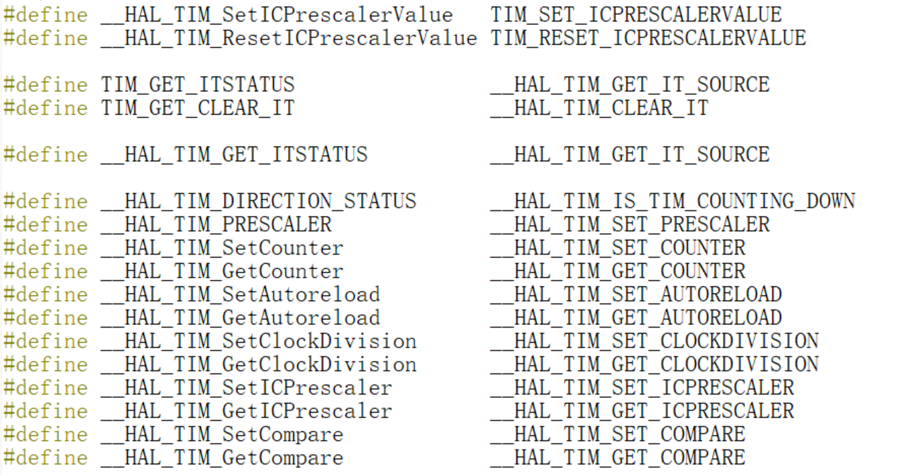

#### 常用函数

```c
/*枚举型，HAL_OK(成功)、HAL_ERROR（错误）、HAL_BUSY（串口忙碌）、HAL_TIMEOUT（超时）*/
HAL_StatusTypeDef HAL_TIM_Base_Start_IT(TIM_HandleTypeDef *htim);// 使能定时器更新中断和使能定时器
HAL_StatusTypeDef HAL_TIM_Base_Stop_IT(TIM_HandleTypeDef *htim);//关闭定时器和定时器中断
HAL_StatusTypeDef HAL_TIM_Base_Start(TIM_HandleTypeDef *htim);//开启定时器
HAL_StatusTypeDef HAL_TIM_Base_Stop(TIM_HandleTypeDef *htim);//关闭定时器

/*定时器的回调函数*/
void HAL_TIM_PeriodElapsedCallback(TIM_HandleTypeDef *htim)//更新中断回调函数
void HAL_TIM_OC_DelayElapsedCallback(TIM_HandleTypeDef *htim);//输出比较回调函数
void HAL_TIM_IC_CaptureCallback(TIM_HandleTypeDef *htim);//输入捕获回调函数
void HAL_TIM_TriggerCallback(TIM_HandleTypeDef *htim);//触发中断回调函数

void TIM3_IRQHandler(void);//定时器3的中断服务函数，调用下行函数，在stmxx_hal_it.c中
HAL_TIM_IRQHandler(TIM_HandleTypeDef *htim);//定时器中断共用处理函数，该函数定义在stmxx_hal_tim.c中，并调用了下面的函数

/*需要自己编写的非常重要的函数，不能写错*/
void HAL_TIM_PeriodElapsedCallback(TIM_HandleTypeDef *htim)//定时器中断回调函数，需要在函数内部区分定时器
{
    if(htim->Instance==TIM3){//定时器中断来源判断
        逻辑语句
    }
	if (htim == &htimx){//定时器中断来源判断
        逻辑语句
    }
}//定时器更新中断
```
>这里列出单独使能/关闭定时器中断和使能/关闭定时器方法：
 \_\_HAL_TIM_ENABLE_IT(htim, TIM_IT_UPDATE);//使能句柄指定的定时器更新中断
 \_\_HAL_TIM_DISABLE_IT (htim, TIM_IT_UPDATE);//关闭句柄指定的定时器更新中断
 \_\_HAL_TIM_ENABLE(htim);//使能句柄 htim 指定的定时器 //似乎不起作用，使用上面的代码
 \_\_HAL_TIM_DISABLE(htim);//关闭句柄 htim 指定的定时器

#### 涉及到初始化的一些代码

```c
void MX_TIM3_Init(void);//在cubemx配置定时器3，该函数在tim.c中，调用下行函数
HAL_TIM_Base_Init(&htim3)；//初始化定时器3，在stm32xx_hal_tim.c中。调用下两行函数。
HAL_TIM_Base_MspInit(htim);//该函数定义在tim.c中，初始化底层硬件，如开启定时器时钟、设置定时器中断优先级以及开启定时器中断，由CubeMx生成
TIM_Base_SetConfig(htim->Instance, &htim->Init);//在stm32xx_hal_tim.c中，完成对计数模式，时钟分频，自动重装值等设置，配置定时器
```

#### 定时器编码器

```c
HAL_TIM_Encoder_Start(&htim1, TIM_CHANNEL_ALL);//启动编码器模式
cnt_encoder = __HAL_TIM_GET_COUNTER(&htim1);//通过函数获取TIM1的CNT值
/*获取TIM1 CNT值*/
__HAL_TIM_GET_COUNTER(&htim1);//return 返回uint16_t整数型变量，即当前的计数值
```
#### 输入捕获

当你设置的捕获开始的时候，cpu会将**计数寄存器的值**复制到**捕获比较寄存器**中并开始计数，当再次捕捉到电平变化时，这是计数寄存器中的值减去刚才复制的值就是这段电平的持续时间，你可以设置上升沿捕获、下降沿捕获、或者上升沿下降沿都捕获。
需要开启NVIC中断

```c
/**设置TIM1的CNT值*/
__HAL_TIM_SET_COUNTER(&htim1, 0);
// 开始捕获
/*上升下降沿捕获在cubemx里可直接配置，通常自动重装寄存器设为最大值*/
__HAL_TIM_SET_CAPTUREPOLARITY(&htim1, TIM_CHANNEL_3, TIM_INPUTCHANNELPOLARITY_RISING);//配置为上升沿捕获
__HAL_TIM_SET_CAPTUREPOLARITY(htim, TIM_CHANNEL_3, TIM_INPUTCHANNELPOLARITY_FALLING);//配置为下降沿捕获

HAL_TIM_IC_Start_IT(&htim1, TIM_CHANNEL_3);//开启TIM1通道3的输入捕获中断
/*重定义输入捕获中断函数*/
void HAL_TIM_IC_CaptureCallback(TIM_HandleTypeDef *htim)
{
  if (htim == &htim1 && htim->Channel == HAL_TIM_ACTIVE_CHANNEL_3)//判断捕获通道，注意==ACTIVE==
  {
	逻辑代码
  }//比较麻烦的判断方法，通常不用判断通道
  if(htim == &htim1) //判断输入捕获定时器
	{
         uint32_t  cc1_value = 0;//uint8_t位数过少
		cc1_value = __HAL_TIM_GET_COUNTER(htim);//获取发生捕获时的计数值
		cc1_value=HAL_TIM_ReadCapturedValue(htim,TIM_CHANNEL_1);
      //该代码读取输入捕获ccr寄存器的值，与上行代码可做相互替代，因为输入捕获发生时会把cnt值复制到ccr寄存器里
		__HAL_TIM_SetCounter(htim,0);//清除CNT
		f40 = 1000000/cc1_value;//逻辑代码示意，频率=系统时钟频率/TIM时钟分频/输入捕获ccr计数器的值（单次捕获计算）
	}
}
```

#### PWM

```c
HAL_TIM_PWM_Start(&htim3, TIM_CHANNEL_1);//启用定时器3的通道一PWM输出
__HAL_TIM_SET_COMPARE(&htim3, TIM_CHANNEL_1, period);//设置PWM的占空比，注意period需要小于设置中的Counter Period（ARR）
__HAL_TIM_GetCompare(&htim3,TIM_CHANNEL_1);//获取比较值
htim3.Instance->ARR = 100;//修改定时器3的ARR值 
//示例
for (int period = 0; period < 100; period++) {
        __HAL_TIM_SET_COMPARE(&htim3, TIM_CHANNEL_1, period);
        HAL_Delay(7);
    }
```


### 4.ADC

```c
HAL_StatusTypeDef HAL_ADCEx_Calibration_Start(ADC_HandleTypeDef *hadc,
                                              uint32_t CalibrationMode, uint32_t SingleDiff);
HAL_ADCEx_Calibration_Start(&hadc1, ADC_CALIB_OFFSET,ADC_SINGLE_ENDED);
//ADC校准函数，只有一部分MCU支持这种额外校准模式
/*形参 2 是校准模式选择，有以下两种：
1）ADC_CALIB_OFFSET 表示只运行偏移校准而不运行线性度校准。
2）ADC_CALIB_OFFSET_LINEARITY 表示同时运行偏移校准和线性度校准。
形参 3 是单端或差分模式选择，有以下两种：
1）ADC_SINGLE_ENDED 表示单端输入模式。
2）ADC_DIFFERENTIAL_ENDED 表示差分输入模式。*/
HAL_ADCEx_Calibration_Start(ADC_HandleTypeDef* hadc, uint32_t SingleDiff);//第二个参数是单端输入和差分输入选择
//ADC校准函数 注：STM32F4没有软件ADC校准

HAL_ADC_Init(&hadc1);//初始化ADC，调用下行函数,被MX_ADC1_Init()调用，在stm32xx_hal_adc.c中
HAL_ADC_MspInit(hadc);//ADC的GPIO初始化代码，在adc.c中
HAL_ADC_Start(&hadc1); //启动ADC1

HAL_ADC_ConfigChannel(&hadc1,&sConfig);//ADC通道配置函数
HAL_ADC_Stop(&hadc1);//停止ADC转换

/*等待 ADC 常规组转换完成函数*/
HAL_StatusTypeDef HAL_ADC_PollForConversion(ADC_HandleTypeDef *hadc,uint32_t Timeout);
HAL_ADC_PollForConversion(&hadc1, 10); /* 轮询转换 */;
//一般先调用 HAL_ADC_Start 函数启动转换，再调用该函数等待转换完成，然后再调用
//形参 2 是等待转换的等待时间，单位是毫秒（ms）。

HAL_ADC_GetValue(&hadc1);//获取当前转换值
```

#### ADC单通道采集

使用示例：获取 ADC1 通道 ch 的转换结果，先取 times 次,然后取平均

```c
uint32_t adc_get_result_average(uint32_t ch, uint8_t times){
	uint32_t temp_val = 0;uint8_t t;
    //HAL_ADCEx_Calibration_Start(&hadc1, ADC_CALIB_OFFSET,ADC_SINGLE_ENDED);
    //ADC 校准，如果MCU支持额外的校准
    /* 等待共模校准完成 */
	//while (HAL_ADCEx_Calibration_GetState(&hadc) != HAL_ADC_CALIBRATION_STATE_COMPLETED);
    //等待共模校准完成
    HAL_ADCEx_Calibration_Start(&hadc1,ADC_SINGLE_ENDED);//单端校准ADC
    HAL_ADC_Start(&hadc1); /* 启动 ADC */
    HAL_ADC_PollForConversion(&hadc1, 10); /* 轮询转换，设置转换10次*/;
    for (t = 0; t < times; t++) {/* 获取 times 次数 */
        temp_val += HAL_ADC_GetValue(&hadc1);
        HAL_Delay(5);
    }/* 获取转换结果，并将每次转换结果进行相加 */
    return temp_val / times; /* 返回转换后的平均值*/
}
```


### 5.I2C

I2C代码根据所使用的I2C外设模块，通常由厂商提供。HAL库IIC初始化可同过CubeMX软件图形化完成。

#### 软件模拟iic的一些通用代码

```c
/*以下代码GPIO配置开漏输出上拉电阻，如果配置SDA线推挽输出，则需要考虑SDA输出输入方向*/
 /*类似这样*/#define SDA_IN() {GPIOB->MODER&=~(3<<(9*2));GPIOB->MODER|=0<<9*2;}
            //PB9 输入模式
            #define SDA_OUT() {GPIOB->MODER&=~(3<<(9*2));GPIOB->MODER|=1<<9*2;} 
            //PB9 输出模式

#ifndef _IIC_H//基础文件定义
#define _IIC_H
#include"gpio.h"
/* IIC-SCL 引脚 定义 */
#define IIC_SCL_GPIO_PORT  GPIOA
#define IIC_SCL_GPIO_PIN   GPIO_PIN_11
/* IIC-SDA 引脚 定义 */
#define IIC_SDA_GPIO_PORT GPIOA
#define IIC_SDA_GPIO_PIN GPIO_PIN_12
/* IO 操作,控制GPIO引脚电平，在这里X为1表示控制为高电平，0为低电平 */
#define IIC_SCL(x) do{ x ? \
HAL_GPIO_WritePin(IIC_SCL_GPIO_PORT, IIC_SCL_GPIO_PIN, GPIO_PIN_SET) : \
HAL_GPIO_WritePin(IIC_SCL_GPIO_PORT, IIC_SCL_GPIO_PIN, GPIO_PIN_RESET); \
}while(0) /* SCL */
#define IIC_SDA(x) do{ x ? \
HAL_GPIO_WritePin(IIC_SDA_GPIO_PORT, IIC_SDA_GPIO_PIN, GPIO_PIN_SET) : \
HAL_GPIO_WritePin(IIC_SDA_GPIO_PORT, IIC_SDA_GPIO_PIN, GPIO_PIN_RESET); \
}while(0) /* SDA */
/* 读取 SDA */
#define IIC_READ_SDA HAL_GPIO_ReadPin(IIC_SDA_GPIO_PORT, IIC_SDA_GPIO_PIN)

/* IIC 所有操作函数 */
void iic_init(void); /* 初始化 IIC 的 IO 口 */
void iic_start(void); /* 发送 IIC 开始信号 */
void iic_stop(void); /* 发送 IIC 停止信号 */
void iic_ack(void); /* IIC 发送 ACK 信号 */
void iic_nack(void); /* IIC 不发送 ACK 信号 */
uint8_t iic_wait_ack(void); /* IIC 等待 ACK 信号 */
void iic_send_byte(uint8_t txd); /* IIC 发送一个字节 */
uint8_t iic_read_byte(unsigned char ack); /* IIC 读取一个字节 */

#endif

void iic_init(void)
{
 /* SDA 引脚模式设置,开漏输出,上拉, 这样就不用再设置 IO 方向了, 开漏输出的时候(=1), 
也可以读取外部信号的高低电平 */
 MX_GPIO_Init(); /* 初始化 PA11 和 PA12，配置为开漏输出、上拉、高速模式 */
 iic_stop(); /* 停止总线上所有设备 */
}

static void iic_delay(void)
{
 delay_us(2); /* 2us 的延时, 读写速度在 250Khz 以内 */
}

void iic_stop(void)
{
 IIC_SDA(0);
 iic_delay();
 IIC_SCL(1);
 iic_delay();
 IIC_SDA(1); /* STOP 信号: 当 SCL 为高时, SDA 从低变成高, 表示停止信号 */
 iic_delay();
}

void iic_start(void)
{
IIC_SDA(1);
IIC_SCL(1);
iic_delay();
IIC_SDA(0); /* START 信号: 当 SCL 为高时, SDA 从高变成低, 表示起始信号 */

iic_delay();
IIC_SCL(0); /* 钳住 I2C 总线，准备发送或接收数据 */
iic_delay();
}

//模拟从机产生应答信号，从机通过将 SDA 拉低来产生应答信号
void iic_ack(void)
{
IIC_SDA(0); /* SCL = 1 时， SDA = 0,表示应答 */
iic_delay();
IIC_SCL(1);
iic_delay();
 
IIC_SCL(0); /* SCL 1 -> 0 */
iic_delay();
IIC_SDA(1); /* 主机释放 SDA 线 */
iic_delay();
}

//不产生 ACK 应答
void iic_nack(void)
{
 IIC_SDA(1); /* SCL 高电平 时， SDA = 1,表示不应答 */
 iic_delay();
 IIC_SCL(1);
 iic_delay();
 IIC_SCL(0); /* SCL 1 -> 0 产生一个时钟 */
 iic_delay();
}

//发送一个字节函数，data: 要发送的数据
void iic_send_byte(uint8_t data)
{
uint8_t t;
for (t = 0; t < 8; t++)
{
    IIC_SDA((data & 0x80) >> 7);/* 高位先发送 */
    iic_delay();
    IIC_SCL(1);
    iic_delay();
    IIC_SCL(0); /* SCL 1 -> 0 产生一个时钟 */
    data <<= 1; /* 左移 1 位,用于下一次发送 */
}
	IIC_SDA(1); /* 发送完成, 主机释放 SDA 线 */
}

//读取一个字节函数，ack=1 时，发送 ack; ack=0 时，发送 nack
uint8_t iic_read_byte(uint8_t ack)
{
 uint8_t i, receive = 0;
 for (i = 0; i < 8; i++ ) /* 接收 1 个字节数据 */
 {
     receive <<= 1; /* 高位先输出,所以先收到的数据位要左移 */
     IIC_SCL(1);
     iic_delay();
     if (IIC_READ_SDA){receive++;}
     IIC_SCL(0);
     iic_delay();
 }
 if (!ack){
 	iic_nack(); /* 发送 nACK */}
 else{
 	iic_ack(); /* 发送 ACK */
 }
 return receive;
}

//iic等待ACK函数，reak返回0接收应答成功，返回1接收应答失败
uint8_t iic_wait_ack(void)
{
    uint8_t waittime = 0;
    uint8_t rack = 0;

    IIC_SDA(1);  //数据线设置为高，等待从机下拉
    iic_delay();
    IIC_SCL(1);   
    iic_delay();

    while (IIC_READ_SDA) //等待从机下拉   
    {
        waittime++;

        if (waittime > 250)
        {
            iic_stop();//超时停止iic，接收应答失败
            rack = 1;
            break;
        }
    }

    IIC_SCL(0);    
    iic_delay();
    return rack;
}
```

#### 硬件IIC

硬件IIC通过CubeMX设置，默认开启I2C即可

使用STM32硬件I2C驱动AHT10温湿度传感器的代码

```c
#include "aht10.h"
#define AHT10_ADDRESS 0x70
//HAL库硬件IIC
//AHT10的地址是0x38（7位），从机左移一位（末尾补零）变为8位即为0x70，如果主机发起通信的目的是为了从从机读取数据末位改为1（此位会由HAL库有关函数自动更改）
void aht10_init(void){
	uint8_t  readBuffer;
	HAL_Delay(40);
	HAL_I2C_Master_Receive(&hi2c1,AHT10_ADDRESS,&readBuffer,1,HAL_MAX_DELAY);//调用的指针，从机地址，读取变量存储地址，读取多少位数据，超时时间
	if((readBuffer & 0x08) == 0x00){//从机返回值不为1
		uint8_t send_Buffer[3] = {0xE1,0x08,0x00};//初始化传感器参数
		HAL_I2C_Master_Transmit(&hi2c1,AHT10_ADDRESS,send_Buffer,3,HAL_MAX_DELAY);//调用的指针，从机地址，发送变量存储地址，发送多少位数据，超时时间
	}
}

void AHT10_Read(float *temperature,float *humidity){
	uint8_t sendBuffer[3]={0xAC,0x33,0x00};//传感器测量参数
	uint8_t readBuffer[6];
	HAL_I2C_Master_Transmit(&hi2c1,AHT10_ADDRESS,sendBuffer,3,HAL_MAX_DELAY);//调用的指针，从机地址，发送变量存储地址，发送多少位数据，超时时间
	HAL_Delay(75);
	HAL_I2C_Master_Receive(&hi2c1,AHT10_ADDRESS,readBuffer,6,HAL_MAX_DELAY);
	
	if((readBuffer[0] & 0x80)==0){//确实读取到了数据
		uint32_t data=0;
		data = (((uint32_t)readBuffer[3]>>4) +((uint32_t)readBuffer[2]<<4 )+((uint32_t)readBuffer[1]<<12));	
		*humidity = data * 100.0f/(1<<20);//根据公式得到湿度
		data = (((uint32_t)readBuffer[3] & 0x0F)<<16) +((uint32_t)readBuffer[4]<<8 )+((uint32_t)readBuffer[5]);	
		*temperature = data * 200.f/(1<<20) - 50;//根据公式得到温度
	}
}
//头文件
#ifndef _AHT10_H//基础文件定义
#define _AHT10_H
#include "i2c.h"

void AHT10_Read(float *temperature,float *humidity);
void aht10_init(void);

#endif
//在main.c的主函数中执行以下函数，实现串口发送采集的数据
MX_I2C1_Init();//HAL库生成
aht10_init();
AHT10_Read(&temperature,&humidity);
sprintf(message,"温度.2lf,湿度%.2lf%%\r\n",temperature,humidity);
HAL_UART_Transmit(&huart1,(uint8_t*)message,strlen(message),HAL_MAX_DELAY);
HAL_Delay(1000);
```


### 6.UART串口通信

#### 初始化、发送接收和中断回调函数

```c
HAL_UART_Init(UART_HandleTypeDef *huart)//初始化
    
//参数1：使用的串口，2：要发送的数据，3：数据大小，4：发送的超时时间
HAL_StatusTypeDef HAL_UART_Transmit(UART_HandleTypeDef *huart, uint8_t
                                    *pData, uint16_t Size, uint32_t Timeout) /*串口轮询模式发送，使用超时管理机*/
HAL_StatusTypeDef HAL_UART_Receive(UART_HandleTypeDef *huart, uint8_t
                                   *pData, uint16_t Size, uint32_t Timeout) /*串口轮询模式接收，使用超时管理机*/
//参数1：使用的串口，2：要发送的数据，3：数据大小(字节)    
HAL_StatusTypeDef HAL_UART_Transmit_IT(UART_HandleTypeDef *huart, uint8_t*pData, uint16_t Size) /*串口中断模式发*/
HAL_StatusTypeDef HAL_UART_Receive_IT(UART_HandleTypeDef *huart, uint8_t*pData, uint16_t Size) /*串口中断模式接收*/

void HAL_UART_IRQHandler(UART_HandleTypeDef *huart)//在stm32xx_it.c中，被对应的USART1_IRQHandler()调用
//该函数调用回调函数，该函数和回调函数定义在stm32xx_hal_uart.c中，使用CubeMX只需编写回调函数
/* 数据完全发送完成后调用 */
void HAL_UART_TxCpltCallback(UART_HandleTypeDef *huart)
/* 一半数据发送完成时调用 */
void HAL_UART_TxHalfCpltCallback(UART_HandleTypeDef *huart)
/* 数据完全接受完成后调用 */
void HAL_UART_RxCpltCallback(UART_HandleTypeDef *huart)
/* 一半数据接收完成时调用，配合HAL_UART_Receive_IT/DMA使用 */
void HAL_UART_RxHalfCpltCallback(UART_HandleTypeDef *huart)
/* 传输出现错误时调用 */
void HAL_UART_ErrorCallback(UART_HandleTypeDef *huart)
/* UART 中止完成时调用 */
void HAL_UART_AbortCpltCallback(UART_HandleTypeDef *huart)
/* UART 中止完成回调函数 */
void HAL_UART_AbortTransmitCpltCallback(UART_HandleTypeDef *huart)
/* UART 中止接收完整的回调函数 */
void HAL_UART_AbortReceiveCpltCallback(UART_HandleTypeDef *huart)
```
#### 传输中断函数

```c
/*一些中止正在进行的发送/接收传输函数（中断模式和阻塞模式）。*/
/* 中止正在进行的传输(阻塞模式) */
HAL_StatusTypeDef HAL_UART_Abort(UART_HandleTypeDef *huart);
/* 中止正在进行的传输传输(阻塞模式) */ 
HAL_StatusTypeDef HAL_UART_AbortTransmit(UART_HandleTypeDef *huart);
/* 中止正在进行的接收传输(阻塞模式) */ 
HAL_StatusTypeDef HAL_UART_AbortReceive(UART_HandleTypeDef *huart);
/* 中止正在进行的传输(中断模式) */ 
HAL_StatusTypeDef HAL_UART_Abort_IT(UART_HandleTypeDef *huart);
/* 中止正在进行的传输(中断模式) */ 
HAL_StatusTypeDef HAL_UART_AbortTransmit_IT(UART_HandleTypeDef *huart);
/* 中止正在进行的接收传输(中断模式) */
HAL_StatusTypeDef HAL_UART_AbortReceive_IT(UART_HandleTypeDef *huart); 
```
#### 串口DMA传输

```c
//串口的DMA发送函数
HAL_StatusTypeDef HAL_UART_Transmit_DMA(UART_HandleTypeDef *huart,uint8_t *pData, uint16_t Size)
//参数1：使用的串口，2：要发送的数据，3：数据大小（字节）

//串口DMA停止暂停恢复函数
HAL_StatusTypeDef HAL_UART_DMAStop(UART_HandleTypeDef *huart); /* 停止 */
HAL_StatusTypeDef HAL_UART_DMAPause(UART_HandleTypeDef *huart); /* 暂停 */
HAL_StatusTypeDef HAL_UART_DMAResume(UART_HandleTypeDef *huart);/* 恢复 */

//串口DMA的接收函数
HAL_StatusTypeDef HAL_UART_Receive_DMA(UART_HandleTypeDef *huart, uint8_t*pData, uint16_t Size)
//参数1：使用的串口，2：要接收的数据地址，3：要接收的数据大小（字节）

DMA 传输完成回调函数 UART_DMAReceiveCplt 会调用HAL_UART_RxCpltCallback 函数
```

#### 空闲中断

如果要实现数据不定长收发，需要开启串口空闲中断

使用串口DMA实现不定长数据接收（串口和DMA均由CubeMX配置，无需另外代码）

```c
/* 在设定模式下接收一定数量的数据，直到接收到预期数量的数据或发生空闲事件，
第三个参数为最大数据接收长度，一般为数组长度(字节) */ 
HAL_UARTEx_ReceiveToIdle_DMA(UART_HandleTypeDef *huart, uint8_t *pData, uint16_t Size);//DMA模式
HAL_UARTEx_ReceiveToIdle(UART_HandleTypeDef *huart, uint8_t *pData, uint16_t Size);//普通阻塞模式
HAL_UARTEx_ReceiveToIdle_IT(UART_HandleTypeDef *huart, uint8_t *pData, uint16_t Size);//中断模式

/* 以DMA模式发送大量数据 */
HAL_UART_Transmit_DMA(UART_HandleTypeDef *huart, const uint8_t *pData, uint16_t Size);

/* 接待事件回调(使用高级接待服务后调用的Rx事件通知) ，适用于接收不定长数据的回调函数HAL_UART_RxCpltCallback*/
void HAL_UARTEx_RxEventCallback(UART_HandleTypeDef *huart, uint16_t Size);//回调函数，第三个参数为最大数据接收长度

//通过DMA接收串口发来的数据，并且利用串口空闲中断在将这些数据发送至串口助手的示意代码
char pData[255];
 void HAL_UARTEx_RxEventCallback(UART_HandleTypeDef *huart, uint16_t Size)
{//Size为接收到的数据大小
	if(huart->Instance == USART1)
	{  
	    HAL_UART_DMAStop(&huart1);//关闭是为了重新设置发送多少数据，不关闭会造成数据错误		
		HAL_UART_Transmit_DMA(&huart1, (uint8_t *)pData, Size);//设置DMA发送多少数据		
		HAL_UARTEx_ReceiveToIdle_DMA(&huart1,(uint8_t *)pData, 255);//继续开启空闲中断DMA接收，在主程序需要加这句
       __HAL_DMA_DISABLE_IT(&hdma_usart1_rx,DMA_IT_HT);//关闭DMA传输过半中断，在主程序需要加这句，其余模式不需要
       /* extern DMA_HandleTypeDef hdma_usart1_rx;需要先添加此行*/
 //HAL_UARTEx_ReceiveToIdle_IT(&huart1,(uint8_t *)pData, 255);//继续开启空闲中断模式接收，在主程序需要加这句*
 //HAL_UARTEx_ReceiveToIdle(&huart1,(uint8_t *)pData, 255);//继续开启空闲中断普通接收，在主程序需要加这句*
 //中断与普通写法形同DMA
	}
}//DMA传输过半中断同样能触发 HAL_UARTEx_RxEventCallback，因此需要手动关闭
```

#### 使用示例

```c
HAL_UART_Transmit(&huart1,(uint8_t *)"hi",sizeof("hi"),50);//阻塞模式发送hi

//中断模式发送示例
char text[30];
sprintf(text,"helloworld");
HAL_UART_Transmit_IT(&huart1,(uint8_t *)text,sizeof(text));
HAL_Delay(10);//多句发送函数在一起需要有延迟等待串口不被占用，sizeof和strlen等价
HAL_UART_Transmit_IT(&huart1,(uint8_t *)"ha",strlen("ha"));

//DMA串口发送
HAL_UART_Transmit_DMA(&huart1,(uint8_t *)"234567\r\n", 10);

//将串口中断接收到的数据发送出去
uint8_t Rx_Data[1];//此代码只能对定长数据进行接收转发，接收的数据只能是接收中断函数中定义的值
HAL_UART_Receive_IT(&huart1,Rx_Data,1);//接收中断值设置为1字节时可以进行任意长度接收转发
void HAL_UART_RxCpltCallback(UART_HandleTypeDef *huart)//串口发送会对串口中断接收产生阻塞影响
{
    if(huart->Instance == USART1)
    {
        HAL_UART_Transmit(&huart1,Rx_Data,sizeof(Rx_Data),100);
        HAL_UART_Receive_IT(&huart1,Rx_Data,1);  //接收结束后需要重新调用该函数，不然只能接收一次
    }
}
```
### DMA

```c
HAL_StatusTypeDef HAL_DMA_Init(DMA_HandleTypeDef *hdma);//DMA初始化
与串口有关的DMA见上文
HAL_StatusTypeDef HAL_DMA_Start_IT(DMA_HandleTypeDef *hdma, uint32_tSrcAddress, uint32_t DstAddress, uint32_t DataLength)//DMA中断方式启动函数，参数1：使用的dma,参数2：源内存缓冲区地址，参数3：目标内存缓冲区地址；参数4：数据长度
/*DMA 传输完成后，会执行对应的 DMA 中断服务函数，对应的 DMA 中断服务函数会调用
DMA 中断请求函数 HAL_DMA_IRQHandler*/
HAL_StatusTypeDef HAL_DMA_Start(DMA_HandleTypeDef *hdma, uint32_tSrcAddress, uint32_t DstAddress, uint32_t DataLength)//DMA启动函数  
```

### RTC

RTC使用示例（串口定时打印当前时间）

```c
RTC_DateTypeDef GetDate;  //获取日期结构体，需要预先在cubemx中配置日期时间
RTC_TimeTypeDef GetTime;   //获取时间结构体

/* Get the RTC current Time */
HAL_RTC_GetTime(&hrtc, &GetTime, RTC_FORMAT_BIN);
 /* Get the RTC current Date */
HAL_RTC_GetDate(&hrtc, &GetDate, RTC_FORMAT_BIN);
/* Display date Format : yy/mm/dd */
printf("%02d/%02d/%02d\r\n",2000 + GetDate.Year, GetDate.Month, GetDate.Date);
/* Display time Format : hh:mm:ss */
printf("%02d:%02d:%02d\r\n",GetTime.Hours, GetTime.Minutes, GetTime.Seconds);
printf("\r\n");
HAL_Delay(1000);
//if(GetData.WeekDay==1){printf("星期一\r\n");判断星期
这里需要注意：不管你需要读取时间日期还是只想要读取时间，读取日期的函数不能够丢。
```

### SysTick函数

```c
HAL_GetTick(void);
//该函数的作用就是返回uwTick，一个用于获取当前系统时间的函数，其主要实现基于SysTick中断
```

关于`uwTick`

`HAL_IncTick()` 是 STM32 HAL（硬件抽象层）库中的一个函数，用于在 SysTick 中断服务例程（ISR）内部递增一个名为 `uwTick` 的全局变量的值。这个全局变量用作系统的滴答计数器（tick counter），通常以毫秒为单位递增。`HAL_IncTick()` 函数的主要目的是提供一个简单而通用的机制，用来追踪自系统启动以来经过的时间，以及实现基于时间的操作，比如延时。

具体来说，`HAL_IncTick()` 函数的工作机制如下：

- **滴答计数器 (`uwTick`)**: 这是一个无符号的全局变量，通常在 HAL 库的源代码中定义。每次调用 `HAL_IncTick()` 时，此变量的值会增加1。其时基（时间间隔）通常由 SysTick 定时器的配置决定，标准配置下为1毫秒。
- **SysTick 中断服务例程 (ISR)**: 在一个标准的STM32项目中，SysTick 定时器配置为每隔固定的时间间隔（例如1毫秒）产生一次中断。每当 SysTick 中断发生时，都会执行 SysTick 的中断服务例程。在这个例程中，调用 `HAL_IncTick()` 来递增滴答计数器。
- **时间管理功能**: 通过这种机制，HAL 库提供了一系列基于时间的函数，如 `HAL_GetTick()`（获取当前的滴答计数器值），`HAL_Delay()`（实现延时）。这些功能依赖于 `uwTick` 的值，因此 `HAL_IncTick()` 的正确调用对于时间管理功能的正常工作至关重要。

在实际应用中，开发者通常不需要直接调用 `HAL_IncTick()`，因为这个函数已经在 HAL 库的 SysTick 中断服务例程模板中被调用。开发者需要确保 SysTick 定时器正确配置，以及对应的中断服务例程已经包含了对 `HAL_IncTick()` 的调用。这样，开发者就可以利用 `HAL_GetTick()` 和 `HAL_Delay()` 等函数实现时间相关的功能，而无需关心背后的细节。

实际开发中，一些延迟应用并不需要开启定时器，可以使用SysTick 中断服务（不需要手动配置，只需要配置好系统时钟就可以）。

```c
extern uint16_t syscount[];//默认情况下，1ms触发一次中断，该函数定义在stm32xx_it.c中，由CubeMX生成
void SysTick_Handler(void)
{
	if(syscount[0] < 5000){//5s
		syscount[0]++;
	}
	if(syscount[1] < 100){//0.1s
		syscount[1]++;
	}
  HAL_IncTick();
}

if (syscount[0] >= 5000){逻辑代码;syscount[0] = 0}//一种使用示例
```


### 微秒级延迟函数（根据系统主频不同需要修改）

开启相应的定时器，把函数放在tim.c中

```c
void delay_us(uint16_t us)//72Mhz下使用
{
uint16_t differ = 0xffff-us-5;
__HAL_TIM_SET_COUNTER(&htim7,differ); //设定TIM7计数器起始值
HAL_TIM_Base_Start(&htim7); //启动定时器
while(differ < 0xffff-5)
{ //判断
differ = __HAL_TIM_GET_COUNTER(&htim7); //查询计数器的计数值
}
HAL_TIM_Base_Stop(&htim7);
}

void delay_us(uint32_t us) {//168Mhz下使用，时钟分频为41，向上计数
  HAL_TIM_Base_Start(&htim7);
  uint32_t start = HAL_TIM_ReadCapturedValue(&htim7, TIM_CHANNEL_1);
  while (1) {
    uint32_t current = HAL_TIM_ReadCapturedValue(&htim7, TIM_CHANNEL_1);
    if ((current - start) >= us) {
      break;
    }
    HAL_TIM_Base_Stop(&htim7);
  }
}
```

### 软件重启函数，复位，使能/关闭全局中断

```c
/*软件重启函数*/
__set_FAULTMASK(1);//关闭所有中断
NVIC_SystemReset();//复位函数

__set_FAULTMASK(0); //使能全局中断
```

`NVIC_SystemReset();`软件复位函数

在软件复位过程中，程序仍然可以响应中断，为避免软重启失败。通常会在软重启前关闭所有中断。

## 二、c语言语法

### 1、sprintf函数

sprintf 是一个在 C 语言中常用的函数，用于将格式化的数据写入字符串中。它的函数原型如下： 

sprintf函数会将传递给它的可变参数按照指定的格式进行格式化，并将结果写入str` 指向的字符串中。返回值是写入字符串的字符数（不包括字符串末尾的空字符）。 

sprintf 函数在 C 语言中是标准库函数，它定义在 stdio.h 头文件中。

> [!TIP]
> 注：在sprintf函数中打印百分号（%），您需要使用两个百分号（%%）。这是因为在sprintf函数中，百分号被用作转义字符，表示要插入格式化输出。

```c
#include <stdio.h>  
  
int main() {  
    char buffer[100];  
    int a = 10;  
    float b = 3.14;  
    char c = 'd';  
    sprintf(buffer, "整数：%d, 浮点数：%f, 字符：%c", a, b, c);  
    printf("%s\n", buffer);  
    return 0;  
}
```
输出结果
```c
整数：10, 浮点数：3.140000, 字符：d
```
sprintf所写入的字符串为char类型。而蓝桥杯屏幕显示函数所需的参量类型为`uint8_t`。建议强制类型转换以避免warning。不过实测该warning不影响程序运行。
```c
LCD_DisplayStringLine(u8 Line, u8 *ptr)
```
一种规范的写法：
```c
	  char text[30];
	  unsigned int i=5;
	  sprintf(text,"CNDR:%d%%   ",i);

	  LCD_DisplayStringLine(Line9,(unsigned char*)text);
```
### 2、bool布尔类型

在C语言中，布尔类型是一种基本的数据类型，用于表示逻辑值`true`和`false`。
在C99标准及其之后的标准中，C语言在<stdbool.h>头文件中提供了内置的布尔类型支持。当你包含这个头文件时，你可以使用`bool`关键字来声明布尔变量，使用true和false来表示布尔值。例如：

```c
#include <stdbool.h>  
  
bool a = true;  
bool b = false;
```
请注意，`true`和`false`在C99中是关键字，它们的值分别是1和0。同时，bool实际上是一个宏，通常被定义为_Bool或者int。

### 3、结构体struct与typedef struct

struct和typedef struct都是用来定义结构体的关键字

```c
struct Student {  
  int id;  
  char name[50];  
  int age;  
};
struct Student stu1;  
stu1.id = 1;  
stu1.name = "John Doe";  
stu1.age = 20;
```

在这个例子中，我们定义了一个名为`Student`的结构体，它包含三个成员：`id`，`name`，和`age`。其中，`id`是一个整数，`name`是一个字符数组（可以存储一个长度为50的字符串），`age`也是一个整数，创建了一个名为`stu1`的`Student`结构体实例，并为其成员赋值。

在C语言中，使用`typedef`和`struct`来定义结构体类型的语法如下：

```c
typedef struct {  
    // 成员变量定义  
    // ...  
} 结构体别名;

typedef struct StructName {  
    // 成员变量定义  
    // ...  
} StructName;

/*下面举一个例子*/

#include <stdio.h>  
  
typedef struct {  
    char name[50];  
    int age;  
} Person;  
  
int main() {  
    Person p1;  // 使用别名声明结构体实例  
    p1.age = 25;  
    printf("Name: %s\n", p1.name);  
    printf("Age: %d\n", p1.age);  
    return 0;  
}
```

在上述示例中，我们定义了一个名为`Person`的结构体类型，并使用别名`Person`来声明结构体实例`p1`。然后，我们可以使用点号`.`来访问结构体成员变量，例如`p1.name`和`p1.age`。

结构体指针成员变量引用方法是通过“->”符号实现，比如要访问 usart3 结构体指针指向的结 构体的成员变量 BaudRate,方法是：`Usart3->BaudRate;`

### 4、弱定义extern,__weak

在C语言中，弱定义是一种允许同一个符号（变量或函数）在多个源文件中被定义，但在链接时只有一个定义会被保留的定义方式。弱定义使用`extern`关键字来声明变量或函数，并且在声明后面不跟任何分号。

下面是一个使用弱定义的示例：

假设我们有一个全局变量`global_var`，需要在多个源文件中共享。我们可以将其声明为弱变量，并在其中一个源文件中定义它：

```c
// 在头文件中声明弱变量  
extern int global_var;  
  
// 在源文件1.c中定义弱变量  
int global_var = 10;
```

在其他源文件中，我们可以使用`extern`关键字来引用`global_var`变量，例如：

```c
// 在源文件2.c中引用弱变量  
extern int global_var;  
  
void func() {  
  printf("The value of global_var is %d\n", global_var);  
}
```

在链接时，链接器会选择其中一个定义作为最终的定义，其他定义将被忽略。因此，在最终的可执行程序中，只有一个`global_var`变量会被定义，并且可以被所有源文件访问。

需要注意的是，弱定义只能用于变量或函数，不能用于函数参数、结构体、枚举等其他类型。此外，弱定义必须保证只有一个强定义（使用`static`关键字定义的变量或函数），否则会导致链接错误。

>  [!CAUTION]
>  需要注意的是：`extern int global_var=10;`此类写法是不允许的。

`__weak`关键字用于修饰函数或变量，表示该函数或变量是弱定义的。

大部分中断回调函数都被`__weak`关键字修饰

具体来说，当你在代码中声明一个弱定义的函数或变量时，如果你没有在其它地方定义这个函数或变量，编译器会报错。

而使用`__weak`关键字可以告诉编译器，这个函数或变量是弱定义的，如果在其它地方没有定义，则使用这个弱定义的函数或变量。

`__weak`关键字通常用于在不同的模块之间共享函数或变量，特别是在嵌入式系统中，不同的模块可能会使用相同的函数或变量名，为了避免冲突，使用弱定义是一种有效的解决方法。

需要注意的是，`__weak`关键字并不是C语言的标准化关键字，而是特定编译器或环境提供的扩展。

### 5、__IO定义

`__IO`是一个在嵌入式C语言中常见的关键字，特别是在与硬件相关的编程中。`__IO`通常用于指定一个变量或地址空间为输入输出(IO)空间。

在大多数处理器架构中，内存被划分为几个不同的空间，例如：RAM、ROM、IO空间等。`__IO`关键字用于告诉编译器，某个变量或指针引用的地址位于IO空间，而不是常规的RAM或ROM空间。

例如，当您在与硬件寄存器交互时，这些寄存器通常位于特殊的IO地址空间。在这种情况下，您可能会使用`__IO`关键字来定义一个指向这些寄存器的指针：

```c
__IO uint32_t* register_address = (uint32_t*)0x40000000;
```

在这个例子中，`register_address`是一个指向地址`0x40000000`的指针，并且这个地址被指定为IO空间。这样编译器就知道，当访问这个指针时，需要生成适用于访问IO空间的机器代码。

`__IO`并不是C语言的标准关键字，而是特定于某些编译器和架构的扩展。

### 6、 ifdef 条件编译

在C语言中，`#ifdef`是一个预处理指令，它用于进行条件编译。`#ifdef`后面跟着一个宏名称，如果这个宏被定义了，那么`#ifdef`后面的代码就会被编译进去，否则这部分代码会被忽略。

下面是一个简单的例子：

```c
#include <stdio.h>  
  
#define FEATURE_A  
  
int main() {  
    #ifdef FEATURE_A  
        printf("Feature A is enabled.\n");  
    #else  
        printf("Feature A is not enabled.\n");  
    #endif  
    return 0;  
}
```

在这个例子中，如果宏`FEATURE_A`被定义了，那么程序会输出"Feature A is enabled."。如果宏`FEATURE_A`没有被定义，那么程序会输出"Feature A is not enabled."。

在实际开发中，我们通常会使用`#ifdef`来检查某些编译选项或者平台特性是否被定义，然后根据这些条件来选择性地编译代码。

### 7、printf串口重定向

这段 printf 函数支持的代码在初始化串口后使用，这段代码加入之后便可以通 过 printf 函数向串口发送我们需要的内容。

```c
//加入以下代码,支持 printf 函数,而不需要选择 use MicroLIB 标准库版本
#if 1
#pragma import(__use_no_semihosting) 
//标准库需要的支持函数 
struct __FILE 
{ 
int handle; 
}; 
FILE __stdout; 
//定义_sys_exit()以避免使用半主机模式
_sys _exit(int x) 
{ 
x = x; 
} 
//重定义 fputc 函数
int fputc(int ch, FILE *f)
{ 
while(USART_GetFlagStatus(USART1,USART_FLAG_TC)==RESET); 
 USART_SendData(USART1,(uint8_t)ch); 
return ch;
}
#endif

//HAL库版本
#include <stdio.h>//添加头文件
int fputc(int ch, FILE *f)//在串口文件中添加这段
{
  HAL_UART_Transmit(&huart1, (uint8_t *)&ch, 1, 0xffff);
  return ch;
}
```

### 8、switch case多路分支语法

switch语句是一种多路选择结构，可以根据不同的条件选择不同的执行路径。

```c
switch (expression) {  
   case constant1:  
      // 代码块1  
      break;  
   case constant2:  
      // 代码块2  
      break;  
   ...  
   default:  
      // 默认代码块  
}
```

这是最简单和最常用的`switch`语句结构。这里，`expression`是要评估的表达式，`constant1`、`constant2`等是可能的值。如果`expression`的值等于某个`case`后面的常量，则执行相应的代码块。`break`语句用于退出`switch`语句。如果没有`break`，程序将继续执行下一个`case`。

### 9、goto语句与标签

`goto`语句用于无条件地转移到程序中的另一部分。它通常用于跳出循环或提前退出函数。然而，使用`goto`语句需要谨慎，因为过度使用它可能会导致代码难以理解和维护。

标签（Label）是一个代码标识符，后面跟一个冒号，它标识一个语句的位置。标签可以与goto语句一起使用，使程序跳转到该标签所在的语句。

```c
#include <stdio.h>  
  
int main() {  
    int i;  
  
    for (i = 0; i < 10; i++) {  
        printf("%d ", i);  
        if (i == 5) {  
            goto end_of_loop;  //goto语句
        }  
    }  
  
    end_of_loop:  //标签语法
        printf("End of loop\n");  
  
        return 0;  
}
```

标签可以被多次引用，这意味着可以在代码中定义相同的标签多次。但是，一个标签只能被一个语句块内的 goto 语句引用，也就是说，`goto`语句只能跳转到最近的被引用的标签所在的位置。这个规则是为了确保代码的可读性和可维护性。如果一个标签被多个`goto`语句引用，就会导致代码的流程变得不清晰，而且也不容易理解。因此，一个标签只能被一个语句块内的`goto`语句引用，这样可以保证代码的流程更加清晰和易于理解。

### 10、sscanf函数

`sscanf` 是一个标准C库函数，用于从字符串中读取格式化输入。它的名字代表“string scan”，意即从字符串中扫描格式化的数据。`sscanf` 的工作方式与 `scanf` 类似，但它不是从标准输入（通常是键盘）读取数据，而是从一个给定的字符串中读取。

```c
int sscanf(const char *str, const char *format, ...);
```

- `str`：指向要读取的字符串的指针。
- `format`：一个格式字符串，指定了要读取的数据的类型和格式。
- `...`：表示可变数量的指针，这些指针指向将要存储读取数据的变量。

`sscanf` 函数的返回值是成功读取并赋值的输入项数，如果输入结束或发生输入失败，则可能小于提供的指针数量。

下面是一个简单的 `sscanf` 示例：

```c
#include <stdio.h>  
int main() {  
    const char *input = "42 3.14 Hello";  
    int integer;  
    float floating;  
    char str[20];  
  
    // 从input字符串中读取一个整数，一个浮点数和一个字符串  
    int itemsRead = sscanf(input, "%d %f %19s", &integer, &floating, str);  
  
    // 打印读取到的值和读取的项数  
    printf("Read %d items:\n", itemsRead);  
    printf("Integer: %d\n", integer);  
    printf("Floating: %f\n", floating);  
    printf("String: %s\n", str);  
  
    return 0;  
}
```

在这个例子中，`sscanf` 函数尝试从 `input` 字符串中读取一个整数、一个浮点数和一个字符串，并将这些值存储在相应的变量中。格式字符串 `"%d %f %19s"` 指定了要读取的数据类型和格式：一个整数（`%d`）、一个浮点数（`%f`）和一个最多包含19个字符的字符串（`%19s`）。注意，字符串的读取长度被限制为19个字符，以避免缓冲区溢出。

### 11、左移右移操作符<< >>

1. **左移运算符 (`<<`)**
   - 将左操作数的所有位向左移动指定的位数，右侧空出的位用0填充。
   - 有一个8位的二进制数 `00001010` (十进制中的10)。如果我们将其左移1位，结果为 `00010100` (十进制中的20)。
   - 左移操作相当于乘以2的某个幂。例如，左移1位相当于乘以2，左移2位相当于乘以4，以此类推。
2. **右移运算符 (`>>`)**
   - 将左操作数的所有位向右移动指定的位数。
   - 对于无符号整数，右侧溢出的位被丢弃，左侧空出的位用0填充。
   - 对于有符号整数，右移的处理方式依赖于具体的编译器或机器。在许多环境中，算术右移会保留符号位（即最左边的位），这意味着负数的右移会在左侧填充1，而正数或0的右移会在左侧填充0。但在某些环境中，也可能采用逻辑右移，即无论符号如何，都在左侧填充0。
   - 有一个8位的二进制数 `00001010` (十进制中的10)。如果我们将其右移1位，结果为 `00000101` (十进制中的5)。
   - 右移操作可以被视为整除2的某个幂。例如，右移1位相当于除以2，右移2位相当于除以4（忽略余数），以此类推。

### 12、strcmp函数

`strcmp` 函数是 C 语言标准库中 <string.h> 头文件提供的一个函数，用于比较两个字符串，其语法如下：

```c
int strcmp(const char *str1, const char *str2);
```

- `str1`：要比较的第一个字符串。指向第一个要比较的 null 结尾字符串的**指针**。
- `str2`：要比较的第二个字符串。指向第二个要比较的 null 结尾字符串的**指针**。

strcmp函数会比较两个字符串`str1`和`str2`，如果两个字符串相等，则返回0；

如果`str1`小于`str2`，则返回一个负数；

如果`str1`大于`str2`，则返回一个正数。

以下是一个简单的示例代码，演示如何使用strcmp函数：

```c
#include <stdio.h>
#include <string.h>

int main() {
    char str1[] = "hello";
    char str2[] = "world";
    int result = strcmp(str1, str2);
    if (result == 0) {
        printf("两个字符串相等\n");
    }
    else if (result < 0) {
        printf("第一个字符串小于第二个字符串\n");
    }
    else {
        printf("第一个字符串大于第二个字符串\n");
    }
    return 0;
}
```

在上面的示例代码中，我们比较了两个字符串`str1`和`str2`，并根据strcmp函数的返回值输出不同的结果。

### 13、strlen/sizeof函数

在C语言中，`strlen` 和 `sizeof` 是两个不同的操作，它们用于不同的目的。

1. `strlen` 函数用于计算字符串的长度，不包括 null 终止字符 '\0'。`strlen` 是 C 标准库中 `<string.h>` 头文件提供的函数。下面是它的语法：

```c
#include <string.h>
size_t strlen(const char *str);
```

函数参数：

- `str`: 指向以 null 结尾的字符串的指针。

返回值：

- 返回 `str` 所指向的字符串的长度，不包括 null 终止字符。

用法示例：

```c
#include <stdio.h>
#include <string.h>
int main() {
    const char *str = "Hello, World!";
    size_t length = strlen(str);
    printf("Length of the string is: %zu\n", length);
    return 0;
}
```

这段代码会输出字符串 "Hello, World!" 的长度，不包括结尾的 null 字符。

2. `sizeof` 操作符用于计算变量或类型所占的字节数。它在编译时计算，而不是运行时。下面是它的用法：

```c
size_t size = sizeof(object_or_type);
```

用法示例：

```c
#include <stdio.h>
int main() {
    int arr[10];
    size_t sizeInBytes = sizeof(arr);
    printf("Size of the array is: %zu bytes\n", sizeInBytes);
    return 0;
}
//%zu 是一个格式说明符，用于 printf 或 scanf 等格式化输入输出函数中。它用来匹配 size_t 类型的数据。使用 %zu 格式说明符可以确保无论 size_t 是多大，都能正确地打印其值，而不会发生整型溢出或类型不匹配的问题。
```

这段代码会输出整型数组 `arr` 的大小（以字节为单位），因为 `arr` 包含 10 个整数，所以如果一个整数占 4 个字节，那么输出将会是 40 字节。

> - `strlen` 返回的是字符串的实际长度，直到遇到第一个 null 字符。
  - `sizeof` 返回的是数组分配的总字节数，对于字符串，这包括末尾的 null 字符。如果 `sizeof` 用于指针，它将返回指针本身的大小，而不是指针所指向的数据的大小。

### 14、memset函数

`memset(rx_data, 0, sizeof(rx_data));`memset常用于清空串口接收缓存，rx_data是自己定义用来存放串口数据的变量

在C语言中，memset函数的语法如下：

```c
void *memset(void *ptr, int value, size_t num);
```

- ptr：指向要设置数值的内存起始地址的指针。
- value：要设置的值，通常是一个无符号字符(unsigned char)，但传入int类型也可以，会被截断为无符号字符。
- num：要设置的字节数，即连续内存块的大小。

memset函数通常用于将一块内存区域的值设置为指定的值，可以是0、-1或其他特定值。例如，将一个数组的所有元素初始化为0，可以使用memset函数：

```c
int arr[10];
memset(arr, 0, sizeof(arr));
char rx[20];
memset(rx,0,strlen(rx));
```

这样就会把数组arr中的所有元素设置为0。

### 15、strtok函数

`strtok` 函数是 C 语言标准库中的一个用于分割字符串的函数。它可以用来将字符串分割成一系列的标记（token），分割是根据一组指定的分隔符来完成的。

函数原型如下：

```c
#include <string.h>
char *strtok(char *str, const char *delim);
```

参数：

- `str`: 要分割的原始字符串。第一次调用 `strtok` 时，`str` 应该指向要分割的字符串。此后，要继续分割同一个字符串，就应该传递 `NULL` 作为 `str` 参数，这样函数就会继续处理上次调用时剩下的部分。
- `delim`: 包含所有分隔符的字符串。这些字符中的任何一个都可以作为标记的分隔符。

返回值：

- 返回指向当前标记的指针，如果没有剩余的标记，则返回 `NULL`。

注意: `strtok` 函数使用一个静态缓冲区来存储当前的位置，所以它不是线程安全的。在多线程环境中应当使用 `strtok_r`，这是它的线程安全版本。

`strtok` 的工作方式是，它在 `str` 指向的字符串中查找 `delim` 中的字符。当它找到一个这样的字符时，它会用 `\0`（空字符）替换掉，并返回指向当前标记起始位置的**指针**。在连续调用中，它会继续从上次停下来的地方开始查找下一个标记。

示例代码：

```c
#include <stdio.h>
#include <string.h>
int main() {
    char str[] = "This is a sample string";
    char *token;//strtok的返回值是一个指针
    char *rest = str;
    // 获取第一个标记
    token = strtok(rest, " ");
    while (token != NULL) {
        printf("%s\n", token);
        // 为了获取后续的标记，rest 应该被设置为 NULL
        token = strtok(NULL, " ");
    }
    return 0;
}
```

在上面的例子中，`strtok` 被用来分割字符串 `str`，每当遇到空格 `" "` 时，就会分割出一个新的标记。每个标记在控制台上单独一行打印出来。第一次调用 `strtok` 时，`rest` 指向要分割的字符串；之后，为了继续分割同一个字符串，我们传递 `NULL` 给 `strtok`。

当 `strtok` 函数找到一个标记时，它会在标记的末尾添加一个 `\0`（空字符）来终止这个标记。然后，`strtok` 返回一个**指向这个标记起始位置的指针**。这意味着，它返回的是一个指向原始字符串 `str` 内部的一个位置的指针，而不是创建一个新的字符串。

这里的“当前标记”是指 `strtok` 根据提供的分隔符 `delim` 在 `str` 或其后续调用中剩余部分中找到的第一个标记。标记是指原字符串中由分隔符分隔的**子字符串**。

具体来说，假设你有以下字符串和调用：

```c
char str[] = "hello,world,this,is,a,test";
char *token = strtok(str, ",");
```

在第一次调用 `strtok` 后，原始字符串 `str` 在内存中的表示会被修改。`strtok` 会在第一个分隔符（`,`）的位置放置一个 `\0` 字符，因此原始字符串 `str` 现在看起来像两个字符串："hello" 和 "world,this,is,a,test"。

`strtok` 的返回值是指向原始字符串中第一个标记（在这个例子中是单词 "hello"）的第一个字符的指针。因此，第一次调用 `strtok` 后，`token` 指向的是 "hello"。

继续调用 `strtok(NULL, ",")` 会继续从上次停止的位置开始查找下一个标记，并重复相同的过程（在下一个分隔符处放置 `\0`，并返回指向当前标记的指针）。这意味着，随着 `strtok` 的每次调用，原始字符串 `str` 会被进一步分割，`strtok` 返回的指针将指向这些新形成的标记。

这种方法的一个后果是 `strtok` 修改了原始字符串，所以如果你需要保留原始字符串未被修改的状态，你应该先对它进行复制。

### 16、size_t

`size_t` 是 C 和 C++ 编程语言中定义的一种数据类型。它是一个无符号整数类型，通常用于表示大小（如数组长度、字符串长度等）和基于内存的计算（如内存分配大小）。`size_t` 类型足够大，能够表示任何对象的大小，包括数组和字符串的最大可能大小。

这个数据类型在 `<stddef.h>`（在 C 语言中）和 `<cstddef>`（在 C++ 中）头文件中定义。由于它是无符号的，`size_t` 类型的值永远不会是负数。

`size_t` 的确切大小依赖于平台和编译器，但它必须至少能够表示编译器支持的最大对象大小。在许多 32 位系统上，`size_t` 是 32 位无符号整数；在 64 位系统上，它通常是 64 位无符号整数。

使用 `size_t` 而不是 `int` 或其他整数类型进行内存相关的计算和表示，有助于提高代码的可移植性和安全性，因为它能够适应不同平台上的地址空间大小变化。

下面是一些使用 `size_t` 的例子：

例子 1：使用 `size_t` 作为数组索引和循环计数器

```c
#include <stdio.h>
int main() {
    int numbers[] = {1, 2, 3, 4, 5};
    size_t numbers_count = sizeof(numbers) / sizeof(numbers[0]);
// 使用 sizeof 运算符计算数组总大小，然后除以单个元素的大小，得到数组元素的数量
    for (size_t i = 0; i < numbers_count; ++i) {
// 使用 size_t 类型的 i 作为循环计数器，从 0 遍历到数组的长度（不包括这个长度）
        printf("%d ", numbers[i]);
    }
    return 0;
}
```

例子 2：使用 `size_t` 接收 `strlen` 函数的返回值

```c
#include <stdio.h>
#include <string.h>
int main() {
    char myString[] = "Hello, World!";
    size_t strLength = strlen(myString);
    printf("The length of '%s' is %zu.\n", myString, strLength);
//%zu 是一个格式说明符，用于 printf 或 scanf 等格式化输入输出函数中。它用来匹配 size_t 类型的数据。
    return 0;
}
```

在这些例子中，使用 `size_t` 来处理与大小相关的值，可以确保代码在不同的系统和编译器配置中具有良好的兼容性和正确性。

### 17、浮点数

keil编译C/C++代码时，出现警告： #1035-D: single-precision operand implicitly converted to double-precision

float代表浮点型数据类型，浮点型数据又分为单精度和双精度两种，1.0小写f或者大写F代表他是单精度的，如果1.0后面跟的是小写d后者大写D代表他是双精度的。

可以忽略这个警告，也可以在所有的浮点数字后面加上f,警告就会消失。比如：float a = 1.01f; 

### 18、异或^运算

C语言中的异或运算（XOR，表示为 `^`）是一种二进制操作，它遵循这样的规则：如果两个比较的位不同，则结果为1；如果相同，则结果为0。异或运算有多种用途，下面是一些典型的例子：

1. 值交换

异或运算可以用于交换两个变量的值而不需要使用临时变量。这是一个巧妙的技巧，但要注意，如果两个变量引用的是同一内存地址，则会导致结果归零。

```c
#include <stdio.h>
int main() {
    int a = 5, b = 10;
    a = a ^ b;
    b = a ^ b;
    a = a ^ b;
    printf("a = %d, b = %d\n", a, b);  // 输出：a = 10, b = 5
    return 0;
}
```

2. 加密和解密

由于异或操作的可逆性（即 `A ^ B = C` 则 `C ^ B = A` 和 `C ^ A = B`），它可以用于简单的加密和解密操作。如果你用相同的密钥（一串数）对数据进行两次异或操作，你会得到原始数据。

```c
#include <stdio.h>
int main() {
    char data = 'a';  // 假设是需要加密的数据
    char key = 'K';   // 加密密钥
    // 加密
    char encrypted = data ^ key;
    printf("Encrypted data: %c\n", encrypted);
    // 解密
    char decrypted = encrypted ^ key;
    printf("Decrypted data: %c\n", decrypted);  // 输出原始数据 'a'
    return 0;
}
```

3. 找出不重复的元素

在一个数组中，如果每个元素都出现两次而只有一个元素出现一次，可以使用异或运算高效地找到这个只出现一次的元素。因为任何数与自身异或的结果为0，并且异或运算满足交换律和结合律。

```c
#include <stdio.h>
int findSingle(int arr[], int n) {
    int res = arr[0];
    for (int i = 1; i < n; i++)
        res = res ^ arr[i];
    return res;
}
int main() {
    int arr[] = {2, 3, 5, 4, 5, 3, 4};
    int n = sizeof(arr) / sizeof(arr[0]);
    printf("The single element is %d\n", findSingle(arr, n));  // 输出：2
    return 0;
}
```

4. 比特翻转

异或运算可以用于翻转指定的比特位。例如，将特定数与特定的掩码进行异或操作可以翻转该数中对应掩码位为1的所有比特位。

```c
#include <stdio.h>
int main() {
    unsigned char byte = 0b10101100;  // 二进制表示的原始字节
    unsigned char mask = 0b11111111;  // 用于翻转所有位的掩码
    unsigned char flipped = byte ^ mask;
    printf("Flipped byte: %02X\n", flipped);  // 输出：01010011
    return 0;
}
//特别地，如果flag定义为0或1。
uint8_t flag=0;
flag ^= 1;//翻转flag的值
```

异或运算因其独特的性质而在算法和位操作中广泛应用。

### 19、关于字符串

在C语言中，定义字符串可以使用字符数组来存储。以下是几种常见的定义字符串的方法：

1. 使用字符数组：

```c
char str1[] = "Hello, World!";
```

2. 显式指定字符数组大小：

```c
char str2[20] = "Hello, World!"; // 指定字符数组大小为20，包括字符串结尾的'\0'
```

3. 使用指针来定义字符串：

```c
char *str3 = "Hello, World!"; // 通过指针指向一个字符串常量
```

无论使用哪种方法，C语言中的字符串都是以null字符'\0'结尾的字符数组。这个null字符表示字符串的结束。在C语言中，字符串的末尾会自动加上这个null字符，所以我们通常不需要手动在字符串末尾添加'\0'。

使用指针来定义字符串时，可以通过指针来访问字符串中的内容。以下是一种常见的方法：

```c
#include <stdio.h>
int main() {
    char *str = "Hello, World!"; 
    // 使用指针遍历字符串并输出每个字符
    while (*str != '\0') {
        printf("%c", *str);
        str++; // 指针后移，指向下一个字符
    }
    return 0;
}
```

在上面的代码中，我们通过一个指针`str`指向字符串常量"Hello, World!"，然后通过一个循环遍历这个字符串，输出每个字符。每次循环，我们会打印指针当前指向的字符，然后将指针后移，指向下一个字符。当指针指向字符串末尾的null字符'\0'时，循环结束。

## 三、关于板子

### 如何新建初始工程？

开发板板载24Mhz晶振。cubeMX时钟树配置外部晶振为24Mhz。
官方例程将系统运行频率设定为80Mhz。

> [!WARNING]
> 注意使用CubeMX建立项目时不能含有中文路径，否则建立工程会失败。

1. 打开stm32cubemx，选择正确的芯片型号，新建工程。
2. pinout&configuration栏选择System Core--->RCC--->HSE(高速外部时钟)选择Crystal/Ceramic Resonator(对应芯片引脚OSC_IN,OSC_OUT)
3. pinout&configuration栏选择sys--->Debug选择serialwire(串口)
4. 配置时钟树（Clock Configuration），输入频率设置24MHz，选择HSE，选择PLLCLK（时钟分频），将HCLK一项设定为80MHz(官方例程的系统运行频率)
5. 在Project Manger栏下配置项目名称和路径（不能有中文），Toolchain/IDE选择MDK-ARM。在Code Generator中勾选每个外设生成.c,.h文件选项

### 程序无法烧录？

1. 边按住芯片复位键边烧录代码
2. 确定keil软件选择了正确的调试方式（CMSIS DAP），并确保设备管理器能够识别
3. 在烧录（Debug）设置中选择了正确的芯片内存和地址范围
4. 检查是否接错口子或者是连接线存在问题

### 启用float浮点打印

在cubeIDE菜单栏中，Project Properties -> C/C++ Build -> Settings -> Tool Settings -> MCU Settings，勾选Use float with printf ... -nano

> [!TIP]
> 默认情况下，sprintf函数不能打印小数。因此我们需要配置一下编译器，使其能够打印小数

### 中文字体乱码

keil软件在右上角扳手处（congrations）editor——>encoding(选择UTF-8)

CubeIDE菜单栏edit——>set encoding...选择UTF-8

CubeMX重新生产代码中文乱码：在环境变量中添加一行配置即可解决（仅Windows下），点击开始菜单，输入“环境变量”搜索，进入系统属性设置，点击系统属性下方的“环境变量”，进入环境变量配置页面。如图，点击新建，添加一个环境变量并保存即可。

​	变量名：JAVA_TOOL_OPTIONS

​	变量值：-Dfile.encoding=UTF-8

### 串口发送汉字乱码原因

在串口发送函数中直接写入汉字（GB2312）可以正确发送汉字字符，但是当CubeMX进行代码重新生成后，汉字部分会乱码，此时进行重新删除写入或是keil软件设置里修改汉字编码方式都无济于事。需要关闭编译器后重新打开后写入汉字，确定码入的汉字显示为宋体，确定串口

### KEIL软件烧录设置Rest and Run失效

在烧录设置里转到Pack设置，将Enable取消勾选

### 定时器中断导致程序死机

在定时器中断回调函数中，禁用`HAL_Delay()；`函数，`HAL_Delay()；`调用的是系统默认的滴答时钟，该时钟默认中断优先级为最低，通常情况下定时器中断优先级比滴答定时器优先级高，进入定时器中断后进入delay延迟，会导致程序无法返回定时器中断而死机。千万千万需要注意各个中断函数之间优先级的关系。

### LCD闪屏问题

避免LCD_Clear(Black);代码在while循环内反复执行

### LED显示紊乱

由于LCD与LED有部分共同引脚，因此LCD刷新显示时会对LED显示会变得紊乱。这是由于LCD刷新时 修改 GPIOC->ODR 寄存器，所以只要在LCD显示前保存LCD刷新前保存GPIOC->ODR 寄存器的值即可。详见bsp led.c部分。

### CubeMX模块配置

**基础配置：**

1. 开启HSE外部晶振
2. 配置时钟频率
3. 分配功能引脚

*以下配置仅为示例*

#### GPIO外部中断

+ Pinout&Configuration -> System Core -> GPIO -> PA4 -> GPIO_EXTI4；(左键单击芯片引脚选择)

+ GOIO mode 选择External Interrupt Mode with Falling edge trigger detection(中断触发模式-上升沿触发)

+ GPIO Pull-up/Pull-down -> No pull-up and no pull-down(已有外部电路上下拉，所以内部不上拉也不下拉)

+ User Label -> KEY_2(设置用户标签)

配置NVIC，中断优先级分组规则 `Priority Group` 默认为4个比特位，一般情况下不改。
 勾选刚刚配置的外部中断线，并配置抢占优先级 `Preemption Priority` 和响应优先级 `Sub Priority`

#### LED配置

+ PC8-PC15 配置成`GPIO_OutPut`,将默认电平电平设置成高电平,不加上拉下拉; 
+ PD2配置成`GPIO_OutPut`,将默认电平设置成低电平,不加上拉下拉；

#### 按键配置

按键的引脚模式为上拉模式输入模式(GPIO_Input) 

#### 定时器编码器配置

在Pinout&Configuration页面，将PA8、PA9分别配置为TIM1_CH1、TIM1_CH2

在Pinout&Configuration -> Timers -> TIM1

- Mode -> Combined Channels设为Encoder Mode，使TIM1进入“编码器模式”
- Configuration -> Encoder -> Input Filter 设为 15，最大程度滤波，可以获得更稳定的效果

#### 定时器输入捕获配置示例

在Pinout&Configuration -> Timers -> TIM1

- Mode -> Clock Source 设为 Internal Clock，Channel3 设为 Input Capture direct mode，即**输入捕获**
- Configuration -> Parameter Settings -> Counter Settings -> Prescaler 设为 72-1，设置时钟分频实际上是设置计数周期
- （可选）开启输入滤波，以提高稳定性：Configuration -> Parameter Settings -> Input Capture Channel 3 -> Input Filter，填写范围0 - 15，数值越大，滤波效果越强
- Configuration -> NVIC Settings -> 勾选TIM1 capture compare interrupt，开启捕获中断

输入捕获测量占空比配置示例
另外需要打开NVIC中断
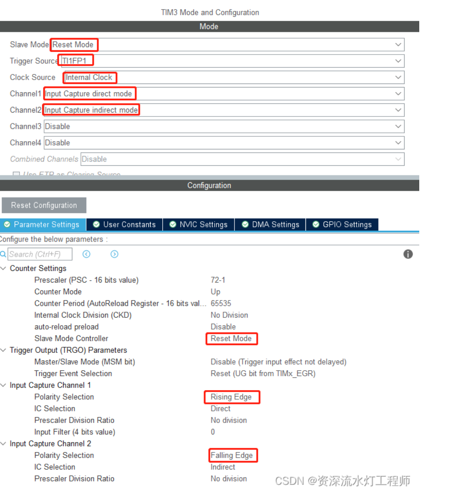

#### 定时器PWM配置

在Pinout&Configuration -> Timers -> TIM1

- 勾选 Internal Clock，开启 TIM1 的内部时钟源

- Configuration -> Mode，将 Channel1配置为 PWM Generation CH1

- Configuration -> Parameter Settings -> Counter Settings，将 Prescaler 配置为 72-1，将 Counter Period （重装载值）配置为 100-1，使PWM频率为10kHz

- 设置PWM Generation CH1的Pulse（32bit），占空比=这里的值/重装载值

  > PWM频率 = 72MHz ÷ 72 ÷ 100 = 10 kHz

#### ADC 规则通道单通道采集

配置引脚功能，ADC1——>IN11——>IN11 Single-ended，配置ADC1 11通道采集

如果只是基本使用，ADC_Settings不需要修改。

#### I2C配置

软件模拟iic，使用两个 GPIO 口来模拟 SCL 时钟线和 SDA 数据线，编写 I2C 读和写时序逻辑，

+ SCL线用于输出时钟信号，可以配置为推挽或者开漏输出；SDA 线必须要配置为开漏输出，因为 SDA 线要作为输入扫描 功能，如果配置为推挽输出，当要实现输入扫描检测时，会受到输出电路没有关闭的影响，之前的输出电平还是存在，造成输入电路和输出电路的短接，可能会损坏芯片；而配置为开漏输 出时，当要作为输入检测时，SDA 输出逻辑 1，P-MOS 关闭，输出电路开路，不会对输入电路产生影响。

硬件iic：（待写）

#### UART串口通信配置

轮询使用配置引脚即可，例：PA9 –>USART1_Tx，PA10 –> USART1_RX,选择同步或异步。asynchronous 异步的 synchronous 同步的
该情况下会阻塞程序运行，所以一般开启中断。一般选择异步通信。

串口中断模式需要打开NVIC中断，串口DMA模式需要打开DMASettings，手动点击Add添加DMA通道，根据需求配置DMA，配置完后需要修改NVIC。

#### RTC时钟配置

RTC使用时不用关注其引脚分配以及设置，只要使用CubeMX配置即可。勾选Active Clock Source和Active Calendar，配置Calendar time，设置基本时间日期。

设置RTC_PRER寄存器中的同步预分频器和异步预分频器，把时钟的频率设置为1HZ。(同步异步分频相乘要为输入的时钟频率)

日期设置时需要注意：year字段其值只能由0-255，因此如果需要表示年，那么年份前面的两位数字我 们可以自己设置，而不需要再借助CubeMX了。例如：当我们需要设置年份为2023年时，可以在CubeMX中 将year字段设置成23，每次读取完成后就手动加上20即可。（可以使用sprintf函数）

## 四、嵌入式基础

### 1.TIM定时器

定时器工作频率=外部总线频率/(PSC+1)
定时频率 = 定时器工作频率/counter（ARR） = 外部总线频率/((psc+1)*counter-1)
计数器计数频率：CK_CNT = CK_PSC / (PSC + 1)
计数器溢出频率：CK_CNT_OV = CK_CNT / (ARR + 1)= CK_PSC / (PSC + 1) / (ARR + 1)

定时器的从模式：经过触发输入选择器而连接到从模式控制器，从而使得计数器的工作受到从模式控制器的控制或影响

定时器自身输入通道1或通道2的输入信号，经过极性选择和滤波以后生成的触发信号，连接到从模式控制器，进而控制计数器的工作；顺便提醒下，来自通道1的输入信号经过上升沿、下降沿双沿检测而生成的脉冲信号进行逻辑相或以后的信号就是TI1F_ED信号，即TI1F_ED双沿脉冲信号。

外部触发脚[ETR脚]经过极性选择、分频、滤波以后的信号，经过触发输入选择器，连接到从模式控制器。

1、复位模式 【Reset mode】

2、触发模式 【Trigger mode】

3、门控模式 【Gate mode】

4、外部时钟模式1 【External clock mode 1】

5、编码器模式 【encode mode】

输入捕获测量占空比原理：

1. 信号从某个通道输入，比如通道1（CH1）；经过滤波和边沿检测后产生两个一模一样的信号TI1FP1和TI1FP2，TI1FP1送给捕获通道IC1，TI1FP2送给捕获通道IC2；
2. 定时器设置为复位模式，将TI1FP1作为复位触发信号，将捕获通道IC1设置为上升沿触发，这样每当TI1FP1上升沿到来的时候，就将定时器复位；当首次检测到TI1FP1的上升沿，定时器复位，计数器CNT的值为0；
3. IC2设置为下降沿触发，当TI1FP2的下降沿到来时，CCR2记录CNT寄存器此时的值X；
   当IC1再次检测到TI1FP1上升沿的时候，CCR1记录CNT此时CNT寄存器的值Y；
4. X可以理解为高电平持续的时间，Y可以理解为整个信号的周期，X/Y就是信号的占空比了。
5. 基本思想就是让两个捕获通道来检测同一个信号，捕获通道IC1检测信号的上升沿，捕获通道IC2检测信号的下降沿，第一个上升沿来复位定时器，第二个上升沿来记录信号的周期值。

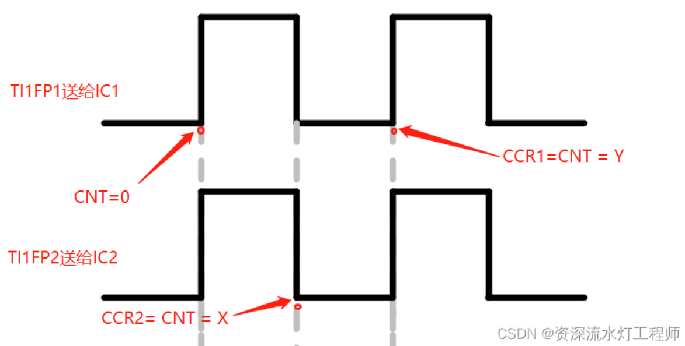

### 2.ADC

模拟信号采样成数字信号

ADC 转换采样率（采样率）：是指完成一次从模拟量转换成数字量时 ADC 所用的时间的倒 数，即每秒从连续信号中提取并转换成离散数字量的信号个数。也就是 1/ TCONV

ADC分辨率：使用一个 16 位的 ADC 去采集一个 10V 的满量程信号（假设此 ADC 能测量 10V 的电压信号，即输入电压为 10V），这个 16 位的 ADC 满刻度（最大值） 时的数字量为 2^16=65536，当 AD 的数字量为 65536 时表示采集到了 10V，当 AD 的数字量为 256 时，表示采集到了 10V* 256 /65536 =0.0391V，此 ADC 的分辨率是10V ∗ 1 /65536 。

转换时间：T~CONV~ = 采样时间（TSMPL） + 逐次逼近时间（TSAR）
逐次逼近时间（TSAR）是由分辨率决定的。

ADC 的位数越高，其分辨率就越高。可通过降低分辨率来缩短转换时间，因为转换时间缩短，我们可以做到的采样率就越高。

ADC 输入范围：VREF– ≤ VIN ≤ VREF+。通常为0-3.3v

当有多个通道需要采集信号时必须开启扫描模式，此时 ADC 将会按设定的顺序轮流采集各通道信号，单通道转换不需要使用此功能。

+ 单端输入：单端输入只有一个输入引脚 ADCin，同时使用公共地 GND 作为电路的返回端，ADC 的采 样值:V~ADC~=V~ADCin~ -V~GND~。
+ 差分输入：差分输入比单端输入多了一根线，ADC 采样值: V~ADC~ =V~ADCin+~-V~ADCin-~。

在 ADC 的 20 个多路复用模拟通道中，可以分为**规则通道组**（也可以称为常规通道组）和**注入通道组**。规则通道组最多可以安排 16 个通道，注入通道组最多可以安排 4 个通道。我们一般使用的是规则通 道，而注入通道可以以抢占式的方式打断规则通道的采样。

转换序列：一个常规转换组最多由 16 个转换构成。一个注入转换组最多由 4 个转换构成。常规转换必须在 ADC_SQRy（y 为 1~4）寄存器中选择转换序列的常规通道及其顺序，转换总数必须写入 ADC_SQR1 寄存器中的 L[3:0]位。注入转换必须在 ADC_JSQR 寄存器中选择转换序列的注入 通道及其顺序，转换总数必须写入 ADC_JSQR 寄存器中的 JL[1:0] 位。注入通道的转换可以打断常规通道的转换， 在注入通道被转换完成之后，常规通道才得以继续转换。

以规则转换为例，以一个寄存器来说明，例如，ADCx_SQR1 寄存器的 SQ1[4:0] 控制着规则序列中的第 1 个转换，SQ4[4:0]控制着规则序列的第 4 个转换，如果通道 8 想在第 3 个转换，则在 SQ3[4:0]写入 8 即可，其它的寄存器也类似。

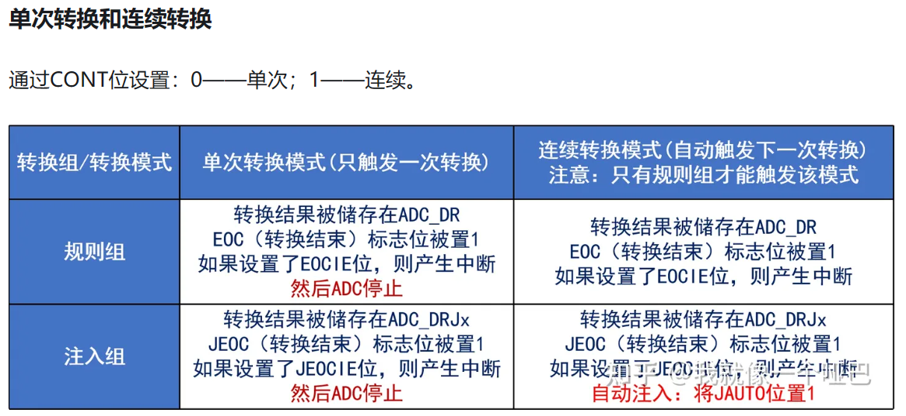

End Of Conversion Selection 用于配置转换方式结束选择，可选择单通道转换完成后 EOC 标志位置位或者所有通道转换成后 EOC 置位，也可以选择转换序列结束后 EOS 置位（配置为 End of sequence of conversion）

### 3.I2C

I2C多用于板间芯片数据通信，是由数据线 SDA 和时钟线 SCL 构成的串行总线，可发送和接收数据。

I2C 总线有如下特点：
1. 总线由串行数据线 SDA 和串行时钟线 SCL 构成，数据线用来传输数据，时钟线用来同 步数据收发。
2. I2C 设备都挂接到 SDA 和 SCL 这两根线上，总线上每一个设备都有一个唯一的地址识 别，即器件地址，所以 I2C 主控制器就可以通过 I2C 设备的器件地址访问指定的 I2C 设备。 
3. 数据线 SDA 和时钟线 SCL 都是双向线路，都通过一个电流源或上拉电阻连接到正的电 压，所以当总线空闲的时候，这两条线路都是高电平状态。 
4. 总线上数据的传输速率在标准模式下可达 100kbit/s ，在快速模式下可达 400kbit/s，在高速模式下可达 3.4Mbit/s
5. 总线支持设备连接，在使用 I2C 通信总线时，可以有多个具备 I2C 通信能力的设备挂载 在上面，同时支持多个主机和多个从机。

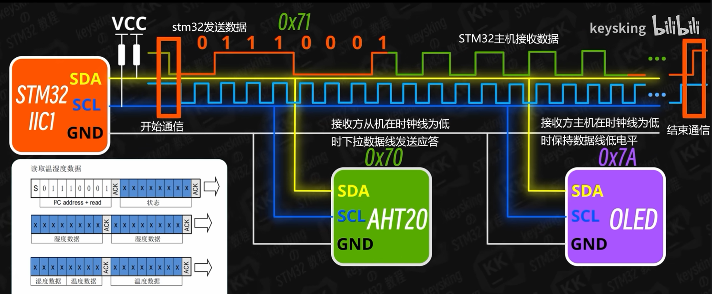

只有主机在发送开始和结束信号时，才会在时钟线为高时控制数据线。

起始位：在 SCL 为高电平期间，SDA 出现下降沿时就表示起始位，起始信号是一种电平跳变时序信号，而不是一个电平信号。

停止位：当 SCL 为高电平期间，SDA 出现上升沿就表示为停止位，停止信号是一种电平跳变时序信号，而不是一个电平信号。

数据传输：在 SCL 串行时钟的配合下，在 SDA 上逐位地串行传送每一位数据。I2C 总线通过 SDA 数据线来传输数据，通过 SCL 时钟线进行数据同步，SDA 数据线在 SCL 的每个时钟周期传输一位数据。I2C 总线进行数据传送时，SCL 为高电平期间，SDA 上的数据有效；SCL 为低电平期间， SDA 上的数据无效。

空闲状态：I2C 总线的 SDA 和 SCL 两条信号线同时处于高电平时，规定为总线的空闲状态。

应答信号为SDA低电平，非应答信号为SDA高电平。

写时序：主机发送起始信号，主机接着发送送从机地址+0(写操作位) 组成的 8bit 数据，对应设备地址的从机就会发出应答信号，主机向从机发送数据包，大小为8bit。主机每发送完一个字节数据，都要等待从机的应答信号。当主机向从机发送一个停止信号时，数据传输结束。

读时序：主机发出起始信号，接着发送 从机地址+1(读操作位) 组成的 8bit 数据，对应设备地址的从机就会发出应答信号，并向主机返回 8bit 数据，发送完之后从机就会等待主机的应答信号。假如主机一直返回应答信号，那么从机可以一直发送数据，直到主机发出**非应答信号**，从机才会停止发送数据，当主机发出**非应答信号**后，紧接着主机会发出停止信号，停止 I2C 通信。

### 4.DMA

DMA：直接存储器访问，作用是实现数据的直接传输，避免占用过多的CPU资源

DMA 配置参数包括：通道地址、优先级、数据传输方向、存储器/外设数据宽度、存储器/ 外设地址、数据传输量等。

### 5.RTC

RTC本质上是一个独立的定时器，通常情况下需要外接一个32.768KHZ的晶振和匹配电容（10~33pf），由于时间是不停止的，为了满足这一要求，所以RTC实时时钟有两种供电方式：

1）在设备正常运行的时候，RTC实时时钟模块是由MCU主电源进行供电。

2）在主电源停止供电的时候，RTC实时时钟由备份电源（纽扣电池）来进行供电，保证当MCU停止供电的情况下，RTC不受影响，保持正常工作。

实时时钟（RTC）模块是一个独立的BCD码定时器/计数器，除了可以正常的提供日历功能外，还可以对MCU进行唤醒。并且在MCU复位后，RTC的寄存器是不允许正常访问的（无法对RTC寄存器进行写操作，但可以进行读操作寄存器）。

**特性：**
（1）可以直接提供，秒，分钟，小时（12/24小时制）、星期几、日期、月份、年份的日历

（2）具有闹钟功能，并且可以对闹钟进行日期编程。

（3）具有自动唤醒单元，可以周期性的更新事件显示

（4）RTC模块的中断源为：闹钟A，闹钟B，唤醒，时间戳以及入侵检测

（5）RTC模块具有独立备份区域，可以对发生入侵事件的时间进行保存。

**RTC写保护**

1. 在系统复位后，需要把电源控制寄存器（PWR_CR）的DBP位置1，以使能RTC寄存器的写访问。

2. 上电复位后，需要通过向写保护寄存器（RTC_WPR）写入0XCA和0x53,来解除寄存器的写保护，写入一个错误的数值（除了0xCA和0x53）会再次激活写保护。

**日历初始化和配置**

1. 首先需要把初始化状态寄存器（RTC_ISR）中的INIT位置1，进入初始化模式，在此模式下，日历计数器将停止工作并且寄存器中的值是可以被更新的。

2. 配置为初始化模式后，RTC寄存器不能立即进入初始化状态，所以在配置为初始化模式后，必须轮询等待初始化寄存器（RTC_ISR）中的INIT位置1，才可以更新时间和日期。

3. 设置RTC_PRER寄存器中的同步预分频器和异步预分频器，把时钟的频率设置为1HZ。(同步异步分频相乘要为输入的时钟频率)

4. 设置RTC_TR,RTC_DR寄存器中的时间和日期，并在RTC_CR寄存器中的FMT位设置时间的格式（12小时制或24小时制）

5. 对初始化寄存器（RTC_ISR）中的INIT位清0则退出初始化模式，当初始化模式序列完成后，日历开始计数。

**RTC闹钟配置**

1. 把控制寄存器（RTC_CR）中的闹钟A和闹钟B的使能位清零，关闭闹钟A和闹钟B。

2. 轮询等待初始化状态寄存器（RTC_ISR）寄存器中的闹钟写入标志位置1，进入闹钟的编程模式。

3. 根据需要，对闹钟A寄存器（RTC_ALRMAR）和闹钟B寄存器（RTC_ALRMBR）的闹钟值和产生闹钟的条件进行编译。

4. 把控制寄存器（RTC_CR）中的闹钟A（ALRAE）和闹钟B（ALRBE）的使能位置1，使能闹钟A和闹钟B。

5. 设置闹钟中断。

6. 编写闹钟中断服务函数。

**读取日历**

由于日历和时间寄存器都存在影子寄存器，所以在读取时间和日历值之前，必须保证影子寄存器的数据和上层寄存器的值同步（等待日历和时间标志位被置1，RTC_ISR[5]）,才能读取时间和日历寄存器。


## 五、BSP适用于蓝桥杯嵌入式开发板的函数

### 0.头文件写法示意.h

可以创建一个include.h头文件，将所有本工程需要的头文件和全局变量（extern）写在里面。

```c
#ifndef _LED_H_
#define _LED_H_

#include "main.h"//包含main.h以包含hal库文件

void LED_Dis(unsigned char dsLED);
void LED_Init(void);
	
#endif
```
### 1.led.c

硬件原理图：

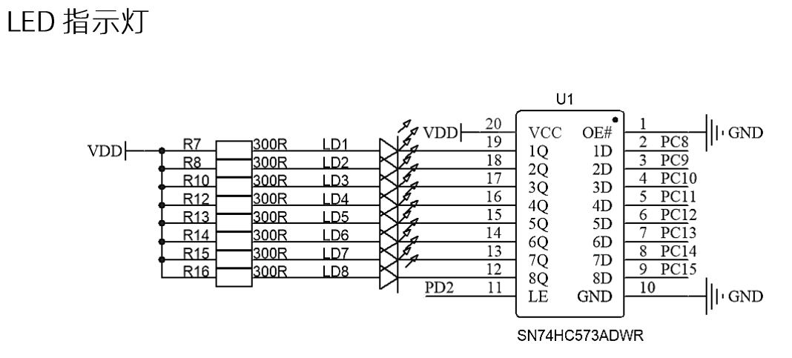

```c
#include "led.h"

void LED_Dis(unsigned char dsLED)//同时控制8位LED灯的状态
{
	HAL_GPIO_WritePin(GPIOC,GPIO_PIN_All,GPIO_PIN_SET);
	HAL_GPIO_WritePin(GPIOC,dsLED<<8,GPIO_PIN_RESET);
	HAL_GPIO_WritePin(GPIOD,GPIO_PIN_2,GPIO_PIN_SET);//PD2 打开锁存器
    HAL_GPIO_WritePin(GPIOD,GPIO_PIN_2,GPIO_PIN_RESET);//PD2 关闭锁存器 
    //锁存器的作用为 使得锁存器输出端的电平一直维持在一个固定的状态
}//pc8-15 led 控制亮灯 0x01亮led1

void LED_Init()//LED初始化灭灯
{
	HAL_GPIO_WritePin(GPIOC,GPIO_PIN_All,GPIO_PIN_SET);
	HAL_GPIO_WritePin(GPIOD,GPIO_PIN_2,GPIO_PIN_SET);
    HAL_GPIO_WritePin(GPIOD,GPIO_PIN_2,GPIO_PIN_RESET);
}//LED上电灭灯（高电平灭灯，低电平亮灯）

/*另外一种LED写法*/
#define LED_GPIO_Pin GPIO_PIN_8|GPIO_PIN_9|GPIO_PIN_10|GPIO_PIN_11|GPIO_PIN_12|GPIO_PIN_13|GPIO_PIN_14|GPIO_PIN_15
#define LED_GPIO_Pin_Odd       GPIO_PIN_8|GPIO_PIN_10|GPIO_PIN_12|GPIO_PIN_14
#define LED_GPIO_Pin_Even      GPIO_PIN_9|GPIO_PIN_11|GPIO_PIN_13|GPIO_PIN_15

enum LEDLOCATION {LED1=GPIO_PIN_8, LED2=GPIO_PIN_9, LED3=GPIO_PIN_10, LED4=GPIO_PIN_11,
				  LED5=GPIO_PIN_12, LED6=GPIO_PIN_13, LED7=GPIO_PIN_14, LED8=GPIO_PIN_15,
				  LEDS = LED_GPIO_Pin,LEDODD = LED_GPIO_Pin_Odd,LEDEVEN = LED_GPIO_Pin_Even};//枚举变量
//如果想在其他的.c文件中调用下面的函数，枚举类型的定义应该放在.h文件里，并进行include包含

void led_display(enum LEDLOCATION LEDLOCATION,char LEDSTATE)//控制单个或几个LED状态，0表示关闭，1表示打开
{
	HAL_GPIO_WritePin(GPIOC,LEDLOCATION,(LEDSTATE==1?GPIO_PIN_RESET:GPIO_PIN_SET));
	HAL_GPIO_WritePin(GPIOD, GPIO_PIN_2, GPIO_PIN_SET);
	HAL_GPIO_WritePin(GPIOD, GPIO_PIN_2, GPIO_PIN_RESET);	
}

void rollbackLedByLocation(enum LEDLOCATION LEDLOCATION)//根据LED的位置反转LED的状态
{
	HAL_GPIO_TogglePin(GPIOC,LEDLOCATION);
	HAL_GPIO_WritePin(GPIOD, GPIO_PIN_2, GPIO_PIN_SET);
	HAL_GPIO_WritePin(GPIOD, GPIO_PIN_2, GPIO_PIN_RESET);
}
```

> [!WARNING]
> 由于LCD与LED的部分引脚是重合的，初始化完成LCD后，还需要强制关闭LED；操作完LCD，再次操作LED时需要重置所有LED的状态，不然 LED的工作状态就会出现问题；
> 每次使用LED时一定要记得将PD2拉高拉低，也就是打开关闭锁存器；

使用上面的`led_display`、`rollbackLedByLocation`时需要注意将`LED_Init`写在`LCD_Init`，不然显示效果会出问题，同时参照下节lcd.c中修改官方库函数，在LCD刷新前保存GPIOC->ODR的值。

```c
void LED_Control(int LED_Num, int LED_State)
{
	static unsigned char LED = 0xFF; //默认是全灭的状态
	
	if(LED_Num > 8 || LED_Num < 1) return; //LED 编号不合法
	
	if(LED_State == 1) //点亮某颗灯
	{
		LED &= ~(1 << (LED_Num - 1));
	}
	else //关闭某颗等
	{
		LED |= (1 << (LED_Num - 1));
	}
	
	GPIOC -> ODR = (LED << 8);
	HAL_GPIO_WritePin(GPIOD, GPIO_PIN_2, 1);
	HAL_GPIO_WritePin(GPIOD, GPIO_PIN_2, 0);
}
```


### 2.lcd.c

该部分函数来自蓝桥杯官方LCD驱动库。
LCD屏幕显示一共分为9行,Line1~Line9。在官方库函数中已经完成了对所涉及引脚的GPIO的初始化。不需要自己设置。
在屏幕上正常显示内容需要以下几行：

```c
LCD_Init();
LCD_Clear(Black);//清屏，颜色选择需要的背景色
LCD_SetTextColor(White);//设置字体颜色
LCD_SetBackColor(Black);//设置背景色
```
下面两行代码需要放在主循环前运行，否则会导致屏幕闪屏
```c
LCD_Init();
LCD_Clear(Black);//清屏，颜色选择需要的背景色，闪屏问题大多由这句引起
```
```c
void LCD_DisplayChar(u8 Line, u16 Column, u8 Ascii);//显示字符
void LCD_DisplayStringLine(u8 Line, u8 *ptr);//显示字符串
```

LCD屏幕的宽度是0~319，一个字符占到了16.将一个字符‘a’显示在第一行第一列需要这么写：

```c
LCD_DisplayChar(Line0, 319 - 16, 'a');
//最常用的显示示例
char text[30];
sprintf(text,"    PA6:%d       ",__HAL_TIM_GetCompare(&htim16,TIM_CHANNEL_1));
LCD_DisplayStringLine(Line1,(uint8_t *)text);
```

LCD_DisplayChar接收的是Ascaii码，如果需要显示数字，可以在数字加上48，也可以加上‘0’，进行字符转换。

LCD与LED存在显示冲突问题。

由于LCD与LED有部分共同引脚，因此LCD刷新显示时会对LED显示会变得紊乱。这是由于LCD刷新时 修改 GPIOC->ODR 寄存器，所以只要在LCD显示前保存LCD刷新前保存GPIOC->ODR 寄存器的值即可。经过查找，官方提供的驱动中，LCD最低层代码分别为下面三函数，因此，只要修改该三函数即可：

```c
void LCD_WriteReg(u8 LCD_Reg, u16 LCD_RegValue);
void LCD_WriteRAM_Prepare(void);
void LCD_WriteRAM(u16 RGB_Code);
```

修改样例

```c
void LCD_WriteReg(u8 LCD_Reg, u16 LCD_RegValue)
{
 // 保存目前GPIOC的值
	uint16_t temp = GPIOC->ODR;//添加这句
 
 	GPIOB->BRR  |= GPIO_PIN_9; 
 	GPIOB->BRR  |= GPIO_PIN_8; 
 	GPIOB->BSRR |= GPIO_PIN_5; 
 
 	GPIOC->ODR = LCD_Reg;
 	GPIOB->BRR  |= GPIO_PIN_5;
 	__nop();
	 __nop();
 	__nop(); 
 	GPIOB->BSRR |= GPIO_PIN_5;
 	GPIOB->BSRR |= GPIO_PIN_8;
 	
 	GPIOC->ODR = LCD_RegValue;
 	GPIOB->BRR  |= GPIO_PIN_5;
 	__nop();
 	__nop();
 	__nop();  
 	GPIOB->BSRR |= GPIO_PIN_5;
 	GPIOB->BSRR |= GPIO_PIN_8;
 
 // 恢复以前保存GPIOC的值
 GPIOC->ODR = temp;//添加这句
}
```
> [!NOTE]
> 简单来说，需要在官方提供的屏幕驱动函数有关write的部分头尾分别添加`uint16_t temp = GPIOC->ODR;` `GPIOC->ODR = temp;`两句代码，在主程序中，如果对LCD进行刷屏操作，会导致有关的LED端口被修改，如果不修改此部分，LED代码总是要对8路GPIO端口进行同时控制。

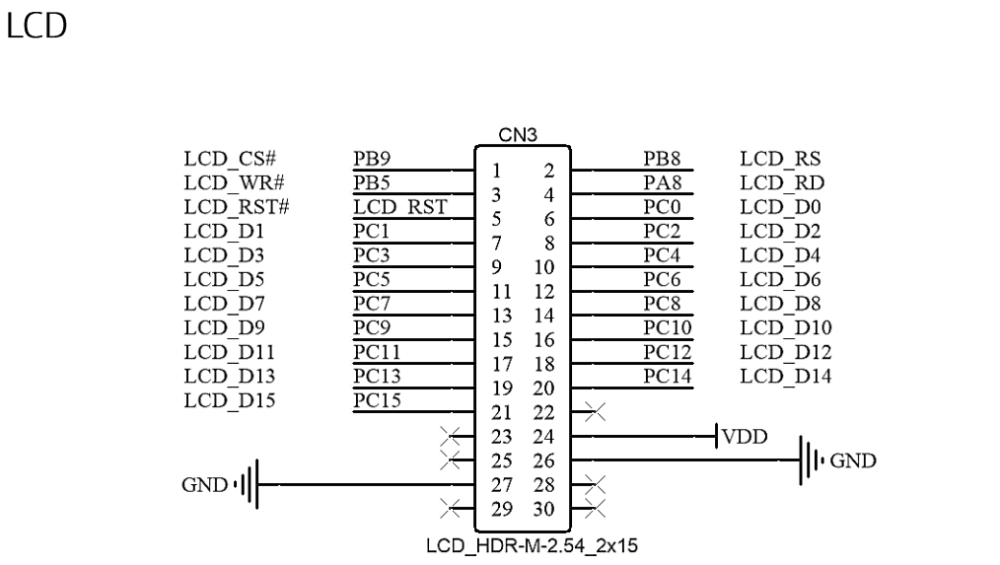

### 3.key.c

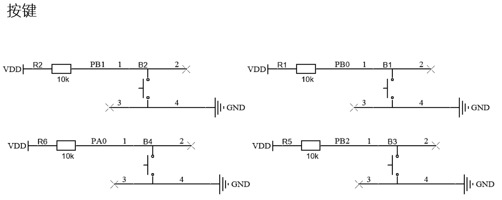

按键扫描，含按键消抖
```c
unsigned char scanKey(void)
{
 //按键锁
 static unsigned char keyLock = 1;
    //记录按键消抖时间
    // static uint16_t keyCount = 0;
 //按键按下
    if((HAL_GPIO_ReadPin(GPIOB,GPIO_PIN_0) == RESET ||
HAL_GPIO_ReadPin(GPIOB,GPIO_PIN_1) == RESET
 || HAL_GPIO_ReadPin(GPIOB,GPIO_PIN_2) == RESET ||
HAL_GPIO_ReadPin(GPIOA,GPIO_PIN_0) == RESET)
      && keyLock == 1){
        //给按键上锁 避免多次触发按键
        keyLock = 0;
        
        //按键消抖 这里最好不要使用延时函数进行消抖 会影响系统的实时性
        // if(++keyCount % 10 < 5) return 0;
        // if(HAL_GetTick()%15 < 10) return 0;
        HAL_Delay(10);
        //按键B1
        if(HAL_GPIO_ReadPin(GPIOB,GPIO_PIN_0) == RESET){
            return 1;
       }
        //按键B2
        if(HAL_GPIO_ReadPin(GPIOB,GPIO_PIN_1) == RESET){
            return 2;}
        //按键B3
        if(HAL_GPIO_ReadPin(GPIOB,GPIO_PIN_2) == RESET){
            return 3;
       }
        //按键B4
        if(HAL_GPIO_ReadPin(GPIOA,GPIO_PIN_0) == RESET){
            return 4;
       }
   }
    //按键松开
    if((HAL_GPIO_ReadPin(GPIOB,GPIO_PIN_0) == SET &&
HAL_GPIO_ReadPin(GPIOB,GPIO_PIN_1) == SET
      && HAL_GPIO_ReadPin(GPIOB,GPIO_PIN_2) == SET &&
HAL_GPIO_ReadPin(GPIOA,GPIO_PIN_0) == SET)
      && keyLock == 0){
        //开锁
        keyLock = 1;
   }
    return 0;
}
```
另一种更方便的写法：

```c
// 声明获取按键的状态值
#define getKeysState()    (	HAL_GPIO_ReadPin(GPIOB,GPIO_PIN_0) << 0 | HAL_GPIO_ReadPin(GPIOB,GPIO_PIN_1) << 1 |    \
						    HAL_GPIO_ReadPin(GPIOB,GPIO_PIN_2) << 2 | HAL_GPIO_ReadPin(GPIOA,GPIO_PIN_0) << 3      )
//按下时GPIO电平为0，松开为1，在下面按键状态中，定义状态1为触发信号，所以key_temp对state低四位进行取反

uint8_t keypressing;//单次按下的键值
uint8_t keyrising;//单次松开的键值
uint8_t keyoldstate;//中间变量，存放上次键值用于下次的键值判断

void key_refresh(){
	//获取按键状态
	uint8_t state = getKeysState();//将4位数据变8位数据，高四位无效数据为0
	//对按键值进行异或处理，逻辑运算实现消抖
	uint8_t key_temp = 0xFF ^ (0xF0 | state);//或运算再走异或运算，高四位为0，低四位取反state
	// 用于判断按键是否新被按下 非0-表示按下 0-表示松开
	keypressing = key_temp & (key_temp ^keyoldstate);
    // 用于判断按键是否新被松开 非0-表示按下 0-表示松开
	keyrising = ~key_temp & (key_temp ^keyoldstate);
	//保存本次按键的值
	keyoldstate = key_temp;
}
```

该种写法的示例程序：

```c
uint32_t uwKey_Tick;//用来存储时间戳数据
uint8_t keytick=0;//双击功能计数
static void keypro(void)//短按按键程序，需要放在while中运行
{
	key_refresh();//按键扫描
    //if(keypressing == 8){uwKey_Tick = HAL_GetTick();}如果需要按键长按，此句用于按键B4长按，获取按下时的时间戳
	switch(keyrising)//按键松开触发
	{
		case 1://按键B1
			break;
		case 2://按键B2
			break;
		case 4://按键B3
             /*keytick++;//双击计数
			if(keytick==1){uwKey_doubleTick = HAL_GetTick();}//第一次松开按键记录时间
			if(keytick==2 && HAL_GetTick()-uwKey_doubleTick < 500){//记录到两次松开并且间隔在500ms以内
				keytick=0;//清零计数
				key_two_flag ^=1;//双击逻辑代码
			}else if(keytick == 2){keytick=0;}//双击没有被触发*/
			break;
		case 8:// 按键B4
            /*if(HAL_GetTick() - uwKey_Tick > 2000){//松开按键时的时间戳减去按下按键时的时间戳大于2000ms
				lock = 1;//长按键逻辑代码
			}else{
				lock = 0;}//短按键逻辑代码*/
			break;
		default:// 其他
			break;
	}
}
```
### 4.tim.c

```c
HAL_TIM_Base_Start(&htim2);//开启定时器
HAL_TIM_Base_Stop(&htim2);//关闭定时器

/*更新中断示例*/
HAL_TIM_Base_Start_IT(&htim3);//开启定时器并开启定时器中断
void HAL_TIM_PeriodElapsedCallback(TIM_HandleTypeDef *htim)//定时器中断回调函数，需要在函数内部区分定时器
    if(htim->Instance==TIM3){//定时器中断来源判断
        逻辑语句
    }
	if (htim == &htimx){//定时器中断来源判断
        逻辑语句
    }
}

/*PWM使用示例，PA1-TIM2CH2*/
HAL_TIM_PWM_Start(&htim16,TIM_CHANNEL_1);//PWM开启输出
char text[30];
sprintf(text,"    PA6:%d       ",__HAL_TIM_GetCompare(&htim16,TIM_CHANNEL_1));
LCD_DisplayStringLine(Line1,(uint8_t *)text);
extern TIM_HandleTypeDef htim16;//在其他文件使用包含此句声明
PA6_DUTY=__HAL_TIM_GetCompare(&htim16,TIM_CHANNEL_1);//获取PWM占空比
__HAL_TIM_SetCompare(&htim16,TIM_CHANNEL_1,PA6_DUTY+=10);.//改变PWM占空比

/*555芯片输出波形输入捕获示例*/
char buf[64] = {0};
HAL_TIM_IC_Start_IT(&htim2, TIM_CHANNEL_1);//开启定时器输出捕获
HAL_TIM_IC_Start_IT(&htim3, TIM_CHANNEL_1);
uint32_t  f39 = 0, f40 = 0; //TIM2_CH1，TIM3_CH1
uint32_t  cc1_value = 0;
void HAL_TIM_IC_CaptureCallback(TIM_HandleTypeDef *htim)
{
	cc1_value = __HAL_TIM_GET_COUNTER(htim);
    //cc1_value = __HAL_TIM_GetCounter(htim);//与上一行函数等价
    //cc1_value=HAL_TIM_ReadCapturedValue(htim,TIM_CHANNEL_1);//与上一行函数等价
	__HAL_TIM_SetCounter(htim,0);
	
	if(htim == &htim2) //定时器2,PA15,R40
	{
		f40 = 1000000/cc1_value;
	}
	
	if(htim == &htim3) //定时器3,PB4,R39
	{
		f39 = 1000000/cc1_value;//1000000=80Mhz/80分频（设置80-1）
	}
}
sprintf(buf , "TIM2(R40): %dHz   ", f40);
LCD_DisplayStringLine(Line2, (uint8_t *)buf);//捕获频率显示		
sprintf(buf , "TIM3(R39): %dHz    ", f39);
LCD_DisplayStringLine(Line3, (uint8_t *)buf);

/*输入捕获占空比测量示例，使用定时器从模式复位模式，触发源选择定时器2通道一上升沿触发复位，通道二2配置下降沿触发*/
uint32_t  CCR1_Cnt = 0;uint32_t  CCR2_Cnt = 0;//不能放在回调函数里，否则无法测量占空比
void HAL_TIM_IC_CaptureCallback(TIM_HandleTypeDef *htim)//输入捕获回调函数//TIM2,PA15,R40 J10
{
	extern double freq;extern float duty;//定义频率和占空比变量
if(htim == &htim2 && htim->Channel == HAL_TIM_ACTIVE_CHANNEL_1) //通道一上升沿捕获   
	{
		CCR1_Cnt = HAL_TIM_ReadCapturedValue(&htim2,TIM_CHANNEL_1);
		freq = 1000000/CCR1_Cnt;//80Mhz/80/计数值
		duty = (float)(CCR2_Cnt+1)*100 / (CCR1_Cnt+1);//ccr2cnt相当于高电平持续时间，ccr1cnt相当于周期
		//__HAL_TIM_SetCounter(htim,0);定时器从模式设定为复位模式，通道一上升沿触发复位，所以不用这句，如若不使用定时器从模式复位模式，则一定要此句
	}
	if(htim == &htim2 && htim->Channel == HAL_TIM_ACTIVE_CHANNEL_2)//通道二下降沿捕获
	{
		CCR2_Cnt = HAL_TIM_ReadCapturedValue(&htim2,TIM_CHANNEL_2);
	}
}
```

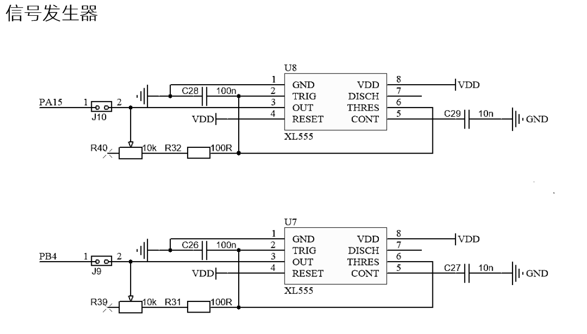

### 5.b-adc.c

因为adc.c文件由CubeMX生成,所以编写自己的程序不要创建adc.c

R37与PB15直接相连接，位于ADC2的通道IN15
R38与PB12直接相连接，位于ADC1的通道IN11

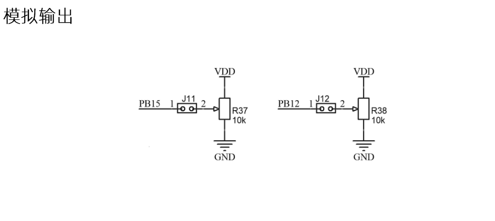

获取ADC通道值的样例(单次转换模式)

在while循环中执行该函数可实现转动旋钮改变获取的ADC值

```c
extern ADC_HandleTypeDef hadc1;
double getADC(ADC_HandleTypeDef *hadc)
{
 unsigned int value = 0;//至少需要uint16_t，uint8_t位数不够
 
 //开启转换ADC并且获取值
 HAL_ADC_Start(hadc);
 HAL_ADC_PollForConversion(hadc,10);//等待转换完成
 value = HAL_ADC_GetValue(hadc);

 //ADC值的转换 3.3V是电压 4096是ADC的精度为12位也就是2^12=4096
 return value*3.3/4096;
}
```
获取ADC多通道值的样例(单次转换模式)

```c
void getManyADC(ADC_HandleTypeDef *hadc,double*data,int n)
{
 int i=0;
 for(i=0;i<n;i++)
 {
     HAL_ADC_Start(hadc);
     //等待转换完成，第二个参数表示超时时间，单位ms
     HAL_ADC_PollForConversion (hadc,10);
     data[i] = ((double)HAL_ADC_GetValue(hadc)/4096)*3.3;
     }
     HAL_ADC_Stop(hadc);
}
```

### 6.i2c_hal.c

PB6——SCL；PB7——SDA

配置IIC PB6,PB7为GPIO OutPut，在主程序里调用I2CInit();

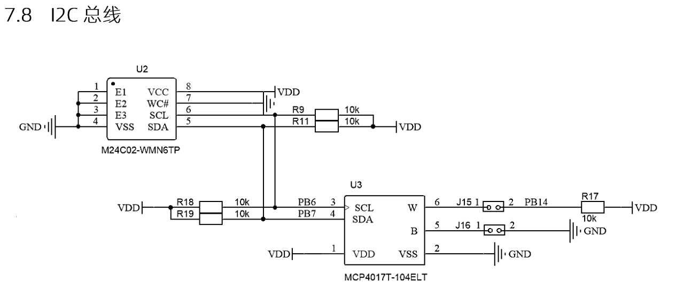

ATC02的示例代码：

```c
uint8_t ATC02_read(uint8_t addr)//从存储芯片内指定地址读取值
{
	uint8_t data;
	I2CStart();
	I2CSendByte(0xA0);//从机地址1010 000 1读0xa1，1010 000 0写0xa0
	I2CWaitAck();
	I2CSendByte(addr);//addr,存储芯片内部地址
	I2CWaitAck();
	I2CStop();
	
	I2CStart();
	I2CSendByte(0xa1); 
	I2CWaitAck();//等待从机下拉SDA发送的响应
	data=I2CReceiveByte();
	I2CSendNotAck();//主机模拟从机下拉SDA发送非应答响应表示停止继续接收
	I2CStop();
	return data;
}

//向指定从机的指定地址写入数据
void ATC02_write(uint8_t addr,uint8_t data)
{
	I2CStart();
	I2CSendByte(0xa0);//与指定从机通信
	I2CWaitAck();
	I2CSendByte(addr);//发送需要写入数据的存储地址
	I2CWaitAck();
	I2CSendByte(data);
	I2CWaitAck();
	I2CStop();
}

void i2c_mcp4017_write(uint8_t value){
	I2CStart();
	I2CSendByte(0x5e);//根据芯片手册，0x5e是写
	I2CWaitAck();
	
	I2CSendByte(value);
	I2CWaitAck();
	I2CStop();
}

uint8_t iic_mcp4017_read(void)
{
	uint8_t value;
	
	I2CStart();
	I2CSendByte(0x5f);
	I2CWaitAck();
 	
	value = I2CReceiveByte();
	I2CSendNotAck();
	I2CStop();
	
	return value;
}

//写入读取16位数据案例
I2CInit();
Key_Value = Key_Scan();
if(Key_Value == 3) //B3按下
{//frq1为uint16型
	uint8_t frq1_h=frq1>>8;//取高八位
    	//uint8_t frq1_h=frq1/256;//取高八位 等价写法
	uint8_t frq1_l=frq1&0xff;//取低八位
    	//uint8_t frq1_l=frq1;//取低八位 等价写法
    	//uint8_t frq1_l=frq1%256;//取低八位
	ATC02_write(1,frq1_h);
	HAL_Delay(10);//需要一定的延迟以便写入读出数据
	ATC02_write(2,frq1_l);
	HAL_Delay(10);
	char text[30];
	uint16_t eep_tmp=(ATC02_read(1)<<8)+ATC02_read(2);
	sprintf(text,"    ATC02=%d   ",eep_tmp);
	LCD_DisplayStringLine(Line9, (uint8_t *)text);
}

//读写MCP4017T（0-100K，写入范围0-127）
uint8_t text[30];
i2c_mcp4017_write(0X7F);
//HAL_Delay(5);可以不要这句
uint8_t res_4017;
res_4017 = iic_mcp4017_read();
sprintf((char *)text,"res_4017 is %2.1F",787.4*res_4017);//显示阻值，单位欧姆
LCD_DisplayStringLine(Line1,text);
```

AT24C02写入语句后需要5ms延迟，以保证正确写入。

随着我们向MCP中输入的数越大，他对应的电阻也就越大，当我们传入0x7f时，对应的电阻就是100K。这里要注意的一点是，我们写进去的一个数字（0-127），读出来也是一个数字，转化为电阻阻值：R = 787.4 \* read_resistor 欧，电压：3.3\*(R/(R+10)) （假设外接的电压为3.3）

### 7.uart.c

usart1串口默认配置是PC4、PC5，在这里我们要将其改成PA9、PA10；usart.c文件由cubemx配置生成
```c
extern UART_HandleTypeDef huart1;
HAL_UART_Transmit(&huart1,(uint8_t *)"hi",sizeof("hi"),50);//阻塞模式发送hi

char text[30];
sprintf(text,"helloworld");
HAL_UART_Transmit_IT(&huart1,(uint8_t *)text,sizeof(text));
HAL_Delay(10);
HAL_UART_Transmit_IT(&huart1,(uint8_t *)"ha",strlen("ha"));

/***使用HAL_UART_Transmit_IT中断发送数据 每次发送完成数据后就会执行该函数***/
void HAL_UART_TxCpltCallback (UART_HandleTypeDef *huart)
{
   逻辑代码 
}

/*使用HAL_UART_Receive_IT中断接收数据*/
uint8_t Rx[USARTMAXLENTH],rxBuff;//存储串口1接收的数据
uint8_t RxCount = 0;//记录串口接收到的数据的大小
/*每次接收完成数据后就会执行该函数*/
void HAL_UART_RxCpltCallback(UART_HandleTypeDef *huart)
{
 	if(huart->Instance == USART1){//huart == &huart1等价代码
 	Rx[RxCount++] = rxBuff;//将串口接受的字节依次存入数组，RxCount %= USARTMAXLENTH;防止数组溢出
 	HAL_UART_Receive_IT(huart,(uint8_t *)&rxBuff,1);//这句不能漏，中断回调函数外主程序里也要写这句*
 	}
}
void uart_rx_proc(){//一个简单的接收数据处理函数,示例：led1
	if(RxCount>0){
		if(RxCount == 4){
			sscanf((char *)Rx,"%3s%d",ledport,num);
		}else{
			HAL_UART_Transmit_IT(&huart1,(uint8_t *)"error",strlen("error"));//接收数据长度错误返回error
		}
		RxCount=0;memset(Rx,0,20);//清零接收数据变量，方便下次接收
	}
}

/*使用HAL_UART_Receive_DMA中断接收数据，需要说明的是使用DMA情况下，只需要配置完cubemxDMA后，将前面代码的IT改为DMA即可*/
uint8_t Rx[USARTMAXLENTH],rxBuff;//存储串口1接收的数据
uint8_t RxCount = 0;//记录串口接收到的数据的大小
/*每次接收完成数据后就会执行该函数*/
void HAL_UART_RxCpltCallback(UART_HandleTypeDef *huart)
{
 	if(huart->Instance == USART1){//huart == &huart1等价代码
 	Rx[RxCount++] = rxBuff;//将串口接受的字节依次存入数组，RxCount %= USARTMAXLENTH;防止数组溢出
 	HAL_UART_Receive_DMA(huart,(uint8_t *)&rxBuff,1);//这句不能漏，中断回调函数外主程序里也要写这句*
 	}//使用DMA接收不定长数据，中断仍然触发，由DMA完成中断调用uart接收完成中断调用该回调函数
}

//通过DMA接收串口发来的数据，并且利用串口空闲中断在将这些数据发送至串口助手的示意代码
uint8_t Rx[20];//存储串口1接收的数据
extern DMA_HandleTypeDef hdma_usart1_rx;/*DMA传输完成会触发该中断，此时 HAL_UART_RxCpltCallback 不会被触发*/
void HAL_UARTEx_RxEventCallback(UART_HandleTypeDef *huart, uint16_t Size)//size为最大接收数据大小，单位为字节
{//Size为接收到的数据大小
	if(huart->Instance == USART1)
	{  
	    HAL_UART_DMAStop(&huart1);//关闭是为了重新设置发送多少数据，不关闭会造成数据错误		
		HAL_UART_Transmit_DMA(&huart1, (uint8_t *)Rx, Size);//设置DMA发送多少数据		
		HAL_UARTEx_ReceiveToIdle_DMA(&huart1,(uint8_t *)Rx, 20);//继续开启空闲中断DMA接收，在主程序需要加这句*
		__HAL_DMA_DISABLE_IT(&hdma_usart1_rx,DMA_IT_HT);//关闭DMA传输过半中断，在主程序需要加这句，其余模式不需要*
	}       /* extern DMA_HandleTypeDef hdma_usart1_rx;需要先添加此行*/
 //HAL_UARTEx_ReceiveToIdle_IT(&huart1,(uint8_t *)pData, 255);//继续开启空闲中断模式接收，在主程序需要加这句
 //HAL_UARTEx_ReceiveToIdle(&huart1,(uint8_t *)pData, 255);//继续开启空闲中断普通接收，在主程序需要加这句
 //中断与普通写法形同DMA
}//DMA传输过半中断同样能触发 HAL_UARTEx_RxEventCallback，因此需要手动关闭
```

串口接收指定内容，返回参数，主程序需加`HAL_UART_Receive_IT(&huart1,(uint8_t *)&rxbuff,1);`

```c
//串口接收单个?返回商品价格
extern UART_HandleTypeDef huart1;
uint8_t rxbuff;
void HAL_UART_RxCpltCallback(UART_HandleTypeDef *huart)
{
	if(huart->Instance == USART1){
		if(rxbuff == '?'){
		sprintf(text,"X:%1.1f,Y:%1.1f",xprice,yprice);
		HAL_UART_Transmit_IT(&huart1,(uint8_t *)text,sizeof(text));
		}
	HAL_UART_Receive_IT(&huart1,(uint8_t *)&rxbuff,1);
	}
}

//串口接收多字节如R37或R38，返回程序参量
extern UART_HandleTypeDef huart1;
uint8_t rxbuff;//接收缓存
uint8_t rxcount=0;
uint8_t rx[3];//用来存放串口接收内容
char text[30];//用来存放串口发送内容的临时变量
char * rx_data[]={"R37","R38"};//需要比较的设定值
void datapro(){//在main主程序循环中运行
	if(rxcount != 0){
		if(strcmp((char *)rx,rx_data[0])==0){//确定收到R37
		sprintf(text,"R37:%d,%d,%.1f%%",r37stdall,r37stdnow,pr37);
		HAL_UART_Transmit_IT(&huart1,(uint8_t *)text,sizeof(text));
		}
		if(strcmp((char *)rx,rx_data[1])==0){//确定收到R38
		sprintf(text,"R38:%d,%d,%.1f%%",r38stdall,r38stdnow,pr38);
		HAL_UART_Transmit_IT(&huart1,(uint8_t *)text,sizeof(text));
		}
		rxcount=0;//标记位复0
		memset(rx,0,strlen((char*)rx));//清除接收到的内容
	}
}
void HAL_UART_RxCpltCallback(UART_HandleTypeDef *huart)
{
	if(huart->Instance == USART1){
		rx[rxcount++]=rxbuff;//存放接收到的字节
		HAL_UART_Receive_IT(huart,(uint8_t *)&rxbuff,1);//不定长数据接收，第三个参数只能填1
	}
}
```


### 8.rtc.c

```c
RTC_DateTypeDef GetDate;  //获取日期结构体，需要预先在cubemx中配置日期时间GetDate，GetTime是自己命名的变量
RTC_TimeTypeDef GetTime;   //获取时间结构体
LCD_Init();
LCD_Clear(Black);//清屏，颜色选择需要的背景色
LCD_SetTextColor(White);//设置字体颜色
LCD_SetBackColor(Black);//设置背景色
char temp[50];//用于LCD显示的变量
while (1){
HAL_RTC_GetTime(&hrtc, &GetTime, RTC_FORMAT_BIN);/* Get the RTC current Time */
HAL_RTC_GetDate(&hrtc, &GetDate, RTC_FORMAT_BIN); /* Get the RTC current Date */
sprintf(temp,"  20%02d-%02d-%02d",GetDate.Year, GetDate.Month, GetDate.Date);/* Display date Format : yy/mm/dd */
LCD_DisplayStringLine(Line1, (uint8_t *)temp);//显示日期
sprintf(temp,"  %02d:%02d:%02d\r\n",GetTime.Hours, GetTime.Minutes, GetTime.Seconds); /* time Format : hh:mm:ss */
LCD_DisplayStringLine(Line3, (uint8_t *)temp);//显示时间
HAL_Delay(1000);}
```

---
## 结语

这是一份STM32系列单片机的HAL库学习手册，也提供了详尽的蓝桥杯嵌入式赛道的基于STM32G431RBT6官方开发平台的示例代码。

祝您学业有成！