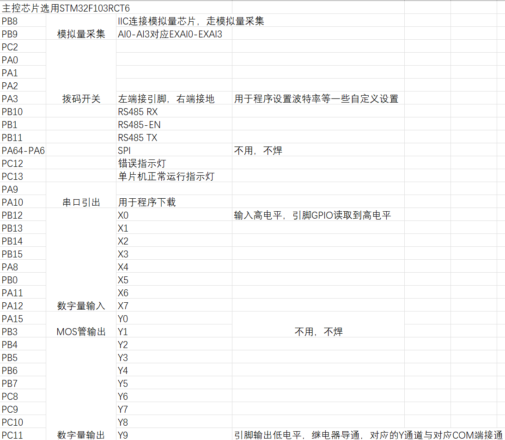
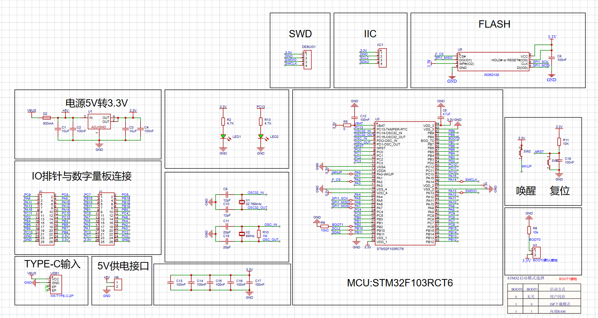
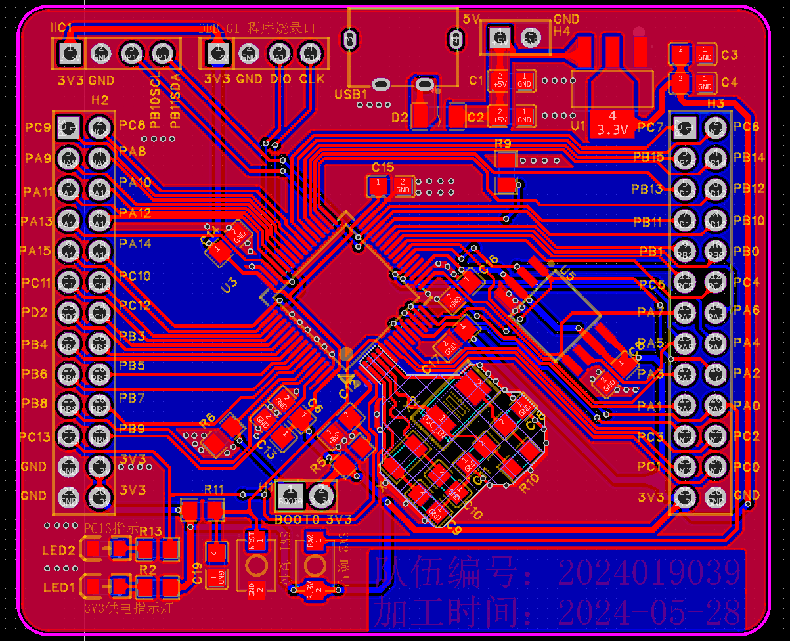
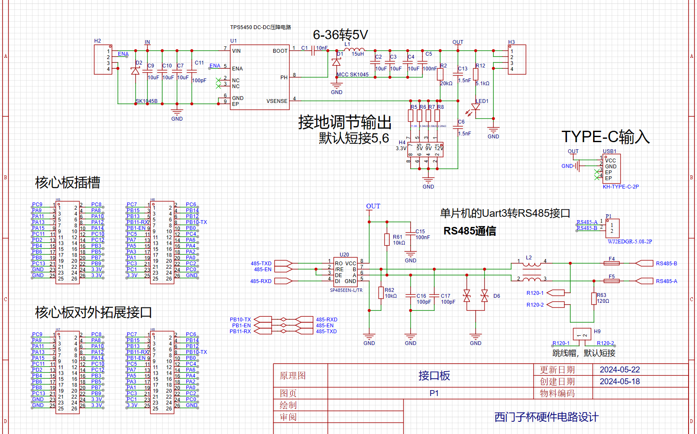
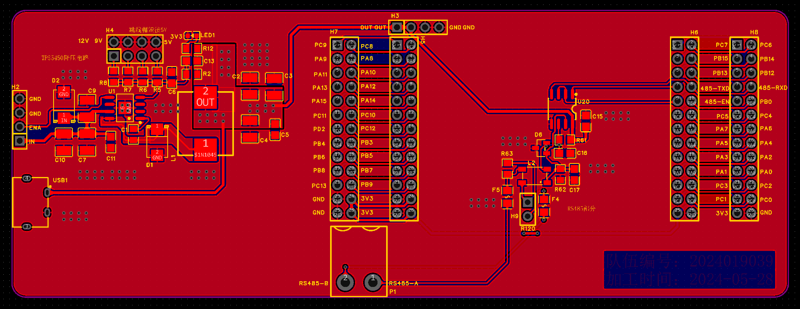
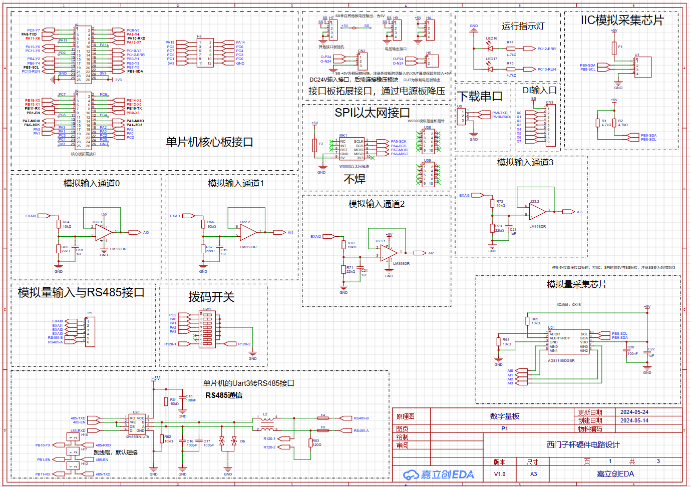
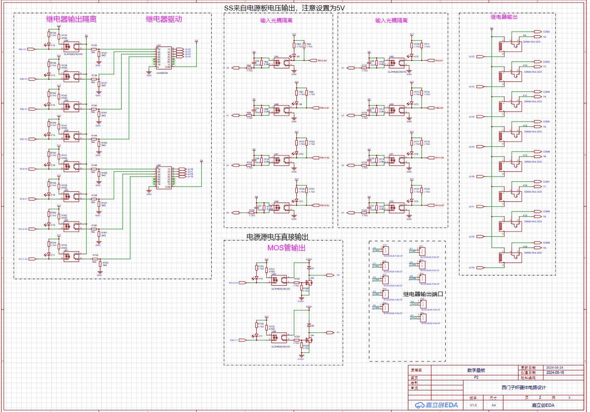
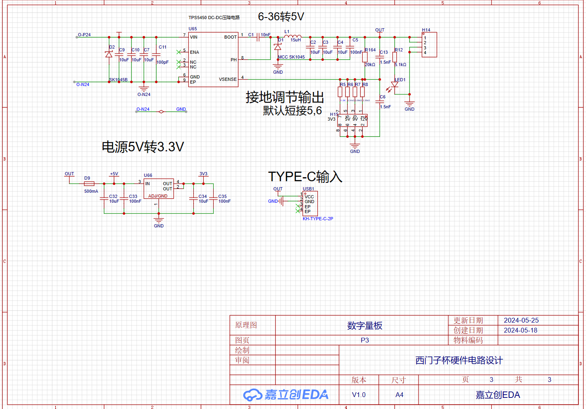
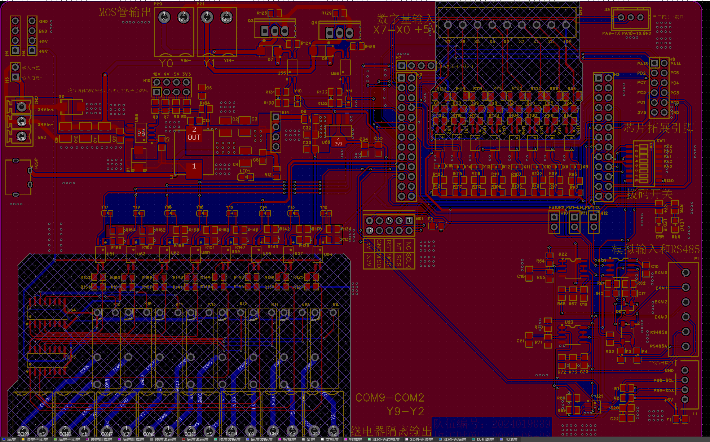

**2024** **年CIMC“西门子杯”中国智能制造挑战赛** 

**智能制造创新研发类赛项：工业硬件研发方向（筹）**

 **设计方案模板**

---

参赛队伍编号：xxxxxxxx

撰写日期：2024年    6 月   30 日

西门子杯中国智能挑战赛，是在2024年首次增加了硬件研发赛项。2024年该赛项的要求是制作一款能够与PLC进行通信，实现数字量输出功能的PLC工控板。在下文需求分析和整体系统设计中给出了今年的原题要求。

本文是按照官方给出的设计方案模版要求所改写的。

对于没有接触过PLC工作的小白来说，理解题目要求和编写RS485通信协议其实是存在不小的难度的，并且比赛时间正好与大部分学校的期末考试时间冲突。从最后比赛公布的全国队伍的得分表来看，实现核心功能的队伍是非常非常少的。实际上完成基础设计和基础的软件设计基本就可以拿到一个不错的名次。

本文是对自己参赛的一个记录。本仓库分享了硬件设计文件（嘉立创EDA专业版文件），可作参考。

---

以下模板为了便于方案评审使用，参赛队伍可在此基础上，根据情况自行增加条目和内容。请注意排版条理清晰、便于审阅。

## 1、需求分析

### 整体需求理解

基于给定的XX芯片，设计和制作核心板与扩展板，以实现一款基于Modbus RTU协议的工业分布式IO系统。该系统的主要目标是提供一个可靠、高效且易于扩展的工业自动化解决方案，用于实时数据采集和控制。

#### 主要需求点：

1. **核心板设计**：使用单片机芯片作为主控单元，负责处理数据、通信和系统管理。
2. **扩展板设计**：提供多个IO接口，用于连接各种传感器和执行器。
3. **Modbus RTU协议支持**：确保系统能够通过Modbus RTU协议与上位机或其他设备进行通信。
4. **分布式架构**：支持多个IO模块的分布式部署，以适应不同的工业环境。
5. **工业级可靠性**：满足工业环境下的高可靠性和稳定性要求。
6. **易于扩展和维护**：系统设计应便于后续的扩展和维护。

### 可行性分析

#### 技术可行性

1. **芯片性能**：单片机芯片是否具备足够的处理能力和资源（如内存、存储）来支持Modbus RTU协议的处理和IO数据的实时采集。
2. **硬件设计**：核心板和扩展板的设计是否能够满足工业级的物理和电气要求，如抗干扰、耐高温等。
3. **软件支持**：是否存在成熟的Modbus RTU协议栈，以及是否能够适配XX芯片。
4. **通信接口**：单片机芯片是否具备足够的通信接口（如UART、RS-485）来支持Modbus RTU通信。

#### 经济可行性

1. **成本分析**：单片机芯片的成本是否在可接受范围内，以及核心板和扩展板的制造成本是否合理。
2. **市场分析**：目标市场的需求是否足够大，以及是否有竞争优势。

#### 操作可行性

1. **用户界面**：是否需要开发易于操作的用户界面，以便用户进行配置和管理。
2. **维护和升级**：系统是否便于维护和升级，如固件更新、故障排查等。

#### 法律和环境可行性

1. **合规性**：系统是否符合相关的工业标准和法规要求。
2. **环境影响**：产品的生产和使用是否对环境造成负面影响。

在进行了上述需求理解和可行性分析后，可以得出以下初步结论：

- 如果单片机芯片的性能、资源和接口满足要求，并且存在成熟的Modbus RTU协议栈，那么技术上是可行的。
- 经济上，需要进一步的市场调研和成本分析来确定产品的竞争力和盈利潜力。
- 操作上，需要考虑用户界面的设计和系统的维护策略。
- 法律和环境上，需要确保产品符合相关标准和法规，不侵犯已有的专利设计。

最终的可行性结论需要在详细设计和市场调研后进一步确认。

## 2、整体系统设计

根据赛题要求将产品设计分为核心板和功能拓展板（接口板和数字量板）。整体系统设计从硬件软件和结构

1. 核心板需要引出芯片所有可用 GPIO 引脚给扩展板，核心板只负责软件功能，不负责 硬件扩展功能的实现。 

2. 扩展板分为 3 种： 

   1. 接口板： i. 外部 24vDC 供电，供电范围：18-36vDC。ii. 对核心板供电 5vDC。 iii. 实现 RS-485 电气接口，通过接口板，核心板可以与 ModbusRTU 主站通信。 iv. 通过连接器实现与扩展板的通信。该通信方式的电气特性与软件协议可自定 义，需确保其他扩展板能及时与 PLC 通信（延迟不超过 ModbusRTU 总线周 期与 PLC 运行周期的最小值的 50%）。

   2. 数字量板： i. 外部 24vDC 供电，供电范围：18-36vDC。 ii. 对核心板供电 5vDC。 iii. 通过连接器实现与接口板和其他扩展板的通信。该通信方式的电气特性与软 件协议可自定义。 iv. 根据通过 iii 的扩展接口接收到的 PLC 输出指令，输出数字量信号。 v. 将输入的数字量信号通过 iii 的扩展接口传输给 PLC。 vi. 实现 8 位晶体管数字量输入与 8 位晶体管数字量输出，输入脉冲频率不低于 1Khz，输出脉冲频率不低于 5Khz，输入输出脉冲误差不超过 0.3%。 vii. 输入输出都具备 LED 提示。 viii. 数字量输出要求电气隔离，隔离度不低于 1000vDC。 

   3. ModbusRTU 接口需要实现下述功能： 

      01-06，08，11，15，16 号命令字。 

      接收报文与发送报文的间隔时间固定且 PLC 可配置。 

      通信参数 PLC 可配置，最高波特率不低于 115200bps。 

   4. 加分项：所有对外接口的 ESD 防护： 

      a) 所有暴露金属接口（包括跟与电源、PLC、各个扩展板相互互联）能耐受±8Kv 空气放电与±2Kv 接触放电的静电测试。 

      b) 静电测试标准参照 EN 61000-4-2 进行: 断电情况进行静电测试，测试完成以后设 备上电，能正常工作为通过。

#### 硬件设计

1. **核心板**：
   - **主控芯片**：选择合适的芯片作为主控单元，确保其具备足够的处理能力、内存和存储资源。
   - **电源管理**：设计高效的电源管理模块，以适应工业环境的电源波动。
   - **通信接口**：集成必要的通信接口，如RS-485用于Modbus RTU通信，以及可能的以太网接口。
   - **扩展接口**：提供标准扩展接口，如SPI、I2C等，以便连接扩展板。
2. **数字量板扩展板**：
   - **IO接口**：设计多种IO接口，包括数字输入/输出、模拟输入/输出，以适应不同的传感器和执行器，通过设计专用的接口以连接单片机核心板。
   - **隔离保护**：在关键IO接口上加入隔离保护，以提高系统的抗干扰能力。
   - **电源接口**：提供独立的电源接口，包含独立的DC-DC电路，以便为连接的设备供电。
3. **接口板扩展板**：
   - **拓展接口**：设计RS485等串行接口。
   - **连接接口**：设计独立的接口以与单片机核心板匹配。
   - **电源接口**：提供独立的电源接口，包含独立的DC-DC电路，以便为连接的设备供电。

#### 软件设计

1. **操作系统**：可以选择适合单片机芯片的实时操作系统（RTOS），以确保系统的实时性和稳定性。在本产品中，我们采用裸机开发的形式。
2. **Modbus RTU协议栈**：集成或开发Modbus RTU协议栈，确保与上位机或其他设备的可靠通信。
3. **应用软件**：开发应用软件，实现数据采集、处理、存储和控制逻辑。
4. **用户界面**：开发易于操作的用户界面，支持配置、监控和故障排查。

#### 结构设计

1. **机械设计**：设计坚固耐用的外壳，以适应工业环境的物理冲击和振动。
2. **散热设计**：合理设计散热结构，确保系统在高温环境下稳定运行。
3. **安装方式**：提供多种安装方式，如 DIN 导轨安装，以适应不同的安装环境。

#### 测试验证

1. **功能测试**：对系统的各项功能进行全面测试，确保符合设计要求。
2. **性能测试**：测试系统的实时性能、通信性能和稳定性。
3. **环境测试**：进行高低温、湿度、振动等环境测试，确保系统的工业级可靠性。
4. **认证测试**：进行必要的认证测试，如CE、UL等，确保产品符合相关标准和法规。

#### 成本与可生产性

1. **成本控制**：在设计和选型过程中，考虑成本因素，选择性价比高的组件和材料。
2. **生产工艺**：选择适合的生产工艺，确保产品的可生产性和质量一致性。
3. **供应链管理**：建立稳定的供应链，确保原材料的供应和成本控制。

#### 非功能要求

1. **安全性**：确保系统设计符合工业安全标准，特别是在高压、高电流环境下的安全操作。
2. **可维护性**：设计便于维护的系统，如模块化设计、远程固件更新等。
3. **可扩展性**：确保系统设计具有良好的可扩展性，便于未来功能的增加和升级。

通过上述系统设计与选型，可以实现一款满足功能、性能要求的基于Modbus RTU的工业分布式IO系统，同时兼顾成本、可生产性、非功能等要求。设计过程中需要硬件、软件、结构、测试验证等多个团队的紧密合作，确保系统的整体性能和质量。

## 3、软硬件详细设计

### 软件设计：

主控芯片方面选择了意法半导体的STM32F103RCT6芯片，此处列出项目设计所用的芯片外设资源引脚列表。软件设计根据此表进行。



RS485通信软件设计：

##### 串口初始化

- **串口配置**：配置STM32的串口参数，如波特率、数据位、停止位和校验位。
- **GPIO配置**：配置控制DE和RE的GPIO引脚为输出模式。

##### 发送数据

- **发送模式**：通过控制DE引脚为高电平，使SP485进入发送模式。
- **数据发送**：通过STM32的串口发送数据到SP485的DI引脚。
- **发送完成**：发送完成后，将DE引脚置为低电平，切换到接收模式。

#####  接收数据

- **接收模式**：通过控制RE引脚为低电平，使SP485进入接收模式。
- **数据接收**：通过STM32的串口接收数据从SP485的RO引脚。

##### 中断处理

- **发送中断**：配置发送中断，当数据发送完成后触发中断，进行后续处理。

- **接收中断**：配置接收中断，当接收到数据后触发中断，进行数据处理。

  ```c
  #include "stm32f1xx_hal.h"
  
  #define RS485_EN_PIN GPIO_PIN_1
  #define RS485_EN_GPIO_PORT GPIOB
  
  UART_HandleTypeDef huart1;
  
  void SystemClock_Config(void);
  static void MX_GPIO_Init(void);
  static void MX_USART1_UART_Init(void);
  
  void RS485_Transmit(uint8_t *pData, uint16_t Size) {
      HAL_GPIO_WritePin(RS485_EN_GPIO_PORT, RS485_EN_PIN, GPIO_PIN_SET); // 设置为发送模式
      HAL_UART_Transmit(&huart1, pData, Size, HAL_MAX_DELAY);
      HAL_GPIO_WritePin(RS485_EN_GPIO_PORT, RS485_EN_PIN, GPIO_PIN_RESET); // 设置为接收模式
  }
  
  void RS485_Receive(uint8_t *pData, uint16_t Size) {
      HAL_UART_Receive(&huart1, pData, Size, HAL_MAX_DELAY);
  }
  
  int main(void) {
      HAL_Init();
      SystemClock_Config();
      MX_GPIO_Init();
      MX_USART1_UART_Init();
  
      uint8_t receivedData[100];
  
      while (1) {
          RS485_Receive(receivedData, sizeof(receivedData));
          // 这里可以添加代码处理接收到的数据
          HAL_Delay(1000);
      }
  }
  
  void SystemClock_Config(void) {
      // 系统时钟配置代码
  }
  
  static void MX_USART1_UART_Init(void) {
      huart1.Instance = USART1;
      huart1.Init.BaudRate = 9600;
      huart1.Init.WordLength = UART_WORDLENGTH_8B;
      huart1.Init.StopBits = UART_STOPBITS_1;
      huart1.Init.Parity = UART_PARITY_NONE;
      huart1.Init.Mode = UART_MODE_TX_RX;
      huart1.Init.HwFlowCtl = UART_HWCONTROL_NONE;
      huart1.Init.OverSampling = UART_OVERSAMPLING_16;
      if (HAL_UART_Init(&huart1) != HAL_OK) {
          // 初始化错误处理
      }
  }
  
  static void MX_GPIO_Init(void) {
      GPIO_InitTypeDef GPIO_InitStruct = {0};
  
      __HAL_RCC_GPIOB_CLK_ENABLE();
  
      // USART1 TX/RX Pins
      GPIO_InitStruct.Pin = GPIO_PIN_10 | GPIO_PIN_11;
      GPIO_InitStruct.Mode = GPIO_MODE_AF_PP;
      GPIO_InitStruct.Speed = GPIO_SPEED_FREQ_HIGH;
      HAL_GPIO_Init(GPIOB, &GPIO_InitStruct);
  
      // RS485 EN Pin
      GPIO_InitStruct.Pin = RS485_EN_PIN;
      GPIO_InitStruct.Mode = GPIO_MODE_OUTPUT_PP;
      GPIO_InitStruct.Speed = GPIO_SPEED_FREQ_LOW;
      HAL_GPIO_Init(RS485_EN_GPIO_PORT, &GPIO_InitStruct);
      HAL_GPIO_WritePin(RS485_EN_GPIO_PORT, RS485_EN_PIN, GPIO_PIN_RESET); // 初始设置为接收模式
  }
  ```

1. **USART初始化**：`MX_USART1_UART_Init`函数初始化USART1接口，设置波特率为9600。
2. **RS485收发控制**：`RS485_Transmit`和`RS485_Receive`函数分别用于发送和接收数据，并通过PB1引脚控制RS485的收发模式。
3. **主循环**：在主循环中，通过`RS485_Receive`函数接收数据，并进行处理。

#### 模拟输入采集程序设计：

1. **I2C初始化**：`MX_I2C1_Init`函数初始化I2C1接口，设置时钟速度为100kHz。

2. **ADS1115配置**：`ADS1115_Config`函数通过I2C发送配置数据到ADS1115的配置寄存器。

3. **读取ADC数据**：`ADS1115_ReadADC`函数通过I2C读取ADS1115的转换结果寄存器，并返回16位ADC值。

   ```c
   #include "stm32f1xx_hal.h"
   
   #define ADS1115_ADDRESS 0x48
   #define ADS1115_CONFIG_REGISTER 0x01
   #define ADS1115_CONVERSION_REGISTER 0x00
   
   I2C_HandleTypeDef hi2c1;
   
   void SystemClock_Config(void);
   static void MX_GPIO_Init(void);
   static void MX_I2C1_Init(void);
   
   void ADS1115_Config(void) {
       uint8_t config[3] = {ADS1115_CONFIG_REGISTER, 0x84, 0x83}; // 配置寄存器数据
       HAL_I2C_Master_Transmit(&hi2c1, ADS1115_ADDRESS << 1, config, 3, HAL_MAX_DELAY);
   }
   
   int16_t ADS1115_ReadADC(void) {
       uint8_t data[2];
       HAL_I2C_Master_Transmit(&hi2c1, ADS1115_ADDRESS << 1, (uint8_t*)&ADS1115_CONVERSION_REGISTER, 1, HAL_MAX_DELAY);
       HAL_I2C_Master_Receive(&hi2c1, ADS1115_ADDRESS << 1, data, 2, HAL_MAX_DELAY);
       return ((int16_t)data[0] << 8) | data[1];
   }
   
   void SystemClock_Config(void) {
       // 系统时钟配置代码
   }
   
   static void MX_I2C1_Init(void) {
       hi2c1.Instance = I2C1;
       hi2c1.Init.ClockSpeed = 100000;
       hi2c1.Init.DutyCycle = I2C_DUTYCYCLE_2;
       hi2c1.Init.OwnAddress1 = 0;
       hi2c1.Init.AddressingMode = I2C_ADDRESSINGMODE_7BIT;
       hi2c1.Init.DualAddressMode = I2C_DUALADDRESS_DISABLE;
       hi2c1.Init.OwnAddress2 = 0;
       hi2c1.Init.GeneralCallMode = I2C_GENERALCALL_DISABLE;
       hi2c1.Init.NoStretchMode = I2C_NOSTRETCH_DISABLE;
       if (HAL_I2C_Init(&hi2c1) != HAL_OK) {
           // 初始化错误处理
       }
   }
   
   static void MX_GPIO_Init(void) {
       // GPIO初始化代码
   }
   ```

   

  数字量输出软件设计：

数字量输出有8路通道，数字量输出在电路设计上做了隔离处理，当某个数字通道需要输出高电平（5V）时，在程序里将对应通道多对应的芯片引脚电平拉低即可。根据电路设计，对应通道的指示灯将会亮起。

  ```c
#include "stm32f1xx_hal.h"

void SystemClock_Config(void);
static void MX_GPIO_Init(void);

void SetDigitalOutput(uint8_t channel, uint8_t state) {
    GPIO_PinState pinState = (state == 0) ? GPIO_PIN_RESET : GPIO_PIN_SET;
    switch (channel) {
        case 0:
            HAL_GPIO_WritePin(GPIOA, GPIO_PIN_15, pinState);
            break;
        case 1:
            HAL_GPIO_WritePin(GPIOB, GPIO_PIN_3, pinState);
            break;
        case 2:
            HAL_GPIO_WritePin(GPIOB, GPIO_PIN_4, pinState);
            break;
        case 3:
            HAL_GPIO_WritePin(GPIOB, GPIO_PIN_5, pinState);
            break;
        case 4:
            HAL_GPIO_WritePin(GPIOB, GPIO_PIN_6, pinState);
            break;
        case 5:
            HAL_GPIO_WritePin(GPIOB, GPIO_PIN_7, pinState);
            break;
        case 6:
            HAL_GPIO_WritePin(GPIOB, GPIO_PIN_8, pinState);
            break;
        case 7:
            HAL_GPIO_WritePin(GPIOC, GPIO_PIN_9, pinState);
            break;
        case 8:
            HAL_GPIO_WritePin(GPIOC, GPIO_PIN_10, pinState);
            break;
        case 9:
            HAL_GPIO_WritePin(GPIOC, GPIO_PIN_11, pinState);
            break;
        default:
            // 错误处理
            break;
    }
}

int main(void) {
    HAL_Init();
    SystemClock_Config();
    MX_GPIO_Init();

    // 示例：将所有通道设置为高电平
    for (uint8_t i = 0; i <= 9; i++) {
        SetDigitalOutput(i, 1);
    }

    while (1) {
        // 主循环
    }
}

void SystemClock_Config(void) {
    // 系统时钟配置代码
}

static void MX_GPIO_Init(void) {
    GPIO_InitTypeDef GPIO_InitStruct = {0};

    // 使能GPIO时钟
    __HAL_RCC_GPIOA_CLK_ENABLE();
    __HAL_RCC_GPIOB_CLK_ENABLE();
    __HAL_RCC_GPIOC_CLK_ENABLE();

    // 配置PA15
    GPIO_InitStruct.Pin = GPIO_PIN_15;
    GPIO_InitStruct.Mode = GPIO_MODE_OUTPUT_PP;
    GPIO_InitStruct.Speed = GPIO_SPEED_FREQ_LOW;
    HAL_GPIO_Init(GPIOA, &GPIO_InitStruct);

    // 配置PB3, PB4, PB5, PB6, PB7, PB8
    GPIO_InitStruct.Pin = GPIO_PIN_3 | GPIO_PIN_4 | GPIO_PIN_5 | GPIO_PIN_6 | GPIO_PIN_7 | GPIO_PIN_8;
    HAL_GPIO_Init(GPIOB, &GPIO_InitStruct);

    // 配置PC9, PC10, PC11
    GPIO_InitStruct.Pin = GPIO_PIN_9 | GPIO_PIN_10 | GPIO_PIN_11;
    HAL_GPIO_Init(GPIOC, &GPIO_InitStruct);
}
  ```

#### 硬件连接

- **PA15** - 数字输出通道0

- **PB3** - 数字输出通道1

- **PB4** - 数字输出通道2

- **PB5** - 数字输出通道3

- **PB6** - 数字输出通道4

- **PB7** - 数字输出通道5

- **PB8** - 数字输出通道6

- **PC9** - 数字输出通道7

- **PC10** - 数字输出通道8

- **PC11** - 数字输出通道9

#### 代码说明

    1. **GPIO初始化**：`MX_GPIO_Init`函数初始化所有指定的GPIO引脚，设置为推挽输出模式。
    2. **设置数字输出**：`SetDigitalOutput`函数根据通道号和状态设置相应的GPIO引脚状态。
    3. **主循环**：在主循环中，示例代码将所有通道设置为高电平。

#### 数字量输入读取软件设计：

```c
#include "stm32f1xx_hal.h"

void SystemClock_Config(void);
static void MX_GPIO_Init(void);

uint8_t ReadDigitalInput(uint8_t channel) {
    switch (channel) {
        case 0:
            return HAL_GPIO_ReadPin(GPIOB, GPIO_PIN_12);
        case 1:
            return HAL_GPIO_ReadPin(GPIOB, GPIO_PIN_13);
        case 2:
            return HAL_GPIO_ReadPin(GPIOB, GPIO_PIN_14);
        case 3:
            return HAL_GPIO_ReadPin(GPIOB, GPIO_PIN_15);
        case 4:
            return HAL_GPIO_ReadPin(GPIOA, GPIO_PIN_8);
        case 5:
            return HAL_GPIO_ReadPin(GPIOB, GPIO_PIN_0);
        case 6:
            return HAL_GPIO_ReadPin(GPIOA, GPIO_PIN_11);
        case 7:
            return HAL_GPIO_ReadPin(GPIOA, GPIO_PIN_12);
        default:
            // 错误处理
            return 0;
    }
}

int main(void) {
    HAL_Init();
    SystemClock_Config();
    MX_GPIO_Init();

    while (1) {
        // 示例：读取所有输入通道的状态并打印
        for (uint8_t i = 0; i < 8; i++) {
            uint8_t input_state = ReadDigitalInput(i);
            printf("Input Channel X%d: %d\n", i, input_state);
        }
        HAL_Delay(1000); // 每隔1秒读取一次
    }
}

void SystemClock_Config(void) {
    // 系统时钟配置代码
}

static void MX_GPIO_Init(void) {
    GPIO_InitTypeDef GPIO_InitStruct = {0};

    // 使能GPIO时钟
    __HAL_RCC_GPIOA_CLK_ENABLE();
    __HAL_RCC_GPIOB_CLK_ENABLE();

    // 配置PB12, PB13, PB14, PB15
    GPIO_InitStruct.Pin = GPIO_PIN_12 | GPIO_PIN_13 | GPIO_PIN_14 | GPIO_PIN_15;
    GPIO_InitStruct.Mode = GPIO_MODE_INPUT;
    GPIO_InitStruct.Pull = GPIO_NOPULL; // 根据需要配置上拉或下拉
    HAL_GPIO_Init(GPIOB, &GPIO_InitStruct);

    // 配置PA8
    GPIO_InitStruct.Pin = GPIO_PIN_8;
    HAL_GPIO_Init(GPIOA, &GPIO_InitStruct);

    // 配置PB0
    GPIO_InitStruct.Pin = GPIO_PIN_0;
    HAL_GPIO_Init(GPIOB, &GPIO_InitStruct);

    // 配置PA11, PA12
    GPIO_InitStruct.Pin = GPIO_PIN_11 | GPIO_PIN_12;
    HAL_GPIO_Init(GPIOA, &GPIO_InitStruct);
}
```

#### 硬件连接

- **PB12** - 输入通道X0
- **PB13** - 输入通道X1
- **PB14** - 输入通道X2
- **PB15** - 输入通道X3
- **PA8** - 输入通道X4
- **PB0** - 输入通道X5
- **PA11** - 输入通道X6
- **PA12** - 输入通道X7

#### 代码说明

1. **GPIO初始化**：`MX_GPIO_Init`函数初始化所有指定的GPIO引脚，设置为输入模式。
2. **读取数字输入**：`ReadDigitalInput`函数根据通道号读取相应的GPIO引脚状态。
3. **主循环**：在主循环中，示例代码读取所有输入通道的状态并打印。

### 硬件设计：

1. 核心板设计

   主控单片机选择STM32F104RCT6芯片。STM32F103RCT6，基于ARM Cortex-M3内核，具有丰富的外设接口。

   

   核心板能够使STM32芯片处于正常工作状态。

   核心板根据芯片手册进行了芯片唤醒、复位电路的设计，并引出BOOT0接口（芯片启动模式）选择。

   外部8MHz晶振作为主时钟源，32.768kHz晶振作为RTC（实时时钟）时钟源。

   核心板支持5V供电，并采用了常用的TYPE-C USB接口，板载AMS1117 LDO线性稳压器，输入端和输出端添加电容滤波，提高电源稳定性。

   接口方面，单独引出了SWD接口，标准2线串行调试接口（SWDIO和SWCLK），用于程序下载和调试。

   指示灯方面，设置了3V3芯片电源供电指示灯和程序控制灯（连接单片机PC13引脚），便于检查核心板工作状态。

2. 接口板设计

   接口板原理图如下

   

   接口板在设计上引出了RS485接口，预留核心板插槽与核心板进行连接。
   1） RS485通信接口设计：
   SP485芯片：选择SP485作为RS485收发器，它支持半双工通信，具有良好的抗干扰能力。
   RS485接口：使用SP485的RO（接收输出）和DI（驱动输入）引脚连接到STM32的串口接收（RX）和发送（TX）引脚。
   DE/RE控制：SP485的DE（驱动使能）和RE（接收使能）引脚连接到STM32的GPIO引脚，用于控制发送和接收模式。

   2）电源电路设计：

   接口板设计了两种电源输入接口，一种是通过USB TYPE-C接口进行供电。

   另一种基于实际应用场景出发，采用了DC-DC降压电路。在DCDC芯片中，我们选择了德州仪器的TPS5450芯片。TPS5450是一款高效率的降压（Buck）转换器，适用于将较高的输入电压转换为较低的输出电压。根据合适的反馈网络设计，使得输出电压稳定在5V。

   DCDC电源电路在设计上运用了稳压二极管，工作电源指示灯等。

   核心板支持接收6-36V的电压输入。

   

3. 数字量板设计

   数字量板原理图设计如下：

   

   

   

   1）电源电路设计：
   数字量板板设计了两种电源输入接口，一种是通过USB TYPE-C接口进行供电。

   另一种基于实际应用场景出发，采用了DC-DC降压电路。在DCDC芯片中，我们选择了德州仪器的TPS5450芯片。TPS5450是一款高效率的降压（Buck）转换器，适用于将较高的输入电压转换为较低的输出电压。根据合适的反馈网络设计，使得输出电压稳定在5V。

   DCDC电源电路在设计上运用了稳压二极管，工作电源指示灯等。
   数字量板板载AMS1117芯片，设计了线性稳压器电路，对TPS5450前端电路输出的5V电路进行降压，输出3.3V电压给一些元件进行供电。
   2）模拟输入设计：

   模拟输入电路输入通过集成运放芯片（LM358DR），采用电压跟随器电路进行隔离，后端输出连接ADS1115模数转换芯片。ADS1115 是一款低功耗、高精度的16位模数转换器（ADC），由德州仪器（Texas Instruments）生产。它采用I2C接口，适用于多种传感器信号的数字化处理，如温度、压力、电压等。ADS1115 具有内部可编程增益放大器（PGA），可调整输入范围，适用于多种应用场景。

   ADS1115芯片通过IIC与STM32单片机连接。

   3）数字量输出电路设计：

   数字量板有8路数字量输出，在电路设计上采用了EL3H4进口光耦芯片和ULN2003A芯片进行电气隔离。ULN2003 是一种高电压、大电流的达林顿晶体管阵列（Darlington transistor array），通常用于驱动继电器、灯泡、步进电机等高电流负载。它包含7个达林顿对，每个达林顿对可以提供高达500mA的电流，并且可以承受高达50V的电压。每路数字量输入都配备有单独的电平指示LED来指示继电器的导通状态。

   4）数字量输入电路设计：

   数字量板有8路数字量输入，在电路设计上采用了EL3H4进口光耦芯片进行电气隔离，防止输入端电压变化影响到系统正常工作，每路数字量输入都配备有单独的电平指示LED。

   5）与接口板类似，数字量板在设计上同样引出了RS485接口，同样预留了核心板插槽与核心板进行连接。
   RS485通信接口设计：
   SP485芯片：选择SP485作为RS485收发器，它支持半双工通信，具有良好的抗干扰能力。
   RS485接口：使用SP485的RO（接收输出）和DI（驱动输入）引脚连接到STM32的串口接收（RX）和发送（TX）引脚。
   DE/RE控制：SP485的DE（驱动使能）和RE（接收使能）引脚连接到STM32的GPIO引脚，用于控制发送和接收模式。

   

## 4、产品分析测试

#### 功能测试

1. **Modbus RTU通信测试**：验证系统是否能够正确解析和生成Modbus RTU协议数据，与上位机或其他设备进行有效通信。
2. **IO接口测试**：对所有IO接口进行测试，确保数字输入/输出、模拟输入/输出等功能正常工作。
3. **控制逻辑测试**：验证系统的控制逻辑是否按照设计要求执行，包括定时、计数、报警等功能。
4. **用户界面测试**：测试用户界面的易用性和功能完整性，确保用户可以方便地进行配置和管理。

#### 性能测试

1. **实时性能测试**：测试系统的数据采集和处理速度，确保满足实时性要求。
2. **通信性能测试**：测试系统的通信速率和稳定性，包括在不同网络负载下的表现。
3. **负载能力测试**：测试系统在连接多个扩展板和IO设备时的性能表现。

#### 非功能测试

1. **可靠性测试**：进行长时间运行测试，验证系统在持续工作下的稳定性和可靠性。
2. **环境适应性测试**：在高低温、湿度、振动等极端环境下测试系统的性能。
3. **电磁兼容性（EMC）测试**：测试系统在电磁干扰环境下的抗干扰能力。

#### 可生产性测试

1. **装配测试**：验证产品的装配流程是否顺畅，是否存在装配难点。
2. **焊接质量测试**：使用X射线或AOI（自动光学检测）等方法检测焊接质量。
3. **老化测试**：对产品进行老化测试，确保在长时间使用后仍能保持性能。

#### 成本验证

1. **BOM成本分析**：详细分析产品的物料清单（BOM）成本，确保成本控制在预算范围内。
2. **生产成本分析**：评估生产过程中的直接和间接成本，包括人工、设备折旧、能源消耗等。
3. **市场成本对比**：与市场上类似产品进行成本对比，确保产品的成本竞争力。

### 设计验证

#### 功能验证

- **验证计划**：制定详细的验证计划，包括测试用例、测试步骤和预期结果。
- **验证工具**：使用专业的测试工具和设备，如网络分析仪、逻辑分析仪等。
- **验证环境**：搭建接近实际使用环境的测试环境，包括模拟的传感器和执行器。

#### 性能验证

- **基准测试**：建立性能基准，对比测试结果，确保性能指标达到设计要求。
- **压力测试**：在极限条件下进行压力测试，验证系统的稳定性和可靠性。

#### 非功能验证

- **安全验证**：进行安全评估，确保系统符合相关的安全标准和法规。
- **维护验证**：验证系统的可维护性，包括故障诊断、部件更换等。

#### 可生产性验证

- **工艺验证**：验证生产工艺的可行性，包括焊接、组装、测试等环节。
- **质量控制**：建立严格的质量控制流程，确保产品的一致性和可靠性。

#### 成本验证

- **成本优化**：在验证过程中寻找成本优化的机会，如替代材料、简化设计等。
- **成本跟踪**：实时跟踪成本变化，确保成本控制在预期范围内。

通过上述测试方案和设计验证，可以确保产品在功能、性能、非功能、可生产性和成本等方面满足设计要求，达到预期的市场竞争力。

## 附录

成本核算表

最终成本=   375  元（请按照一下表格，汇总后，填写）

根据实际采购金额，BOM表成本约为227元左右，PCB制板工程费为137.6元，装配成本10元。

| **序号** | **物料类型** | **物料参数**        | **物料型号**        | **数量** | **备注** | **采购链接/供应商合同与付款凭证** | **单价** | **小计** |
| -------- | ------------ | ------------------- | ------------------- | -------- | -------- | --------------------------------- | -------- | -------- |
| 1        | 电容         | 10uF                |                     | 2        |          |                                   |          |          |
| 2        | 电容         | 100nF               |                     | 4        |          |                                   |          |          |
| 3        | 电容         | 4.7uF               | CL10A106KP8NNNC     | 1        |          |                                   |          |          |
| 4        | 电容         | 12pF                |                     | 2        |          |                                   |          |          |
| 5        | 电容         | 20pF                |                     | 2        |          |                                   |          |          |
| 6        | 电容         | 100nF               | CL10B104KB8NNNC     | 6        |          |                                   |          |          |
| 7        | 芯片         | 0466.500NR          | 0466.500NR          | 1        |          |                                   |          |          |
| 8        | 排针         | 2.54-1*4P母         | 2.54-1*4P母         | 2        |          |                                   |          |          |
| 9        | 排针         | 2.54-1*2P           |                     | 1        |          |                                   |          |          |
| 10       | 排针         | PZ254-2-13-Z-8.5    | PZ254-2-13-Z-8.5    | 2        |          |                                   |          |          |
| 11       | 排针         | 2.54-1*2P母         | 2.54-1*2P母         | 1        |          |                                   |          |          |
| 12       | LED          | LED_0603-G          |                     | 2        |          |                                   |          |          |
| 13       | 电阻         | 4.7K                |                     | 2        |          |                                   |          |          |
| 14       | 电阻         | 0                   |                     | 1        |          |                                   |          |          |
| 15       | 电阻         | 10k                 | 0603WAF1002T5E      | 1        |          |                                   |          |          |
| 16       | 电阻         | 10kΩ                | 0603WAF1002T5E      | 1        |          |                                   |          |          |
| 17       | 电阻         | 1M                  | 0603WAF1002T5E      | 1        |          |                                   |          |          |
| 18       | 电阻         | 10K                 |                     | 1        |          |                                   |          |          |
| 19       | 按键         | Key_SMD_3x4x2       |                     | 2        |          |                                   |          |          |
| 20       | LDO芯片      | AMS1117-3.3         | AMS1117-3.3         | 1        |          |                                   |          |          |
| 21       | 芯片         | STM32F103RCT6       | STM32F103RCT6       | 1        |          |                                   |          |          |
| 22       | 存储芯片     | W25Q128             |                     | 1        |          |                                   |          |          |
| 23       | 连接器       | KH-TYPE-C-2P        | KH-TYPE-C-2P        | 1        |          |                                   |          |          |
| 24       | 晶振         | 32.768kHz           |                     | 1        |          |                                   |          |          |
| 25       | 晶振         | 8MHz                | X503220MSB2GI       | 1        |          |                                   |          |          |
| 26       | 电容         | 10nF                | CC0603KRX7R9BB103   | 1        |          |                                   |          |          |
| 27       | 电容         | 10uF                | GMK325BJ106KN-T     | 6        |          |                                   |          |          |
| 28       | 电容         | 100nF               | TCC0603X7R104K500CT | 1        |          |                                   |          |          |
| 29       | 电容         | 1.5nF               | CC0603KRX7R9BB152   | 2        |          |                                   |          |          |
| 30       | 电容         | 100pF               | CC0603JRNPO9BN101   | 1        |          |                                   |          |          |
| 31       | 电容         | 100nF               | CL10B104KB8NNNC     | 1        |          |                                   |          |          |
| 32       | 电容         | 100pF               | CL10C101JB8NNNC     | 2        |          |                                   |          |          |
| 33       | 稳压器件     | MCC SK1045          | MCC SK1045          | 1        |          |                                   |          |          |
| 34       | 稳压器件     | SK1045B             | SK1045B             | 1        |          |                                   |          |          |
| 35       | 稳压器件     | SM712               | SM712               | 1        |          |                                   |          |          |
| 36       | 保险丝       | JK-SMD0603-005      | JK-SMD0603-005      | 2        |          |                                   |          |          |
| 37       | 排针         | B-2100S04P-A110     | B-2100S04P-A110     | 2        |          |                                   |          |          |
| 38       | 排针         | B-2100S08P-B110     | B-2100S08P-B110     | 1        |          |                                   |          |          |
| 39       | 排针         | PZ254-2-13-Z-8.5    | PZ254-2-13-Z-8.5    | 4        |          |                                   |          |          |
| 40       | 排针         | 2.54-1*2P母         | 2.54-1*2P母         | 1        |          |                                   |          |          |
| 41       | 电感         | 15uH                | APS10A40M150        | 1        |          |                                   |          |          |
| 42       | 连接器       | ACT45B-510-2P-TL003 | ACT45B-510-2P-TL003 | 1        |          |                                   |          |          |
| 43       | 连接器       | XL-1608SURC-06      | XL-1608SURC-06      | 1        |          |                                   |          |          |
| 44       | 连接器       | WJ2EDGR-5.08-2P     |                     | 1        |          |                                   |          |          |
| 45       | 电阻         | 20kΩ                | FRC0603F2002TS      | 1        |          |                                   |          |          |
| 46       | 电阻         | 11.8K               | 0603WAF1182T5E      | 1        |          |                                   |          |          |
| 47       | 电阻         | 6.34kΩ              | RS-03K6341FT        | 1        |          |                                   |          |          |
| 48       | 电阻         | 3.09kΩ              | RMC06033.09K1%N     | 1        |          |                                   |          |          |
| 49       | 电阻         | 2.26kΩ              | CR0603-FX-2261ELF   | 1        |          |                                   |          |          |
| 50       | 电阻         | 5.1kΩ               | CR0603JA0512G       | 1        |          |                                   |          |          |
| 51       | 电阻         | 10kΩ                | 0603WAF1002T5E      | 2        |          |                                   |          |          |
| 52       | 电阻         | 120Ω                | 0603WAF1200T5E      | 1        |          |                                   |          |          |
| 53       | 电阻         | TPS5450DDAR         | TPS5450DDAR         | 1        |          |                                   |          |          |
| 54       | 电阻         | SP485EEN-L/TR       | SP485EEN-L/TR       | 1        |          |                                   |          |          |
| 55       | USB连接器    | KH-TYPE-C-2P        | KH-TYPE-C-2P        | 1        |          |                                   |          |          |
| 56       | 电容         | 10nF                | CC0603KRX7R9BB103   | 1        |          |                                   |          |          |
| 57       | 电容         | 10uF                | GMK325BJ106KN-T     | 6        |          |                                   |          |          |
| 58       | 电容         | 100nF               | TCC0603X7R104K500CT | 1        |          |                                   |          |          |
| 59       | 电容         | 1.5nF               | CC0603KRX7R9BB152   | 2        |          |                                   |          |          |
| 60       | 电容         | 100pF               | CC0603JRNPO9BN101   | 1        |          |                                   |          |          |
| 61       | 电容         | 100nF               | CL10B104KB8NNNC     | 10       |          |                                   |          |          |
| 62       | 电容         | 100pF               | CL10C101JB8NNNC     | 2        |          |                                   |          |          |
| 63       | 电容         | 1uF                 | CL10A105KB8NNNC     | 5        |          |                                   |          |          |
| 64       | 电容         | 10uF                |                     | 2        |          |                                   |          |          |
| 65       | 电容         | 100nF               |                     | 2        |          |                                   |          |          |
| 66       | 连接器       | WJ15EDGVC-3.81-3P   | WJ15EDGVC-3.81-3P   | 1        |          |                                   |          |          |
| 67       | 连接器       | WJ15EDGVC-3.81-9P   | WJ15EDGVC-3.81-9P   | 1        |          |                                   |          |          |
| 68       | 连接器       | MCC SK1045          | MCC SK1045          | 1        |          |                                   |          |          |
| 69       | 稳压器件     | SK1045B             | SK1045B             | 1        |          |                                   |          |          |
| 70       | 稳压器件     | SM712               | SM712               | 1        |          |                                   |          |          |
| 71       | 稳压器件     | M7                  | M7                  | 2        |          |                                   |          |          |
| 72       | 芯片         | 0466.500NR          | 0466.500NR          | 1        |          |                                   |          |          |
| 73       | 稳压器件     | BSMD0805-035-24V    | BSMD0805-035-24V    | 2        |          |                                   |          |          |
| 74       | 保险丝       | JK-SMD0603-005      | JK-SMD0603-005      | 2        |          |                                   |          |          |
| 75       | 排针         | PZ254-2-13-Z-8.5    | PZ254-2-13-Z-8.5    | 2        |          |                                   |          |          |
| 76       | 排针         | HDR-M_2.54_1x4P     |                     | 3        |          |                                   |          |          |
| 77       | 连接器       | B-2100S02P-A110     | B-2100S02P-A110     | 1        |          |                                   |          |          |
| 78       | 连接器       | HDR-F_2.54_2x6      |                     | 1        |          |                                   |          |          |
| 79       | 连接器       | 2.54-1*2P母         | 2.54-1*2P母         | 3        |          |                                   |          |          |
| 80       | 连接器       | B-2100S04P-A110     | B-2100S04P-A110     | 1        |          |                                   |          |          |
| 81       | 连接器       | B-2100S08P-B110     | B-2100S08P-B110     | 1        |          |                                   |          |          |
| 82       | 继电器       | G5NB-1A-E DC5       | G5NB-1A-E DC5       | 8        |          |                                   |          |          |
| 83       | 电感         | 15uH                | APS10A40M150        | 1        |          |                                   |          |          |
| 84       | 芯片         | ACT45B-510-2P-TL003 | ACT45B-510-2P-TL003 | 1        |          |                                   |          |          |
| 85       | 芯片         | XL-1608SURC-06      | XL-1608SURC-06      | 1        |          |                                   |          |          |
| 86       | LED          | NCD0603R1           | NCD0603R1           | 2        |          |                                   |          |          |
| 87       | 芯片         | W5500               | W5500               | 1        |          |                                   |          |          |
| 88       | 连接器       | WJ15EDGVC-3.81-6P   | WJ15EDGVC-3.81-6P   | 1        |          |                                   |          |          |
| 89       | 连接器       | WJ2EDGR-5.08-2P     |                     | 10       |          |                                   |          |          |
| 90       | MOS管        | IRFZ44NPBF          | IRFZ44NPBF          | 2        |          |                                   |          |          |
| 91       | 电阻         | 4.7kΩ               | 0603WAF4701T5E      | 34       |          |                                   |          |          |
| 92       | 电阻         | 11.8K               | 0603WAF1182T5E      | 1        |          |                                   |          |          |
| 93       | 电阻         | 6.34kΩ              | RS-03K6341FT        | 1        |          |                                   |          |          |
| 94       | 电阻         | 3.09kΩ              | RMC06033.09K1%N     | 1        |          |                                   |          |          |
| 95       | 电阻         | 2.26kΩ              | CR0603-FX-2261ELF   | 1        |          |                                   |          |          |
| 96       | 电阻         | 5.1kΩ               | CR0603JA0512G       | 1        |          |                                   |          |          |
| 97       | 电阻         | 10kΩ                | 0603WAF1002T5E      | 4        |          |                                   |          |          |
| 98       | 电阻         | 120Ω                | 0603WAF1200T5E      | 1        |          |                                   |          |          |
| 99       | 电阻         | 10kΩ                | RT0603BRD0710KL     | 4        |          |                                   |          |          |
| 100      | 电阻         | 22kΩ                | RT0603BRE0722KL     | 4        |          |                                   |          |          |
| 101      | 电阻         | 2.2kΩ               | 0603WAF2201T5E      | 8        |          |                                   |          |          |
| 102      | 电容         | 1206W4F4701T5E      | 1206W4F4701T5E      | 8        |          |                                   |          |          |
| 103      | 电阻         | 1kΩ                 | 0603WAF4701T5E      | 8        |          |                                   |          |          |
| 104      | 电阻         | 3kΩ                 | 0603WAF4701T5E      | 8        |          |                                   |          |          |
| 105      | 电阻         | 470Ω                | 0603WAF4700T5E      | 10       |          |                                   |          |          |
| 106      | 电阻         | 20kΩ                | FRC0603F2002TS      | 1        |          |                                   |          |          |
| 107      | 芯片         | DSHP08TSGER         | DSHP08TSGER         | 1        |          |                                   |          |          |
| 108      | 连接器       | B4B-XH-A(LF)(SN)    | B4B-XH-A(LF)(SN)    | 1        |          |                                   |          |          |
| 109      | 连接器       | B3B-XH-A(LF)(SN)    | B3B-XH-A(LF)(SN)    | 1        |          |                                   |          |          |
| 110      | 芯片         | SP485EEN-L/TR       | SP485EEN-L/TR       | 1        |          |                                   |          |          |
| 111      | 芯片         | ADS1115IDGSR        | ADS1115IDGSR        | 1        |          |                                   |          |          |
| 112      | 集成运放     | LM358DR             | LM358DR             | 2        |          |                                   |          |          |
| 113      | 光耦         | EL3H4(B)(TA)-VG     | EL3H4(B)(TA)-VG     | 18       |          |                                   |          |          |
| 114      | 达林顿管     | ULN2003A            | ULN2003A            | 2        |          |                                   |          |          |
| 115      | DC-DC芯片    | TPS5450DDAR         | TPS5450DDAR         | 1        |          |                                   |          |          |
| 116      | LDO芯片      | AMS1117-3.3         | AMS1117-3.3         | 1        |          |                                   |          |          |
| 117      | USB连接器    | KH-TYPE-C-2P        | KH-TYPE-C-2P        | 1        |          |                                   |          |          |
| 118      | LED          | NCD0603R1           | NCD0603R1           | 18       |          |                                   |          |          |
|          |              |                     |                     |          |          |                                   |          |          |
|          |              |                     |                     |          |          |                                   |          |          |
|          |              |                     |                     |          |          |                                   |          |          |

BOM物料价格统计

| **PCB描述** | **层数** | **面积(cm2)** | **价格** |
| ----------- | -------- | ------------- | -------- |
| 核心板      | 2        | 31.1          | 21.60    |
| 接口板      | 2        | 71.4          | 40.50    |
| 数字量板    | 2        | 207.0         | 75.51    |
|             |          |               |          |
| 总计        |          |               |          |

PCB价格统计

| **PCB**  | **贴片点数** | **插件点数** | **小计** |
| -------- | ------------ | ------------ | -------- |
| 核心板   | 138          | 68           | 206      |
| 接口板   | 82           | 128          | 210      |
| 数字量板 | 490          | 193          | 683      |
|          |              |              |          |
| 总计     | 710          | 389          | 1099     |

装配价格统计：采用亚克力切割件，10元左右成本。