# 车站信号自动控制

---
2024-12-27

## 车站信号控制系统概述

### 安全线和避难线、警冲标、股道有效长

为防止专用线或岔线上的机车车辆因故进入正线或到发 线而发生冲突，在岔线与站内正线或到发线接轨时要设置 安全线；或进站信号机外方制动距离内有6‰及以上的连 续下坡道时，在车站接车方向的末端设置要设置安全线。

为防止在又陡又长的下坡道上列车失去控制，或 在陡长的上坡道上因车辆断钩，而溜入占用的区 间或站内，在陡长坡道下方专设一条线路，叫避 难线。

警冲标是指示机车车辆不准超过道岔方面和线路交叉地 点的标志。在两分支轨道中心相距各2m 的地方设置警冲标防止列车侧面冲突。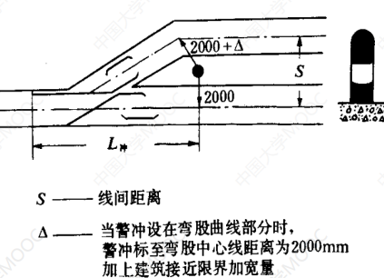

 股道有效长是指在股道全长范围内可以停留机车 车辆而不影响邻线行车的一段长度，应大于或等 于规定的列车长度在加上附加长度（30m）

### 车站作业：列车作业、调车作业和转场作业

列车作业：

- 接车作业—将列车由区间接入站内股道

- 发车作业—将列车由站内股道发往区间

- 通过作业—列车经由股道不停车通过车站

调车作业——在车站站场内进行的机车出入库、转线、车列解体、编组及取送车等作业，统称调车作业。

转场作业——具有多个车场的车站，列车或车列由一个车场转线到另一个车场的作业，称为转场作业。

车站作业的特点：

- 并发性：车站内可能有多列车同时作业，列车作业和调 车作业同时进行；
- 复杂多变性：作业过程随情况变化而发生变化
- 安全性：必须保证各种车站作业的安全性。

### 信号机

信号机的灯光:红、绿、黄、白、蓝、绿黄、双黄、红白的字母表示符号?

红色是停车信号。在铁路信号系统中，当信号机显示红色灯光时，列车或车辆必须在信号机前停车，绝对禁止越过。

绿色是按规定速度运行的信号。准许列车或车辆按规定的速度通过信号机。

黄色是减速信号。提示列车或车辆应减速，准备停车或者在注意瞭望的前提下继续前进。

月白色（白色），在调车信号机中，月白色灯光准许越过该信号机调车。在某些情况下作为引导信号，如进站信号机的**红白显示**中的白色部分，准许列车在该信号机前不停车，以不超过一定速度进站或通过接车进路，并随时准备停车。

蓝色信号主要用于调车信号机，表示禁止越过该信号机调车。

绿黄信号：进站信号机显示绿黄灯光：表示允许列车经道岔直向位置进入站内，越过下一架已经开放的接车进路信号机准备停车。比如当列车需要连续通过车站内的多个信号机时，进站信号机显示绿黄灯光，引导列车逐步进站停车；区间通过信号机显示绿黄灯光：在四显示自动闭塞区段，绿黄灯光表示前方有两个闭塞分区空闲，列车应注意运行速度，按规定速度越过该信号机后，在次一架信号机前减速准备停车。

双黄信号；进站信号机显示双黄灯光：准许列车经道岔侧向位置，进入站内准备停车。即列车要通过道岔的侧向进入站内时，信号机显示双黄灯光，提醒司机注意侧向通过道岔的限速要求，因为列车侧向通过道岔时速度不能太高，以免脱轨等危险情况发生

红白信号：进站信号机显示红白灯光，为引导进站信号，白色为引导信号，表示允许列车在该信号机前不停车，以不超过 20km/h 的速度进站或通过接车进路，并随时准备停车。

**列车信号机：**

- **进站信号机**

  为了防护车站， 指示列车能否由区间进入车站，在车站的入口处设置的信号机叫做进站信号机。

  作用：防护车站，指示列车的运行条件，保证接车进路的正确和安全可靠。

  命名：上行用S，下行用X；有多个方向线路时，在字母右下角加线路名拼音字头，如X~D~；双线自动闭塞区间的反向进站信号机，在字母右下角加F或N，表示反向或逆向，如X~F~。

  

  

- **出站信号机**

  为了指示列车能否由车站进入区间，在车站的发车股道列车停车地点前方设置的信号机叫做出站信号机。

  作用：防护区间，作为列车进入区间的凭证，指示列车能否进入区间。

  命名：上行用S，下行用X，在字母右下角加上股道号，如图中的S~I~，S~II~等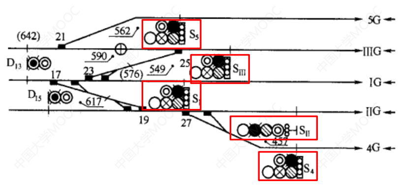

- 进路信号机（接车、发车）

  作用：防护转场进路，指示列车转场作业。

  设置：当两个车场间线路较短，在车场入口处不能装设接车进路信号机时，可在相邻车场出口处的正线上装设接发车进路信号机。 当两个车场间线路较长，为了提高站内通过能力，除在车场入口处的正线上装设接车进路信号机外，还应在相邻车场出口处的正线上装设接发车进路信号机。

  命名：在 S 或 X 的后面加 L 表示进路信号机，再在L的右下角缀上所在股道号，如XL3。

- 预告信号机

  设置：进站信号机外方，不少于800m的地方

  命名：Y+进站信号机名称：如YX

  显示：一个绿灯：表示主体信号机在开放状态；一个黄灯：表示主体信号机在关闭状态

- 复示信号机

**调车信号机**

​	作用：指示站内各种调车作业

​	设置：根据调车作业的实际需要划分，包括调车起始信号机、调车折返信号机、调车阻拦信号机。

根据调车信号机所处的位置划分：股道头部调车信号机、尽头型调车信号机、咽喉区调车信号机

命名：调车信号机的名称以**D**表示，再在右下角缀上顺序号。调车信号机从车站两端进站方向向股道顺序编号，上行咽喉区编为**双号**，下行咽喉区编为**单号**。

显示：一个月白灯光，表示准许越过该调车信号机；一个蓝色灯光，表示禁止越过该调车信号机；尽头线上起阻拦列车运行作用的调车信号机，可用红色灯光代替蓝色灯光。

### 道岔

道岔是列车从一股道到另一股道的转辙设备，是进路方向的约束条件，是铁路信号的主要控制设备之一。

辙叉号：由叉心所形成的角叫辙叉角（a）；道岔号（N）代表道岔各部主要尺寸，用辙叉角的余切表示；辙叉号（道岔号）越大，导曲线半径也越大，允许过岔速度越高；9、12、18号道岔，允许侧向通过速度30、45、80km/h；30、38号道岔，允许侧向通过速度140、160km/h。

通常把道岔经常所处的位置叫做定位，临时根据需要改变的另一位置叫做反位。一次操纵只能使一组道岔转换的道岔，叫单动道岔；一次操纵能使两组道岔同时或顺序转换的道岔，叫双动道岔；异常状态：四开、挤岔

道岔定位的确定原则：按左侧行车制尽量考虑站内行车和调度作业的安全；作业方便，尽量减少扳动道岔的次数；单线正线进站道岔为由车站两端向不同线路开通的位置。双线车站正线进站道岔，为各该正线开通的位置。区间内由辅助所所辖道岔以开通正线为其定位。连通正线的其他道岔，应以引向正线开通的位置。引向安全线和避难线的道岔，为开通安全线和避难线的位置。站线上的道岔，（除安全线和避难线）为向列车开通的位置。如果两条进路都是列车进路，为向直股列车进路开通的位置或向靠近站舍方向开通的位置，即向经常使用的股道开通为定位。

对向道岔和顺向道岔：列车顺着道岔尖轨运行时，叫顺向道岔，反之叫对向道岔。

### 轨道电路

**轨道电路区段划分原则**：

有信号机的地方必须设置绝缘节，使其前后为两个不同 的轨道区段；

凡是能平行运行的进路，其间应设轨道绝缘将其隔开；

一个轨道电路区段的道岔不能超过3组；

为提高咽喉使用效率，应把轨道电路区段适当划短，但在提速区段，为了保证机车信号的连续显示，轨道电路区段不能过短。

**侵限绝缘**

道岔区段的绝缘节设在警冲标的内方 ，不小于3.5m、不大于4m的地方，若 实在不能满足此要求，则该绝缘节称为侵限绝缘；

两绝缘节应设在同一坐标处，避免产生死区段。错开距离小于2.5m。

两相邻死区段间隔，不得小于18m。

信号机处的绝缘节：应与信号机坐标相同，若达不到时：进站、接车进 路信号机处的绝缘可以设在信号机前方1m或后方1m处。出站、发车进路信号机处，钢轨绝缘可以设在信号机前方1m或后方6.5m的范围内。调车信号机处与进站一致，但设在到发线时与出站一致。

### 站内轨道区段的命名

### 车站联锁

车站室外信号设备（三大件）：<u>信号机</u>：命令指挥；<u>道岔转辙机</u>：方向转换；<u>轨道电路</u>：位置检测

进路：为列车运行划分出来的、虚拟的、专用的一条通路

联锁：为了保证行车安全，信号、道岔与进路之间必须保持一定的制约关系和操作顺序，这种制约关系和操作顺序称为联锁。

进路与道岔的联锁关系：

​	道岔是进路方向的约束条件，进路 建立后道岔不允许再动作，锁闭道岔。

​	道岔在进路中的表示方法：

​		进路通路上的道岔：定位：1，反位：（1）。

​		不在通路上的道岔：防护道岔：定位锁闭[4/6]，反位锁闭 [(4/6)] ；带动道岔：定位锁闭		{4/6}，反位锁闭{(4/6)}

进路与信号机的联锁关系：

​	防护：在进路表中写明信号名称和显示颜色，D21:B

​	敌对：在进路表中写明信号名称和敌对条件，敌对锁闭，D23，＜19＞D33

进路与轨道区段的联锁关系：

​	防护锁闭：检查空闲，建立锁闭；在进路表中写明轨道区段名称：11DG

​	侵限检查：在进路表中写明轨道区段名称和侵限条件，D3-D11进路中检查<3>3DG。

进路与进路的联锁关系：

​	抵触进路和敌对进路：决定因素是道岔，如果道岔位置不能间接控制两条进路， 两条进路存在抵触或敌对关系，则为敌对进路，若通过道岔能分开，则为抵触进路

### 联锁表

定义：说明车站信号设备联锁关系的图表

设计依据：按照车站站场线路配置，咽喉区道岔分布以及信号机布置情况， 遵照《铁路信号联锁图表编制原则》编制出来的

### 进路的控制过程

**进路的选排：**

​	功能：根据操作命令选择一条进路、检查进路建立的联锁条件、完成道岔的转状态转换过程控制与位置检查

​	技术条件：区段空闲且未锁闭，侵限区段空闲；道岔未被封锁，未单独位置防护锁在错误位置；敌对进路未建立；进路的其他照查条件满足

**进路的锁闭：**

​	功能：检查进路的锁闭条件是否满足、条件满足则锁闭进路（道岔、轨道区段、敌对信号、照查锁闭）

​	技术条件：区段空闲且未锁闭，侵限区段空闲、进路的防护道岔位置正确、敌对进路未建立、进路的其他照查条件满足

**进路的信号开放：**

​	功能：检查进路已锁闭、检查信号开放的技术条件、完成主体信号机的开放

​	技术条件：区段空闲且锁闭，侵限区段空闲、进路的防护道岔位置正确、敌对进路未建立、进路的其他照查条件满足、未办理取消进路、列车信号机红灯灯丝完好、开放信号显示正确。

**信号的保持开放：**

​	功能：连续检查信号开放的技术条件、检查信号机的关闭条件、信号机开放条件不满足时，立即实施主体信号机的关闭

​	技术条件-开放：区段空闲且锁闭，侵限区段空闲进路的防护道岔位置正确、敌对进路未建立、进路的其他照查条件满足、未办理取消进路、列车信号机红灯灯丝完好、开放信号显示正确

​	技术条件-关闭：列车第一轮对压入进路内方、接近无车调车全部进入进路内方、接近有车调车越过进路内方第一区段、机车专用线机车第一轮对压入、信号机发生故障、办理取消或人工解锁进路、复示信号机的主体信号机关闭

**进路的正常通过解锁：**

​	功能：检查列车或调车顺序驶过进路、完成进路的分段解锁或一次解锁

​	技术条件：防护进路的信号机因车列进入进路而自动关闭、车列确已顺序压入并出清进路区段、分段解锁闭，车列出清轨道区段后，该区段自动及时解锁（ 三点检查与3秒）

**进路的取消解锁：**

​	功能：检查是否办理了取消进路的操作、检查进路取消解锁的条件是否满足、条件满足时一次性取消进路

​	技术条件：进路接近区段空闲且无接近锁闭、防护进路的信号机关闭、进路处于空闲状态

**进路的人工延迟解锁：**

​	功能：检查进路解锁的条件是否满足、条件满足时延时后一次性解锁进路

​	技术条件：进路接近区段有车或处于接近锁闭状态、防护进路的信号机关闭、延时过程中，进路处于空闲状态（30秒和3分钟）

**进路的区段故障解锁：**

​	功能：检查车列非正常通过进路、破铅封解除区段的锁闭

​	技术条件：检查解锁区段空闲、检查解锁区段未处于车列运行前方

**进路的调车中途折返解锁：**

​	功能：检查调车列的折返作业条件、解除调车折返作业的原牵出进路的锁闭

​	技术条件：检查车列牵出作业后折返信号机开放、检查车列顺序退出牵出进路、检查车列压入折返信号机的内方

特殊进路的控制：引导进路控制、延续进路控制、到发线出岔进路控制、非进路调车控制

## 车站信号控制技术基础

### 铁路信号安全型继电器

所谓安全型继电器是指它的结构必须符合故障—安全原则，是一种不 对称器件，在故障情况下使前接点闭合的概率远小于后接点闭合的概率。（分类：无极继电器、极性继电器：偏极，极性保持）

故障—安全措施：前接点采用了熔点高材料;增加衔铁重量，利用“重力恒定”原理;采用残磁极小的铁磁材料;衔铁不致因机械故障而卡在吸起状态

J 继电器 W 无极 X 小型 C 插入式 Z 整流式 Y 有极 P 偏极 字头后J表示加强节点 阻值前H表示缓放型 JWJXC-H125/0.44

125/0.44：前圈电阻值：后圈电阻值

继电器一般都有多组接点，每组接点包含前接点、中接点和后接点，编号分别 为2、1和3。

电路中继电器通常呈现的状态，称为定位或常态。（确定定位的原则：继电器的定位状态应与该继电器对应的信号设备的定位状态一致；继电器的释放状态必须与该继电器对应的信号设备的安全侧一致。常态吸起（定位）：↑ 常态落下（定位）：↓）

电路中选择继电器的一般原则：继电器的类型、线圈电阻，应满足各种电路的基本要求。电路中串联使用继电器时，串联继电器的数量满足电压的要求。接点通过的电流不应小于电路的工作电流，必要时采用并联。接点数量不够时，设置复示继电器反映主继电器工作状态。电路中串联继电器接点时，接点的接触电阻满足电路要求。

接通公式：描述继电器励磁电流的径路，即由电源正极经由接点、线圈以及其它器件而流 向电源负极的回路，它是分析继电器电路的常用方法。KZ-DGJ~11-12~ -DBJ~21-22~ -AJ~11-13~ -D~1-2~ -CJ~1-4~ -KF

继电器安全电路：断线故障：使电路开路的故障；混线故障：使电路短路的故障

### 联锁系统结构

车站室外设备继电接口电路作用：完成把室内联锁逻辑形成的设备控制命令，转 换为对室外设备的安全强电输出，并且把室外信号设备的状态，转换为对应的继电器组合状态再传递 给联锁逻辑部分进行运算。

### 信号机继电接口电路

进站信号机的灯光设计：

-  红灯： 停车，禁止越过信号机

- 黄灯： 正线停车

- 双黄： 侧线停车

- 绿黄： 正线通过，出站信号机点黄灯

- 绿灯： 正线通过

- 红白： 引导接车

进站信号机的功能继电器设计：

- LXJ：区分禁止信号与允许信号

- ZXJ：区分正与侧线停车

- TXJ：正线通过

- LUJ：点绿黄灯

- YXJ：引导接车

- DJ ：第1灯光监督

- 2DJ：第2灯光监督

#### 进站信号机点灯电路

（1）平时：LXJ↓→点红灯 

（2）正线通过：LXJ↑、ZXJ↑、TXJ↑→点绿灯 

（3）正线接车：LXJ↑、ZXJ↑、TXJ↓、LUXJ ↓→点黄灯 

（4）侧线接车： LXJF↑、ZXJ↓、TXJ↓→点双黄灯 

（5）转场进路： LXJF↑、ZXJ **↑**、 TXJ ↓、LUXJ ↑→点绿黄灯 

（6）引导信号： LXJ ↓、LXJF ↓、 YXJ ↑→点红白灯

LXJ励磁吸起，点亮允许灯光；LXJ失磁落下，点 亮红色禁止灯光；允许灯灭灯或LXJ的控制输出断线时，自动转点红灯

在同时点两个允许 显示信号时，在第1个点灯电路里接有2DJ的前接点。 如点绿黄灯时，当 第2黄灯电路故障或灯 丝断丝时，2DJ落下切断点绿灯电路，使绿 灯无法点灯或点亮后熄灭，信号机改点红灯，不会造成显示升级。

混电防护 	双断法防护：允许信号(U、L、2U)；引导信号YB

混线防护 	位置法防护：LU2U与UL2UH、H与HH、YB与YBH

#### 出站兼调车信号机点灯电路(自动闭塞区间三显示)

（1）平时：LXJ↓、DXJ↓→点红灯 

（2）向主要方向发车：

​	a.LXJ↑、ZXJ↑、2LQJ↑→点绿灯

​	b.LXJ↑、ZXJ↑、2LQJ↓→点黄灯 

（3）向次要方向发车：

​	a.LXJ↑、ZXJ↓→点双绿灯

​	b.LXJ↑、ZXJ↑、2LQJ ↓→点黄灯 

（4）开放调车信号：LXJ↓、**DXJ**↑→点白灯

#### 显示的技术要求及安全防护设计：

基本要求：应符合“故障－安全”原则，当发生故障时， 信号机应能自动给出最大限制的信号显示；信号显示应具有较高的抗干扰能力。

技术要求：允许灯光故障，要自动转点红灯；点亮双灯时，第2灯不能点亮则第1灯光不允许点亮；防混电混线设计

防护措施：（1）设置灯丝监督继电器DJ，串接到电路中判断灯光点亮（2）供电双断法，以防止混入电源形成回路使信号错误点 灯，防止信号出现乱显实（3）位置法，防止混线（4）采用双丝灯泡，设置DZJ，监督主灯丝断丝(每个咽喉设一套 )

#### 出站信号机点灯电路

出站兼调车信号机的点灯电路显示：H、U、L和2L ，B(调)

继电器种类 :LXJ，ZXJ，2LQJ，DXJ，DJ，2DJ

逻辑关系 ：①点一个红灯（条件LXJ↓） ②点一个黄灯 （条件LXJ↑+ZXJ↑+2LQJ↓） ③点两个绿灯（条件LXJ↑+ZXJ↓） ④点一个绿灯 （条件LXJ↑+ ZXJ↑+ 2LQJ↑）

#### 调车信号机

A蓝灯和B白灯；DXJ、DJ；灯泡单灯丝；蓝灯断丝允许点白灯；共回线

### 道岔转辙机的继电接口电路

转辙机是道岔控制系统的执行机构

转辙机作用：转换：转换道岔的位置， 根据需要转换至定位或反位；锁闭：道岔转至 所需位置 而且密贴 后，实现锁闭，防止外力转换道岔；表示：正确地反映道岔的实际 位置，道岔的尖轨密贴于基本轨后 ，给出相应的表示；报警：道岔被挤 或因故处 于“四开” 位置时，及时断开表示，给出报警。

基本要求：作为转换装置，应具有足够大的拉力，以带动尖轨作直线往返运动；当尖轨受阻不能运动到底时，应随时通过操纵使尖轨回复原位。作为锁闭装置，当尖轨和基本轨不密贴时，不应进行锁闭；一旦锁闭，应保证不致因车辆通过道岔时的震动而错误解锁。作为监督装置，应能正确的反映道岔的状态。道岔被挤后，在未修复前不应再使道岔转换。

道岔启动电路技术条件：对道岔实行区段锁闭，道岔区段有车占用，或道岔区段轨道电路发生故障时，不准道岔转换；对道岔实行进路锁闭，进路在锁闭状态时，不准进路上的道岔再转换；道岔启动后，保证道岔能继续转到底；道岔启动电路接通后，如果电路故障使各部分没有启动造成道岔未转动，则启动电路应自动被切断；应保证道岔在不能转换到底时，能在车站值班员操纵下，随时都可以使其返回原位；道岔转换完毕到位密贴后，应自动切断启动电路使电机停转。

道岔表示电路技术条件：当外线发生混线或混入其他电源时，必须保证不使DBJ和FBJ错误励磁；为实现断线保护， 只能用继电器的吸起状 态来反映道岔的工作状态(定位或反位)，继电器的落下状态，只能反映道岔在非工作状态；在道岔转换过程中，或发生挤岔、停电、断线等故障时，应保证DBJ和FBJ落下。（防混电、防混线；故障导向安全；吸起代表工作状态；切断表示：转换、停电、继线、挤岔；）

#### 道岔控制电路设计

DCJ/FCJ:发出定位操作或反位操作命令

1DQJ：第1启动继电器，区分动作电与表示电

2DQJ：第2启动继电器，区分供电方向，动作时接通定位或反位电机控制电路；表示时，接通定位或反位表示电路

DBJ/FBJ:定位/反位表示继电器，组合给出位置表示。

SFJ:道岔锁闭时落下，不允许启动转极电路

启动电路采用分级控制（三级）：第一级电路（1DQJ电路）第二级电路（2DQJ电路）第三级电路（电动机电路）

由1DQJ检查联锁条件，若条件满足则1DQJ↑→由2DQJ控制电机的转动方向（决定道岔定位转或反位转）→由直流电机转换道岔。

### 四线制直流道岔接口电路分析

1DQJ的励磁电路(一级控制)：

接通公式：KZ —> SJ~81-82~ —>1DQJ~3-4~—>2DQJ~141-142~—>FCJ~61-62~—>KF

2DQJ的转极电路(二级控制):

接通公式：KZ—>1DQJ~41-42~—>2DQJ~2-1~—>FCJ~61-62~—>KF

切断1DQJ的3-4线圈励磁电路

电机供电电路(三级控制)

接通公式：DZ~220~—>RD~3~—>1DQJ~1-2~—>1DQJ~12-11~—>2DQJ~111-113~—>外线X2—>自动开闭器接点11-12 —>电动机定子线圈2-3 —>电动机转子线圈3-4—>遮断器5-06 —>外线X4—>1DQJ~21-22~—>2DQJ~121-123~—> RD~2~—>DF~220~

电机反转电路：

#### 直流道岔启动电路技术条件与实现

检查锁闭继电器SJ的前接点，证明道岔未被区段锁且未被进路锁闭。

由于表示杆的作用，道岔刚转换 时，自动开闭器接通反转回路。

自闭电路-转到底；自动开闭器动作切断电源-转完断电；无法转动，1DQJ自闭电路断开-不能转断开

定位：当外线混线时，整流二极体失去作用，偏极继电器中流过交流电不会吸起，可防止DBJ或FBJ的错误励磁。

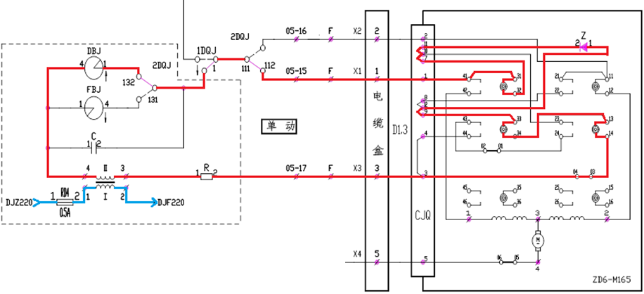

当外线上混入外界电源时，由于采用变压器隔离，混入的电源不能构成闭合回路，可防止道岔表示继电器误动。

当电容器C击穿时，道岔表示继电器被C短路，从而不会励磁；当电容器引线断线时，由于失去滤波作用，DBJ或FBJ将颤动。

### 站内轨道电路

轨道电路是利用钢轨线路和钢轨绝缘，接上送电设备和受电设备构成的电路。

轨道电路的作用：

监督列车的占用：利用轨道电路区段是否空闲，为建立进路、开放信号、关闭信号以及构成闭塞提供依据。

传递列车控制信息：移频自动闭塞利用轨道电路中传递不同的频率来反映前行列车的位置，决定各信号机的显示为列车运行提供行车命令。

分支轨道区段的一送多受轨道电路

一送两受轨道电路

一送三受轨道电路

一送多受轨道电路设有一个送电端，在每个分支轨道电 路的另一端各设一个受电端；

各分支受电端轨道继电器的前接点串联在主轨道继电器 电路中，分支轨道继电器落下，主轨道继电器也落下。

### 计算机联锁控制系统

#### 计算机联锁控制系统功能

是以计算机或微处理器实现联锁逻辑运算功能的车站联锁控制系统。

1. 人机交互功能（也称为操作表示功能）

​	操作功能，是指行车指挥人员通过操作人机交互设备（如鼠标、键盘等）向联锁机构输入操作指令，如按压按钮、排列进路、操纵道岔等。

​	表示功能，是将站场信号设备状态和行车作业情况的表示信息通过显示屏等人机交互设备表示出来。

2. 联锁运算功能

​	联锁运算是系统的核心功能，其主要功能包括以下三类：

​	第一类是进路控制功能，也是整个计算机联锁控制系统最重要的功能，包 括选排进路、锁闭进路、开放信号、关闭信号、解锁进路等；

​	第二类是道岔操作功能，包括单独操作（定操/反操）、单独锁闭/单独解锁、 封锁/解封操作等；

​	第三类是引导信号控制功能，包括进路式引导和引导总锁闭两类。

3. 输入/输出功能

​	输入功能是指采集信号机、道岔以及轨道电路等现场设备的状态信息，反馈给联锁运算主机，作为联锁运算的实时动态数据。

​	输出功能是指根据联锁运算结果，控制信号机显示，驱动道岔转换。

#### 计算机联锁系统的优点 P214

1. 进一步提高了安全性和可靠性
2. 增加和完善了联锁系统的功能
3. 方便设计和站场的改建和扩建
4. 省工省料且降低了造价

#### 基于并行总线扩展的计算机联锁系统的主要特点：

上下位机间采用通信总线交互、联锁主机与输入输出板通过并行总线交互。输入输出板通过继电器接口电路与室外设备交互。输入输出板CPU处理器。

#### 基于串行总线扩展的计算机联锁系统-继电接口的主要特点：

上下位机间采用通信总线交互。联锁主机与I/O执行机通过串行总线交互，易于规模扩展。I/0执行机配置智能处理单元与联锁主机间进行通信交互，对内一般采用并行总线与驱采板交互。I/O执行机通过继电器接口电路与室外设备交互。

#### 基于串行总线扩展的计算机联锁系统-全电子化接口的主要特点：

上下位机间通信总线交互。输入输出采用全电子化I/O接口单元。联锁主机与电子化接口单元通过串行总线交互。全电子化I/O接口单元直接通过电缆与室外设备连接。全电子化I/O接口单元为带CPU处理器的逻辑控制单元。电子化接口单元一般分为道岔模块、信号模块、轨道模块、零散模块与对应的室外设备相连接。

#### 满足铁路现场需求的联锁系统基本要求：

​	(1)功能完备(功能安全与故障安全)

​	(2)高可靠和高安全

​	(3)应用与维护方便(高可用性）

人机交互层系统结构

​	一般不涉及安全，采用“双机热备结构” ，两套操作表示计算机互为热备提高系统的可靠性。

主流的计算机联锁系统架构（制式）：(1)双机热备 (2)三取二 (3)二乘二取二

#### 双机热备模式-计算机联锁控制系统的主要特点：

上位机双套热备、联锁主机双套互为热备、输出驱动以倒切单元单套输出、一般采用继电器接口电路实现对室外设备的控制。

#### 二乘二取二模式-计算机联锁控制系统的主要特点：

上位机双套热备、联锁主机每系采用双处理器二取二表决、联锁两系互为热备、驱采机每系也采用二 取二处理器、驱采机两系一般采用并联输出、采用继电器接口电路实现对室外设备的控制。

#### 三取二模式-计算机联锁控制系统的主要特点：

上位机双套热备、联锁主机采用三套完全一致的处理器，按三取二表决运算输出、3套输入电路直接传递给3个主机，3输出电路按三取二表决输出，采用继电器接口电路实现对室外设备的控制。

### 电气集中联锁控制系统（6502）

#### 6502电气集中联锁系统概述

1）控制台	人机交互层 

2）控制台继电接口	实现控制台与联锁机构的信息传输

3）继电逻辑组合	是以安全继电器电路实现联锁逻辑运算的机构

4）现场设备继电接口	现场设备与联锁机构的信息通道 

5）现场设备	室外三大件

站场型网络电路：将电路图形画成站场的形状， 以便将检查的条件参照信号 布置接入电路的对应位置。本质上是继电器电路化简后 的特例。 便于分析和设计电路。网络之间只有时序逻辑关系，没有必然的电路连接。

#### 15条网络线的设计思想

0. 进路操纵记录过程 
1. 进路选路过程
2. 进路选排一致性检查过程
3. 信号开放条件检查过程
4. 进路锁闭过程 
5. 信号开放保持过程
6. 进路解锁过程

进路的控制过程—时间上-分时的，控制过程上-步进用上一个阶段的动作结果，作为下一阶段的动作条件。

#### 15条网络线的设计 P52

1\~7线为选路电路，8\~13线为执行电路 

- 14、15线为轨道光带表示灯电路。 
-  选择组电路由记录电路和选路网路组成，主要用以记录车站值班员按压 按钮的动作，按要求自动选通所需进路，并将操作意图传给执行组电路。

- 1、2网路线用于选“八”字第一笔撇形渡线双动道岔的反位

- 3、4网路线用于选“八”字第二笔捺形渡线双动道岔的反位

- 5、6网路线用于选单动及双动道岔定位和单动道岔反位。

- 7网路线是开始继电器(KJ)励磁网路，用以检查所选进路和所排进路的一致性

- 8线是信号检查继电器电路(XJJ)，用来检查开放信号的可能性

- 9线是区段检查继电器(QJJ)和股道检查继电器电路(GJJ)

- 10线是区段检查继电器自闭电路，用来防止利用区段故障解锁方式使进路迎面错误解锁。

- 11线是信号继电器电路(XJ)，检查进路上各区段处于锁闭状态、道岔位 置正确，以及迎面敌对进路检查，符合条件即可开放信号。

- 12、13线为进路继电器网路(1LJ,2LJ)，用来实现进路锁闭，完成进路的正常解锁、取消、人工解锁、调车中途返回解锁以及引导解锁等。

#### 信号组合的用途（6种）P45

（1）调车信号组合DX——调车信号组合，用于各种调车信号机 

（2）调车信号辅助组合DXF——调车信号辅助组合，用于单置调车、调车终端按钮和变 通按钮BA处 

（3）引导信号组合YX——引导信号组合，用于进站及接车进路信号机 

（4）列车信号主组合LXZ——列车信号主组合，用于出站、发车进路及股道的调车信号 

（5）列车信号第一辅助组合1LXF——一方向列车信号辅助组合，用于一个方向出站、单线进站及股道的调车

（6）列车信号第二辅助组合2LXF——二方向列车信号辅助组合，用于两个方向出站、单线进站及股道的调车

6502电气集中的定型组合规定每一个组合内的继电器的数量不超过10个,12种定型组合 。

#### 道岔类型的组合

1. 双动道岔主组合SDZ；

2. 双动道岔辅助组合SDF；

3. 单动道岔组合DD

#### 其他组合类型

​	区段组合（Q）
​	方向组合（F）
​	电源组合 （DY）

各组合中所含的继电器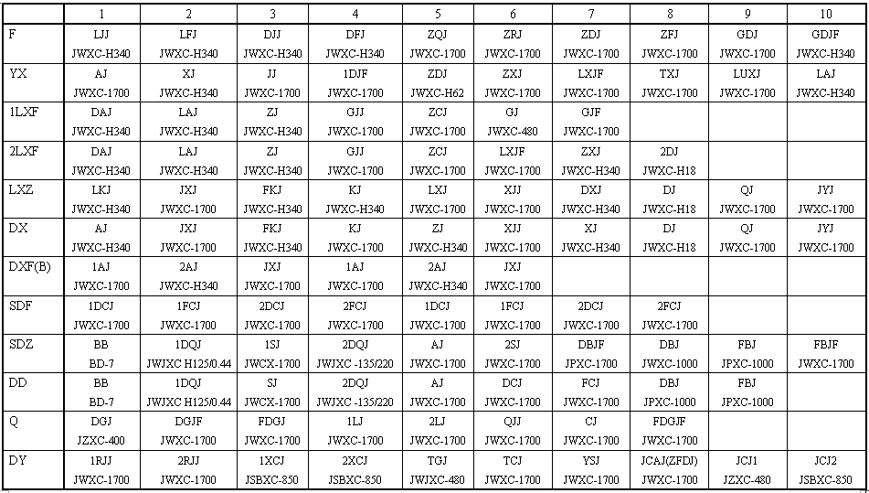

#### 继电器组合使用

交叉渡线道岔组合使用

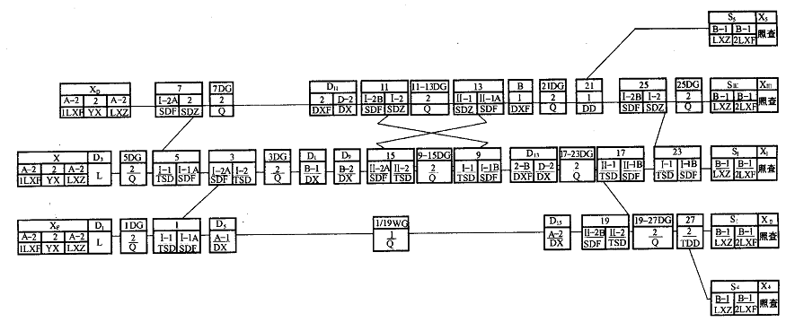

#### 进路控制时序逻辑

##### 进路选择时序逻辑

1. 接收按压按钮的操作并记录
2. 确定进路性质和方向
3. 自动选出与进路相符的道岔位置
4. 进路选出后，记录进路终端和性质

##### 进路建立时序逻辑

1. 道岔启动并转换
2. 选排一致性检查
3. 进路锁闭条件检查
4. 信号开放条件检查

##### 进路解锁时序逻辑

1. 信号机的关闭
2. 三点检查的实现
3. 进路的解锁标志

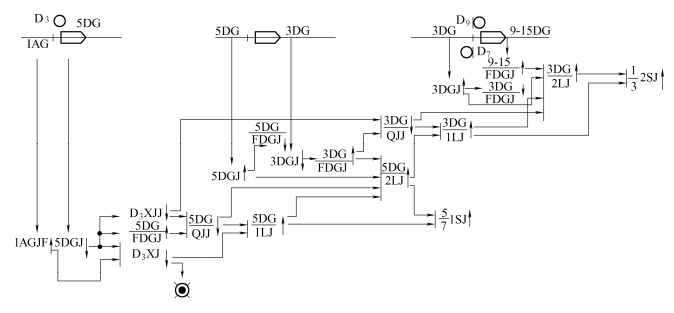

##### 执行组进路控制时序总结

​	• DCJ、FCJ：选择道岔位置
​	• DBJ、FBJ：反映道岔位置
​	• KJ和ZJ：记录进路的始端位置和终端位置，KJ兼作检查进路选排一致性
​	• FKJ：防止信号自动重复开放
​	• XJJ：反映是否可以锁闭进路
​	• XJ：控制信号机点灯
​	• QJJ：选择哪个区段准备参与锁闭与解锁
​	• 1LJ、2LJ：专门检查解锁条件（三点检查）
​	• SJ：反映进路的锁闭与解锁状态
​	**GJJ\ZCJ：检查股道占用和迎面锁闭

#### 执行组电路中的6类继电器

​	• 道岔启动与表示继电器（1DQJ、2DQJ、DBJ、FBJ） 
​	• 开始继电器（KJ）--7线
​	• 信号检查继电器（XJJ） --8线 
​	• 区段检查继电器（QJJ） --9线10线 
​	• 进路继电器（1LJ、2LJ）和锁闭继电器（SJ）--12线13线 
​	• 信号继电器（XJ） --11线

#### 选择组电路中的7类继电器 P57

​	• 按钮继电器（DxAJ、LxAJ）
​	• 方向继电器（LJJ、LFJ、DJJ、DFJ）
​	• 进路选择继电器（ DxJXJ、LxJXJ ） 
​	• 道岔操纵继电器（DCJ、FCJ）
​	• 辅助开始继电器（FKJ）
​	• 终端继电器（ZJ）
​	• 列车开始继电器（LKJ）

#### 选择组时序逻辑表达式

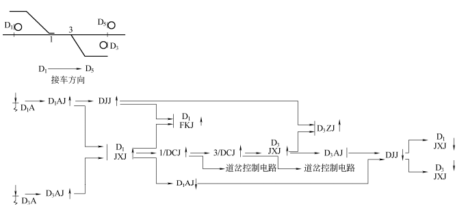

左向右送正电，先选反位后定位

#### 执行组时序逻辑表达式

#### SII至D7的选择组时序逻辑

#### 进路建立过程典型电路

##### 方向继电器电路

设置方式：每一个车站咽喉设4个方向继电器，列车接车方向继电器LJJ；列车发车方向继电器LFJ；调车接车方向继电器DJJ；调车发车方向继电器DFJ。

技术条件：1.进路的性质和方向是由进路的始端按钮所确定的。 2. 4个方向继电器同时只允许其中一个方向继电器励磁吸起，并保持到整条进路全部选出.3.选路时间短，不包括道岔动作时间。 4.当进路因故不能正常选出时，通过办理取消手续使方向继电器复原。5.当办理取消进路人工解锁和重复开放信号而按下进路始端按 钮时，不应使方向继电器励磁，以免妨碍办理其它进路。(始端、唯一、时间短、取消复原、避误吸)

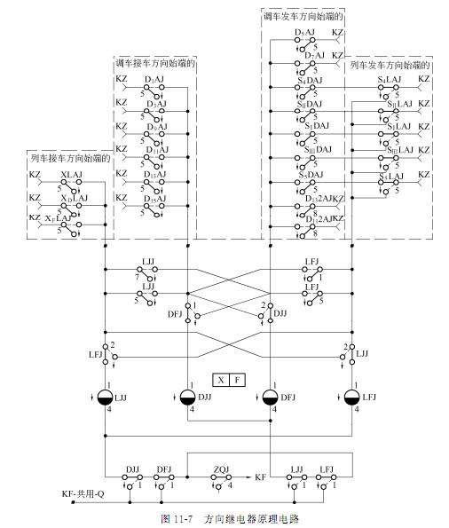

LJJ励磁：XLAJ吸起，接通 LJJ励磁电路。用LJJ第一组后接 点断开DJJ和DFJ的 励磁电路，用LJJ第二组后接点断开LFJ的励磁电路， 使其不能励磁。按下终端列车按钮 后，不能使其他三个方向继电器励磁。

LJJ自闭:利用终端按钮形成自闭。从而保证同时只准许一个方向继电器吸起和只准许一条进路。

DJJ励磁：D5AJ吸起，接通 DJJ励磁电路。用DJJ第一组后接点断开LJJ和DFJ的 励磁电路，用LJJ 第二组后接点断开 LFJ的励磁电路，使其不能励磁。按下终端列车按钮 后，不能使其他三 个方向继电器励磁。		从而保证同时只准许一个方向继电器吸起和只准许一条进路。

DJJ自闭:利用终端按钮形成自闭。

###### 方向电源

概念：接替方向继电器的功能，接向电源的条件电源

采用方向电源的原因和优点：按钮继电器及其他一些继电器的电路，都需要方向继电器接点作为“断”或“通”的控制条件，为节省接点而采用方向电源。节省方向继电器接点，简化电路。

方向电源共10种：KF电源6种，KZ电源4种。

• 1．KF-共用-Q：经任一方向继电器的前接点所供出的负电源，用于进路选择继电器JXJ和DXF组合中按钮继电器1AJ和2AJ的自闭电 路。 
• 2．KF-共用-H：经四个方向继电器和ZQJ的后接点供出的负电源，用于单置调车信号机的辅助开始继电器FKJ在重复开放信号时的励磁电路。
• 3．KF-LJJ-Q：经LJJ前接点供出的负电源，用于列车接车方向的 列车开始继电器LKJ的励磁电路。 
• 4．KF-LFJ-Q：经LFJ前接点供出的负电源，用于列车发车方向的 LKJ的励磁电路。 
• 5．KF-DJJ-Q：经DJJ前接点供出的负电源，用于接车方向的调车 信号机的FKJ、单置调车信号机的终端继电器ZJ的励磁电路，以及发车方向的并置、差置、尽头线的调车信号机ZJ励磁电路。
• 6．KF-DFJ-Q：经DFJ前接点供出的负电源，用于发车方向的调车信号机的FKJ、单置调车信号机的ZJ励磁电路，以及接 车方向的并置、差置、尽头线的调车信号机ZJ励磁电路。 
• 7．KZ-共用-H：经四个方向继电器后接点供出的正电源，用于单置调车信号机按钮继电器AJ的励磁电路。 
• 8．KZ-列共-Q：经由LJJ或LFJ前接点供出的正电源，用于并置和差置调车信号机的两个AJ互相带动的励磁电路。
• 9．KZ-列共-DJJ-Q：经LJJ或LFJ或DJJ前接点供出的正电源，用于发车方向的单置调车信号机AJ的励磁电路。
• 10．KZ-列共-DFJ-Q：经LJJ或LFJ或DFJ前接点供出的正电源，用于接车方向的单置调车信号机AJ的励磁电路。
Q－－指相应的J吸起才得到此电源  H－－指全部的J落下才得到此电源

##### 按钮继电器电路

按钮的作用：办理进路、重复开放信号、取消进路、人工解锁进路。

###### 尽头线调车信号按钮继电器电路

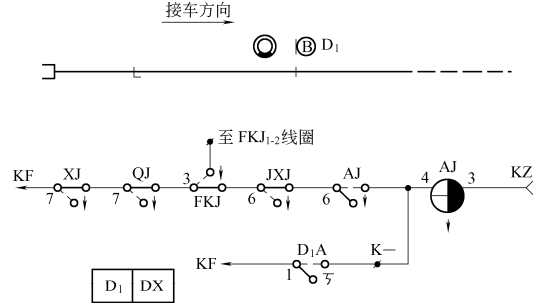

###### 并置和差置调车按钮继电器

3-4线圈与尽头型按钮继电器电路一致

1-2线圈在列车变通进路中作为变更按钮的继电器带起

###### 单置调车信号机的按钮继电器

对应每一个按钮设置三个按钮继电器:

​	1AJ 记录按钮按下的动作

​	2AJ 终端/变通

​	AJ 始端/变通

1.(始端)按下→1AJ↑→AJ↑，作为始端按钮使用时；

2.(终端)按下→1AJ↑→2AJ↑，作为终端按钮使用时； 

3.(变通)按下→1AJ↑→2AJ↑→AJ↑，作为变通按钮使用时。

1. 作始端（ 按下→1AJ↑→AJ↑） KZ-共用-H有电；AJ励磁、按下D13A，D131AJ 吸起并自闭

2. 作终端（按下→1AJ↑→2AJ↑ ）KZ-共用-H、 KZ-列共-SDFJ-Q无电KF-共用-Q有电；按下D13A，D131AJ 吸起并自闭；2AJ励磁

3. 当作变通按钮使用（按下→1AJ↑→2AJ↑→AJ↑）KF-共用-Q、 KZ-列共-SDFJ-Q有电；AJ励磁、2AJ励磁

##### 选岔电路

作用：自动选出进路上的道岔位置		设置：DCJ和FCJ

设计思路：站场型网路--并联传递式选岔网路-（防迂回）-分路法—6线制选岔网络 

好处：继电器逐个励磁，稳压电路稳定；道岔启动电流错峰； 右端JXJ吸起全部选出。

六线：

​	1-2线，选“八”字撇型渡线道岔反位；

​	3-4线，选“八”字捺型渡线道岔反位；

​	5-6线，选择双动定位和单动定反位；

###### 道岔操纵继电器配置

单动道岔：设一个DCJ、一个FCJ

双动道岔：设1DCJ、2DCJ、1FCJ、2FCJ 渡线上处于左端道岔的操纵继电器编号为1，右端的编号为2 ，选岔时，一定要从左到右选

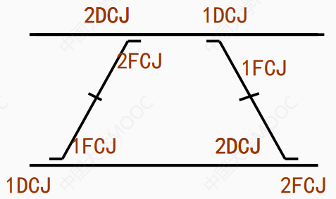

技术条件（六条）：

​	1、选出的进路应与操作意图相符。
​	2、锁闭时，选岔电路不能工作。
​	3、区段有车时，选岔电路不能工作。
​	4、应防止选出两条相抵触的进路。
​	5、应防止迂回电流和串电现象。
​	6、电路工作稳定可靠、符合定型化。

动作规律：

1、继电器均并接在两条网络线上。 2、继电器从左向右顺序传递励磁，与进路方向无关。 3、可用最右端继电器的吸起状态证明电路工作完毕、正常。 4、任一继电器励磁后，向右传递KZ，接通右边继电器励磁电 路，同时切断其左边继电器的励磁电路KF。 “右传左断” 5、最多有两个继电器同时工作，避免多台电机同时启动而造 成整流器输出电流过大。 6、左端向网络送KZ，逐段传送，右端向网络送KF，一步到位。 7、岔道顺序选出、启动，可降低整流器电流峰值。

###### 1、2线选岔网络

送电规律：1线从左到右依次传 递KZ，2线从右到左送KF。

动作规律：1FCJ励磁后，2FCJ励磁。

复原时机：进路锁闭后，SJ落下，1FCJ、 2FCJ均落下。

送电规律：1线从左到右依次传递KZ，2线从右到左送KF。

动作规律：1FCJ励磁后，2FCJ励磁。

复原时机：进路锁闭后，SJ落下，1FCJ、 2FCJ均落下。

###### 3、4线选岔网络

送电规律：3线从左到右依次传递KZ，4线从右到左送KF。

动作规律：1FCJ励磁后，2FCJ励磁。

复原时机：进路锁闭后，SJ落下，1FCJ、 2FCJ均落下。

送电规律：3线从左到右依次传递KZ，4线从右到左送KF。

动作规律：1FCJ励磁后，2FCJ励磁。

复原时机：进路锁闭后，SJ落下，1FCJ、 2FCJ均落下。

###### 5、6线选岔网络

送电规律：5线从左到右依次传递KZ，6线从右到左送KF。DCJ(FCJ)吸起后，依次断开KF。

###### 进路选择继电器JXJ

说明：进路选择继电器（JXJ）是选路电路的组成部分。JXJ励磁电路不单独占用网路线，它与选岔网路的第5、6线合用，其电路动 作与选岔电路相似。

设置：对应每一架信号机处的信号组合内均设一个JXJ。对应单置调 车信号机处设两个JXJ，分别在DX组合和DXF组合内。

作用：JXJ↑后，用其前接点与方向电源相配合，使有关的FKJ↑和ZJ↑，确定了进路的始端和终端，为进路锁闭、开放信号创造了条件。

进路选择继电器配置

​	出站兼调车：设一个JXJ

​	进站带调车（两个信号机）：设一个JXJ

​	单置调车信号机：设两个JXJ

​	变更按钮处：设一个JXJ

​	别的信号机处：设一个JXJ

​	发车口不设任何信号机，只设一个DZJ或LZJ，设一个JXJ

进路中有两个JXJ，对应于始端和终端，只要进路中有一个 道岔操作继电器没有吸起，终端JXJ均不能吸起。

###### 列车兼调车信号的JXJ电路

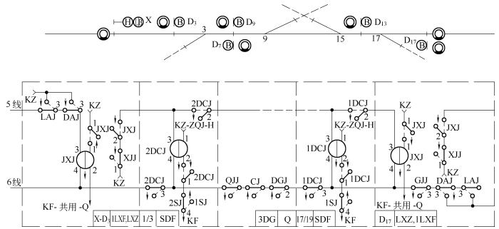

依次使进路中道岔DCJ励磁，最终使终端JXJ励磁。始端JXJ励磁与自闭，始端JXJ带动2DCJ励磁，并形成自闭电路，始端JXJ带动1DCJ励磁，并形成自闭电路，终端JXJ励磁，并形成自闭电路。终端JXJ吸起说明进路全部选定。

复原时机：方向继电器落下，JXJ全部落下。进路锁闭后，SJ落下，DCJ(FCJ)均落下。

##### 辅助开始继电器与终端继电器电路

###### 辅助开始继电器

作用：1、记录始端。接续记录电路工作，在信号开放前记录进路的始端。（因JXJ↑→AJ↓→FJ↓→ JXJ↓记录电路复原）2、防止信号重复开放。

设置：（1）对应每架信号机设一个FKJ，放在LXZ或DX组合中。（2）进站带调车合用一个FKJ。

技术条件：（1）为了接续记录电路工作，必须使FKJ在进路始端的JXJ和与所选进路的性质及方向相符的FJ吸起后吸起，以反映进路的始端； （2）为防止信号自动重复开放，必须用FKJ的前接点作为开放信号的必要条件；（3）信号开放后，在列车未进入进路前，若因轨道电路瞬时故障信号自动关闭，此时电路处于锁闭状态。只要进路处于锁闭状态，准许在此情况下，只按下进路始端按钮手动开放信号，称为重复开发信号。重开时，按下始端LA，就应使FKJ吸起。

###### 终端继电器介绍

作用：接续进路选择继电器和方向继电器的工作，记录进路的终端。

设置：凡是调车进路的终端，都要设一个终端继电器，放在DX组合中，列车进路除复线发车口处设一个LZJ外，其余地方都不设。

技术条件：（1）要能够接续记录电路工作。（2）要检查进路必须在解锁状态，否则禁止ZJ吸起。（3）ZJ一旦吸起，必须使它保持到这条进路解锁为止。

###### 调车信号的FKJ电路

调车的JXJ↑,构通FKJ励磁； JXJ↓，切断FKJ励磁电路。调车的FKJ↑,构通FKJ的自闭电路；信号开放后，XJ↑，切断FKJ自闭电路。重开信号的励磁时机：重按DA后；复原时机：松开DA后。

###### 终端继电器电路

调车终端的JXJ↑,构通ZJ励磁电路；JXJ↓，切断ZJ励磁电路。调车进路终端最近的道岔的DCJ(FCJ)↑,构通自闭电路；落下切断FKJ自闭电路

进路锁闭后，SJ↓，构通第二条自闭电路；进路解锁后，SJ↑，切断第二条自闭电路。

##### 开始继电器KJ电路

开始继电器：

作用：（1）记录进路的始端。（2）检查进路的选排一致性。（3）作为网络的区分条件。

设置：（1）每架调车信号机设一个KJ，在DX组合中。（2）每架列车兼调车信号机合用一个KJ，并增设列车开始继电器LKJ，都在 LXZ组合中。

技术条件：（1） KJ应继续记录进路的始端。（2） KJ励磁时，必须检查进路的选排一致性。选排不一致时，禁止开始继电器励磁。（3）在KJ励磁前，必须检查有关进路在解锁状态，如果处于锁闭状态，则禁止励磁。（SJ↑）（4） KJ的接点，作为执行组网络的区分条件，在励磁吸起后必须一直保 持到进路解锁后才准复原。

开始继电器KJ电路

作用：记录进路始端和性质，检查进路选排一致性和解锁状态。	设置：7线

##### 信号检查继电器XJJ电路

作用：检查开放信号的基本联锁条件，取消进路时检查进路空闲，调车进路防错解和解锁只有一段轨道电路的进路。	设置：8线

网路结构：

（1）DBJ和FBJ区分站场形状 

（2）KJ前接点确定进路的始端和进路的方向

（3）ZJ接点区分进路的性质-吸起调车：落下列车

（4）DGJ前接点证明轨道空闲 

（5）ZCJ前接点和ZJ后接点，迎面未建立敌对进路

（6）始端XJJ接入KZ电源，8线接入KF电源

励磁电路：5条---开放前、开放中、取消、人工延解锁、人工延时保持

###### 8线检查的联锁条件

（1）进路空闲：是在8线网路上用串接各轨道电路区段的DGJ前接点来实现的； （2）进路上的道岔位置正确：XJJ的吸起，必须通过KJ前接点，用KJ前接点来间接实现这项检查，串接DBJ、FBJ直接检查； （3）未建立敌对进路：敌对进路包括本咽喉、另一咽喉迎面敌对进路。 本咽喉是通过8线上串接有敌对进路的KJ、ZJ的后接点来实现的； 另一咽喉是在8线上相当于股道部位串接ZCJ前接点来实现的。 （4）对超限绝缘的检查：所谓超限绝缘是指钢轨绝缘的设置位置距警冲标不足3.5m的绝缘。

###### 8线网络和信号检查继电器电路

以X—>IIIG接车进路为例

###### 第8节区段检查继电器QJJ和股道检查继电器GJJ电路

设置：9线和10线

9线作用：QJJ锁闭与解锁道岔，锁闭本咽喉的敌对进路,GJJ与 ZCJ配合锁闭另一咽喉的迎面敌对进路。

10线的作用是防止列车迎面解锁和保证进路人工解锁、调车中途返回解锁。

##### 照查继电器ZC电路

作用：防止车站两端咽喉向同一股道办理迎面敌对进路。

设置：1LXF和2LXF组合中，由GJJ和SJ控制

##### 信号继电器电路

作用：控制信号机点灯电路开放信号。

设置：11线

开放信号的联锁条件： 区段空闲、敌对进路未建立且被锁在未建立状态、道岔位置正确、操纵才能开放并防重复开放、开放前检查红灯灯丝完整、禁止乱显示；

信号关闭：列车或车列进入信号机内方、取消进路或人工解锁、故障关闭。

列车励磁电路：11线终端传KF，始端局部传KZ；

励磁时机：KJ ↑ ；自闭时机：XJ ↑ ；复原时机：FKJ ↓

调车励磁电路：11线ZJ ↑送KZ电源，8线ZJ ↑送KF电源

复原时机：信号开放XJ ↑，FKJ ↓，断开励磁电路

调车自闭电路1：11线ZJ ↑送KZ电源，8线ZJ ↑送KF电源 

励磁时机：信号开放XJ ↑

复原时机：1）列车出清接近区段

​		  2）列车进入第一区段时，切断8线，接通白灯保留电路

调车自闭电路2：11线终端传KZ，局部传KF 

励磁时机：接近区段列车占用，调车车列在信号机内方第一区段，接通 XJ励磁回路

复原时机：1）调车车列出清信号机内方第一区段，断开XJ励磁回路

​		  2）调车车列全部进入信号机内方，出清接近区段，断开XJ励磁回路

#### 进路解锁过程典型电路

##### 取消继电器电路

为了完成取消进路、人工解锁等任务，在每个咽喉区设置一个总取消继电器ZQJ和一个总人工解锁继电器ZRJ，放在相应咽喉的方向组合内；对应每架信号机设一个取消继电器QJ（进站内方有一无岔区段，设一同方的调车信号机的情况 下，进站和调车可以共用一个QJ），列车信号机的QJ放在LXZ内，调车信号机的QJ放在DX内。

作用：复原误按的按钮继电器和方向电路；取消正在排列的进路,使 FKJ复原（始端）；取消预先锁闭的进路；关闭处于接近锁闭进路的信号或使进路解锁。

设置：进路始端，每架信号机设一个QJ

###### 总取消和总人工解锁继电器电路

###### 调车信号的取消继电器电路

XJJ：确保进路空闲

FKJ：确保信号无法开放，即在信号开放时不能立即取消

##### 进路继电器电路与传递继电器电路

作用：1LJ和2LJ执行进路锁闭与解锁并点亮操纵台上进路光带表示灯，CJ传递12线解锁电源且通过故障解锁关闭特殊情况下已开放的信号机。	设置：12线和13线

CJ：可以表示区段的锁闭与解锁，两个特性： 

​	（1）滞后励磁特性：进路建立后车轧入，（FDGJ缓放3-4s),稳定解锁网路；

​	（2）即时励磁特性：进路建立后区段空闲，FDGJ落下，1LJ或2LJ吸 起则马上吸起。

##### SJ锁闭继电器电路

作用：锁闭道岔和本咽喉敌对进路，反映进路锁闭、区段锁闭和引导锁闭的状况。当SJ↓后，道岔控制电路和有关的敌对进路的电路都被切断，使道岔不能转换，有关的敌对进路不能选出。

设置：对应每个道岔区段设一个SJ，用道岔号来命名，对于双动道岔除了用道岔号来命名外，还要根据 “左1右2” 的原则加以区分，如5/7 1SJ，5/7 2SJ。

电路原理： 1、平时SJ↑吸起；

​		   2、车占用或轨道电路故障DGJ ↓→SJ↓实现区段锁闭；

​		   3、经该区段建立进路后，LJ↓→ SJ↓实现区段的进路锁闭。

工作原理：

​	锁闭道岔：1DQJ励磁电路中接有SJ前接点

​	锁闭敌对进路：接在KJ、ZJ及ZCJ励磁电路中SJ前接点

​	1LJ和2LJ前接点：进路锁闭检查

​	DGJF前接点：区段锁闭

​	FDGJ后接点：防小车跳动或轨道电路瞬间分路不良

​	条件电源KZ-YZSJ-H：平时有电，办理咽喉引导总锁闭时断开。

锁闭继电器电路

1LJ和2LJ同时吸起，SJ才励磁吸起

##### 正常解锁电路

1、解锁条件

​	（1）防护进路的信号已关闭。

​	（2）必须满足“三点检查”的条件才准许进路逐段解锁，即验证车已确实依次占用过并且顺序出清进路上的各区段，才准许进路逐段解锁。

2、动作原理

例：X→ⅠG接车进路的正常解锁

3、动作规律

（1）由始端向终端逐段解锁； 

（2）LJ吸起的顺序与进路的方向有关，当进路方向由左向右时，是1LJ先吸起，2LJ后吸起，（1LJ↑→2LJ↑）；当进路方向由右 向左时，是2LJ先吸起，1LJ后吸起，（2LJ↑→1LJ↑），先吸 起的LJ由1-2线圈构成经12线励磁电路，后吸起的LJ由3-4线圈经13线构成励磁电路； 

（3）利用CJ的缓动特性传递解锁电源（解锁电源是瞬间供的）；

（4）根据第一区段是否选Q组合，其解锁时机及电路不同；

（5）最后一个区段后动的LJ利用本区段FDGJ的缓动传递解锁电源。

###### 12、13线网络结构

###### 进路解锁电路

