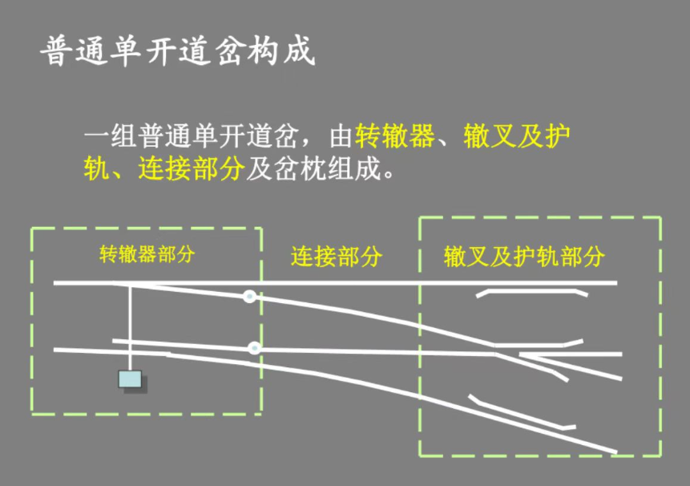

# 轨道交通信号基础知识点复习期中

---

1. 普通单开道岔组成：转辙部分、连接部分、辙叉部分
    - 转辙部分：尖轨，基本轨，连接零件，转辙机械
    - 连接部分：导轨，基本轨
    - 辙叉部分：叉心、翼轨、护轮轨

2. 列车自动运行控制系统（ATC）包括哪三个子系统：
    - 列车自动防护系统（ATP）
    - 列车自动驾驶系统（ATO）
    - 列车自动监控系统（ATS）

3. 轨道电路两个主要作用？按分割方式：车辆段内、正线分别采用什么类型轨道电路？
    - 检测列车是否占用线路
    - 传输ATP信息（传递行车信息）
   车辆段：50Hz相敏轨道电路（公频交流轨道电路）
   正线：音频轨道电路

4. 按照信息是否可变，应答器应分哪两类？
    - 固定应答器
    - 可变应答器

5. 联锁的定义
    - 联锁（Interlocking）是指一套安全保障系统，用来控制铁路信号、道岔和轨道电路之间的逻辑关系，以防止列车冲突和事故的发生。联锁系统确保只有在不会导致列车相撞或发生危险情况的前提下，信号才会显示允许行车的指示，并且道岔才能被转换到适当的位置，允许列车安全通过。
    - 信号、道岔、进路之间相互制约的关系，称为联锁关系，简称联锁，实现它们之间联锁关系的设备称为联锁设备。

6. 分别从线路走向、客流量及列车编组之间比较地铁与轻轨之间的区别？

    - 线路走向:
 ```
    地铁: 地铁系统通常在城市中心区域的地下运行，以避免与城市交通发生冲突。地铁线路往往更直线和高速，以快速通过密集区域。在郊区或者客流量较少的地方，地铁也可能在地面或高架上运行。
    轻轨: 轻轨线路相对更加灵活，它们可以在城市街道上、地下或是高架结构上运行，并且常常与城市其他交通方式（如汽车）共享路权。轻轨线路的曲线半径一般小于地铁，因此轻轨能更好地适应城市现有的街道布局。
 ```

    - 客流量:
 ```
    地铁: 设计用来处理大量客流，通常在高峰时段提供高频率的服务。地铁站之间的距离    通常较长，以提高运行速度和效率。
    轻轨: 轻轨则更适合中等客流量，其站点间距通常比地铁短，因此可以更好地服务于地区间的短途旅行。轻轨车辆通常也能快速启动和停车，适应频繁的停靠。
 ```

    - 列车编组:
 ```
    地铁: 地铁列车的编组通常固定，车辆数量较多，以容纳更多乘客。地铁车辆的设计会更倾向于重型，以承受高密度使用和长时间的运营。
    轻轨: 轻轨车辆一般较短，编组灵活，可以根据客流量的变化调整车辆编组长度。轻轨车辆相对较轻，设计通常更注重能源效率和对城市环境的适应性。
 ```

7. 画出普通右开道岔，并标明各部分组成？

      

8. 若继电器的型号是JPXC-H270，请说明型号中各字母和数字表示的意义？并说明该类型继电器的结构和性能特点？

      JPXC-H270型偏极继电器中，J代表继电器，P代表极化，X代表信号，C代表插入式，H代表缓放，270代表序号。该类型继电器主要用于交流电路中，通过内部的半波或全波整流电路将交流电变为直流电而动作，以避免在AX系列继电器中采用结构形式完全不同的交流继电器，提高产品的系列化、通用化程度。

      偏极继电器的接点系统的结构与无极继电器相同，零部件全部通用，只是接点的编号有区别。其结构包括磁路系统、转换传动系统和接点系统。磁路系统主要由线圈、铁芯、衔铁和轭铁组成，主要作用是产生电磁吸力；转换传动系统主要由衔铁和拉杆组成，主要作用是把电磁吸力转换成拉杆的机械运动，断开或闭合接点；接点系统主要由接点片、接点组组成，主要作用是利用接点的闭合和断开来控制外部电路。

9.  继电器的组成结构图名称？写出安全型继电器吸起落下的原理？

      

      安全型继电器主要由磁路系统、转换传动系统和接点系统组成。其吸气工作原理是在线圈两端加上一定的电压，线圈中就会流过一定的电流，从而产生电磁效应，衔铁就会在电磁力吸引的作用下克服返回弹簧的拉力吸向铁芯，从而带动衔铁的动触点与静触点吸合。其落下工作原理是当线圈断电后，电磁的吸力也随之消失，衔铁就会在弹簧的反作用力返回原来的位置，使动触点与原来的静触点释放，从而达到在电路中的导通、切断的目的。

10. 轨道电路的三种工作状态以及线路空闲、占用的工作原理？ 
    - 调整状态
    - 分路状态
    - 断轨状态
    - 线路空闲：电流从轨道电路电源正极--钢轨--轨道继电器--另一根钢轨--电源负极。继电器吸起——绿灯
    - 线路占用：电流从轨道电路电源正极--钢轨--车轮--另一根钢轨--电源负极。继电器落下——红灯

11.  1435mm标准轨距

12.  继电器 信号机关闭 XJ 落下 道岔开通 DJ 落下 轨道电路空闲GJ 吸起
