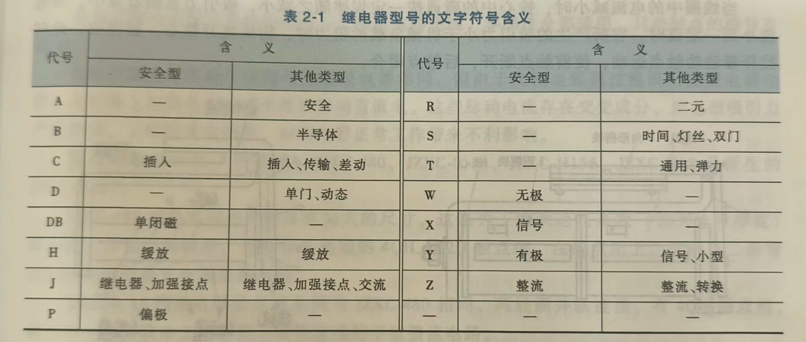
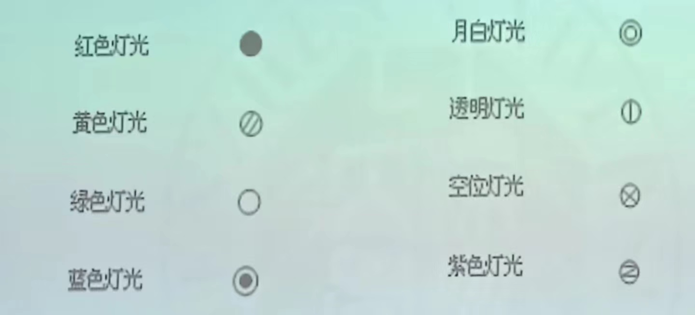

# 轨道交通信号基础期末

---

1. 计轴器及应答器的作用；轨道电路的组成及其作用

   **计轴器的作用**

   - 计轴器通过计算车辆进出区段的车轴数来监督列车占用
   - 在CBTC城轨线路无线设备故障时用计轴器检查列车的位置，构成”降级“信号
   > [!NOTE]
   >
   > 1. 空闲情况检测
   > 2. 列车完整性检查
   > 3. 自动校正列车行驶里程 

   **应答器的作用**

   - 程序定位停车控制
   - 距离定位，也称“信标”
   - CBTC系统中检测列车位置
   > [!NOTE]
   > 1. 列车定位
   > 2. 传出固定和可变信息 

   **轨道电路的组成**

   - 导体、钢轨绝缘、送电设备、受电设备、限流电阻
   - 轨道电路是以铁路线路的两根钢轨作为导体，两端加以机械绝缘（或电气绝缘），用引导线连接电源和接收设备所构成的电气回路。

   **轨道电路的作用**

   - 检测列车是否占用线路，监督列车占用
   - 传输ATP信息（传递行车信息）

2. 继电器JYJXC-135/220的各符号及数字含义；继电器JWXC-1700各部分符号及数学含义？

   
          JYJXC-135/220:

   - J - 继电器；Y - 有极；J - 加强触点；X - 信号；C - 插入式；135-前圈电阻值；220后圈电阻值
   JWXC-1700：
   - J - 继电器；W - 无极；X - 信号；C - 插入式；1700（前后圈电阻值之和，前后圈电阻值相同）

3. 信号定义、信号作用及信号系统组织架构图？

   信号定义：城市轨道交通信号是城市轨道交通保证行车安全的重要设备,是指示列车运行及调车作业进行的命令。

   轨道交通信号与系统作用：

   - 保证列车运行的安全
   - 具有统一指挥功能
   - 提高列车速度、运输效率和服务质量
   - 降低工作人员的劳动强度
   - 降低运营成本

   信号系统组织架构图：

4. S700K转辙机产品各符号及数字含义？

   S——西门子；700——具有700kgf（约6860N）转换力；K——带有滚珠丝杠

5. “手摇道岔六部曲”？

   - 一看：检查道岔及其周围区域是否有异常情况，确保道岔可以安全操作。这包括确认道岔的开通- 位置是否正确，是否需要改变位置，以及道岔尖轨与基本轨之间是否有杂物等。
   - 二开：打开盖孔板。如果有加钩锁器，则需打开钩锁器的锁，拆下钩锁器。
   - 三摇：将手摇把插入盖孔板，通过手摇动作顺时针或逆时针转动道岔到正确位置，直至听到道岔转换到正确位置后清脆的落槽声。
   - 四确认：双人确认道岔转动位置是否正确，确保道岔已经正确地切换到指定的轨道上。
   - 五加锁：解除道岔的解锁状态，使道岔恢复到锁闭状态，以防止列车误入。
   - 六汇报：完成所有操作后，向相关部门汇报操作结果，确保所有步骤都已按照规定执行

6. 闭塞定义；电话闭塞的前提条件、特点及其行车凭证六要素？

   “**闭塞**” 指的是为了安全管理列车运行，在铁路线路上实施的一种控制系统。闭塞系统的目的是确保一段轨道在同一时间内只被一列列车占用，从而避免列车之间的相互碰撞和干扰。
   >[!NOTE] 
   >同一时间、同一地点、同一区间、同一辆列车通行

   列车自动控制系统（ATC）按闭塞制式的不同，可分为固定闭塞式ATC系统、准移动闭塞式ATC系统和移动闭塞式ATC系统。

   **电话闭塞的前提条件：**

   - 信号系统故障
   - 通信设备可用
   - 人员经过培训

   **电话闭塞特点：**

   - 人工操作
   - 效率较低
   - 安全性依赖人员

   **行车凭证（路票）六要素：**

   - 电话记录号码
   
   - 列车车次
   
   - 运行区间
   
   - 值班员签名
   
   - 日期
   
   - 行车专用章

   

7. 信号机设置：

   | 类型           | 标号方法                                                     |
   | -------------- | ------------------------------------------------------------ |
   | 进站信号机     | 上行用S，下行用X；有几个方向线路时，在字母右下角加以线路名拼音字头，如X~S~、S~H~。 |
   | 出站信号机     | 上行用S，下行用X，在字母右下角加股道号，如S~I~，X~II~。      |
   | 接车进路信号机 | 下行用XL，上行用SL。有数架时，加以顺序号，上行双数，下行单数，如SL2，XL1 |
   | 发车进路信号机 | 下行用X，上行用S。在字母后先加车场号，再在右下角加以股道号，如SI~I~，XI~Ⅱ~ |
   | 调车信号机     | 在D字右下角加以顺序号，上行用双号，下行用单号，有数个车场时一百位数表示车场号，如D~1~，D~3~，D~202~ |
   | 预示信号机     | 以Y表示，加在主信号机名称前，如YX，YS                        |
   | 通过信号机     | 以该信号机所在地点坐标公里数和百米数上行为偶数下行为奇数。   |
   | 复示信号机     | 以F字开头，加在主信号机名称前，如FS~I~                       |

     两通过信号机之间距离不少于1200m
     行车信号与道岔防护信号信号显示距离应不小于400m
     调车信号和道岔状态表示器应不小于200m
     引导和道岔状态表示器以外的各种表示器应不小于100m
     各种地面信号机和表示器显示距离为无遮挡条件下的最小显示距离

8. 色灯信号机主要采用颜色特征

   

9. ATO与ATP的关系，ATC系统控制等级应遵循的原则。

   ATP系统主要负责”超速防护“，起保证安全的作用；ATO系统主要负责正常情况下列车的高质量运行。因此ATP系统是ATO系统的基础，ATO系统不能脱离ATP系统单独工作，必须从ATP系统获得基础信息。而且，只有在ATP的基础上才能实现ATO，列车的安全运行才有保证。ATO系统是ATP系统的发展和技术延伸，ATO系统在ATP系统的基础上实现自动驾驶。
   > [!IMPORTANT]
   > ATC系统控制等级应遵循的原则
   > 1. 车辆人工控制优于控制中心人工控制
   > 2. 控制中心人工控制优于控制中心的自动控制或车站自动控制

10. 移动闭塞的定义；并从闭塞方式、闭塞区间及闭塞凭证三方面列表比较半自动闭塞、自动闭塞及电话闭塞三种闭塞方式？

    移动闭塞系统是一种区间不分割、根据连续检测先行列车位置和速度进行列车运行间隔控制的列车安全系统。

    |  闭塞模式  |     闭塞模式     | 闭塞区间 |     闭塞凭证     |
    | :--------: | :--------------: | :------: | :--------------: |
    | 半自动闭塞 | 人工手动按压闭塞 | 两站之间 | 信号显示机的显示 |
    |  自动闭塞  | 设备自动微机联锁 | 两站之间 | 信号显示机的显示 |
    |  电话闭塞  |  人工打电话记录  | 两站之间 |       路票       |

    闭塞方式：

    - 半自动闭塞：依赖于车站操作员通过信号设备手工控制闭塞信号。当列车进入闭塞区段时，操作员需手工设置信号机，以禁止其他列车进入该区段。
    - 自动闭塞：完全依赖于轨道电路和信号设备自动控制闭塞信号。 不需要人工干预，信号设备根据轨道占用情况自动显示信号。
    - 电话闭塞：当信号设备出现故障或无信号设备的线路上，通过电话通信控制列车运行。 依赖于车站之间的直接通信来手工协调列车运行，需要操作员之间通过电话确认。

    闭塞区间：

    - 半自动闭塞：区间长度固定，区段划分根据车站布局和需要进行。区间长度和设置受限于手工操作的便利性和效率。
    - 自动闭塞：区间可以更短，允许更频繁的列车运行，提高铁路线路容量。区间的设置和长度可以根据实际的车流量和速度要求灵活调整。
    - 电话闭塞:区间的设置通常较为简单，因为需要人工协调，可能导致较长的闭塞区间。在无法使用自动或半自动闭塞的特殊情况下使用，区间长度和设置依赖于实际操作的方便性。

    闭塞凭证：
    - 半自动闭塞：闭塞凭证可以是信号机显示的信号。列车司机根据信号机指示进入或禁止进入闭塞区段。
    - 自动闭塞：信号自动显示列车是否允许进入下一闭塞区间。不需要手工发放的闭塞凭证，所有控制通过轨道电路和信号设备自动完成。
    - 电话闭塞：闭塞凭证为口头指令，通常在电话通信中传达给列车司机或调度员。操作员之间通过电话确认列车位置和运行权限，以口头凭证的形式授权列车运行。

11. 六种驾驶模式？

    - ATO：列车自动运行模式，或称为AM
    - ATP：列车自动防护驾驶模式，ATP监督下的人工驾驶模式
    - IATP：IATP监督下的人工驾驶模式（利用信号机的动态信标的信息及速度限制控制列车运行）
    - RM：限制人工驾驶模式，在车辆段内，连锁装置、轨旁电路、轨旁ATP故障
    - NRM：非限制的人工驾驶模式，切除ATP保护
    - AR：自动折返驾驶模式

12. ATP按地面信息的传输方式分为<u>点式ATP</u>和<u>连续式ATP</u>两种结构。

13. 装备ATC系统的自动闭塞包含<u>固定闭塞</u>、<u>准移动闭塞</u>和<u>移动闭塞</u>三项。

14. 色灯信号机实现原理分<u>透镜式色灯信号机</u>和<u>LED式色灯信号机</u>两类。

15. 按供电电源种类划分，ZD6（<u>直流转辙机</u>）、S700K（<u>交流转辙机</u>）属于<u>电动</u>转辙机。

16. 列车检测功能一般由<u>轨道电路</u>或<u>计轴器</u>完成。

17. 轮轴传感器由**两组**<u>发送</u>和<u>接收磁头</u>组成。

18. ATS设备由<u>中央ATS设备</u>、<u>车站ATS设备</u>及<u>车辆段ATS设备</u>组成。

19. 站间闭塞包含：<u>电话闭塞</u>、<u>半自动闭塞</u>和<u>自动站间闭塞</u>。

20. 信号显示制度是指表达信号显示意义的基本体系分为：<u>进路制</u>和<u>速差制</u>。

21. 道岔锁闭的方式，可分为：<u>内锁闭转辙机</u>和<u>外锁闭转辙机</u>。

22. ATP/ATO功能分<u>*ATP/ATO* 轨旁功能</u>、<u>*ATP/ATO*传输功能</u>和<u>*ATP/ATO*车载功能</u>三个子功能。

23. 根据能源供应及信息提供方式，应答器可分为<u>无源应答器</u>及<u>有源应答器</u>。

24. 轨道电路按照电流特性分类，分为<u>工频连续式轨道电路</u>和<u>音频轨道电路</u>

25. 地铁：右侧行车制