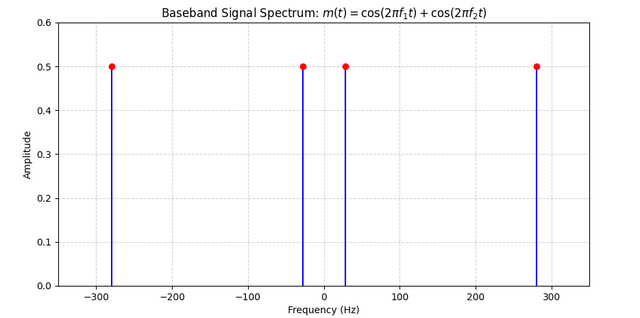
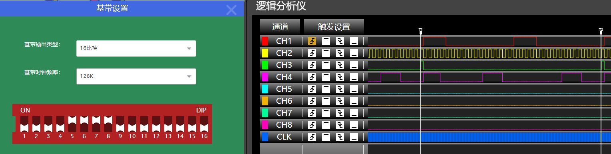
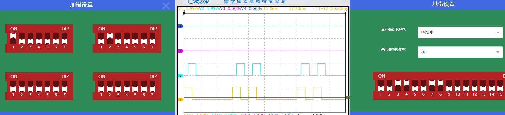

# 通信原理实验

---

本科通信原理课程 - 实验报告

## 实验1 AM与DSB调制解调实验

### 一、实验目的

1. 掌握AM与DSB调制与解调原理
2. 掌握用Simulink可视化仿真平台进行通信系统仿真的方法
3. 了解信号噪声对传输特性的影响

### 二、基本概念复习

**调制的本质就是给信号 “找快递车”**：

- 基带信号（比如声音、图像转化的电信号）频率低，直接传输会被衰减，无法远距离传播。
- 调制就是把基带信号 “装载” 到高频载波上，像快递车一样带着信号跑，这样才能通过天线有效发射。

#### AM 调制（振幅调制）的原理

- 核心逻辑：让载波的振幅随着基带信号的变化而变化。
- AM 调制是一种线性调制技术，通过改变载波信号的振幅，使其与基带信号成线性关系。
- 数学公式：设基带信号为 $m(t)$，载波为 $A_c\cos(\omega_ct)$（其中 $A_c$ 为载波振幅，$\omega_c$ 为载波角频率），则 AM 已调信号 $s_{AM}(t)$ 可表示为：


​			$s_{AM}(t)=[A_c + k_am(t)]\cos(\omega_ct)$

​	其中 $k_a$ 为调制灵敏度，它决定了基带信号对载波振幅的控制能力。

AM 解调：AM 解调是从 AM 已调信号中恢复出原始基带信号的过程，常用的方法是包络检波。包络检波通过硬件电路提取 AM 已调信号的包络，经过滤波等处理后得到原始基带信号。

#### DSB 调制（Double - Sideband Modulation，双边带调制）原理

1.  专业概念：DSB 解调通常采用同步解调（相干解调）的方式，需要在接收端产生一个与发送端载波同频同相的本地载波，与接收信号相乘，从而恢复出原始基带信号。


2.  数学过程：设接收的 DSB 信号为 $s_{DSB}(t)=k_am(t)\cos(\omega_ct)$，本地生成的同步载波为 $\cos(\omega_ct + \varphi)$（$\varphi$ 为相位差），二者相乘后得到：


​		$s_{DSB}(t)\times\cos(\omega_ct + \varphi)=k_am(t)\cos(\omega_ct)\cos(\omega_ct + \varphi)$

利用三角函数的积化和差公式：$\cos A\cos B=\frac{1}{2}[\cos(A + B)+\cos(A - B)]$，经过滤波等处理，当 $\varphi = 0$（即同频同相）时，可恢复出原始基带信号 $m(t)$。

**通俗理解**：发送端用特定频率的载波 “加密” 信号，接收端必须用相同频率且相位一致的载波 “解密”，否则无法正确拆包还原出原始信号。对同步载波的生成要求极高，需要精确保证与发送端载波同频同相，设备复杂度比 AM 解调高。

| 对比维度   | AM 调制                           | DSB 调制                                    |
| ---------- | --------------------------------- | ------------------------------------------- |
| 是否含载波 | 包含载波，载波占大部分功率&#xA;   | 不含载波，只传输边带，功率利用率高&#xA;     |
| 带宽       | 带宽为两倍基带信号带宽&#xA;       | 带宽与 AM 相同，为两倍基带信号带宽&#xA;     |
| 解调难度   | 解调简单，采用包络检波&#xA;       | 解调复杂，需采用同步解调，生成同步载波&#xA; |
| 应用场景   | 常用于广播（如中波 AM 广播）&#xA; | 应用于电视信号（部分频段）、专业通信等领域  |

### 三、实验预习

复习AM与DSB调制与解调方法及系统框图，完成下列各题。

基带信号为复合正弦波 $m(t) = \cos 2\pi f_1 t + \cos 2\pi f_2 t$，其中两个正弦波的频率分别为 $f_1 = $ 学号最后两位；$f_2 = f_1 * 10$。如学号为2号，则 $f_1 = 2\text{Hz}$，$f_2 = 20\text{Hz}$。载波为 $c(t) = \cos 2 \pi f_c t$（可自行确定载波频率，保证能进行正常的调制）；

(*a*)画出基带信号的频谱；

基带信号：
$\quad m(t)=\cos \left(2 \pi f_{1} t\right)+\cos \left(2 \pi f_{2} t\right)$

其中 $f_{1}=28 \mathrm{~Hz}, f_{2}=10 \times f_{1}=280 \mathrm{~Hz}$。

频谱为位于 $\pm f_{1}$ 和 $\pm f_{2}$ 的冲激（双边谱），幅度为 0.5 。



(*b*)确定AM调制时需叠加到信号上的直流分量大小，并画出AM及DSB信号的频谱；

$\begin{aligned}& \text { 直流分量计算: } \\& m(t)_{\max }=|\cos (2 \pi f_{1} t)+\cos (2 \pi f_{2} t)|_{\max }=2 \text {, 故取 } A=2 \text { (最小取值, 避免除调制)。 }\end{aligned}$

- AM 信号频谱:
    - 载波分量: $\pm f_{c}$ (幅度 $A / 2=1$ )
    - 上边带: $f_{c} \pm f_{1} 、 f_{c} \pm f_{2}$ (幅度 0.25)
    - 下边带: $-f_{c} \pm f_{1} 、-f_{c} \pm f_{2}$ (幅度 0.25)

载波频率选择 $f_{c}=1000 \mathrm{~Hz}$ (远高于 $f_{2}=280 \mathrm{~Hz}$ )。

- DSB 信号频谱:

无载波分量, 仅有上下边带（幅度 0.25）。


(*c*)分别画出AM及DSB调制解调系统框图（AM接收采用包络检波），确定接收端理想带通滤波器的通带范围，以及理想低通滤波器的截止频率。

AM系统：

- 带通滤波器（BPF）通带范围：
    $$
    [f_{c} - f_{2},f_{c} + f_{2}] = [1000 - 280, 1000 + 280] = [720, 1280] \text{Hz}
    $$
    确保通带覆盖信号带宽 $2 \times f_{2} = 560 \text{Hz}$。

    带通滤波器（BPF）的作用是选择我们需要的频带，并滤除带外噪声。因为已调信号的频谱在载波频率fc的两侧，带宽为2倍的基带最高频率（即560Hz），所以通带设置为720Hz至1280Hz。
    
- 低通滤波器（LPF）截止频率：
    $$
    f_{\text{cutoff}} = f_{2} = 280 \text{Hz}
    $$
	低通滤波器（LPF）的作用是滤除解调后信号中的高频分量，只保留基带信号。由于基带信号最高频率为280Hz，因此低通滤波器的截止频率设为280Hz。

DSB系统：

- 带通滤波器 (BPF) 通常范围:
    同 AM: $[720,1280] \mathrm{Hz}$ 。

- 低通滤波器（LPF）截止频率:
    同 AM: $280 \mathrm{kHz}$ 。


### 四、系统仿真及波形记录与分析

#### 1. AM传输系统仿真（包络检波）

（1）系统框图及主要模块（基带信号、载波、带通滤波器、低通滤波器）的参数设置（**注意：仿真的滤波器的传输特性并非理想的矩形特性，设置截止频率时应考虑到滤波器的过渡频带对传输信号的影响**）。


设置A0为83，此时调制度为 0.3;设置载波为 128k. 

​	1.基带信号m(t)
​		表达式：m(t)=sin(2π⋅1k⋅t)+sin(2π⋅3k⋅t)
​		频率成分：1 kHz 和 3 kHz 的正弦波，带宽为3 kHz−1 kHz=2 kHz。
​		最高频率：3 kHz。
​	2.载波信号
​		调制类型：AM（调幅）
​		AM 表达式：(A0+m(t))⋅cos(2πfct)，其中A0为载波幅度。
​		调制指数（AM）：
 		MA=调制信号幅度/A0
 		若MA=1，则A0=25（假设调制信号幅度为 25，避免过调幅）。
​		载波频率fc：需远高于基带信号最高频率（3 kHz），假设为fc=100 kHz。
​	3.带通滤波器（调制输出后）
​		中心频率：与载波频率一致，即100 kHz。
​		带宽：覆盖调制信号边带，即2×3 kHz=6 kHz。
​		频率范围：97 kHz∼103 kHz97kHz∼103kHz。
​	4.低通滤波器（解调后）
​		截止频率：基带信号最高频率3 kHz，用于滤除高频分量，保留原始信号。

（2）系统各点波形及频谱对比（在一个示波器中以多通道方式进行对比）

a. 波形对比

​	对比发送端基带信号、AM已调信号、接收端解调信号的波形，并进行简要说明。


黄色线——基带信号；浅蓝色线——本振信号；紫色线——添加直流分量输出；深蓝色线——调制输出

使用MATLAB进行波形AM调制波形绘制：


基带信号频率通常远低于载波频率。

AM 信号的波形为高频载波（频率 $f_c$）的幅度随基带信号线性变化，其包络严格跟随基带信号的形状。

接收端解调信号：通过包络检波器提取 AM 信号的包络，恢复出基带信号。

b. 频谱对比

对比发送端基带信号、AM已调信号及接收端解调信号的频谱，并进行简要说明。

|  |  |  |
| :----------------------------------------------------------: | :----------------------------------------------------------: | :----------------------------------------------------------: |
|                         基带信号频谱                         |                        AM已调信号频谱                        |                        接收端解调信号                        |

发送端基带信号： 频谱集中在低频段，能量分布对称于零频。

接收端解调信号：频谱通过包络检波和低通滤波后，仅保留基带信号的原始频谱，载波和边带分量被滤除。若解调过程无失真，频谱与发送端基带信号完全一致。

AM 已调信号： 频谱由载波分量、上边带（USB）、下边带（LSB）组成，总带宽为 $2f_m$，是基带信号带宽的两倍。

（3）噪声对系统的影响

a. 接收端无带通滤波器时，信道有噪声和无噪声时接收信号波形和频谱对比，进行简要说明。

- 波形
  - 无噪声：接收信号为理想 AM 波形，包络平滑且严格跟随基带信号。
  - 有噪声：噪声（通常为高斯白噪声）直接叠加到 AM 信号上，导致包络出现随机波动，解调后的基带信号产生毛刺或失真。噪声强度越高，波形失真越明显。
- 频谱
  - 无噪声：频谱为干净的载波和对称边带。
  - 有噪声：噪声分布在整个频谱范围内，信噪比（SNR）下降。噪声功率谱密度（PSD）均匀分布于系统带宽内

b. 有噪声情况下，接收端无带通滤波器和有带通滤波器时接收信号波形和频谱对比，进行简要说明。

- 波形：
  - 无带通滤波：噪声未被抑制，解调信号受高频噪声干扰，波形毛刺严重。
  - 有带通滤波：带通滤波器（中心频率 $f_c$，带宽 $2f_m$）滤除带外噪声，仅保留 AM 信号的边带和载波分量，解调波形更平滑，噪声显著降低。
- 频谱：
  - 无带通滤波：噪声覆盖整个频谱，边带和载波被噪声基底包围。
  - 有带通滤波：噪声仅存在于滤波器通带内（$f_c \pm f_m$），通带外噪声被大幅衰减，频谱基底变干净，边带和载波分量更清晰。

#### 2.DSB传输系统仿真

（1）系统框图及主要模块的参数设置


​	1.基带信号m(t)m(t)
​		表达式：m(t)=sin(2π⋅1k⋅t)+sin(2π⋅3k⋅t)
​		频率成分：1 kHz 和 3 kHz 的正弦波，带宽为3 kHz−1 kHz=2 kHz。
​		最高频率：3 kHz。
​	2.载波信号
​		调制类型： DSB（抑制载波双边带）。
​		DSB 表达式：m(t)⋅cos(2πfct)m(t)（无载波分量，A0=0）。
​		载波频率fc：需远高于基带信号最高频率（3 kHz），假设为fc=100 kHz。
​	3.带通滤波器（调制输出后）
​		中心频率：与载波频率一致，即100 kHz。
​		带宽：覆盖调制信号边带，即2×3 kHz=6 kHz。
​		频率范围：97 kHz∼103 kHz97kHz∼103kHz。
​	4.低通滤波器（解调后）
​		截止频率：基带信号最高频率3 kHz，用于滤除高频分量，保留原始信号。

（2）系统各点波形及频谱对比（在一个示波器中以多通道方式进行对比）

a. 波形对比

对比发送端基带信号、DSB已调信号、接收端解调信号的波形，并进行简要说明。


黄线为发送端基带信号、深蓝色线为DSB已调信号、紫色线为接收端解调信号的波形

使用MATLAB进行DSB调制波形绘制：


发送端基带信号：与 AM 系统相同，为低频模拟信号（如正弦波），波形表现为连续变化的幅度调制信号。

DSB 信号的波形为高频载波（频率 $f_c$）的幅度随基带信号变化，但载波分量被抑制，仅保留上下边带，其波形表现为高频振荡，幅度由基带信号的绝对值决定，包络与基带信号的绝对值成正比。接收端解调信号：需通过同步检波（相干解调）

恢复基带信号：本地载波与接收的 DSB 信号相乘，频谱搬移至基带，经低通滤波后，输出基带信号。

b.频谱对比

对比发送端基带信号、DSB已调信号及接收端解调信号的频谱，并进行简要说明。

|  |  |  |
| :----------------------------------------------------------: | :----------------------------------------------------------: | :----------------------------------------------------------: |
|                       发送基带信号频谱                       |                       DSB已调信号频谱                        |                        接收端解调信号                        |

发送端基带信号： 频谱与 AM 系统相同，集中在低频段。

DSB 已调信号： 频谱仅包含上下边带（位于 $f_c \pm f_m$），无载波分量，边带结构与基带信号频谱相同（USB 为正频移，LSB 为负频移镜像）。总带宽仍为 $2f_m$，但能量仅分布在边带，功率利用率高于 AM。

接收端解调信号： 同步检波后，频谱恢复为基带信号的原始频谱，边带分量被滤除。理想情况下，频谱与发送端基带信号完全一致。

（3）噪声对系统的影响

a. 接收端无带通滤波器时，信道有噪声和无噪声时接收信号波形和频谱对比，进行简要说明。

- 波形：
  - 无噪声：DSB 信号为干净的高频振荡，包络由基带信号绝对值决定。
  - 有噪声：噪声叠加到 DSB 信号上，导致高频振荡幅度随机波动。同步检波后，噪声被下变频至基带，解调信号出现高频毛刺或幅度失真。
- 频谱：
  - 无噪声：频谱仅含对称的上下边带，无载波。
  - 有噪声：噪声分布在整个频谱，SNR 下降。由于 DSB 信号带宽与 AM 相同（$2f_m$），噪声功率与 AM 相当，但 DSB 的信号功率仅为 AM 的一半（无载波），因此同等噪声条件下，DSB 的 SNR 低于 AM。

b. 有噪声情况下，接收端无带通滤波器和有带通滤波器时接收信号波形和频谱对比，进行简要说明。

- 波形：
  - 无带通滤波：噪声未被抑制，同步检波后的解调信号受高频噪声干扰，波形失真严重。
  - 有带通滤波：带通滤波器（中心频率 $f_c$，带宽 $2f_m$）滤除带外噪声，仅保留 DSB 信号的边带，解调波形更平滑，噪声显著降低1027。
  
- 频谱：
  - 无带通滤波：噪声覆盖整个频谱，边带被噪声基底包围。
  
  - 有带通滤波：噪声仅存在于滤波器通带内（$f_c \pm f_m$），通带外噪声被大幅衰减，边带分量更清晰，频谱基底降低。由于 DSB 无载波，带通滤波后的噪声功率与 AM 相同，但 DSB 的信号功率较低，因此带通滤波对 DSB 的 SNR 改善效果弱于 AM。

## 实验2 PAM调制与抽样定理实验

### 一、实验目的

1、掌握抽样定理原理，了解自然抽样、平顶抽样特性；

2、理解抽样脉冲脉宽、频率对恢复信号的影响；

3、理解恢复滤波器幅频特性对恢复信号的影响；

4、了解混叠效应产生的原因。

### 二、基本概念复习

#### 抽样定理

想象你用手机拍视频，每秒拍的帧数越多，视频越流畅；如果帧数太少，动作就会卡顿（比如慢动作变跳跃式播放）。

抽样定理就像给信号 “拍照” 的规则：要想从 “照片”（抽样后的信号）还原出原来的信号（比如声音、图像），必须保证 “拍照” 的频率足够高。具体来说：如果一个信号中最高频率的成分是 fmax，那么每秒至少要 “拍” 2×fmax 张 “照片”（即抽样频率 fs ≥ 2×fmax），否则还原时信号会 “失真”（像视频卡顿一样，信号变形）。

#### 奈奎斯特抽样定理（Nyquist Sampling Theorem）：
对于带宽有限的模拟信号（最高频率为 $  f_{\text{max}}  $），若以不小于 $  2f_{\text{max}}  $ 的频率对其抽样，则抽样后的离散信号可以完整保留原信号的所有信息，且能通过低通滤波器无失真还原。


*   最低抽样频率 $  f_{\text{s}} = 2f_{\text{max}}  $ 称为奈奎斯特频率，其倒数 $  T_{\text{s}} = 1/f_{\text{s}}  $ 为抽样周期。


*   若 $  f_{\text{s}} < 2f_{\text{max}}  $，会出现混叠现象（高频信号被误认为低频信号）。

#### 抽样方式：


*   理想冲激抽样：用单位冲激序列对信号抽样，数学上表示为 $  x_{\text{s}}(t) = x(t) \sum_{n=-\infty}^{\infty} \delta(t-nT_{\text{s}})  $。


*   自然抽样（曲顶抽样）：抽样脉冲为矩形脉冲，顶部随原信号幅度变化。


*   平顶抽样：抽样后的脉冲幅度保持为抽样时刻的信号值，直到下一个抽样时刻。

#### PAM 调制：信号 “量化” 的前一步

假设你要把一段声音存进电脑，但声音是连续变化的（比如说话的音量高低起伏），电脑只能处理数字信号（0 和 1）。怎么办？

先用抽样定理对声音 “拍照”（抽样），得到一系列离散的时间点；每个时间点的声音 “大小”（幅度）用一个脉冲表示，脉冲的 “高度”（振幅）对应此时的声音幅度 —— 这就是 **PAM（脉冲振幅调制）**。PAM 信号就像给信号 “画刻度”，后续再把这些刻度 “四舍五入”（量化）成数字，就能变成电脑认识的 0 和 1 了（比如 PCM 编码）。

#### 脉冲振幅调制（Pulse Amplitude Modulation, PAM）

一种将模拟信号的幅度信息映射到脉冲序列振幅上的调制方式。具体过程：

*   对模拟信号 $  x(t)  $ 按抽样周期 $  T_{\text{s}}  $ 抽样，得到抽样值 $  x(nT_{\text{s}})  $；


*   用一组脉冲序列表示这些抽样值，每个脉冲的振幅与 $  x(nT_{\text{s}})  $ 成正比，波形为 $  s_{\text{PAM}}(t) = \sum_{n=-\infty}^{\infty} x(nT_{\text{s}}) p(t-nT_{\text{s}})  $，其中 $  p(t)  $ 为脉冲形状（如矩形脉冲）。

#### PAM 与抽样定理的关系：


*   PAM 是抽样定理在实际信号处理中的应用之一，抽样后的信号经 PAM 调制后，成为离散振幅的脉冲序列，为后续的量化和编码（如 PCM）奠定基础。

> 注意：PAM 信号本质上仍为模拟信号（振幅连续），而量化后才成为数字信号（振幅离散）。

| 模块     | 通俗理解                                                | 专业要点                                                     |
| -------- | ------------------------------------------------------- | ------------------------------------------------------------ |
| 抽样定理 | 信号 “拍照” 的最低频率要求&#xA;                         | $  f_{\text{s}} \geq 2f_{\text{max}}  $，否则混叠；通过低通滤波器验证还原效果。&#xA; |
| PAM 调制 | 用脉冲高度表示信号幅度&#xA;                             | 抽样后对每个抽样值进行振幅调制，波形为离散脉冲序列，振幅与原信号瞬时值相关。&#xA; |
| 实验目的 | 验证抽样频率对信号还原的影响&#xA;                       | 对比不同 $  f_{\text{s}}  $ 下的 PAM 波形及还原信号，观察混叠现象。&#xA; |
| 典型现象 | $  f_{\text{s}} < 2f_{\text{max}}  $ 时信号 “扭曲”&#xA; | 示波器中可见 PAM 波形失真，还原信号与原信号差异明显。        |

### 三、实验预习

预习实验指导，完成下列各题。

模拟信号为2kHz的正弦波，用理想冲激序列进行抽样，接收端通过一个理想低通滤波器进行恢复。试对以下两种情况进行分析：

（1）冲激序列抽样频率为8kHz，低通滤波器的截止频率为3kHz，在通带范围内*H*(*f*)=1；画出原模拟信号、已抽样信号和恢复信号的频谱图；说明恢复信号与原模拟信号相比是否有失真。


抽样频率为 8kHz，它大于原始信号最高频率 2kHz 的两倍，符合奈奎斯特抽样定理。低通滤波器截止频率设为 3kHz，能保证完整保留原始信号频谱，同时阻隔镜像频谱，所以恢复信号不会有失真。

（2）冲激序列抽样频率为3kHz，低通滤波器的截止频率为3kHz，在通带范围内*H*(*f*)=1；画出原模拟信号、已抽样信号和恢复信号的频谱图；说明恢复信号与原模拟信号相比是否有失真。


抽样频率是 3kHz，低于奈奎斯特频率，这会造成频谱混叠。尽管低通滤波器截止频率为 3kHz，但混叠已然出现，使得恢复信号产生失真。

### 四、实验数据记录及分析

#### 1、自然抽样验证

单频正弦波的自然抽样：设置单频正弦波频率为2kHz，抽样序列频率8kHz，占空比为50%（4/8），恢复滤波器截止频率为3kHz。

（1）记录原模拟信号、抽样序列、已抽样信号和恢复信号的波形，并说明恢复信号与原模拟信号相比是否有失真。


黄线为原始信号波形、紫线为抽样输出波形、蓝线为抽样脉冲波形、深蓝色线为恢复信号波形。

通过对比恢复信号与原模拟信号，可以发现，信号没有出现失真。

（2）分别记录原模拟信号、已抽样信号、恢复信号的频谱，并与预习报告中的理论分析结果进行比较。

|  |  |
| :----------------------------------------------------------: | :----------------------------------------------------------: |
|                         原始信号频谱                         |                         抽样脉冲频谱                         |
|  |  |
|                  已抽样信号（抽样输出）频谱                  |                        恢复信号的频谱                        |

对比原模拟信号、已抽样信号、恢复信号的频谱，发现与实验预习中理论分析结果一致。

#### 2、频谱混叠现象验证

单频正弦波的频谱混叠现象验证：单频正弦波频率为2kHz，抽样序列频率3kHz，占空比为50%（4/8），恢复滤波器截止频率为3kHz。

（1）记录原模拟信号、抽样序列、已抽样信号和恢复信号的波形，并说明恢复信号与原模拟信号相比是否有失真。


  黄线为原模拟信号波形、蓝线为抽样序列波形、紫线为已抽样信号波形、深蓝色线为恢复信号波形。

  对比恢复信号与原模拟信号，发现信号出现失真。

（2）分别记录原模拟信号、已抽样信号、恢复信号的频谱。恢复信号的频谱与预习报告中的理论结果是否一致？

|  |  |  |
| ------------------------------------------------------------ | ------------------------------------------------------------ | ------------------------------------------------------------ |
| 原模拟信号频谱                                               | 已抽样信号频谱                                               | 恢复信号频谱                                                 |
| 原始模拟信号的频谱分布，展示信号在频域的能量分布特性。       | 经过抽样后的信号频谱，体现抽样定理对频谱的影响（周期性复制现象）。 | 通过重建滤波器恢复的信号频谱，反映信号重建后的频域特性及可能的失真情况。 |

  通过对比原模拟信号、已抽样信号、恢复信号的频谱图像，分析结果与预习报告中的理论结果一致。

#### 3、抽样脉冲占空比对恢复信号的影响验证

设置单频正弦波频率为2kHz，抽样序列频率8kHz，恢复滤波器截止频率为3kHz。保持原模拟信号幅度不变，分别改变窄脉冲抽样序列的占空比为1/8、4/8、7/8。记录原模拟信号与各次恢复波形（注意记录波形幅度值）及相应的频谱，总结变化规律并进行说明。

原模拟信号为振幅为0.816V，频率与恢复信号相同的正弦波。

窄脉冲抽样序列的占空比为1/8：信号幅度为0.188V

|  |  |
| :----------------------------------------------------------: | :----------------------------------------------------------: |

窄脉冲抽样序列的占空比为4/8：信号幅度为0.800V

|  |  |
| :----------------------------------------------------------: | :----------------------------------------------------------: |

窄脉冲抽样序列的占空比为7/8：信号幅度为1.302V

|  |  |
| :----------------------------------------------------------: | :----------------------------------------------------------: |

抽样脉冲的占空比定义为脉冲宽度与脉冲周期的比值，它会直接影响抽样信号的频谱结构。根据傅里叶变换理论，窄脉冲抽样可视为信号与抽样脉冲序列的乘积，而占空比的变化会改变抽样脉冲的频谱特性，进而影响恢复信号的质量。存在最优占空比（本实验中$D=4/8$），此时恢复信号幅度最大、失真最小占空比偏离最优值时，恢复信号幅度下降，失真程度增加。

#### 4、平顶抽样验证

设置模拟信号为正弦波，频率为1KHz；设置抽样脉冲频率8KHz，占空比50%（4/8）；将切换开关分别打到“自然抽样”和“平顶抽样”，记录已抽样信号波形和对应的频谱，进行对比并说明原因。

自然抽样：

|  |  |
| :----------------------------------------------------------: | :----------------------------------------------------------: |
|                          已抽样波形                          |                        已抽样波形频谱                        |

平顶抽样：

|  |  |
| :----------------------------------------------------------: | :----------------------------------------------------------: |
|                          已抽样波形                          |                        已抽样波形频谱                        |

| 对比维度     | 自然抽样（曲顶抽样）                                         | 平顶抽样（零阶保持抽样）                                     |
| ------------ | ------------------------------------------------------------ | ------------------------------------------------------------ |
| 时域波形     | 抽样脉冲顶部随正弦波轮廓变化，脉冲幅度与抽样时刻信号值一致，脉冲之间不连续。 | 抽样后信号在每个抽样间隔内保持抽样时刻的幅值，形成平顶矩形脉冲，脉冲之间连续连接。 |
| 波形失真     | 脉冲顶部保留原信号波形特征，失真主要来自抽样间隔的离散化     | 平顶脉冲使波形出现 “台阶状” 阶梯，抽样间隔内信号被强制保持为恒定值，引入形状失真 |
| 幅度特性     | 抽样脉冲幅度严格等于原信号在抽样时刻的瞬时值                 | 平顶脉冲幅度与原信号抽样值一致，但脉冲宽度固定为占空比对应的时长 |
| 频谱结构     | 由原信号频谱（1kHz）以 8kHz 为周期重复复制，各次谐波分量间通过 sinc 函数加权 | 频谱同样以 8kHz 为周期复制，但每个复制频谱被额外乘以 sinc (f・τ) 函数（τ 为脉冲宽度），形成幅度衰减 |
| 孔径效应影响 | 无明显孔径效应                                               | 存在显著孔径效应，频谱因 sinc 加权产生频率响应失真，需额外校正 |

- 自然抽样： 本质是信号与抽样脉冲序列的乘积，数学表达式为：$x_s(t) = x(t) \cdot \sum_{n=-\infty}^{\infty} p(t-nT_s)$ 其中$p(t)$为占空比 50% 的矩形脉冲，抽样结果在脉冲持续期内保留原信号波形。
- 平顶抽样： 可视为自然抽样后经 “零阶保持” 处理，即每个抽样值被保持至下一个抽样时刻，数学表达式为：$x_s(t) = \sum_{n=-\infty}^{\infty} x(nT_s) \cdot rect\left(\frac{t-nT_s}{\tau}\right)$ 其中$rect()$为矩形窗函数，导致时域波形出现阶梯状保持。

> - 平顶抽样中，脉冲宽度$\tau$不为零，相当于在抽样时刻对信号进行 “保持”，这会引入频率响应失真，称为孔径效应。其本质是零阶保持器的频率响应$\text{sinc}(f\tau)$对原信号频谱的加权，导致恢复信号时高频成分衰减，相位产生非线性偏移。
> - 自然抽样因脉冲顶部随信号变化，未强制保持，故不存在孔径效应。

自然抽样与平顶抽样的核心差异在于 “抽样脉冲是否保持幅值”：自然抽样保留信号瞬时特征，平顶抽样引入保持过程。平顶抽样的频谱失真源于零阶保持带来的 sinc 加权，即孔径效应，而自然抽样在理想情况下更接近理论上的 “理想抽样”。

## 实验三 PCM编译码实验

### 一、实验目的

1、理解PCM编译码原理及PCM编译码性能；
2、熟悉PCM编译码专用集成芯片的功能和使用方法及各种时钟间的关系；
3、熟悉语音数字化技术的主要指标及测量方法。

### 二、基本概念复习

#### PCM概念

PCM 全称是 “脉冲编码调制”，简单来说，就是把我们平时听到的声音、看到的模拟信号（比如连续变化的电压），变成计算机能识别的数字信号（0 和 1 组成的代码），这样才能在数字通信系统里传输。

将模拟信号通过抽样、量化、编码三个步骤转换为数字信号的过程，是数字通信中最基本的信号数字化方法。

#### PCM 的核心步骤：抽样、量化、编码

1. 抽样：把连续信号切成 “快照”

   就像拍照一样，每隔一小段时间测一次模拟信号的大小。比如声音信号是连续的波形，抽样就是在固定时间点记录它的幅度值，把连续信号变成一串离散的点。

   抽样定理（奈奎斯特定理）
   *   抽样频率 $  f_s  $ 需至少为模拟信号最高频率 $  f_m  $ 的 2 倍（$  f_s \geq 2f_m  $），才能从抽样信号中无失真恢复原始信号。
   *   例：语音信号最高频率约 3.4kHz，抽样频率通常取 8kHz（满足 2×3.4kHz）。


2. 量化：给 “快照” 分档编号

   抽样得到的数值可能有很多小数（比如 3.2V、5.7V），但计算机只认整数怎么办？我们把这些数值分到不同的 “箱子” 里，每个箱子对应一个整数。比如把 0-10V 分成 8 档，3.2V 归到 3V 这一档，5.7V 归到 6V 这一档，这就是 “量化”。分的档越多，精度越高，但数字代码也会越长。

   量化
   *   均匀量化量化间隔相等，适用于信号幅度分布均匀的场景。
   *   非均匀量化（压缩扩张）： 对小信号用小间隔、大信号用大间隔，提高小信号的量化精度（如 A 律 13 折线、μ 律压缩，常用于语音通信）。
   *   量化误差：量化值与真实值的差值，最大误差为量化间隔的一半（$  \pm \Delta/2  $）。


3. 编码：给每一档 “贴标签”

   每一档对应一个二进制数（比如 000、001、010…），这就是编码。比如刚才的 8 档，用 3 位二进制数就能表示（2³=8）。这样，每个抽样点的幅度值就被转换成了一串 0 和 1 的代码，比如 3V 对应 011，6V 对应 110，这串代码就是 PCM 编码结果。

    编码
    *   编码位数 $  n  $ 与量化级数 $  L  $ 的关系：$  L = 2^n  $。
	*   例：8 位编码对应 256 级量化，码率为 $  n \times f_s  $（如 8 位 ×8kHz=64kbit/s，即传统电话的传输速率）。

#### PCM 编译码系统组成

编码器
*   功能：完成抽样、量化、编码，输出二进制码流。
*   关键器件：抽样保持电路、量化器、编码器（如 A 律 13 折线编码器）。

解码器
*   功能：将二进制码流还原为量化后的抽样值，再通过低通滤波器恢复模拟信号。
*   关键步骤：码型转换、解码重建、平滑滤波。

### 三、实验预习

1、请画出PCM系统的原理框图。（可参考书上图10-17）


2、设信号归一化的抽样值为-955个量化单位（一个量化单位Δ=1/2048），求13折线量化编码后的码字。

- 符号位确定

抽样值为负数，符号位设为 0（正数为 1）。

- 段落位置判断—— 确定抽样值在哪一段 “区间” 里

​	13 折线正方向各段落对应的量化单位范围如下：

| 段落号 | 量化单位范围（Δ） | 段落长度（Δ） |
| ------ | ----------------- | ------------- |
| 1      | 0~16              | 16            |
| 2      | 16~32             | 16            |
| 3      | 32~64             | 32            |
| 4      | 64~128            | 64            |
| 5      | 128~256           | 128           |
| 6      | 256~512           | 256           |
| 7      | 512~1024          | 512           |
| 8      | 1024~2048         | 1024          |

- 算 “段落码”（第 2-4 位）—— 每段对应一个 3 位二进制数

  段落码由 3 位二进制表示，第 7 段的段落码为 110。

- 算 “段内码”（第 5-8 位）—— 在段落里再细分 16 小格
  1. 段内小格的大小：第 7 段的范围是 512Δ~1024Δ，总长度是 1024-512=512Δ。把这段分成 16 个小格，每个小格的大小是：$512Δ ÷ 16 = 32Δ$（每个小格代表 1 个段内量化级）。
  2. 抽样值在段内的位置：
     - 从第 7 段起点 512Δ 到抽样值 955Δ 的距离是：955 - 512 = 443Δ。
     - 443Δ 里包含多少个 32Δ？用除法算：$443 ÷ 32 = 13$（商），余数 27（余数表示没填满一个小格，但段内级只看商，从 0 开始数）。
     - 段内级从 0 开始数：0 级、1 级……13 级，共 14 级（因为 16 格对应 0~15 级，这里商 13 对应第 14 格）。
  3. 段内级转二进制：13 的 4 位二进制是1101（因为 2³+2²+2⁰=8+4+1=13）。

- 组合起来：8 位编码 = 符号位 + 段落码 + 段内码

  符号位：0；段落码：110；段内码：1101；最终码字：0 110 1101 → 01101101

### 四、实验数据记录及分析

#### 1、PCM编码原理验证

设置原始信号为：“正弦”，频率：1KHz，幅度设置指示为45。

（1）PCM串行接口时序观察

用示波器同时观测抽样脉冲信号2TP9和输出时钟信号2TP8，观测时以2TP9做同步。记录波形，分析PCM编码抽样脉冲信号与输出时钟的对应关系（同步沿、抽样脉冲宽度等）。


黄色线为抽样脉冲波形、蓝色线为编码时钟波形。

抽样脉冲的上升沿与输出时钟的上升沿严格对齐，确保抽样时刻与时钟周期同步。抽样脉冲的同步沿会固定出现在时钟的每8个周期，保证采样时序的规律性。


（2）PCM串行接口时序观察

抽样时钟信号与PCM编码数据测量：用示波器同时观测抽样脉冲2TP9、编码时钟2TP8和编码输出信号2P6，观测时以2TP9做同步。记录相应波形和至少两组编码数据，分析PCM编码输出与抽样脉冲信号（数据输出与抽样脉冲沿）及输出时钟的对应关系。

|  |  |
| :----------------------------------------------------------: | :----------------------------------------------------------: |
|                      编码值为0000 0010                       |                      编码值为0011 1000                       |

黄色线为抽样脉冲波形、蓝色线为编码时钟波形。紫色线为PCM编码输出。

（3）在液晶屏上观测PCM编码

用鼠标点击PCM编译码框图右上角“！”号，液晶屏上出现PCM编码解析图。观察模拟信号、抽样脉冲、量化值、编码值等相关波形和参数，记录相应结果。

|  |  |
| :----------------------------------------------------------: | :----------------------------------------------------------: |

#### 2、PCM译码观测

点击闭合开关，连接编码输出（2P6）和译码输入（7TP5），PCM输出编码数据由A7模块译码。将输入模拟信号调整为频率1kHz，峰峰值为2V的正弦波，用示波器同时观测输入模拟信号2P7和译码器输出信号7P8，观测并记录波形，分析输出信号的质量。


对比输入模拟信号2P7和译码器输出信号7P8，输出信号存在波形细微失真、幅度衰减，但总体与输入模拟信号保持相同。

#### 3、PCM频率响应测量

将测试信号电平固定在2V峰峰值，调整测试信号频率，观测译码恢复出的模拟信号电平。观测输出信号电平相对输入信号频率变化的关系。用点频法测量。测量频率范围：300Hz～4KHz。将测试数据记录在下表中，用描点法画出频率响应特性（横轴为频率，纵轴为输出信号幅值），并做简要分析。

<center>表3-1 系统频响特性</center>


| 输入信号  频率（kHz） | 0.3   | 0.4   | 0.5  | 0.6  | 0.7  | 0.8  | 0.9  | 1.0  | 1.1  | 1.2  | 1.3  | 1.4  | 1.5  | 1.6  | 1.8  |
| --------------------- | ----- | ----- | ---- | ---- | ---- | ---- | ---- | ---- | ---- | ---- | ---- | ---- | ---- | ---- | ---- |
| 输出信号  峰峰值（V） | 0.942 | 0.408 | 2.04 | 2.38 | 2.56 | 2.60 | 2.50 | 2.46 | 2.38 | 2.22 | 2.04 | 2.10 | 2.22 | 2.40 | 2.50 |

| 输入信号  频率（kHz） | 2.0  | 2.2  | 2.4  | 2.6  | 2.8  | 3.0  | 3.1  | 3.2  | 3.3  | 3.5  | 3.6   | 3.7  | 3.8  | 3.9  | 4.0  |
| --------------------- | ---- | ---- | ---- | ---- | ---- | ---- | ---- | ---- | ---- | ---- | ----- | ---- | ---- | ---- | ---- |
| 输出信号  峰峰值（V） | 2.38 | 2.29 | 2.13 | 2.34 | 2.66 | 2.40 | 2.24 | 1.96 | 1.56 | 0.47 | 0.156 | 0    | 0    | 0    | 0    |

#### 4、PCM译码失真测量

将测试信号频率固定在1KHz，改变测试信号电平（输入信号的最大幅度为3Vpp。），用示波器定性观测译码恢复出的模拟信号质量（通过示波器对比编码前和译码后信号波形平滑度）。记录几个典型的波形，并进行简要分析。

|  |  |
| :----------------------------------------------------------: | :----------------------------------------------------------: |
|  |  |

信噪比（SNR）随电平的变化

- PCM 的理论 SNR 公式为：SNR = 6.02n + 1.76 + 10lg (S/P)，其中 n 为编码位数，S 为信号功率，P 为量化噪声功率。
- 当输入电平增加时，信号功率 S 线性增长，而量化噪声功率 P 基本固定（由量化阶数决定），因此 SNR 提高，表现为波形中噪声分量（抖动）减少，平滑度提升。

## 实验4 基带传输及眼图观测

### 一、实验目的

1、理解眼图的概念，能用示波器观测眼图；
2、会用眼图分析通信系统性能；

### 二、基础概念讲解

#### 眼图的概念

所谓“眼图”，就是由解调后经过接收滤波器输出的基带信号，以码元时钟作为同步信号，基带信号一个或少数码元周期反复扫描在示波器屏幕上显示的波形称为眼图。干扰和失真所产生的传输畸变，可以在眼图上清楚地显示出来。因为对于二进制信号波形，它很像人的眼睛故称眼图。

在整个通信系统中，通常利用眼图方法估计和改善（通过调整）传输系统性能。我们知道，在实际的通信系统中，数字信号经过非理想的传输系统必定要产生畸变，也会引入噪声和干扰，也就是说，总是在不同程度上存在码间串扰。在码间串扰和噪声同时存在情况下，系统性能很难进行定量的分析，常常甚至得不到近似结果。为了便于评价实际系统的性能，常用观察眼图进行分析。

眼图可以直观地估价系统的码间干扰和噪声的影响，是一种常用的测试手段。

在下图眼图示意图中画出两个无噪声的波形和相应的“眼图”，一个无失真，另一个有失真(码间串扰)。

在图中可以看出，眼图是由虚线分段的接收码元波形叠加组成的。眼图中央的垂直线表示取样时刻。当波形没有失真时，眼图是一只“完全张开”的眼睛。在取样时刻，所有可能的取样值仅有两个：+1或-1。当波形有失真时，“眼睛”部分闭合，取样时刻信号取值就分布在小于+1或大于-1附近。这样，保证正确判决所容许的噪声电平就减小了。换言之，在随机噪声的功率给定时，将使误码率增加。“眼睛”张开的大小就表明失真的严重程度。


<center>图 无失真及有失真时的波形及眼图</center>

(a) 无码间串扰时波形；无码间串扰眼图

(b) 有码间串扰时波形；有码间串扰眼图

#### 眼图参数及系统性能

眼图的垂直张开度表示系统的抗噪声能力，水平张开度反映过门限失真量的大小。眼图的张开度受噪声和码间干扰的影响，当信道信噪比很大时眼图的张开度主要受码间干扰的影响，因此观察眼图的张开度就可以评估系统干扰的大小。


<center>图 眼图模型</center>

其中，垂直张开度 $E_0 = \frac{V_1}{V_2}$；水平张开度 $E_1 = \frac{t_1}{t_2}$。

从眼图中我们可以得到以下信息：
（1）最佳抽样时刻是“眼睛”张开最大的时刻。
（2）眼图斜边的斜率表示了定时误差灵敏度。斜率越大，对位定时误差越敏感。
（3）在抽样时刻上，眼图上下两分支阴影区的垂直高度，表示最大信号畸变。
（4）眼图中央的横轴位置应对应于判决门限电平。
（5）在抽样时刻上，眼图上下两阴影区的间隔距离的一半为噪声容限，若噪声瞬时值超过它就会出现错判。
（6）眼图倾斜分支与横轴相交的区域的大小，即过零点失真的变动范围；它对利用信号零交点的平均位置来提取定时信息的接收系统来说影响定时信息的提取。

#### 实验中眼图观测方法

在早期观测通信系统眼图时，一般会选择模拟示波器，由于其工作原理的原因，其波形余辉会在屏幕（荧光屏）上保留一段时间，观测到的眼图的其实是多次余辉叠加的效果呈现。

将示波器的通道1观测基带时钟，并用该通道作为同步通道；另一通道测信道传输后的信号，作为观测眼图效果的通道。另外需要将示波器显示（一般在示波器display按钮菜单下）保持时间选择到1s左右。


<center>图 基带经信道模拟滤波器眼图示意</center>

### 三、实验预习

一随机二进制序列为10110001，“1”码对应的基带波形是峰值为1的升余弦波形，持续时间为*Ts*，“0”码对应的基带波形与“1”码相反。当示波器扫描周期*T*0=*Ts*时，画出眼图，说明最佳抽样判决时刻、判决门限电平及噪声容限值。

升余弦波形定义（滚降系数$\alpha=1$）：

波形在区间$[0,T_s]$内的表达式为：

- "1"码波形：$s(t)=\frac{1}{2}\left[1+\cos\left(2\pi\frac{t-T_s/2}{T_s}\right)\right]=\frac{1}{2}-\frac{1}{2}\cos(2\pi t/T_s)$
- "0"码波形：$s(t)=-\left(\frac{1}{2}-\frac{1}{2}\cos(2\pi t/T_s)\right)=-\frac{1}{2}+\frac{1}{2}\cos(2\pi t/T_s)$

归一化时间($T_s=1$)：

- "1"码：$s_1(t)=0.5-0.5\cos(2\pi t)$
- "0"码：$s_0(t)=-0.5+0.5\cos(2\pi t)$

序列"10110001"各码元对应的波形如下：

- Bit 1 ($t\in[0,1]$): 1 → $s_1(t)$
- Bit 2 ($t\in[1,2]$): 0 → $s_0(t)$ → 平移至[0,1]
- Bit 3 ($t\in[2,3]$): 1 → $s_1(t)$ → 平移至[0,1]
- Bit 4 ($t\in[3,4]$): 1 → $s_1(t)$ → 平移至[0,1]
- Bit 5 ($t\in[4,5]$): 0 → $s_0(t)$ → 平移至[0,1]
- Bit 6 ($t\in[5,6]$): 0 → $s_0(t)$ → 平移至[0,1]
- Bit 7 ($t\in[6,7]$): 0 → $s_0(t)$ → 平移至[0,1]
- Bit 8 ($t\in[7,8]$): 1 → $s_1(t)$ → 平移至[0,1]


1. 最佳抽样判决时刻：
   - 出现在眼图张开最大的位置 $t = T_s / 2$ (图中红色虚线)。
   - 此时“1”码波形峰值为 +1 (波形上顶点),“0”码波形谷值为 -1 (波形下顶点)。

2. 判断门限电平：
   - 因“1”和“0”电平对称, 最佳门限为 $V_d = 0$ (图中绿色点划线)。
   - 判断规则：抽样值 $> 0 \rightarrow$ 判为“1”；抽样值 $< 0 \rightarrow$ 判为“0”。

3. 噪声容限值：
   - 定量计算：在 $t = T_s / 2$ 时:
      - “1”码电平 $V_1 = +1$
      - “0”码电平 $V_0 = -1$
      - 噪声容限定义为门限到最近信号点的距离：
        $$
        \text{Noise Margin} = \min \left( \left| V_1 - V_d \right|, \left| V_0 - V_d \right| \right) = \min \left( |1 - 0|, |-1 - 0| \right) = 1.0
        $$
   - 眼图直观：垂直方向最大张开高度从 -1 到 +1，噪声容限为张开高度的一半 $(1 - (-1)) / 2 = 1.0$。

### 四、实验内容及数据记录和分析

#### 1、实验准备


在本实验中，将基带信号设置为：“511-PN”，“32K”；其中基带信号从2P6输出，基带信号时钟从2TP8输出。为了便于眼图的观测，实验中用2TP8时钟作为同步信道；

测量点说明：
	2P6：基带数据输出；
	2TP8：基带时钟输出；
	4VT11：成型输出；
	4TP2：加噪后信号输出；

#### 2、成型信号观测

将基带信号设置为：“511-PN”，“32K”；用示波器一个通道观测2P6基带信号，另一通道观测4VT11成型输出，选择不同成型滤波器，在示波器上观测成型前后的时域信号。

观察并记录两种不同成型滤波器输出的时域波形。

|  |  |
| :----------------------------------------------------------: | :----------------------------------------------------------: |
|                        高斯成型滤波器                        |                       升余弦成型滤波器                       |

黄色线为基带输出、蓝色线为成型输出。

用示波器FFT功能，观测并记录上述成型信号的频谱，定性比较成型前后信号带宽并进行说明。

|  |  |
| :----------------------------------------------------------: | :----------------------------------------------------------: |
|                         基带信号频谱                         |                       高斯成型输出频谱                       |
|  |  |
|                         基带信号频谱                         |                      升余弦成型输出频谱                      |

成型滤波器的目的：

- 限制信号带宽：基带信号（如矩形脉冲）频谱较宽，直接传输会占用过多信道带宽，且易受噪声干扰。
- 消除码间串扰（ISI）：通过时域波形成型，使信号在抽样时刻满足奈奎斯特准则（即当前码元在其他码元抽样时刻的取值为 0）。

成型前：频谱带宽较宽，旁瓣高 → 成型后：高斯/升余弦频谱，主瓣展宽但旁瓣压低

#### 3、无噪声模拟信道眼图观测

（1）模式设置及示波器调节

鼠标单击“基带设置”按钮，将基带数据设置为：“511-PN”，“32K”。

使用示波器通道1观测基带数据时钟2TP8，并作为同步通道，将示波器显示保持（display按钮菜单下）调整到1s左右。示波器通道2观测经过成型后的信号4VT11；调整示波器状态，将眼图波形调整到比较好的状态（效果为：在屏幕上仅显示一个张开饱满的眼）。

（2）眼图观测及信道参数调节

选择两种不同的成型方式，记录相应的眼图并观察它们的差别。

| 成型类型 |                             图像                             |
| :------: | :----------------------------------------------------------: |
|   高斯   |  |
|  升余弦  |  |
| 根升余弦 |  |

- 高斯滤波器：眼图呈现 “眼睛” 半开状态，底部和顶部有较明显的重叠，说明 ISI 和定时误差影响较大。
- 升余弦滤波器：眼图张开度比高斯滤波器大，边缘更清晰。
- 根升余弦滤波器：理论上眼图 “眼睛” 张开最大，上下轮廓分明，几乎无 ISI，且噪声引起的抖动范围较小，体现匹配滤波的优势。实际实验图未体现。

#### 4、有噪声模拟信道眼图观测

保持示波器之前的设置，使用示波器通道1观测基带数据时钟2TP8，并作为同步通道，示波器通道2观测经过噪声信道后的信号4TP2。

用鼠标滚轮调节噪声电平旋钮，增减噪声，观察眼图相应的变化（主要是观测眼皮厚度变化）。记录有噪声时的眼图，说明噪声对码元判决再生的影响。

|  |  |
| :----------------------------------------------------------: | :----------------------------------------------------------: |

眼图中的 “眼皮厚度” 本质是噪声导致的信号幅度抖动范围。当噪声叠加到信号上时，原本清晰的眼图边缘会变得模糊，上下两条 “眼皮”（对应信号高电平和低电平的波动范围）会变厚，具体表现为：

- 无噪声时：眼图上下边缘锐利，“眼睛” 张开度大，信号在判决时刻的电压值集中在确定的高 / 低电平附近。
- 有噪声时：信号幅度在噪声作用下随机波动，眼图上下边缘呈现 “毛边” 或 “模糊带”，噪声越强，“眼皮” 越厚，“眼睛” 内部的空白区域（代表可靠判决区间）越小，信号电压在判决时刻落入错误区间的概率越高。

#### 5、恢复判决观测

（1）示波器观测恢复后信号5TP3波形，对比基带信号，观测记录恢复信号与基带信号差别，并进行分析。


图中，黄色线是基带信号，深蓝色线是恢复数据信号。经过比对可以发现恢复信号与基带信号基本一致，仅存在少量时延。

（2）在步骤（1）的基础上，示波器另一路探头连接5TP2，调整判决电平参数，观测判决电平对恢复时钟及恢复信号的影响，记录波形并进行分析。

|  |  |
| :----------------------------------------------------------: | :----------------------------------------------------------: |
|                         判决电平152                          |                         判决电平105                          |
|  |  |
|                          判决电平25                          |                         判决电平171                          |

在数字通信系统中，判决电平（Decision Level） 是接收端对基带信号进行二进制判决的阈值（通常设为理想高电平与低电平的中间值）。

判决阈值升高时，“0” 码误判为 “1” 的概率增加。原本应判为 “0” 的信号（如噪声叠加后的低电平）超过阈值，被误判为 “1”。
判决阈值降低时，“1” 码误判为 “0” 的概率增加。部分高电平信号（如噪声叠加后电压降低）低于阈值，被误判为 “0”。

恢复时钟通常通过时钟恢复电路从接收信号中提取，判决电平的调整会间接影响时钟同步质量。

处于最佳判决电平时，恢复信号的过零点（0 电平附近的跳变沿）准确对应原始信号的码元边界，时钟恢复电路可通过稳定的跳变沿锁定时钟频率（如 32KHz），时钟抖动小。当判决电平偏离时，若电平偏高，低电平信号可能因误判为 “1” 而减少跳变沿（如连续 “1” 码），导致时钟恢复电路失去同步参考点；若电平偏低，高电平信号误判为 “0” 时同理，跳变沿稀疏或随机，时钟提取变得不稳定。

判决电平偏离会导致时钟抖动：

- 时钟脉冲的上升沿 / 下降沿位置随机偏移，波形边缘模糊；
- 时钟周期出现不规则波动（周期抖动），严重时导致时钟信号失真。

经实验观察可得，实验结果与理论符合。

（3）在步骤（1）的基础上，示波器另两路探头分别连接5TP1及5TP2，调整噪声电平，观测噪声对恢复时钟及恢复信号的影响，记录波形并进行分析。用误码率测试仪观察有噪声影响时系统的误码情况，记录相应的数据。

|  |  |
| :----------------------------------------------------------: | :----------------------------------------------------------: |
|                            加噪55                            |                            加噪55                            |
|  |  |
|                            加噪35                            |                            加噪35                            |

## 实验5 汉明码编译码及纠错性能验证

### 一、实验目的

1、学习汉明码编译码的基本概念；
2、掌握汉明码的编译码方法；
3、验证汉明码的纠错能力。

### 二、基础概念讲解

#### 汉明编译码介绍

汉明码（Hamming Code）是一个可以有多个校验位，具有检测并纠正一位错误代码的纠错码，所以它也仅用于信道特性比较好的环境中，如以太局域网中，因为如果信道特性不好的情况下，出现的错误通常不是一位。

汉明码的检错、纠错基本思想是将有效信息按某种规律分成若干组，每组安排一个校验位进行奇偶性测试，然后产生多位检测信息，并从中得出具体的出错位置，最后通过对错误位取反（也是原来是1就变成0，原来是0就变成1）来将其纠正。

#### 汉明编译码原理

- 汉明码编码

采用(7,4)汉明码，信息位数 $k=4$，监督位数 $r=n-k=3$，可以纠一位错码，生成矩阵
$${G=\left[\begin{array}{rrrrrrr}1 & 0 & 0 & 0 & 1 & 1 & 1 \\0 & 1 & 0 & 0 & 1 & 1 & 0 \\0 & 0 & 1 & 0 & 1 & 0 & 1 \\0 & 0 & 0 & 1 & 0 & 1 & 1\end{array}\right]},编码情况见表格。$$

<center>表 （7,4） Hamming编码表</center>

| 信息位         | 监督位      | 信息位         | 监督位      |
| -------------- | ----------- | -------------- | ----------- |
| $a_6a_5a_4a_3$ | $a_2a_1a_0$ | $a_6a_5a_4a_3$ | $a_2a_1a_0$ |
| 0000           | 000         | 1000           | 111         |
| 0001           | 011         | 1001           | 100         |
| 0010           | 101         | 1010           | 010         |
| 0011           | 110         | 1011           | 001         |
| 0100           | 110         | 1100           | 001         |
| 0101           | 101         | 1101           | 010         |
| 0110           | 011         | 1110           | 100         |
| 0111           | 000         | 1111           | 111         |

- 汉明码译码

计算校正子 $S = [S_1, S_2, S_3]$，其中

$S_1 = a_6 \oplus a_5 \oplus a_4 \oplus a_2$

$S_2 = a_6 \oplus a_5 \oplus a_3 \oplus a_1$

$S_3 = a_6 \oplus a_4 \oplus a_3 \oplus a_0$

校正子 $S$ 的值决定了接收码元中是否有错码，并且指出错码的位置，见表格。

<center>表 错码位置示意</center>

| $S_1S_2S_3$ | 错码位置 | $S_1S_2S_3$ | 错码位置 |
| ----------- | -------- | ----------- | -------- |
| $001$       | $a_0$    | $101$       | $a_4$    |
| $010$       | $a_1$    | $110$       | $a_5$    |
| $100$       | $a_2$    | $111$       | $a_6$    |
| $011$       | $a_3$    | $000$       | 无错     |

> $\oplus$：异或运算（XOR）当两个操作数的真值不同时（一个为真，另一个为假），结果为真；当两个操作数真值相同时（都为真或都为假），结果为假。

- 举例说明

信息位 $a_{6} a_{5} a_{4} a_{3}=1001$, 根据表格 3-1, 编码为 $1001100$ ，如果在信道传输的过程中产生一位误码, 编码接收时变为 $11011100$ ，我们计算校正子：

$S_{1}=a_{6} \oplus a_{5} \oplus a_{4} \oplus a_{2}=1$

$S_{2}=a_{6} \oplus a_{5} \oplus a_{3} \oplus a_{1}=1$

$S_{3}=a_{6} \oplus a_{4} \oplus a_{3} \oplus a_{0}=0$

校正子 $S=110$, 查找表格, $a_{5}$ 产生误码, 则译码输出信息位 1001 。

> 注意：为了便于分频, 在 CPLD 实现汉明编码时, 每一编码组后面插入了一位 ' 0 ' 码。例如 '0010 ' 编码应该为 '0010101' 七位比特, 插入 ' 0 ' 码后则输出 ' 00101010 ' 八位比特, 插入的 ' 0 ' 码在译码时将直接舍去。

> (7,4) 汉明码通过监督矩阵构造校验位，能有效检测并纠正单比特错误，适用于需快速纠错的场景（如存储系统、数据传输）。

### 三、实验预习

1.对（7,4）汉明码，其最小码距是多少？码率是多少？这种码能纠正或检测几个错码？

 码长 $n = 7$，信息位 $k = 4$，校验位 $r = n - k = 3$。

 码率 R 表示信息位在码长中的占比，计算公式为：$R = \frac{k}{n} = \frac{4}{7} \approx 0.571$
每传输 7 位码元，其中 4 位是有效信息，3 位是校验位。

1. 纠错能力：若最小码距为 $d_{\text{min}}$，则能纠正的错误位数 t 满足：$t = \left\lfloor \frac{d_{\text{min}} - 1}{2} \right\rfloor = \left\lfloor \frac{3 - 1}{2} \right\rfloor = 1$ 即（7,4）汉明码能纠正1 位错码。
2. 检错能力：能检测的错误位数 s 满足：$s = d_{\text{min}} - 1 = 3 - 1 = 2$ 即能检测2 位错码。

2.设（7,4）汉明码码字和错误图样如前述表格。若某个接收码字为0110110，试通过校正子计算说明哪位产生了误码，其恢复出来的信息位应是什么？

- $  a_6 = 0  $, $  a_5 = 1  $, $  a_4 = 1  $, $  a_3 = 0  $, $  a_2 = 1  $, $  a_1 = 1  $, $  a_0 = 0  $

$ S_1 = a_6 \oplus a_5 \oplus a_4 \oplus a_2 = 0 \oplus 1 \oplus 1 \oplus 1$
$ S_2 = a_6 \oplus a_5 \oplus a_3 \oplus a_1 = 0 \oplus 1 \oplus 0 \oplus 1$
$ S_3 = a_6 \oplus a_4 \oplus a_3 \oplus a_0 = 0 \oplus 1 \oplus 0 \oplus 0$

$  S_1 = 1  $, $  S_2 = 0  $, $  S_3 = 1  $，组合后为 `101`。查找表格, $a_{4}$ 产生误码, 则译码输出信息位 0100

### 四、实验内容及数据记录和分析

#### 1、实验准备

完成汉明码编码的功能。为便于观察实验结果，对编码原理进行验证，在本节原理实验中，不需要外接基带数据（系统实验时需外接数据），而是直接内部产生16bit的基带数据，对该基带数据进行编码。16bit数据按照（7,4）汉明码编码时，需分为4组分别进行编码。编码后的数据可以直接输出，或者进行加错设置后输出。

完成汉明码译码功能。将编码数据输入到纠错译码输入端，可以完成汉明编码的纠错输出和未纠错输出。通过两组数据比较可以完成汉明码纠错能力的验证。


- 测量点说明：

  2P6：基带输入数据；

  3TP3：基带时钟；

  3TP5：编码数据帧输出；

  3TP2：编码数据输出（编码后加帧头，加错输出）；
  
  6TP6：帧同步测输出
  
  6TP5：译码位时钟输出；
  
  6TP3：纠错译码输出；
  
  6TP4：未纠错输出；


<center>图 汉明编译码各测量点时序图</center>

图中标注了一帧长度，为64个编码时钟周期。3TP5为编码数据帧，每隔64个时钟周期输出一个帧脉冲，帧脉冲的上升沿为一帧的起始时刻。

2P6为编码前基带数据（16Bit），3TP3为基带数据时钟，由于编码后增加了数据位，对应数据速率变快，在实验中，编码时钟为基带数据时钟的2倍，因此64个编码时钟周期包含32bit基带数据，即两组16bit基带数据。编码时每组16bit分为4*4bit进行（7,4）汉明编码，可完成8组（7,4）汉明编码。

在进行编码时，为了便于同步，将两组编码数据进行组帧，在最前面加上8bit帧头（帧头为0x7E），组成一帧完整的编码数据。从图中可以看出，一帧编码数据包含：8bit帧头+8组编码数据，即8bit+8*7bit=64bit数据。

在进行加错设置时，可以设置4组错误，分别对应16bit分为的4组（7,4）汉明码，对应组帧数据中，分别对两组数据进行加错。

#### 2、汉明码编码原理验证

（1）基带数据设置及观测

使用双踪示波器分别观察2P6和3TP3。鼠标点击“基带设置”按钮，弹出16bit拨码开关，修改数据速率及拨码开关，点击“设置”进行修改，观察示波器观测波形的变化，理解并掌握基带数据设置的基本方法。

所选16bit数据速率为（  2k  ）。记录两组拨码开关上所设置的16bit基带数据，并与相应的示波器波形进行对比。

|  |  |
| :----------------------------------------------------------: | :----------------------------------------------------------: |
|              基带数据为1111111110000000波形正确              |              基带数据为1111111111111000波形正确              |

（2）系统组帧原理观测

用双踪示波器分别观测3TP5和3TP2，其中3TP5作为同步通道。将基带数据设置为全“0”码，观察一组完整的组帧数据。

编码数据为全“0”码时，记录示波器输出的编码数据帧波形，并对波形进行说明。


黄色线是基带信号，浅蓝色线是基带时钟波形，紫色线是帧同步波形，深蓝色线为编码输出波形。

将基带数据设置为全“0”码时，基带信号呈一条直线。编码输出信号跟随帧同步信号脉冲上升沿输出波形。编码输出波形有8bit帧头（帧头为0x7E），然后是两组编码数据。

（3）编码数据观测

用逻辑分析仪分别测试2P6、3TP3、3TP5、3TP2。修改基带数据的设置，观察编码数据输出，结合实验原理部分对帧结构的说明，分别记录基带数据和编码数据。

记录至少两组编码数据，并对逻辑分析仪相应的波形进行说明，验证所给信息的编码是否正确。

一帧编码数据包含：8bit帧头+8组编码数据，即8bit+8*7bit=64bit数据。其中7bit数据由4bit信息位和3bit监督位组成。16比特基带数据，被划分为4组（7,4）汉明码进行传输。

基带数据1-16: 0000 1111 0000 0000



- 实际去掉0x7e的帧头后的读数，为 0000（000）0000（000）1111（111）0000（000）
- 括号内为监督位，排列信息位得 0000 0000 1111 0000，为设置基带数据的13-16,1-12位。
- 经查表验证，信息位与对应的监督位符合汉明编码表。

基带数据1-16:0011 0000 0000 1100


- 实际去掉0x7e的帧头后的读数，为 1100（001）0011（110）0000（000）0000（000）
- 括号内为监督位，排列信息位得 1100 0011 0000 0000，为设置基带数据的13-16,1-12位。
- 经查表验证，信息位与对应的监督位符合汉明编码表。


- 实际去掉0x7e的帧头后的读数，为 0110（011）0000（000）0001（011）1000（111）
- 括号内为监督位，排列信息位得 0110 0000 0001 1000，为设置基带数据的2-15,1位。
- 经查表验证，信息位与对应的监督位符合汉明编码表。

（4）加错数据观测

通过实验框图上的“加错设置”按钮，可以对编码输出加错，16bit分4组编码后为4*7bit，每bit均能加错。修改加错4组拨码开关的加错数据，通过示波器观测加错前及加错后的数据，并分析加错位置。

注：4组拨码开关，分别对16bit分成的4组7bit数据汉明编码后数据进行加错。

至少记录两组加错后的编码数据，并对加错数据位和波形显示结果进行分析和验证。

以下波形中，黄色线为基带信号，蓝色线为未纠错译码信号。

通过实验观察波形可得，加错设置标号1-7，与（7,4）汉明码 $a_6$ - $a_0$ 一一对应。


- 加错位置为数据位$a_7$，波形显示结果发生变化一位错误变化，错误位置符合预期。


- 加错位置为监督位$a_1$，波形没有发生变化。说明监督位出错不会影响译码波形。

#### 3、汉明译码观测及纠错能力验证

（1）汉明码译码观测

用双踪示波器分别观察2P6和6TP3，观测编码前数据和纠错译码后数据。将加错设置全部清零，通过“基带设置”修改基带数据，观察2P6和6TP3是否相同？至少记录一组译码数据及相应的波形，是否有时延？如有时延，记录时延周期。

以下波形中，黄色线为基带信号，蓝色线为纠错译码信号。


编码前数据和纠错译码后数据相同，译码正确，通过“基带设置”修改基带数据，观察2P6和6TP3相同。


纠错译码数据存在延时，延时周期为0.53ms。

（2）汉明译码纠错能力验证

通过实验框图上的“加错设置”按钮，设置加错数据，观测基带数据和译码数据是否相同？加错时可以修改不同的加错图样。如：每组编码加1bit错码、加2bit或以上错码、加连续错码、加分散错码等各种不同的情况，以便对汉明译码能力进行验证。

至少记录两组加错后基带数据和译码数据的波形和数据，分别观测加1位错码和加2位错码后汉明码的译码结果，并说明其纠错译码能力。

以下波形中，黄色线为基带信号，蓝色线为纠错译码信号。

在两组（7,4）汉明码中，各加入1bit错码进行观察。



- 汉明码译码时成功完成了纠错。说明一位数据位的加错不会导致译码错误。

在一组（7,4）汉明码中，分别进行2bit连续错码及2bit分散错码。


- 观察发现，译码输出波形出现错误。不难得出，汉明码对2bit及以上的错码无法进行纠正。

（3）汉明译码未纠错译码验证

使用双踪示波器分别观察2P6和6TP4，观测编码前数据和未纠错译码后数据，完成上面步骤的测量，分析加错对编码数据的影响。可以发现，加错位置在监督位，不会影响译码输出，加错位置在信息位，则影响译码输出。

至少记录两组基带数据及未纠错译码的数据和波形，并验证上述结论。

以下波形中，黄色线为基带信号，蓝色线为未纠错译码信号。

在第二组（7,4）编码处将$a_5$进行加错，可以发现未纠错译码出现错误。


在第二组（7,4）编码处将$a_5$、$a_2$进行加错，未纠错译码出现错误，且错误波形与只加错$a_5$的情况相同。


在第三组（7,4）编码处将$a_0$进行加错，未纠错译码与基带信号保持波形一致，未发生错误。


现在，我们验证了结论：加错位置在监督位，不会影响译码输出，加错位置在信息位，则影响译码输出。

## 附录

### AM/DSB调制解调 MATLAB代码

```matlab
function AM_Modulation_Demodulation()
    % 参数初始化
    fs = 1000;       % 采样率
    T = 0.5;         % 信号时长
    t = 0:1/fs:T-1/fs;
    x_freq = 5;      % 基带信号频率
    x = 2*pi*x_freq;
    mt = sin(x*t) + sin(3*x*t); % 基带信号
    
    % 初始参数
    A = 25;
    A0 = 30;         % 初始直流分量
    fc = 64;         % 初始载波频率
    
    % 创建图形界面
    fig = figure('Position',[100 100 900 850],'Name','AM调制解调实验');
    
    % 子图布局
    subplotRows = 6;
    subplotCols = 2;
    titles = {'4VT4: 原始信号','4VT6: 本振信号','M(T)+A0 (调制前)',...
              '4TP2: 已调信号','4VT9: 整流后','4VT10: 低通滤波后',...
              '4VT11: 非相干解调','Y: 相干混频输出','X: 相干滤波后',...
              '4VT14: 相干解调','AM频谱',' '};
    
    % 初始化图形对象
    ax = gobjects(11,1);
    lines = gobjects(10,1);
    
    % 绘制前10个波形子图
    for i = 1:10
        ax(i) = subplot(subplotRows,subplotCols,i);
        set(ax(i),'Position',get(ax(i),'Position') + [0 0.02 0 -0.02])
        lines(i) = plot(0,0);
        title(ax(i),titles{i});
    end
    
    % 频谱图位置调整
    ax(11) = subplot(subplotRows,subplotCols,[11 12]);
    set(ax(11),'Position',get(ax(11),'Position') + [0 0.05 0 -0.05])
    line_fft = plot(0,0); 
    title(ax(11),'AM信号频谱');

    % 添加交互式控件
    controlY = 20; % 控件基准Y坐标
    
    % A0滑块
    uicontrol('Style','text','Position',[20 controlY+40 100 20],...
             'String','直流分量A0:');
    A0Slider = uicontrol('Style','slider','Position',[20 controlY+20 150 20],...
                        'Min',0,'Max',100,'Value',A0);
    
    % 载波频率滑块
    uicontrol('Style','text','Position',[200 controlY+40 120 20],...
             'String','载波频率(Hz):');
    fcSlider = uicontrol('Style','slider','Position',[200 controlY+20 150 20],...
                        'Min',30,'Max',100,'Value',fc);
    
    % 滤波器设计
    [b,a] = butter(5,20/(fs/2)); % 截止频率20Hz
    
    % 主更新函数
    function updatePlot(~,~)
        % 获取当前参数
        A0 = get(A0Slider,'Value');
        fc = get(fcSlider,'Value');
        
        % 生成调制信号
        m_plus_A0 = mt + A0;
        carrier = sin(2*pi*fc*t);
        am = m_plus_A0 .* carrier;
        
        % 非相干解调
        rectified = abs(am);
        filtered_rect = filter(b,a,rectified);
        noncoherent = filtered_rect - A0;
        
        % 相干解调
        y = am .* carrier;
        filtered_y = filter(b,a,y);
        coherent = filtered_y - A0/2;
        
        % 计算频谱
        L = length(am);
        P2 = abs(fft(am)/L);
        P1 = P2(1:L/2+1);
        f = fs*(0:(L/2))/L;
        
        % 更新图形数据
        set(lines(1),'XData',t,'YData',mt);
        set(lines(2),'XData',t,'YData',carrier);
        set(lines(3),'XData',t,'YData',m_plus_A0);
        set(lines(4),'XData',t,'YData',am);
        set(lines(5),'XData',t,'YData',rectified);
        set(lines(6),'XData',t,'YData',filtered_rect);
        set(lines(7),'XData',t,'YData',noncoherent);
        set(lines(8),'XData',t,'YData',y);
        set(lines(9),'XData',t,'YData',filtered_y);
        set(lines(10),'XData',t,'YData',coherent);
        
        % 更新频谱图
        set(line_fft,'XData',f,'YData',P1);
        xlim(ax(11),[0 100]);
        
        % 更新标题
        m_index = A/A0;
        title(ax(1),sprintf('原始信号 (A0=%.1f, m=%.2f)',A0,m_index))
        title(ax(4),sprintf('载波频率 %.1f Hz',fc))
    end

    % 控件回调设置
    set(A0Slider,'Callback',@updatePlot);
    set(fcSlider,'Callback',@updatePlot);
    
    % 第一次绘制
    updatePlot();
end
```

### AM与DSB频谱绘制 Python代码

```python
import matplotlib.pyplot as plt
import numpy as np
# 设置调制参数
fc = 1000  # 载波频率

f1 = 28
f2 = 280
frequencies = [-f2, -f1, f1, f2]
amplitudes = [0.5, 0.5, 0.5, 0.5]

# AM 信号频谱
am_freqs = np.array([-fc-f2, -fc-f1, -fc, -fc+f1, -fc+f2, 
                     fc-f2, fc-f1, fc, fc+f1, fc+f2])
am_amps = np.array([0.25, 0.25, 1, 0.25, 0.25, 0.25, 0.25, 1, 0.25, 0.25])

# DSB 信号频谱
dsb_freqs = np.array([-fc-f2, -fc-f1, -fc+f1, -fc+f2, 
                     fc-f2, fc-f1, fc+f1, fc+f2])
dsb_amps = np.array([0.25, 0.25, 0.25, 0.25, 0.25, 0.25, 0.25, 0.25])

# 创建图形
plt.figure(figsize=(12, 8))

# AM 频谱
plt.subplot(2, 1, 1)
markerline, stemlines, baseline = plt.stem(am_freqs, am_amps, 
                                           markerfmt='ro', linefmt='b-', basefmt=" ")
plt.setp(stemlines, 'linewidth', 1)
plt.setp(markerline, 'markersize', 6)
plt.title('AM Signal Spectrum ($A=2$, $f_c=1000$ Hz)')
plt.xlabel('Frequency (Hz)')
plt.ylabel('Amplitude')
plt.grid(True, linestyle='--', alpha=0.6)
plt.xlim(-1500, 1500)
plt.ylim(0, 1.1)

# 添加图例标注
plt.text(1010, 1.05, 'Carrier', fontsize=9)
plt.text(1030, 0.3, 'Upper Sideband', fontsize=9)
plt.text(-980, 0.3, 'Lower Sideband', fontsize=9)

# DSB 频谱
plt.subplot(2, 1, 2)
markerline, stemlines, baseline = plt.stem(dsb_freqs, dsb_amps, 
                                           markerfmt='go', linefmt='b-', basefmt=" ")
plt.setp(stemlines, 'linewidth', 1)
plt.setp(markerline, 'markersize', 6)
plt.title('DSB Signal Spectrum ($f_c=1000$ Hz)')
plt.xlabel('Frequency (Hz)')
plt.ylabel('Amplitude')
plt.grid(True, linestyle='--', alpha=0.6)
plt.xlim(-1500, 1500)
plt.ylim(0, 0.3)

plt.tight_layout()
plt.show()
```

### AM调制实验-基带信号频谱绘制 Python代码

```python
import matplotlib.pyplot as plt
import numpy as np

# 设置信号参数
f1 = 28
f2 = 280
frequencies = np.array([-f2, -f1, f1, f2])
amplitudes = np.array([0.5, 0.5, 0.5, 0.5])

# 绘制频谱图
plt.figure(figsize=(10, 5))
plt.stem(frequencies, amplitudes, markerfmt='ro', linefmt='b-', basefmt=" ")
plt.title('Baseband Signal Spectrum: $m(t) = \cos(2\pi f_1t) + \cos(2\pi f_2t)$')
plt.xlabel('Frequency (Hz)')
plt.ylabel('Amplitude')
plt.grid(True, linestyle='--', alpha=0.6)
plt.ylim(0, 0.6)
plt.xlim(-350, 350)
plt.show()
```

### 理想冲激抽样-时域图、频谱图绘制 Python代码

```python
import numpy as np
import matplotlib.pyplot as plt

# 信号参数
f0 = 2000  # 信号频率，2kHz
fc = 3000  # 低通滤波器截止频率，3kHz

# 情况 (1): 抽样频率为8kHz
fs1 = 8000

# 情况 (2): 抽样频率为3kHz
fs2 = 3000

def plot_spectrum_and_waveforms(fs, case_num):
    # 频谱图部分 ----------------------------------------------------------------
    # 原模拟信号频谱
    f_orig = np.array([-f0, f0])
    mag_orig = np.array([1, 1])
    
    # 已抽样信号频谱
    m_vals = np.arange(-2, 3)
    f_samp = []
    for m in m_vals:
        f_samp.append(m * fs + f0)
        f_samp.append(m * fs - f0)
    f_samp = np.array(f_samp)
    mag_samp = np.ones_like(f_samp)
    
    # 恢复信号频谱
    if fs > 2 * f0:  # 无混叠
        f_recover = np.array([-f0, f0])
    else:  # 混叠
        alias_freq = np.abs(fs - f0)
        f_recover = np.array([-f0, -alias_freq, alias_freq, f0])
    mag_recover = np.ones_like(f_recover)
    
    # 创建频谱图画布
    fig_spectrum, axs_spec = plt.subplots(3, 1, figsize=(10, 10))
    fig_spectrum.suptitle(f'Case {case_num} Spectrum: Sampling Frequency = {fs/1000} kHz', fontsize=16)
    
    # 频谱图绘制
    axs_spec[0].stem(f_orig, mag_orig, linefmt='b-', markerfmt='bo', basefmt=' ')
    axs_spec[0].set_title('Original Signal Spectrum', pad=15)  # 增加标题与x轴的间距
    axs_spec[0].set_ylabel('Magnitude')
    
    axs_spec[1].stem(f_samp, mag_samp, linefmt='r-', markerfmt='ro', basefmt=' ')
    axs_spec[1].set_title('Sampled Signal Spectrum', pad=15)  # 增加标题与x轴的间距
    axs_spec[1].set_ylabel('Magnitude')
    
    axs_spec[2].stem(f_recover, mag_recover, linefmt='g-', markerfmt='go', basefmt=' ')
    axs_spec[2].set_title('Recovered Signal Spectrum', pad=15)  # 增加标题与x轴的间距
    axs_spec[2].set_xlabel('Frequency (Hz)')
    axs_spec[2].set_ylabel('Magnitude')
    
    for i, ax in enumerate(axs_spec):
        ax.set_xlim(-10000, 10000)
        ax.set_ylim(0, 1.5)
        ax.grid(True)
        ax.axvline(x=-fc, color='gray', linestyle='--', alpha=0.5)
        ax.axvline(x=fc, color='gray', linestyle='--', alpha=0.5)
        ax.text(-fc, 1.3, f'{fc}Hz', color='gray', ha='right')
        ax.text(fc, 1.3, f'{fc}Hz', color='gray', ha='left')
        if i < 2:  # 只给第一、二个子图添加x轴标签（在顶部）
            ax.tick_params(axis='x', which='both', bottom=True, top=False, labelbottom=False)
    
    # 增加子图间距避免重叠
    plt.tight_layout(rect=[0, 0, 1, 0.96])
    fig_spectrum.subplots_adjust(hspace=0.3)  # 增加垂直间距
    
    # 时域波形图部分 ------------------------------------------------------------
    # 时间参数
    Ts = 1 / fs           # 采样间隔
    T_period = 1 / f0     # 信号周期
    t_min = 0             # 起始时间
    t_max = 5 * T_period  # 5个周期
    t_continuous = np.linspace(t_min, t_max, 500)  # 连续时间点
    
    # 原模拟信号
    s_continuous = np.sin(2 * np.pi * f0 * t_continuous)
    
    # 抽样信号（离散点）
    n = np.arange(0, np.floor(t_max / Ts))
    t_sampled = n * Ts
    s_sampled = np.sin(2 * np.pi * f0 * t_sampled)
    
    # 重建信号（使用sinc内插）
    def ideal_reconstruction(t):
        result = np.zeros_like(t)
        for idx in range(len(s_sampled)):
            result += s_sampled[idx] * np.sinc((t - t_sampled[idx]) * fs)
        return result
    
    s_recovered = ideal_reconstruction(t_continuous)
    
    # 创建时域图画布
    fig_waveform, axs_wave = plt.subplots(3, 1, figsize=(10, 10))
    fig_waveform.suptitle(f'Case {case_num} Waveforms: Sampling Frequency = {fs/1000} kHz', fontsize=16)
    
    # 时域波形图绘制
    # 原模拟信号
    axs_wave[0].plot(t_continuous * 1000, s_continuous, 'b')
    axs_wave[0].set_title('Original Analog Signal', pad=15)  # 增加标题与x轴的间距
    axs_wave[0].set_ylabel('Amplitude')
    
    # 抽样信号
    axs_wave[1].stem(t_sampled * 1000, s_sampled, linefmt='r-', markerfmt='ro', basefmt=' ')
    axs_wave[1].plot(t_continuous * 1000, s_continuous, 'b:')
    axs_wave[1].set_title('Sampled Signal (Discrete Points)', pad=15)  # 增加标题与x轴的间距
    axs_wave[1].set_ylabel('Amplitude')
    
    # 重建信号
    axs_wave[2].plot(t_continuous * 1000, s_recovered, 'g', linewidth=2)
    axs_wave[2].plot(t_continuous * 1000, s_continuous, 'b--')
    axs_wave[2].set_title('Recovered Signal', pad=15)  # 增加标题与x轴的间距
    axs_wave[2].set_xlabel('Time (ms)')
    axs_wave[2].set_ylabel('Amplitude')
    
    for i, ax in enumerate(axs_wave):
        ax.set_xlim(t_min * 1000, t_max * 1000)
        ax.set_ylim(-1.5, 1.5)
        ax.grid(True)
        if i < 2:  # 只给前两个子图添加x轴标签（在顶部）
            ax.tick_params(axis='x', which='both', bottom=True, top=False, labelbottom=False)
    
    # 增加子图间距避免重叠
    plt.tight_layout(rect=[0, 0, 1, 0.96])
    fig_waveform.subplots_adjust(hspace=0.3)  # 增加垂直间距
    
    plt.show()
    
    # 失真说明
    if fs > 2 * f0:
        print(f"Case {case_num} (fs={fs/1000}kHz): 无失真 - 满足Nyquist准则 (fs > 2f0)")
    else:
        alias_freq = np.abs(fs - f0)
        print(f"Case {case_num} (fs={fs/1000}kHz): 有失真 - 发生混叠，出现{alias_freq/1000}kHz频率分量")

# 绘图
plot_spectrum_and_waveforms(fs1, case_num=1)  # 情况 (1)
plot_spectrum_and_waveforms(fs2, case_num=2)  # 情况 (2)
```

### 眼图绘制代码 Python代码

```python
import numpy as np
import matplotlib.pyplot as plt

# 归一化参数设置
Ts = 1.0
t = np.linspace(0, Ts, 1000)  # 时间区间 [0, Ts]

# 定义波形函数
def waveform_1(t):
    return 0.5 - 0.5 * np.cos(2 * np.pi * t / Ts)

def waveform_0(t):
    return -0.5 + 0.5 * np.cos(2 * np.pi * t / Ts)

# 序列的波形数据（每个码元周期映射到 [0, Ts]）
waveforms = [
    waveform_1(t),   # Bit 1: '1'
    waveform_0(t),   # Bit 2: '0'
    waveform_1(t),   # Bit 3: '1'
    waveform_1(t),   # Bit 4: '1'
    waveform_0(t),   # Bit 5: '0'
    waveform_0(t),   # Bit 6: '0'
    waveform_0(t),   # Bit 7: '0'
    waveform_1(t)    # Bit 8: '1'
]

# 创建眼图
plt.figure(figsize=(10, 6))

# 绘制所有波形
for wave in waveforms:
    plt.plot(t, wave, 'b-', alpha=0.5)  # 蓝色半透明线

# 标记最佳抽样时刻 (t = Ts/2) 和判决门限 (y = 0)
plt.axvline(x=0.5, color='r', linestyle='--', label=f'Best Sampling Time $t=T_s/2$')
plt.axhline(y=0.0, color='g', linestyle='-.', label='Decision Threshold $V_d=0$')

# 标注关键点
plt.scatter(0.5, waveform_1(0.5), color='black', zorder=5, s=80)
plt.scatter(0.5, waveform_0(0.5), color='black', zorder=5, s=80)

# 噪声容限示意图
plt.annotate('Noise Margin = 1.0', 
             xy=(0.5, 0.0), xytext=(0.4, 0.5),
             arrowprops=dict(arrowstyle="->", color='purple'))
plt.annotate('', 
             xy=(0.5, waveform_1(0.5)), xytext=(0.5, 0.0),
             arrowprops=dict(arrowstyle="<->", color='purple'))
plt.annotate('', 
             xy=(0.5, waveform_0(0.5)), xytext=(0.5, 0.0),
             arrowprops=dict(arrowstyle="<->", color='purple'))

# 设置坐标轴和图例
plt.xlim(0, Ts)
plt.ylim(-1.2, 1.2)
plt.xlabel('Time [Normalized to $T_s$]')
plt.ylabel('Amplitude')
plt.title('Eye Diagram for Sequence "10110001"')
plt.legend(loc='lower right')
plt.grid(True, linestyle=':', alpha=0.6)
plt.tight_layout()
plt.show()
```

